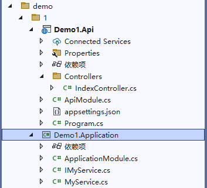
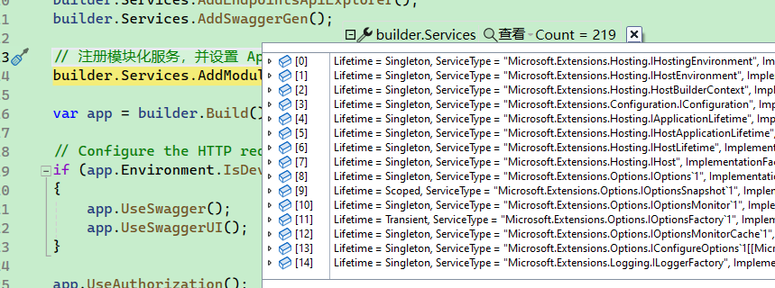
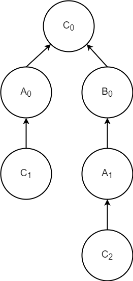
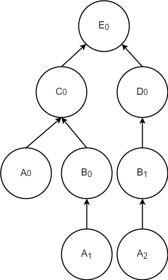

# 模块化和自动服务注册

基于 ASP.NET Core 开发的 Web 框架中，最著名的是 ABP，ABP 主要特点之一开发不同项目(程序集)时，在每个项目中创建一个模块类，程序加载每个程序集中，扫描出所有的模块类，然后通过模块类作为入口，初始化程序集。

使用模块化开发程序，好处是不需要关注程序集如何加载配置。开发人员开发程序集时，在模块类中配置如何初始化、如何读取配置，使用者只需要将模块类引入进来即可，由框架自动启动模块类。

Maomi.Core 也提供了模块化开发的能力，同时还包括简单易用的自动服务注册。Maomi.Core 是一个很简洁的包，可以在控制台、Web 项目、WPF 项目中使用，在 WPF 项目中结合 MVVM 可以大量减少代码复杂度，让代码更加清晰明朗。

<br />

进行本章的学习时，请使用 learn 分支。

https://github.com/whuanle/maomi/tree/learn


### 快速入手

有 Demo1.Api、Demo1.Application 两个项目，每个项目都有一个模块类，模块类需要实现 IModule 接口。



<br />

Demo1.Application 项目的 ApplicationModule.cs 文件内容如下：

```csharp
public class ApplicationModule : IModule
{
    // 模块类中可以使用依赖注入
    private readonly IConfiguration _configuration;
    public ApplicationModule(IConfiguration configuration)
    {
        _configuration = configuration;
    }

    public void ConfigureServices(ServiceContext services)
    {
        // 这里可以编写模块初始化代码
    }
}
```

<br />

如果要将服务自动注册到容器中，在类型上加上 `[InjectOnScoped]` 特性即可。

```csharp
public interface IMyService
{
    int Sum(int a, int b);
}

[InjectOnScoped] // 自动注册的标记
public class MyService : IMyService
{
    public int Sum(int a, int b)
    {
        return a + b;
    }
}
```

> 等同于：
>
> ```csharp
> service.AddScoped<IMyService, MyService>();
> ```

<br />

上层模块 Demo1.Api 中的 ApiModule.cs 可以通过特性注解引用底层模块。

```csharp
using System.Reflection;

[InjectModule<ApplicationModule>]
public class ApiModule : IModule
{
    public void ConfigureServices(ServiceContext services)
    {
        // 这里可以编写模块初始化代码
    }
}
```

<br />

最后，在程序启动时配置模块入口，并进行初始化。

```csharp
var builder = WebApplication.CreateBuilder(args);
builder.Services.AddControllers();
builder.Services.AddEndpointsApiExplorer();
builder.Services.AddSwaggerGen();

// 注册模块化服务，并设置 ApiModule 为入口
builder.Services.AddModule<ApiModule>();

var app = builder.Build();
```

<br />

### 模块可以依赖注入

每个模块都需要实现 IModule 接口，其定义如下：

```csharp
/// <summary>
/// 模块接口
/// </summary>
public interface IModule
{
    /// <summary>
    /// 模块中的依赖注入
    /// </summary>
    /// <param name="context">模块服务上下文</param>
    void ConfigureServices(ServiceContext context);
}
```

<br />

在 ASP.NET Core 配置 Host 时，会自动注入一些框架依赖的服务，如 IConfiguration 等，因此在 `.AddModule<ApiModule>()` 开始初始化模块服务时，模块类的构造函数可以获取到已经注入的服务。



<br />

```cs
[InjectModule<ApplicationModule>]
public class ApiModule : IModule
{
    private readonly IConfiguration _configuration;
    private readonly IHostEnvironment _hostEnvironment;
    public ApiModule(IConfiguration configuration, IHostEnvironment hostEnvironment)
    {
        _configuration = configuration;
        _hostEnvironment = hostEnvironment;
    }

    public void ConfigureServices(ServiceContext context)
    {
        var configuration = context.Configuration;
        context.Services.AddCors();
    }
}
```

<br />

除了可以直接在模块构造函数注入服务之外，还可以通过 `ServiceContext context` 获取服务和配置。

```csharp
/// <summary>
/// 模块上下文
/// </summary>
public class ServiceContext
{
	private readonly IServiceCollection _serviceCollection;
	private readonly IConfiguration _configuration;


	internal ServiceContext(IServiceCollection serviceCollection, IConfiguration configuration)
	{
		_serviceCollection = serviceCollection;
		_configuration = configuration;
	}

	/// <summary>
	/// 依赖注入服务
	/// </summary>
	public IServiceCollection Services => _serviceCollection;

	/// <summary>
	/// 配置
	/// </summary>
	public IConfiguration Configuration => _configuration;
}
```

<br />

### 模块化

因为模块之间会有依赖关系，为了识别这些依赖关系，Maomi.Core 使用树来表达依赖关系。Maomi.Core 在启动模块服务时，扫描所有模块类，然后将模块依赖关系存放到模块树中，然后按照左序遍历的算法对模块逐个初始化，也就是先从底层模块开始进行初始化。

<br />

#### 循环依赖检测

Maomi.Core 可以识别模块循环依赖

比如，有以下模块和依赖：

```csharp
[InjectModule<A>()]
[InjectModule<B>()]
class C:IModule

[InjectModule<A>()]
class B:IModule

// 这里出现了循环依赖
[InjectModule<C>()]
class A:IModule

// C 是入口模块
services.AddModule<C>();
```

<br />因为 C 模块依赖 A、B 模块，所以 A、B 是节点 C 的子节点，而 A、B 的父节点则是 C。当把 A、B、C 三个模块以及依赖关系扫描完毕之后，会得到以下的模块依赖树。

如下图所示，每个模块都做了下标，表示不同的依赖关系，一个模块可以出现多次，`C1 -> A0` 表示 C 依赖 A。



<br />C<sub>0</sub> 开始，没有父节点，则不存在循环依赖。

从 A<sub>0</sub> 开始，A<sub>0</sub> -> C<sub>0</sub> ，该链路中也没有出现重复的 A 模块。

从 C<sub>1</sub> 开始，C<sub>1</sub> -> A<sub>0</sub> -> C<sub>0</sub> ，该链路中 C 模块重复出现，则说明出现了循环依赖。

从 C<sub>2</sub> 开始，C<sub>2</sub> -> A<sub>1</sub> -> B<sub>0</sub> -> C<sub>0</sub> ，该链路中 C 模块重复出现，则说明出现了循环依赖。


### 模块初始化顺序

在生成模块树之后，通过对模块树进行后序遍历即可。

比如，有以下模块以及依赖。

```csharp
[InjectModule<C>()]
[InjectModule<D>()]
class E:IModule

[InjectModule<A>()]
[InjectModule<B>()]
class C:IModule

[InjectModule<B>()]
class D:IModule
    
[InjectModule<A>()]
class B:IModule
    
class A:IModule

// E 是入口模块
services.AddModule<E>();
```

<br />

生成模块依赖树如图所示：




<br />首先从 E<sub>0</sub> 开始扫描，因为 E<sub>0</sub> 下存在子节点 C<sub>0</sub>、 D<sub>0</sub>，那么就会先顺着 C<sub>0</sub> 再次扫描，扫描到 A<sub>0</sub> 时，因为 A<sub>0</sub> 下已经没有子节点了，所以会对 A<sub>0</sub> 对应的模块 A 进行初始化。根据上图模块依赖树进行后序遍历，初始化模块的顺序是（已经被初始化的模块会跳过）：


### 服务自动注册


Maomi.Core 是通过 `[InjectOn]` 识别要注册该服务到容器中，其定义如下：

```csharp
/// <summary>
/// 依赖注入标记
/// </summary>
[AttributeUsage(AttributeTargets.Class, AllowMultiple = false, Inherited = false)]
public class InjectOnAttribute : Attribute
{
	/// <summary>
	/// 要注入的服务
	/// </summary>
	public Type[]? ServicesType { get; set; }

	/// <summary>
	/// 生命周期
	/// </summary>
	public ServiceLifetime Lifetime { get; set; }

	/// <summary>
	/// 注入模式
	/// </summary>
	public InjectScheme Scheme { get; set; }

	/// <summary>
	/// 是否注入自己
	/// </summary>
	public bool Own { get; set; } = false;

	/// <summary>
	/// 
	/// </summary>
	/// <param name="lifetime"></param>
	/// <param name="scheme"></param>
	public InjectOnAttribute(ServiceLifetime lifetime = ServiceLifetime.Transient, InjectScheme scheme = InjectScheme.OnlyInterfaces)
	{
		Lifetime = lifetime;
		Scheme = scheme;
	}
}
```

<br />


使用 `[InjectOn]` 时，默认是注册服务为 `Transient` 生命周期，且注册所有接口。

```csharp
[InjectOn]
public class MyService : IAService, IBService
```

<br />

等同于：

```csharp
services.AddTransient<IAService, MyService>();
services.AddTransient<IBService, MyService>();
```

<br />


如果只想注册 `IAService`，可以将注册模式设置为`InjectScheme.Some` ，然后自定义注册的类型：

```csharp
[InjectOn(
	lifetime: ServiceLifetime.Transient,
	Scheme = InjectScheme.Some,
	ServicesType = new Type[] { typeof(IAService) }
	)]
public class MyService : IAService, IBService
```

<br />

也可以把自身注册到容器中：

```csharp
[InjectOn(Own = true)]
public class MyService : IMyService
```

<br />

等同于：

```csharp
services.AddTransient<IAService, MyService>();
services.AddTransient<MyService>();
```

<br />

如果服务继承了类、接口，只想注册父类，那么可以这样写：

```csharp
public class ParentService { }

[InjectOn(
	Scheme = InjectScheme.OnlyBaseClass
	)]
public class MyService : ParentService, IDisposable 
```

<br />

等同于：

```csharp
services.AddTransient<ParentService, MyService>();
services.AddTransient<MyService>();
```

<br />

如果只注册自身，忽略接口等，可以使用：

```csharp
[InjectOn(ServiceLifetime.Scoped, Scheme = InjectScheme.None, Own = true)]
```


