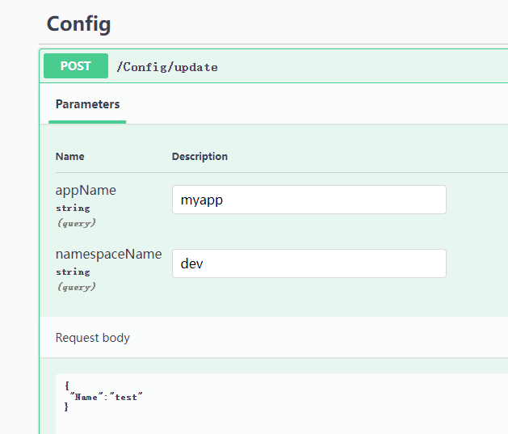

### 实现配置中心

在了解配置、选项的使用方法，以及如何自定义配置提供器之后，在本小节，我们将会创建一个配置中心服务，然后客户端通过 SignalR 与配置中心通讯，当配置中心的配置内容被修改后，自动推送到客户端中。


新建一个名为 Demo3.ConfigCenter 的 API 项目和一个名为 Demo3.ConfigClient 的控制台项目。


首先是实现配置中心的 Demo3.ConfigCenter 的代码，创建一个保存客户端信息的模型类。

```csharp
    /// <summary>
    /// 客户端的信息
    /// </summary>
    public class ClientInfo
    {
        /// <summary>
        /// SignalR 连接的 id
        /// </summary>
        public string ConnectionId { get; set; }

        /// <summary>
        /// 应用名称
        /// </summary>
        public string AppName { get; set; }

        /// <summary>
        /// 命名空间
        /// </summary>
        public string Namespace { get; set; }

        /// <summary>
        /// 分组名称
        /// </summary>
        public string GroupName => $"{AppName}-{Namespace}";

        /// <summary>
        /// 客户端的 IP 地址
        /// </summary>
        public string IpAddress { get; set; }
    }
```


创建一个用于 SignalR 通讯的 Hub 服务，与客户端进行实时通信。

```csharp
    public partial class ConfigCenterHub : Hub
    {
        // 客户端连接信息
        private static readonly ConcurrentDictionary<string, ClientInfo> _clients = new();
        // 在内存中保存每个服务的配置
        private static readonly ConcurrentDictionary<string, JsonObject> _settings = new();

        private readonly IHubContext<ConfigCenterHub> _hubContext;
        public ConfigCenterHub(IHubContext<ConfigCenterHub> hubContext)
        {
            _hubContext = hubContext;
        }

        // 当客户端连接到服务时
        public override async Task OnConnectedAsync()
        {
            ClientInfo clientnInfo = GetInfo();

            await _hubContext.Groups.AddToGroupAsync(clientnInfo.ConnectionId, clientnInfo.GroupName);
            _clients[clientnInfo.GroupName] = clientnInfo;
        }

        // 当客户端断开服务时
        public override async Task OnDisconnectedAsync(Exception? exception)
        {
            ClientInfo clientnInfo = GetInfo();

            await _hubContext.Groups.RemoveFromGroupAsync(clientnInfo.ConnectionId, clientnInfo.GroupName);
            _clients.TryRemove(clientnInfo.ConnectionId, out _);
        }

        // 获取客户端的信息
        private ClientInfo GetInfo()
        {
            var feature = Context.Features.Get<IHttpConnectionFeature>();
            var httpContext = Context.GetHttpContext();

            ArgumentNullException.ThrowIfNull(feature);
            ArgumentNullException.ThrowIfNull(httpContext);

            // 从 header 中查询信息
            var appName = httpContext.Request.Headers["AppName"].FirstOrDefault();
            var namespaceName = httpContext.Request.Headers["Namespace"].FirstOrDefault();

            ArgumentNullException.ThrowIfNull(appName);
            ArgumentNullException.ThrowIfNull(namespaceName);

            var groupName = $"{appName}-{namespaceName}";

            // 获取客户端通讯地址
            var remoteAddress = feature.RemoteIpAddress;
            ArgumentNullException.ThrowIfNull(remoteAddress);
            var remotePort = feature.RemotePort;

            return new ClientInfo
            {
                ConnectionId = feature.ConnectionId,
                AppName = appName,
                Namespace = namespaceName,
                IpAddress = $"{remoteAddress.MapToIPv4().ToString()}:{remotePort}"
            };
        }
        
        // 客户端自行获取配置
        public async Task<JsonObject> GetAsync()
        {
            ClientInfo clientnInfo = GetInfo();
            if(_settings.TryGetValue(clientnInfo.GroupName, out var v))
            {
                return v;
            }
            var dic = new Dictionary<string, JsonNode>().ToList();
            return new JsonObject(dic);
        }
        
        // 更新缓存
        public void UpdateCache(string appName, string namespaceName, JsonObject json)
        {
            var groupName = $"{appName}-{namespaceName}";
            _settings[groupName] = json;
        }
    }
```


然后注册 Hub 服务：

```csharp
... ...
builder.Services.AddSwaggerGen();

// 注入 SignalR
builder.Services.AddSignalR();
builder.Services.AddScoped<ConfigCenterHub>();

var app = builder.Build();

... ...
app.MapControllers();

// 加入 Hub 中间件
app.MapHub<ConfigCenterHub>("/config");
app.Run("http://*:5000");
```


创建一个 ConfigController 控制器，允许通过 API 修改配置中心的内容，以及在修改配置后推送到对应的客户端中。

```csharp
    [ApiController]
    [Route("[controller]")]
    public class ConfigController : ControllerBase
    {
        private readonly ConfigCenterHub _configCenter;
        private readonly IHubContext<ConfigCenterHub> _hubContext;

        public ConfigController(IHubContext<ConfigCenterHub> hubContext, ConfigCenterHub configCenter)
        {
            _hubContext = hubContext;
            _configCenter = configCenter;
        }

        [HttpPost("update")]
        public async Task<string> Update(string appName, string namespaceName, [FromBody] JsonObject json)
        {
            var groupName = $"{appName}-{namespaceName}";
            _configCenter.UpdateCache(appName, namespaceName, json);
            await _hubContext.Clients.Group(groupName).SendAsync("Publish", json);
            return "已更新配置";
        }
    }
```


接下来就是客户端部分。

在程序启动时，会读取目录的 tmp_config.json 文件注入到配置中，如果文件不存在则创建。然后使用框架自带的 JsonConfigurationProvider 为我们动态监听 json 文件的变化，减少我们的代码量。在实时监听 Json 文件变化，以及解析 json ，这部分可以利用官方的 JsonConfigurationSource 来实现，我们就不需要重新写一个了。

然后使用 SignalR 与配置中心通讯，将配置中心的内容写入到临时文件 tmp_config.json 中，JsonConfigurationProvider 会自动将修改后的 json 文件加载到内存中。因为我们使用了本地配置文件，获取到的配置先缓存在本地中，所以当下次程序启动时或网络出现故障时，程序依然可以通过本地缓存配置启动起来。这个也是很多配置中心都有实现的。


在  Demo3.ConfigClient 中创建 OnlineConfigurationSource、OnlineConfigurationProvider 文件，写入以下代码：

```csharp
    public class OnlineConfigurationSource : IConfigurationSource
    {
        /// <summary>
        /// 获取最新配置的 API 路径
        /// </summary>
        public string URL { get; init; }
        public string AppName { get; init; }
        public string Namespace { get; init; }

        public IConfigurationProvider Build(IConfigurationBuilder builder)
        {
            return new OnlineConfigurationProvider(this, builder);
        }
    }
```


然后实现一个配置提供器，与 Hub 服务器实时通信，并更新到 tmp_config.json 文件中。

```csharp
    public class OnlineConfigurationProvider : IConfigurationProvider, IDisposable
    {
        private const string TmpFile = "tmp_config.json";
        private readonly string _jsonPath;

        private readonly OnlineConfigurationSource _configurationSource;
        private readonly JsonConfigurationSource _jsonSource;
        private readonly IConfigurationProvider _provider;
        private readonly HubConnection _connection;

        public OnlineConfigurationProvider(OnlineConfigurationSource configurationSource, IConfigurationBuilder builder)
        {
            // 使用框架自带的 JsonConfigurationSource 动态获取 json 文件的内容
            var curPath = Directory.GetParent(typeof(OnlineConfigurationProvider).Assembly.Location).FullName;
            _jsonPath = Path.Combine(curPath, TmpFile);
            if (!File.Exists(TmpFile)) File.WriteAllText(_jsonPath, "{}");

            _configurationSource = configurationSource;
            _jsonSource = new JsonConfigurationSource()
            {
                Path = TmpFile,
                ReloadOnChange = true,
            };
            _provider = _jsonSource.Build(builder);

            // 配置 SignalR 通讯，将新的内容写入到 json 文件
            _connection = new HubConnectionBuilder()
                .WithUrl(_configurationSource.URL, options =>
                {
                    options.Headers.Add("AppName", _configurationSource.AppName);
                    options.Headers.Add("Namespace", _configurationSource.Namespace);
                })
                .WithAutomaticReconnect()
                .Build();

            _connection.On<JsonObject>("Publish", async (json) =>
            {
                await SaveJsonAsync(json);
            });

            _connection.StartAsync().Wait();
            var json = _connection.InvokeAsync<JsonObject>("GetAsync").Result;
            SaveJsonAsync(json).Wait();
        }

        private async Task SaveJsonAsync(JsonObject json)
        {
            // 每次清空文件重新写入内容
            using FileStream fs = new FileStream(_jsonPath, FileMode.Truncate, FileAccess.ReadWrite);
            await System.Text.Json.JsonSerializer.SerializeAsync(fs, json);
            Console.WriteLine($"已更新配置：{System.Text.Json.JsonSerializer.Serialize(json)}");
        }

        private bool _disposedValue;
        ~OnlineConfigurationProvider() => Dispose(false);
        public void Dispose()
        {
            Dispose(true);
            GC.SuppressFinalize(this);
        }

        protected virtual void Dispose(bool disposing)
        {
            if (!_disposedValue)
            {
                if (disposing)
                {
                    _connection.DisposeAsync();
                }
                _disposedValue = true;
            }
        }

        public IEnumerable<string> GetChildKeys(IEnumerable<string> earlierKeys, string? parentPath) => _provider.GetChildKeys(earlierKeys, parentPath);
        public IChangeToken GetReloadToken() => _provider.GetReloadToken();
        public void Load() => _provider.Load();
        public void Set(string key, string? value) => _provider.Set(key, value);
        public bool TryGet(string key, out string? value) => _provider.TryGet(key, out value);
    }
```


编写扩展方法，配置 Hub 服务。

```csharp
    public static class Extensions
    {
        // 添加远程配置
        public static IConfigurationBuilder AddReomteConfig(this IConfigurationBuilder builder, string url, string appName, string @namespace)
        {
            var source = new OnlineConfigurationSource()
            {
                URL = url,
                AppName = appName,
                Namespace = @namespace
            };
            builder.Add(source);
            return builder;
        }
    }
```


使用配置中心服务：

```csharp
    internal class Program
    {
        static void Main(string[] args)
        {
            Thread.Sleep(5000);
            var builder = new ConfigurationBuilder()
                .AddReomteConfig("http://127.0.0.1:5000/config", "myapp", "dev");

            var config = builder.Build();
            while (true)
            {
                Console.WriteLine(config["Name"]);
                Thread.Sleep(1000);
            }
        }
    }
```


同时启动配置中心和客户端，打开配置中心的 Swagger 地址，修改并推送新的配置到客户端。

