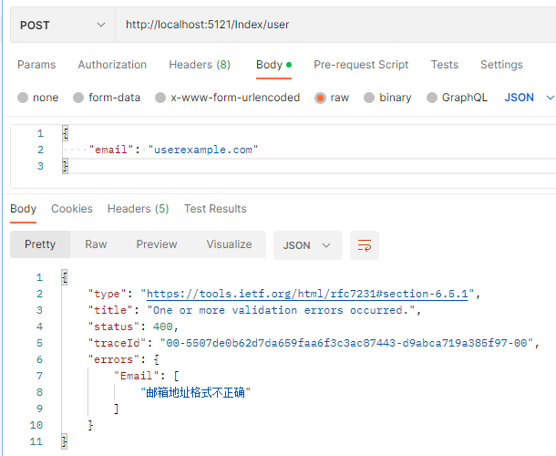
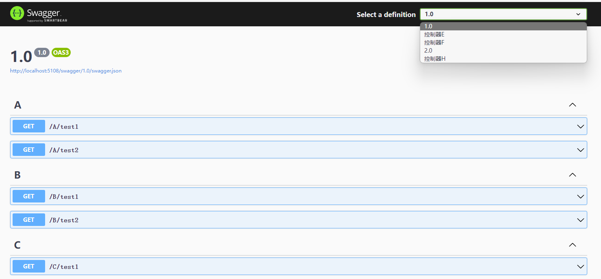
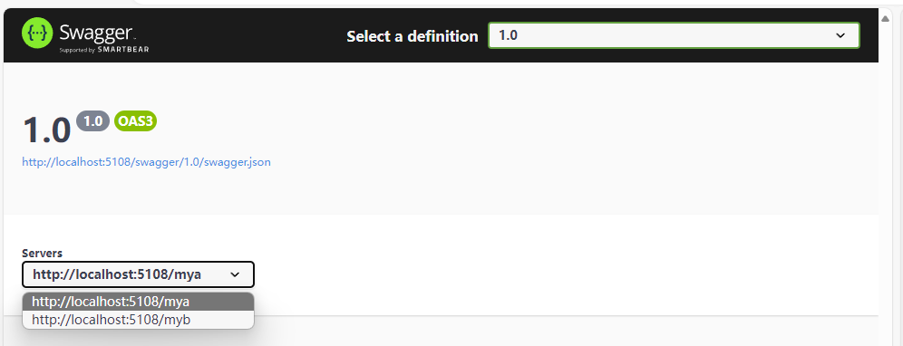

# ASP.NET Core 定制

Web 开发是 .NET 最广泛使用的场景之一，现在越来越多的企业 Web 开发业务系统采用 ASP.NET Core 或第三方框架如 ABP 等进行开发，这些第三方框架绝大多数是基于 ASP.NET Core 进行开发的，当然每个企业或每个开发者对框架的需求都不一样，有的人觉得 ABP 满足了大多数需求，有的人觉得 ABP 太重了，也有很多人选择自己基于 ASP.NET Core 开发新的 Web 开发框架。由于 ASP.NET Core 是 .NET 日常开发中最常是使用的框架，因此本章主要讲解如何定制 Web，以便满足不同的需求。


创建 Maomi.Web.Core 项目，添加对 Maomi.Core 的引用，接着创建模块类 MaomiWebModule.cs。

```csharp
    public class MaomiWebModule : IModule
    {
        public void ConfigureServices(ServiceContext context)
        {
        }
    }
```


### 定制统一响应模型

无论是报错还是模型验证失败、请求成功等，都要设置一定的响应体格式，方便前端或客户端使用。

在编程中，常见 return 缩写为 ret，result 缩写为 res，不过在 C# 中并不提倡缩写，不过考虑到响应模型类使用太频繁，为了便于使用，可以将响应模型类设置为 Res。


```csharp
// 响应模型类
public class Res<T>
{
	// 当前请求是否有错误
	public virtual bool IsSuccess => Code == 200;

	// 业务代码
	public virtual int Code { get; set; }

	// 响应消息
	public virtual string Msg { get; set; }

	// 返回数据
	public virtual T? Data { get; set; }
}

// 响应模型类
public partial class Res : Res<object?>
{
	// 创建 Res
	public static Res<T> Create<T>(int code, string message, T data)
	{
		return new Res<T>
		{
			Code = code,
			Msg = message,
			Data = data
		};
	}

	/// 创建 Res
	/// </summary>
	public static Res<T> Create<T>(HttpStatusCode code, string message, T data) => Create((int)code, message, data);
}

// 分页结果模型类
public class PageRes<T>
{
	/// 当前页
	public virtual int PageNo { get; set; }

	/// 页大小
	public virtual int PageSize { get; set; }

	public virtual T? List { get; set; }
}

// 分页结果模型类
public partial class PageListRes<T> : Res<PageRes<IEnumerable<T>>>
{
}

/// 分页结果模型类
/// <typeparam name="T"></typeparam>
public partial class PageArrayRes<T> : Res<PageRes<T[]>>
{
}
```


### 模型验证

在本节中，我们将来学习如何在控制台使用模型验证以及 ASP.NET Core 中的模型验证是怎么实现的。

标记的特性注解称为 DataAnnotations 数据注释。在使用 ASP.NET Core 时，我们可以通过对模型类设置 `[EmailAddress]`、`[Required]` 等特性注解，用户的数据请求便会被 ASP.NET Core 拦截并验证其模型是否正确。


#### 模型验证是如何实现的

实际上，模型验证也可以脱离 ASP.NET Core 使用，我们可以新建控制台。

示例项目在 Demo10.ConsoleDataAnnotations 中。


首先定义一个模型类：

```csharp
public class UserInfo
{
    [Required]
    [EmailAddress]
    public string Email { get; set; }
}
```


然后创建一个验证器方法：

```csharp
private static (bool IsValid, IReadOnlyList<ValidationResult> ValidationResult) VerifyModel(object o)
{
	var result = new List<ValidationResult>();
	var validationContext = new ValidationContext(o);
	var isValid = Validator.TryValidateObject(o, validationContext, result, validateAllProperties: true);
	return (isValid, result);
}
```


ValidationContext：模型验证检查上下文。

Validator.TryValidateObject：使用验证上下文和验证结果集合确定指定对象是否有效。


然后，使用它：

```csharp
static void Main()
{
	var json = """
            {
              "Email":"aaa#qq.com"
            }
            """;
	var userInfo = System.Text.Json.JsonSerializer.Deserialize<UserInfo>(json);

	var (isValid, result) = VerifyModel(userInfo);
	if (!isValid)
	{
		foreach (var item in result)
		{
			Console.WriteLine($"{item.MemberNames.First()}:{item.ErrorMessage}");
		}
	}
}
```


这段代码运行之后，会输出：

```bash
Email:The Email field is not a valid e-mail address.
```


其实可以看到，模型验证最核心的是使用 ValidationContext 和 `Validator.TryValidateObject` 对模型的属性字段进行检查，然后获取检查结果。


ASP.NET Core 本质也是控制台，API 接口的模型类进行模型验证时的机制也差不多如此，例如当用户发起一个 `application/json` 请求时，首先从 Body 中取出 json 反序列化为对象，此过程可以配置是否忽略大小写、字符串和枚举或数字互转等，在反序列化时，如果有报错，则会抛出异常。接着会对模型类进行验证，如果验证失败，则会返回 400 状态码。


- 下面是一些内置的验证属性:

  - `[ValidateNever]` ：不验证此属性。
  - `[CreditCard]`：是否为信用卡格式。
  - `[Compare] `： 对比模型中两个字段值是否一致。
  - `[EmailAddress]` ：属性为电子邮件格式 。
  - `[Phone]`：属性为电话号码格式。
  - `[Range]`：属性在值范围之内。
  - `[RegularExpression]`：使用正则表达式验证属性。
  - `[Required]`：该属性必填。
  - `[StringLength] `：限制字符串的最大长度。
  - `[Url]`：属性为 url 地址格式。


所有的模型验证类都继承了 `ValidationAttribute`，所以也可以直接通过模型验证类的 `IsValid` 方法获取验证结果。

示例：

```csharp
bool isValid = new EmailAddressAttribute().IsValid(userInfo);
```


#### 自定义模型验证器

处理 .NET 自带的模型验证特性外，我们也可以自定义特性类。在本小节中，笔者将会介绍如何实现一个模型验证特性。

示例项目在 Demo10.ConsoleDataAnnotations 中。

假设的场景如下，我们需要在邮件地址字段中，检查邮件后缀是否为 `@maomi.com`。


自定义模型验证器主要是重写两个 `IsValid`，示例代码如下：

```csharp
public class MaomiEmailAttribute : ValidationAttribute
{
    public override bool IsValid(object? value)
    {
        if (value is string email)
        {
            return email.EndsWith("@maomi.com");
        }
        return false;
    }

    protected override ValidationResult? IsValid(object? value, ValidationContext validationContext)
    {
        // 成员名称
        var memberName = validationContext.MemberName;
        // [DisplayName] 定义的名称
        var displayName = validationContext.DisplayName;
        // 实例对象
        var obj = validationContext.ObjectInstance;
        if (this.IsValid(value))
        {
            return ValidationResult.Success;
        }
        string[] memberNames = memberName != null ? new string[] { memberName } : null;
        return new ValidationResult(this.FormatErrorMessage(validationContext.DisplayName), memberNames);
    }
    public override string FormatErrorMessage(string name)
    {
        return $"{name} 不是 @maomi.com 邮箱后缀！";
    }
}
```


然后新建 UserInfoMaomi 模型类:

```csharp
public class UserInfoMaomi
{
    [Required]
    [EmailAddress]
    [MaomiEmail]
    public string Email { get; set; }
}
```


将 json 字符串改成：

```csharp
var json = """
            {
              "Email":"aaa@qq.com"
            }
            """;
```


```csharp
var userInfoMaomi = System.Text.Json.JsonSerializer.Deserialize<UserInfoMaomi>(json);
var (isValid2, result2) = VerifyModel(userInfoMaomi);
```


由于我们使用 VerifyModel 方法，验证模型使用的是 Validator.TryValidateObject，因此调用模型验证特性类，会使用 `IsValid(object?, ValidationContext)` 重载。


而 `IsValid(object? value)` 重载，我们可以单独针对一个值来使用：

```csharp
new MaomiEmailAttribute().IsValid("aaa@qq.com")
```


#### 模型验证器使用 i18n

ASP.NET Core 中模型验证器打印的字符串默认都是英文，我们在业务中往往需要多语言以及自定义模型验证特性，因此有必要让模型验证也支持 i18n。

在 Maomi.Web.Core 中添加 Maomi.I18n 引用。


我们在 Maomi.I18n 中添加一个扩展类型，用来为 API 注入 I18n 扩展服务。

```csharp
public static class DataAnnotationsExtensions
{
    // 为 API 模型验证注入 i18n 服务
	public static IMvcBuilder AddI18nDataAnnotation(this IMvcBuilder builder)
	{
		builder.Services.AddTransient<IStringLocalizerFactory, I18nStringLocalizerFactory>();
		builder
			.AddDataAnnotationsLocalization(options =>
			{
				options.DataAnnotationLocalizerProvider = (modelType, stringLocalizerFactory) =>
				stringLocalizerFactory.Create(modelType);
			});
		return builder;
	}
}
```

注入模型验证本地化服务之后，框架会从此模型类所在的程序集中取出本地化语言字符串。


在 MaomiWebModule 中添加 i18n 服务，以及为 API 注入模型验证服务。

```csharp
public class MaomiWebModule : IModule
{
	public void ConfigureServices(ServiceContext context)
	{
		// i18n 服务
		context.Services.AddI18n("zh-CN");
		context.Services.AddI18nResource(options =>
		{
			options.AddJson<MaomiWebModule>("i18n");
		});

		// 添加控制器
		context.Services.AddControllers()
			.AddI18nDataAnnotation();
	}
}
```


然后创建名为 Demo10.ApiDataAnnotations 的 API 服务，添加对 Maomi.Web.Core 的引用，项目结构如下。


我们将 Demo10.ApiDataAnnotations 模块化后，只需要在该项目中注入 json 多语言资源服务即可。

```csharp
[InjectModule<MaomiWebModule>()]
public class ApiModule : IModule
{
	public void ConfigureServices(ServiceContext context)
	{
		context.Services.AddI18nResource(options =>
		{
			options.AddJson<ApiModule>("i18n");
		});
	}
}
```


然后我们在该项目中创建一个模型类：

```csharp
public class UserInfo
{
	[EmailAddress(ErrorMessage = "邮箱地址格式不正确")]
	public string Email { get; set; }
}
```


因为 UserInfo 模型类在 Demo10.ApiDataAnnotations 项目中，因此我们需要在 Demo10.ApiDataAnnotations 中创建 json 多语言资源文件，目录在 `i18n/Demo10.ApiDataAnnotations ` 下。

json 文件示例如下：

zh-CN.json

```json
{
  "邮箱地址格式不正确": "邮箱地址格式不正确"
}
```

en-US.json

```json
{
  "邮箱地址格式不正确": "The email address format is incorrect"
}
```


然后创建一个简单的 API 接口进行测试：

```csharp
    [ApiController]
    [Route("[controller]")]
    public class IndexController : ControllerBase
    {
        [HttpPost("user")]
        public string GetUserName([FromBody] UserInfo info)
        {
            return info.Email.Split("@").FirstOrDefault();
        }
    }
```


然后对 API 发出请求，分别在 email 字段输入不同的内容。




使用 i18n 服务之后，模型验证错误会随着语言标识而变化。


### 筛选器

我们知道，ASP.NET Core 的功能是由一系列中间件管道提供的，当 API 接收一个 http 请求时，请求上下文会经过管道中各种中间件的处理，最后到达 Action 中。

ASP.NET Core 管道中默认中间件的排序顺序如下图所示：


ASP.NET Core 中提供了筛选器，可以帮助我们在部分中间件的前后执行一系列的操作。


#### Action 筛选器

在 ASP.NET Core 中，当模型验证失败时，会返回如下格式的内容。

```json
{
    "type": "https://tools.ietf.org/html/rfc7231#section-6.5.1",
    "title": "One or more validation errors occurred.",
    "status": 400,
    "traceId": "00-4fcae233f0ff7c4de765680f5ee8b8b8-67b2c0d9a41224c6-00",
    "errors": {
        "Email": [
            "The email address format is incorrect"
        ]
    }
}
```


但是在项目开发中，我们往往需要固定一种格式，比如本章开头就设置了统一的响应模型类 `Res`、`Res<T>`。


在 Maomi.Web.Core 中，依次创建 i18n、Maomi.Web.Core 目录，添加 zh-CN.json、`en-US.json` 两个文件，内容分别如下：

zh-CN.json

```
{
  "400": "发生了一个或多个验证错误"
}
```

en-US.json

```
{
  "400": "One or more validation errors occurred."
}
```

设置两个文件的生成属性为 “始终复制”。


为了通过项目引用、nuget 包引用时，文件会自动复制到启动项目运行目录中，需要手动配置多语言文件属性：

```xml
	<ItemGroup>
		<None Update="i18n\Maomi.Web.Core\en-US.json" Pack="true" PackagePath="contentFiles\any\any;">
			<PackageCopyToOutput>true</PackageCopyToOutput>
		</None>
	</ItemGroup>
	<ItemGroup>
		<None Update="i18n\Maomi.Web.Core\zh-CN.json" Pack="true" PackagePath="contentFiles\any\any;">
			<PackageCopyToOutput>true</PackageCopyToOutput>
		</None>
	</ItemGroup>
```


由于  `Microsoft.NET.Sdk.Web`  SDK 在编译 Web 项目时，会自动配置 json 文件属性，这样一来会导致与手动配置的多语言文件属性配置冲突，因此需要关掉该功能。

```xml
<EnableDefaultContentItems>false</EnableDefaultContentItems>
```


Action 筛选器在执行 Action 之前或之后被框架自动调用，用来拦截请求或处理 Action 返回的结果。Action 筛选器有两种实现方法，第一种是实现 IActionFilter 接口，然后依赖注入配置控制器时通过 `.AddControllers()` 扩展方法配置全局。第二种使用特性注解，单独给 Controller 或 Action 使用。

使用特性注解配置 Action，需要继承 ActionFilterAttribute 特性，简化我们编写筛选器的代码。

ActionFilterAttribute 的定义如下：

```csharp
[AttributeUsage(AttributeTargets.Class | AttributeTargets.Method, AllowMultiple = true, Inherited = true)]
public abstract class ActionFilterAttribute :
	Attribute,
	IActionFilter,
	IFilterMetadata,
	IAsyncActionFilter,
	IResultFilter,
	IAsyncResultFilter,
	IOrderedFilter
{
	protected ActionFilterAttribute();

	public int Order { get; set; }

	public virtual void OnActionExecuted(ActionExecutedContext context);
	public virtual void OnActionExecuting(ActionExecutingContext context);
	public virtual Task OnActionExecutionAsync(ActionExecutingContext context, ActionExecutionDelegate next);
	public virtual void OnResultExecuted(ResultExecutedContext context);
	public virtual void OnResultExecuting(ResultExecutingContext context);
	public virtual Task OnResultExecutionAsync(ResultExecutingContext context, ResultExecutionDelegate next);
}
```


在 Maomi.Web.Core 中创建一个名为 MaomiActionFilter 的筛选器，同时继承 ActionFilterAttribute、IActionFilter，MaomiActionFilter 筛选器使用时需要注入相关的依赖。

```csharp
// Action 过滤器
[InjectOn(Scheme = InjectScheme.None, Own = true)]
[AttributeUsage(AttributeTargets.Class | AttributeTargets.Method, AllowMultiple = false, Inherited = true)]
public class MaomiActionFilter : ActionFilterAttribute
{
	private readonly IStringLocalizer<ActionFilter> _localizer;
	public ActionFilter(IStringLocalizer<ActionFilter> stringLocalizer)
	{
		_localizer = stringLocalizer;
	}

	public override void OnResultExecuting(ResultExecutingContext context)
	{
		if (!context.ModelState.IsValid)
		{
			Dictionary<string, List<string>> errors = new();
			foreach (var item in context.ModelState)
			{
				List<string> list = new();
				foreach (var error in item.Value.Errors)
				{
					list.Add(error.ErrorMessage);
				}
				errors.Add(item.Key, list);
			}
			context.Result = new BadRequestObjectResult(R.Create(400, _localizer["400"], errors));
		}
	}
}
```

> MaomiActionFilter 使用了自动注册特性，我们只注册 MaomiActionFilter，而不包含 ActionFilterAttribute、IActionFilter。


然后在 Demo10.ApiDataAnnotations 项目中的 IndexController 中加上 MaomiActionFilter 特性。

```csharp
[ApiController]
[Route("[controller]")]
public class IndexController : ControllerBase
{
	[ServiceFilter(typeof(MaomiActionFilter))]
	[HttpPost("user")]
	public string GetUserName([FromBody] UserInfo info)
	{
		return info.Email.Split("@").FirstOrDefault();
	}
}
```

启动 Web 程序，请求该接口，模型验证错误的结果使用固定格式响应。


ActionFilterAttribute 可以用在 Action 上，也可以用在 Controller 上，在 Controller 配置时，对所有 Action 起效。

```csharp
[ServiceFilter(typeof(MaomiActionFilter))]
[ApiController]
[Route("[controller]")]
public class IndexController : ControllerBase
{
}
```


因为 MaomiActionFilter 需要进行依赖注入，需要使用 ServiceFilter 配置筛选器，如果自定义的 ActionFilterAttribute 并不需要使用依赖注入，那么可以直接使用。

```csharp
[MyActionFilter]
[HttpPost("user")]
public string GetUserName([FromBody] UserInfo info)
{
	return info.Email.Split("@").FirstOrDefault();
}
```


我们也可以使用全局配置：

```csharp
            context.Services.AddControllers(options =>
            {
                // 不需要依赖注入的筛选器
                // options.Filters.Add<MyActionFilter>();
                // 需要依赖注入的筛选器
                options.Filters.AddService<MaomiActionFilter>();
            })
```


我们将 Maomi.Web.Core.MaomiWebModule 改造一下。

```csharp
    public class MaomiWebModule : IModule
    {
        public void ConfigureServices(ServiceContext context)
        {
            // i18n 服务
            context.Services.AddI18n("zh-CN");
            context.Services.AddI18nResource(options =>
            {
                options.AddJson<MaomiWebModule>("i18n");
            });

            // 添加控制器
            context.Services.AddControllers(options =>
            {
                options.Filters.Add<MaomiActionFilter>();
                options.Filters.AddService<MaomiActionFilter>();
            })
                .AddI18nDataAnnotation();
        }
    }
```


现在，Maomi.Web.Core 已经具备了本地化多语言、模型验证信息多语言、统一模型验证输出三个功能了。


#### 资源筛选器

资源筛选器有  IResourceFilter 或 IAsyncResourceFilter 两种接口，接口定义如下：

```csharp
public interface IResourceFilter : IFilterMetadata
{
	void OnResourceExecuted(ResourceExecutedContext context);
	void OnResourceExecuting(ResourceExecutingContext context);
}
public interface IAsyncResourceFilter : IFilterMetadata
{
	Task OnResourceExecutionAsync(ResourceExecutingContext context, ResourceExecutionDelegate next);
}
```


资源筛选器发生在模型绑定、Action 之前，因此可以提前做预检查提前拦截非正常请求等。对于某些情况下 API 要求携带 header 或者其他参数时，在资源筛选器处理会比在 API 中处理好，减少了一些过程，节约了资源。


假设有这么一个场景，我们需要将 API 的结果缓存到 Redis 中，当用户请求时，如果 Redis 中有缓存则直接返回，不需要再进入 Controller、Action 中。如果换成不存在，则执行 Action 并返回结果，然后自动加入到 Redis 缓存中。

新建名为 Demo10.ResourceFilter 的 Web项目，并新建 CacheResourceFilter 类型，引入 Maomi.Web.Core、FreeRedis 两个依赖。

新建 CacheResourceFilter  筛选器，CacheResourceFilter 使用 `{ControllerName}:{ActionName}` 作为 key 名称，从 redis 中获取数据，然后直接写入到响应中，不需要再执行 Action 中代码。

```csharp
[InjectOn(Scheme = InjectScheme.None, Own = true)]
[AttributeUsage(AttributeTargets.Class | AttributeTargets.Method, AllowMultiple = false, Inherited = true)]
public class CacheResourceFilter : Attribute, IAsyncResourceFilter
{
	private readonly IStringLocalizer<CacheResourceFilter> _localizer;
	private readonly IRedisClient _redisClient;
	public CacheResourceFilter(IStringLocalizer<CacheResourceFilter> stringLocalizer, IRedisClient redisClient)
	{
		_localizer = stringLocalizer;
		_redisClient = redisClient;
	}

	public async Task OnResourceExecutionAsync(ResourceExecutingContext context, ResourceExecutionDelegate next)
	{
		var action = context.ActionDescriptor as Microsoft.AspNetCore.Mvc.Controllers.ControllerActionDescriptor;
		ArgumentNullException.ThrowIfNull(action);
		var key = $"{action.ControllerName}:{action.ActionName}";
		var methodInfo = action.MethodInfo;
		var returnResult = methodInfo.ReturnType;
		if (returnResult.GetGenericTypeDefinition() == typeof(Task<>))
		{
			returnResult = returnResult.GetGenericArguments()[0];
		}

		// 如果有缓存
		var text = await _redisClient.GetAsync<string>(key);
		if (!string.IsNullOrEmpty(text))
		{
			var value = System.Text.Json.JsonSerializer.Deserialize(text, returnResult);
			context.Result = new JsonResult(value);
			return;
		}

		var newContext = await next();

		// 记录到缓存中，下次直接从缓存中取出
		var result = newContext.Result as ObjectResult;
		if (result != null)
		{
			await _redisClient.SetAsync(key, result.Value, timeoutSeconds: 10);
		}
	}
}
```


然后编写一个 API 进行测试：

```csharp
[ApiController]
[Route("[controller]")]
public class TestController : ControllerBase
{
	[HttpGet(Name = "get")]
	public IEnumerable<TestModel> Get()
	{
		var data = new List<TestModel>()
			{
				new TestModel(){ Name = "1"},
				new TestModel(){ Name = "2"}
			};
		return data;
	}
}

public class TestModel
{
	public string Name { get; set; }
}
```


然后配置 API 模块：

```csharp
[InjectModule<MaomiWebModule>()]
public class ApiModule : IModule
{
	public void ConfigureServices(ServiceContext context)
	{
		context.Services.AddControllers(options =>
		{
			// 这里不会跟 MaomiWebModule 中的筛选器冲突，两者的筛选器会被合起来一起使用
			options.Filters.AddService<CacheResourceFilter>();
		});

		// 配置 FreeRedis
		RedisClient redis = new RedisClient("127.0.0.1:6379,defaultDatabase=0");
		redis.Serialize = obj => System.Text.Json.JsonSerializer.Serialize(obj);
		redis.Deserialize = (json, type) => System.Text.Json.JsonSerializer.Deserialize(json, type);

		context.Services.AddSingleton<IRedisClient, RedisClient>(s => redis);
	}
}
```


你可以在 CacheResourceFilter 中进行断点调试，你会发现在第一次请求之后，会直接在 Redis 中取得数据，而不需要执行 `await next()`。


为什么笔者不把 CacheResourceFilter 放到 Maomo.Web.Core 中。

因为 ResourceFilter 通用的场景比较少，不必要在模块化框架中混入太多组件，比如上一小节的 ActionFilter 中也仅仅是为了通用返回的模型验证错误的格式。

每个公司可能在过滤器中有不一样的需求，甚至每个项目都有不同的需求，这些很可能在开发中定制需求，那么正在框架之外，编写扩展完善补充即可。

Maomi.Web.Core 框架应当保持简洁，支持基础功能即可。


#### 异常筛选器

异常筛选器主要用于捕获发生在 Action 中的异常。

当 API 出现异常时，我们需要屏蔽异常信息以免泄露敏感信息，以及统一响应模型。

我们在 Maomi.Web.Core 中定义一个异常筛选器 MaomiExceptionFilter，我们需要将异常信息输出到日志中，统一响应结果，并且显示的信息使用 i18n 进行多语言支持。

```csharp
// 统一异常处理
[InjectOn(Scheme = InjectScheme.None, Own = true)]
public class MaomiExceptionFilter : IAsyncExceptionFilter
{
	private readonly ILogger<MaomiExceptionFilter> _logger;
	private readonly IStringLocalizer<MaomiExceptionFilter> _stringLocalizer;

	// 统一异常处理
	public MaomiExceptionFilter(ILogger<MaomiExceptionFilter> logger, IStringLocalizer<MaomiExceptionFilter> stringLocalizer)
	{
		_logger = logger;
		_stringLocalizer = stringLocalizer;
	}

	/// 异常处理
	public async Task OnExceptionAsync(ExceptionContext context)
	{
		// 未经处理的异常
		if (!context.ExceptionHandled)
		{
			var action = context.ActionDescriptor as Microsoft.AspNetCore.Mvc.Controllers.ControllerActionDescriptor;

			_logger.LogCritical(context.Exception,
				"""
                    RequestId: {0}
                    ControllerName: {1}
                    ActionName: {2}
                    """,
				context.HttpContext.TraceIdentifier,
				action?.ControllerName,
				action?.ActionName
				);
			var response = new R()
			{
				Code = 500,
				Msg = _stringLocalizer["500", context.HttpContext.TraceIdentifier],
			};

			context.Result = new ObjectResult(response)
			{
				StatusCode = 500,
			};

			context.ExceptionHandled = true;
		}

		await Task.CompletedTask;
	}
}
```


然后给 `zh-CN.json`、`en-US.json` 文件分别添加以下内容：

```
  "500": "服务出现故障，请求 Id:{0}"
```

```
  "500": "Service error，Request Id:{0}"
```


最后在 MaomiWebModule 中添加异常处理筛选器：

```csharp
// 添加控制器
context.Services.AddControllers(options =>
{
	options.Filters.Add<MaomiActionFilter>();
	options.Filters.AddService<MaomiActionFilter>();
	options.Filters.AddService<MaomiExceptionFilter>();
})
	.AddI18nDataAnnotation();
```


然后创建一个简单的示例项目 Demo10.ExceptionFilter，引用 MaomiWebModule ，只需要创建一个简单的 API 即可。

```csharp
[ApiController]
[Route("[controller]")]
public class TestController : ControllerBase
{
	[HttpGet(Name = "get")]
	public IEnumerable<TestModel> Get()
	{
		throw new Exception("test");
	}
}

public class TestModel
{
	public string Name { get; set; }
}
```


直接请求 http://localhost:5242/Test，响应：

```json
{
    "isSuccess": false,
    "code": 500,
    "msg": "服务出现故障，请求 Id:0HMT8H2RIMEQ7:00000001",
    "data": null
}
```

使用多语言请求 http://localhost:5242/Test?culture=en-US&ui-culture=en-US ，响应：

```json
{
    "isSuccess": false,
    "code": 500,
    "msg": "Service error，Request Id:0HMT8H2RIMEQ7:00000002",
    "data": null
}
```


### Swagger 定制

```
MaomiSwaggerOptions.cs
MaomiSwaggerSchemaFilter.cs
SwaggerExtensions.cs
```


#### 模型类属性类型处理

在示例项目 Demo9.Swagger 中，有一个模型类：

```csharp
public class Test
{
	[JsonConverter(typeof(string))]
	public Boolean Value1 { get; set; }  
    ...  
	[JsonConverter(typeof(string))]
	public Int32 Value7 { get; set; }

	[JsonConverter(typeof(string))]
	public UInt32 Value8 { get; set; }

	[JsonConverter(typeof(string))]
	public Int64 Value9 { get; set; }
    ...
}
```

Test 模型类中包含了多种类型，打开 swagger 后，如下所示：

```json
{
  "value1": true,
  "value2": "string",
  "value3": 0,
  "value4": 0,
  "value5": 0,
  "value6": 0,
  "value7": 0,
  "value8": 0,
  "value9": 0,
  "value": 0,
  "value10": 0,
  "value11": 0,
  "value12": 0,
  "value13": "2024-02-15T03:50:35.891Z",
  "value14": "string"
}

```


我们希望 swagger 中显示时，能够显示 JsonConverter 中指定的格式。

在 Maomi.Web.Core 中创建 MaomiSwaggerSchemaFilter 类型，继承 ISchemaFilter。

```csharp
// Swagger 模型类过滤器
public class MaomiSwaggerSchemaFilter : ISchemaFilter
{
    // schema: Swagger 中的属性
	// context: 模型类上下文
	public void Apply(OpenApiSchema schema, SchemaFilterContext context)
	{
		// 模型类的类型
		var type = context.Type;

		// 如果 API 参数不是对象
		if (type.IsPrimitive || TypeInfo.GetTypeCode(type) != TypeCode.Object)
		{
			return;
		}

		// 如果 API 参数是对象类型

		// 获取类型的所有属性
		PropertyInfo[] ps = context.Type.GetProperties();

		// 获取 swagger 文件显示的所有属性
		// 注意文档属性是已经已经生成的，这里进行后期转换，替换为需要显示的类型
		foreach (var property in schema.Properties)
		{
			var p = ps.FirstOrDefault(x => x.Name.ToLower() == property.Key.ToLower());
			if (p == null) continue;
			var t = property.Value.Type;
			var converter = p.GetCustomAttribute<JsonConverterAttribute>();
			if (converter == null || converter.ConverterType == null) continue;

			var targetType = TypeInfo.GetTypeCode(converter.ConverterType);

			// 如果是基元类型或 Decimal、DateTime
			if (targetType != TypeCode.Empty &&
				targetType != TypeCode.DBNull &&
				targetType != TypeCode.Object)
			{
				if (GetValueType(targetType, out var valueType))
				{
					property.Value.Type = valueType;
				}
			}
		}

		static bool GetValueType(TypeCode targetType, out string? valueType)
		{
			valueType = null;
			switch (targetType)
			{
				case TypeCode.Boolean: valueType = "boolean"; break;
				case TypeCode.Char: valueType = "string"; break;
				case TypeCode.SByte: valueType = "integer"; break;
				case TypeCode.Byte: valueType = "integer"; break;
				case TypeCode.Int16: valueType = "integer"; break;
				case TypeCode.UInt16: valueType = "integer"; break;
				case TypeCode.Int32: valueType = "integer"; break;
				case TypeCode.UInt32: valueType = "integer"; break;
				case TypeCode.Int64: valueType = "integer"; break;
				case TypeCode.UInt64: valueType = "integer"; break;
				case TypeCode.Single: valueType = "number"; break;
				case TypeCode.Double: valueType = "number"; break;
				case TypeCode.Decimal: valueType = "number"; break;
				case TypeCode.DateTime: valueType = "string"; break;
				case TypeCode.String: valueType = "string"; break;
				// 一般不需要处理对象
				// case TypeCode.Object: valueType = p.PropertyType.Name; break;
				default: return false;
			}
			return true;
		}
	}
}
```


在使用

```csharp
services.AddSwaggerGen(options =>
{
	// 模型类过滤器
	options.SchemaFilter<MaomiSwaggerSchemaFilter>();
});
```


重新打开 swagger 。

```json
{
  "value1": "string",
  "value2": "string",
  "value3": "string",
  "value4": "string",
  "value5": "string",
  "value6": "string",
  "value7": "string",
  "value8": "string",
  "value9": "string",
  "value": "string",
  "value10": "string",
  "value11": "string",
  "value12": "string",
  "value13": "2024-02-15T03:54:45.440Z",
  "value14": "string"
}
```


#### 接口分组

在 ASP.NET Core 中使用 swagger 时，默认配置如下：

```csharp
builder.Services.AddSwaggerGen(options =>
{
});
var app = builder.Build();

if (app.Environment.IsDevelopment())
{
	app.UseSwagger();
	app.UseSwaggerUI();
}
```


使用 swagger 分为两个部分，一个是服务注册，一个是中间件，本节从两个步骤出发讲解如何定制 swagger 去解决业务开发中的一些问题。


由于项目逐渐庞大，API 接口越来越多，所有接口都在一个 swagger 中，导致 swagger.json 文件庞大。第六章中提到过可以使用工具将 swagger.json 生成代码文件，可是如果只需要使用其中一部分接口，却需要生成全部接口代码文件，以及不同模块中可能会有相同名称的接口，这样会导致混乱。因此，需要将 swagger 中的接口进行分组。

```csharp
[ApiController]
[Route("[controller]")]
[ApiExplorerSettings(GroupName = "控制器E")]
public class EController : ControllerBase
{
}
```


效果如下：


本节示例代码请参考 Demo9.Swagger 项目。主要原理是通过注入 swagger 服务，将已经扫描的接口整理出来，对每个接口进行分组划分，如果接口没有设置 `[ApiExplorerSettings]` 特性，则放到默认分组中。

创建模型类保存分组信息。

```csharp
// swagger 配置
public class MaomiSwaggerOptions
{
	/// 默认分组名称
	public string DefaultGroupName { get; set; } = "default";

	/// 默认标题
	public string DefaultGroupTitle { get; set; } = "default";
}
```


分组管理的代码较为复杂，作用是对接口进行分组，分组后 swagger 框架会给每个分组生成一个单独的 swagger.json 文件，其示例代码如下：

```csharp
// 配置每个分组中有哪些 Action
void BuildGroupApis(SwaggerGenOptions swaggerGenOptions, MaomiSwaggerOptions maomiSwaggerOptions)
{
	// docname == GroupName
	swaggerGenOptions.DocInclusionPredicate((string docname, ApiDescription apiDescription) =>
	{
		if (!apiDescription.TryGetMethodInfo(out MethodInfo methodInfo)) return false;
		// 属于默认分组
		if (docname == maomiSwaggerOptions.DefaultGroupName && apiDescription.GroupName == null)
		{
			return true;
		}

		return apiDescription.GroupName == docname;
	});
}


// 1，这里注入
builder.Services.AddSwaggerGen(options =>
{
	var ioc = builder.Services.BuildServiceProvider();
	// IApiDescriptionGroupCollectionProvider 提供对程序中所有 ApiDescriptionGroup 对象的访问，
	// ApiDescriptionGroup 记录 Controller 的分组描述信息
	var descriptionProvider = ioc.GetRequiredService<IApiDescriptionGroupCollectionProvider>();
	var apiVersionoptions = ioc.GetRequiredService<IOptions<ApiVersioningOptions>>();
	var maomiSwaggerOptions = ioc.GetRequiredService<IOptions<MaomiSwaggerOptions>>();

	HashSet<Assembly> ApiAssemblies = new();
	// 配置分组信息
	// Items 是根据 ApiExplorerSettings.GroupName 进行分组的
	foreach (var description in descriptionProvider.ApiDescriptionGroups.Items)
	{
		// 如果 Controller 没有配置分组，则放到默认分组中
		if (description.GroupName == null)
		{
			options.SwaggerDoc(maomiSwaggerOptions.Value.DefaultGroupName, new OpenApiInfo
			{
				// 分组默认的 Api 版本号
				Version = apiVersionoptions.Value.DefaultApiVersion.ToString(),
				Title = maomiSwaggerOptions.Value.DefaultGroupTitle
			});

			// 保存每个 Action 反射的 MethodInfo
			foreach (var item in description.Items)
			{
				if (item.TryGetMethodInfo(out var methodInfo))
				{
					var assembly = methodInfo.DeclaringType?.Assembly;
					if (assembly != null) ApiAssemblies.Add(assembly);
				}
			}
		}
		else
		{
			options.SwaggerDoc(description.GroupName, new OpenApiInfo
			{
				Version = apiVersionoptions.Value.DefaultApiVersion.ToString(),
				Title = description.GroupName,
			});
		}
	}

	// 加载所有控制器对应程序集的文档
	var dir = new DirectoryInfo(AppContext.BaseDirectory);
	var files = dir.GetFiles().Where(x => x.Name.EndsWith(".xml")).ToArray();
	foreach (var item in files)
	{
		// 如果 Controller 程序集的 xml 文件存在，则加载
		if (ApiAssemblies.Any(x => item.Name.Equals(x.GetName().Name + ".xml", StringComparison.CurrentCultureIgnoreCase)))
			options.IncludeXmlComments(item.FullName);
	}
    
    // 构建分组信息
	BuildGroupApis(options, maomiSwaggerOptions.Value);
});
```


最后还需要配置中间件，指定每个分组指向的 swagger.json 位于何处。

```csharp
public static IApplicationBuilder UseMaomiSwagger(this IApplicationBuilder app)
{
	var ioc = app.ApplicationServices;
	var descriptionProvider = ioc.GetRequiredService<IApiDescriptionGroupCollectionProvider>();
	var maomiSwaggerOptions = ioc.GetRequiredService<IOptions<MaomiSwaggerOptions>>();

	app.UseSwagger();

	app.UseSwaggerUI(options =>
	{
        // 是否将该接口放到默认分组中
		bool haveDefault = false;

		// 配置页面显示和使用哪些位置的 swagger.json 文件
		foreach (var description in descriptionProvider.ApiDescriptionGroups.Items)
		{
			if (description.GroupName == null)
			{
				haveDefault = true;
				continue;
			}
			options.SwaggerEndpoint($"{description.GroupName}/swagger.json", description.GroupName);
		}

		// 有默认不带分组的
		if (haveDefault)
		{
			options.SwaggerEndpoint($"{maomiSwaggerOptions.Value.DefaultGroupName}/swagger.json", maomiSwaggerOptions.Value.DefaultGroupName);
		}
	});

	return app;
}
```


#### 接口版本号

随着项目迭代，接口越来越多，为了不影响已经对接的项目，同一个接口就会出现多个版本号。

只需要在 Controller 或 Action 上添加 `[ApiVersion("1.0")]` 特性注解即可。


第一步，配置 ASP.NET Core 中关于接口版本号和 `[ApiVersion]` 的处理。

```csharp
// 配置 Api 版本信息
builder.Services.AddApiVersioning(setup =>
{
	// 全局默认 api 版本号
	setup.DefaultApiVersion = new ApiVersion(1, 0);
	// 用户请求未指定版本号时，使用默认版本号
	setup.AssumeDefaultVersionWhenUnspecified = true;
	// 响应时，在 header 中返回版本号
	setup.ReportApiVersions = true;
	// 从哪里读取版本号信息
	setup.ApiVersionReader =
	ApiVersionReader.Combine(
	   new HeaderApiVersionReader("X-Api-Version"),
	   new QueryStringApiVersionReader("version"));
});

// 在 swagger 中显示版本信息，
// 进一步使用版本号进行隔分
builder.Services.AddVersionedApiExplorer(o =>
{
	// 获取或设置版本参数到 url 地址中
	o.SubstituteApiVersionInUrl = true;
	// swagger 页面默认填入的版本号
	o.DefaultApiVersion = new ApiVersion(1, 0);
	// 显示的版本分组格式
	o.GroupNameFormat = "'v'VVV";
});
```


第二步，配置 swagger 生成对应版本号文档。

```csharp
builder.Services.AddSwaggerGen(options =>
{
	var ioc = builder.Services.BuildServiceProvider();
	var apiVersionDescriptionProvider = ioc.GetRequiredService<IApiVersionDescriptionProvider>();
	var apiVersionoptions = ioc.GetRequiredService<IOptions<ApiVersioningOptions>>();
	foreach (var item in apiVersionDescriptionProvider.ApiVersionDescriptions)
	{
		// 给每个版本号创建 swagger.json 
		options.SwaggerDoc(item.GroupName, new OpenApiInfo
		{
			Version = apiVersionoptions.Value.DefaultApiVersion.ToString(),
			Title = item.GroupName,
		});
	}
});
```


第三步，配置 swagger 生成对应下拉框选项列表。

```csharp
// 配置 ui
app.UseSwaggerUI(options =>
{
	var ioc = app.Services;
	var apiVersionDescriptionProvider = ioc.GetRequiredService<IApiVersionDescriptionProvider>();
	var descriptions = apiVersionDescriptionProvider.ApiVersionDescriptions;

	foreach (var description in apiVersionDescriptionProvider.ApiVersionDescriptions)
	{
		var url = $"/swagger/{description.GroupName}/swagger.json";
		var name = description.GroupName.ToUpperInvariant();
		options.SwaggerEndpoint(url, name);
	}
});
```


由于 swagger 定制起来比较复杂，因此需要将其封装到框架中的 SwaggerExtensions.cs 文件中，使用时只需要很简单的代码即可，示例项目可参考 Demo9.MaomiSwagger。

```csharp
var builder = WebApplication.CreateBuilder(args);

// Add services to the container.

builder.Services.AddControllers();
builder.Services.AddEndpointsApiExplorer();
// 1，这里注入
builder.Services.AddMaomiSwaggerGen();

var app = builder.Build();

if (app.Environment.IsDevelopment())
{
	// 2，这里配置中间件
	app.UseMaomiSwagger();
	});
}
```




#### 路由后缀

在微服务场景下，许多服务会共用一个域名，然后使用不同的路由后缀指向对应的服务，比如 https://localhost/a、 https://localhost/b ，不过默认 swagger ui 中请求时，使用了绝对路径，因此不会自动使用这些路由后缀参数。为了能够让 swagger ui 在微服务下能够支持不同路由后缀请求，需要对此进行配置。


```csharp
// 2，这里配置中间件
app.UseMaomiSwagger(setupAction: setup =>
{
	setup.PreSerializeFilters.Add((swagger, httpReq) =>
	{
		swagger.Servers = new List<OpenApiServer>
		{
		    new  (){ Url = $"{httpReq.Scheme}://{httpReq.Host.Value}/mya" },
			new  (){ Url = $"{httpReq.Scheme}://{httpReq.Host.Value}/myb" }
		};
	});
});
```



