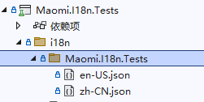

# 多语言框架的设计

在本节中，将会介绍如何设计和编写一个 i18n 框架，框架的全部代码如下所示。

```csharp
// 手动设置当前语言作用域
CultureInfoScope
// 记录当前请求语言
I18nContext.cs
// 服务注入扩展
I18nExtensions.cs
// 生成 I18nContext
I18nMiddleware.cs
// 自定义请求语言解析
I18nRequestCultureProvider.cs
// i18n 语言资源提供接口
I18nResource.cs
// i18n 语言资源工厂
I18nResourceFactory.cs
// 实现 IStringLocalizer 接口
I18nStringLocalizer.cs
// 实现 IStringLocalizer<T> 接口
I18nStringLocalizer`.cs
// 实现 I18nResourceFactory
InternalI18nResourceFactory.cs
// 实现 I18nResource，通过 json 文件导入语言资源
JsonResource.cs
// 扩展
JsonResourceExtensions.cs
// 解析 json 的帮助类
ReadJsonHelper.cs
```


#### 抽象接口

设计多语言框架，首先将框架划分为三个角色，即使用者、框架自身、多语言提供者，使用者通过抽象接口获取 key 对应语言的值，多语言提供者通过抽象接口提供多语言键值对数据。所以，抽象接口主要是面向使用者和多语言提供者设计，框架自身则是为使用者和提供者架设一个桥梁，此外还需要定义一些上下文类、模型类，以便传递信息。


定义一个 I18nResource 接口，i18n 框架通过该接口加载多语言数据。

```csharp
// i18n 资源管理
public interface I18nResource
{
	// 该资源提供的语言
	IReadOnlyList<CultureInfo> SupportedCultures { get; }

	// 该资源提供的 UI 语言
	IReadOnlyList<CultureInfo> SupportedUICultures { get; }

	// 获取值
	LocalizedString Get(string culture, string name);

	// 获取值，支持字符串插值
	LocalizedString Get(string culture, string name, params object[] arguments);

	// 获取值
	LocalizedString Get<T>(string culture, string name);

	// 支持字符串插值
	LocalizedString Get<T>(string culture, string name, params object[] arguments);

	// 获取全部字符串
	IEnumerable<LocalizedString> GetAllStrings(bool includeParentCultures);
}
```


然后创建多语言管理工厂，管理 I18nResource 列表。

```csharp
// I18n 资源工厂
public interface I18nResourceFactory
{
	// 支持的语言
	IList<CultureInfo> SupportedCultures { get; }

	// UI 支持的语言
	IList<CultureInfo> SupportedUICultures { get; }

	// 所有资源提供器
	IReadOnlyList<I18nResource> Resources { get; }

	// 添加资源提供器
	I18nResourceFactory Add(I18nResource resource);
}
```


接下来是设计使用者接口的抽象。

ASP.NET Core 通过 IRequestCultureProvider 检索出来的当前请求语言，为了简化解析语言标识的代码，定义一个I18nContext 类型，用来存储从请求上下文中解析处理的多语言标识，i18n 框架中下游服务可以通过 I18nContext 获取当前请求语言。

```csharp
// 记录当前请求的 i18n 信息
public class I18nContext
{
	// 当前用户请求的语言
	public CultureInfo Culture { get; internal set; } = CultureInfo.CurrentCulture;
}
```


 `IStringLocalizer`、`IStringLocalizer<T>` 是 ASP.NET Core 中多语言服务的接口，使用者可以从这两个接口中查询多语言字符串，我们实现两个对应的服务，从 I18nResource 集合中查找出对应字符串的值。

```csharp
// i18n 字符串本地化，从 I18nResource 获取字符串
public class I18nStringLocalizer : IStringLocalizer
{
	private readonly I18nContext _context;
	private readonly IReadOnlyList<I18nResource> _resources;
	public I18nStringLocalizer(I18nContext context, I18nResourceFactory resourceFactory)
	{
		_context = context;
		_resources = resourceFactory.Resources;
	}

	public LocalizedString this[string name] => Find(name);

	public LocalizedString this[string name, params object[] arguments] => Find(name, arguments);

	public IEnumerable<LocalizedString> GetAllStrings(bool includeParentCultures)
	{
		foreach (var resource in _resources)
		{
			foreach (var item in resource.GetAllStrings(includeParentCultures))
			{
				yield return item;
			}
		}
	}

	private LocalizedString Find(string name)
	{
		foreach (var resource in _resources)
		{
			var result = resource.Get(_context.Culture.Name, name);
			if (result == null || result.ResourceNotFound) continue;
			return result;
		}
		// 所有的资源都查找不到时，使用默认值
		return new LocalizedString(name, name);
	}

	private LocalizedString Find(string name, params object[] arguments)
	{
		foreach (var resource in _resources)
		{
			var result = resource.Get(_context.Culture.Name, name, arguments);
			if (result == null || result.ResourceNotFound) continue;
			return result;
		}
		// 所有的资源都查找不到时，使用默认值
		return new LocalizedString(name, name);
	}
}
```

```csharp
public class I18nStringLocalizer<T> : IStringLocalizer<T>
{
	private readonly I18nContext _context;
	private readonly IReadOnlyList<I18nResource> _resources;

	public I18nStringLocalizer(I18nContext context, I18nResourceFactory resourceFactory)
	{
		_context = context;
		_resources = resourceFactory.Resources;
	}

	public LocalizedString this[string name] => Find(name);

	public LocalizedString this[string name, params object[] arguments] => Find(name, arguments);

	public IEnumerable<LocalizedString> GetAllStrings(bool includeParentCultures)
	{
		foreach (var resource in _resources)
		{
			foreach (var item in resource.GetAllStrings(includeParentCultures))
			{
				yield return item;
			}
		}
	}

	private LocalizedString Find(string name)
	{
		foreach (var resource in _resources)
		{
			var result = resource.Get<T>(_context.Culture.Name, name);
			if (result == null || result.ResourceNotFound) continue;
			return result;
		}
		// 所有的资源都查找不到时，使用默认值
		return new LocalizedString(name, name);
	}

	private LocalizedString Find(string name, params object[] arguments)
	{
		foreach (var resource in _resources)
		{
			var result = resource.Get<T>(_context.Culture.Name, name, arguments);
			if (result == null || result.ResourceNotFound) continue;
			return result;
		}
		// 所有的资源都查找不到时，使用默认值
		return new LocalizedString(name, name);
	}
}
```


CultureInfoScope 的作用很简单，在其作用域之内修改 CultureInfo.CurrentCulture 的值。

```csharp
public class CultureInfoScope : IDisposable
{
	private readonly CultureInfo _defaultCultureInfo;

	public CultureInfoScope(string language)
	{
		_defaultCultureInfo = CultureInfo.CurrentCulture;
		CultureInfo.CurrentCulture = CultureInfo.CreateSpecificCulture(language);
	}

	public void Dispose()
	{
		CultureInfo.CurrentCulture = _defaultCultureInfo;
	}
}
```


至此，我们已经设计好 i18n 框架的抽象了，接下来我们会进一步实现 i18n 框架。


#### 实现从 json 读取语言资源

Maomi.I18n 本身实现了一个从 json 文件读取多语言资源包的 I18nResource 服务，代码在 JsonResource.cs 中，下面笔者以 JsonResource 为例，讲解开发者如何实现一个 I18nResource 服务。

为了保证每个项目都可以携带自己的语言信息，我们可以要求项目下面创建 i18n 目录，然后创建与当前项目同名的子目录，在子目录下存储自己的语言文件。



这样做的好处时，当编译项目时，主项目下的 i18n 会收集到所有项目的语言文件，而且不会发生冲突。而且当我们使用 nuget 打包项目时，nuget 包还会携带这些文件，使用这个拉取 nuget 包后也可以使用到这些多语言文件。

```csharp
public class JsonResource<TResource> : I18nResource
{
	protected readonly string _defaultLanguage;

	public IReadOnlyList<CultureInfo> SupportedCultures => new List<CultureInfo>() { new CultureInfo(_defaultLanguage) };
	public IReadOnlyList<CultureInfo> SupportedUICultures => new List<CultureInfo>() { new CultureInfo(_defaultLanguage) };


	private readonly IReadOnlyDictionary<string, LocalizedString> _kvs;

	public JsonResource(string language, IReadOnlyDictionary<string, object> kvs)
	{
		_defaultLanguage = language;
		_kvs = kvs.ToDictionary(x => x.Key, x => new LocalizedString(x.Key, x.Value.ToString()));
	}

	public IEnumerable<LocalizedString> GetAllStrings(bool includeParentCultures) => _kvs.Values;

	public LocalizedString Get(string culture, string name)
	{
		if (culture != _defaultLanguage) return new LocalizedString(name, name, resourceNotFound: true);

		var value = _kvs.GetValueOrDefault(name);
		if (value == null) return new LocalizedString(name, name, resourceNotFound: true);
		return value;
	}

	public LocalizedString Get(string culture, string name, params object[] arguments)
	{
		if (culture != _defaultLanguage) return new LocalizedString(name, name, resourceNotFound: true);

		var value = _kvs.GetValueOrDefault(name);
		if (value == null) return new LocalizedString(name, name, resourceNotFound: true);

		return new LocalizedString(name, string.Format(value, arguments));
	}

	public LocalizedString Get<T>(string culture, string name)
	{
		// 不是同一个程序集的资源，不处理
		if (typeof(TResource).Assembly != typeof(T).Assembly) return new LocalizedString(name, name, resourceNotFound: true);
		return Get(culture, name);
	}

	public LocalizedString Get<T>(string culture, string name, params object[] arguments)
	{
		if (typeof(TResource).Assembly != typeof(T).Assembly) return new LocalizedString(name, name, resourceNotFound: true);
		return Get(culture, name, arguments);
	}
}
```


编写扩展方法注入 json 语言资源，该扩展方法只会加载与 `T` 类型所在程序集的相同命名目录下的 json 文件。

```csharp
public static class JsonResourceExtensions
{
	// 添加 json 文件资源
	public static I18nResourceFactory AddJson<T>(this I18nResourceFactory resourceFactory,
		string basePath)
		where T : class
	{
		var dirName = typeof(T).Assembly.GetName().Name;

		// 非递归法遍历所有目录，读取 json 文件，生成语言支持
		var rootDir = new DirectoryInfo(Path.Combine(Directory.GetParent(typeof(T).Assembly.Location).FullName, basePath));
		var lanDir = rootDir.GetDirectories().FirstOrDefault(x => x.Name == dirName);

		ArgumentNullException.ThrowIfNull(lanDir);

		var files = lanDir.GetFiles().Where(x => x.Name.EndsWith(".json"));
		foreach (var file in files)
		{
			var language = Path.GetFileNameWithoutExtension(file.Name);
			var text = File.ReadAllText(file.FullName);
			// 参考第四章实现的 ReadJsonHelper.cs
			var dic = ReadJsonHelper.Read(new ReadOnlySequence<byte>(Encoding.UTF8.GetBytes(text)), new JsonReaderOptions { AllowTrailingCommas = true });

			JsonResource<T> jsonResource = new JsonResource<T>(language, dic);
			resourceFactory.Add(jsonResource);
		}

		return resourceFactory;
	}
}
```


#### 实现 Web i18n 框架

在 Web 中，框架需要支持从请求上下文中获取语言标识，所以需要编写一个中间件，用于获取当前请求的语言信息，然后存储到 I18nContext 中。

```csharp
// i18n 中间件，从请求中提取用户指定的语言
public class I18nMiddleware : IMiddleware
{
	// 默认多语言配置
	private readonly CultureInfo _defaultCulture;

	public I18nMiddleware(CultureInfo defaultCulture)
	{
		_defaultCulture = defaultCulture;
	}

    // 从请求上下文中解析语言标识
	public async Task InvokeAsync(HttpContext context, RequestDelegate next)
	{
		CultureInfo culture;
		var requestCultureFeature = context.Features.Get<IRequestCultureFeature>();
		var requestCulture = requestCultureFeature?.RequestCulture;
		if (requestCulture != null)
			culture = requestCulture.Culture;
		else culture = _defaultCulture;

		var option = context.RequestServices.GetRequiredService<I18nContext>();
		option.Culture = culture;
		await next(context);
	}
}
```


最后在 I18nExtensions 中实现一个中间件扩展，使用该扩展解析语言标识。

```csharp
// i18n 中间件
public static void UseI18n(this IApplicationBuilder app)
{
	app.UseRequestLocalization();
	app.UseMiddleware<I18nMiddleware>();
}
```


中间件准备完毕之后，我们开始写管理 I18nResourceFactory 接口的实现，以便管理好各种语言资源服务。

```csharp
internal class InternalI18nResourceFactory : I18nResourceFactory
{
	private readonly List<I18nResource> _resources;
	public IReadOnlyList<I18nResource> Resources => _resources;

	private readonly List<CultureInfo> _supportedCultures = new();
	public IList<CultureInfo> SupportedCultures => _supportedCultures;

	private readonly List<CultureInfo> _supportedUICultures = new();
	public IList<CultureInfo> SupportedUICultures => _supportedUICultures;

	internal InternalI18nResourceFactory()
	{
		_resources = new List<I18nResource>();
	}

	public I18nResourceFactory Add(I18nResource resource)
	{
		_resources.Add(resource);
		foreach (var item in resource.SupportedCultures)
		{
			if (_supportedCultures.Contains(item)) continue;
			_supportedCultures.Add(item);
		}
		foreach (var item in resource.SupportedUICultures)
		{
			if (_supportedUICultures.Contains(item)) continue;
			_supportedUICultures.Add(item);
		}
		return this;
	}
}
```


实现 IStringLocalizerFactory 接口，根据泛型类型创建 `IStringLocalizer` 对象。

```csharp
public class I18nStringLocalizerFactory : IStringLocalizerFactory
{
	private readonly I18nResourceFactory _i18NResourceFactory;
	public I18nStringLocalizerFactory(I18nResourceFactory i18NResourceFactory)
	{
		_i18NResourceFactory = i18NResourceFactory;
	}

    // 根据泛型类型创建 IStringLocalizer
	public IStringLocalizer Create(Type resourceSource)
	{
		return Activator.CreateInstance(typeof(I18nStringLocalizer<>).MakeGenericType(resourceSource),
			new object[]
			{
						new I18nContext{ Culture = CultureInfo.CurrentCulture },
						_i18NResourceFactory
			}) as IStringLocalizer;
	}

	public IStringLocalizer Create(string baseName, string location)
	{
		throw new NotImplementedException();
	}
}
```


最后在 I18nExtensions 中添加 AddI18n 扩展方法注入相关的服务。

```csharp
public static class I18nExtensions
{
    // 添加 i18n 资源
	public static void AddI18nResource(this IServiceCollection services, Action<I18nResourceFactory> resourceFactory)
	{
		var service = services.BuildServiceProvider().GetRequiredService<I18nResourceFactory>();
		resourceFactory.Invoke(service);
	}

    // 添加 i18n 支持服务
	public static void AddI18n(this IServiceCollection services,
		string defaultLanguage = "zh-CN")
	{
		InternalI18nResourceFactory resourceFactory = new InternalI18nResourceFactory();

		// ASP.NET Core 自带的
		services.AddLocalization();

		// 配置 ASP.NET Core 的本地化服务
		services.Configure<RequestLocalizationOptions>(options =>
		{
			options.ApplyCurrentCultureToResponseHeaders = true;
			options.DefaultRequestCulture = new RequestCulture(culture: defaultLanguage, uiCulture: defaultLanguage);
			options.SupportedCultures = resourceFactory.SupportedCultures;
			options.SupportedUICultures = resourceFactory.SupportedUICultures;

			// 默认自带了三个请求语言提供器，会先从这些提供器识别要使用的语言。
			// QueryStringRequestCultureProvider
			// CookieRequestCultureProvider
			// AcceptLanguageHeaderRequestCultureProvider
			// 自定义请求请求语言提供器
			options.RequestCultureProviders.Add(new I18nRequestCultureProvider(defaultLanguage));
		});

		// i18n 中间件
		services.AddScoped<I18nContext>();
		services.AddScoped<I18nMiddleware>(s => new I18nMiddleware(new CultureInfo(defaultLanguage)));

		// 注入 i18n 服务
		services.AddSingleton<I18nResourceFactory>(s => resourceFactory);
		services.AddSingleton<IStringLocalizerFactory, I18nStringLocalizerFactory>();
		services.AddScoped<IStringLocalizer, I18nStringLocalizer>();
		services.TryAddEnumerable(new ServiceDescriptor(typeof(IStringLocalizer<>), typeof(I18nStringLocalizer<>), ServiceLifetime.Scoped));
	}

	/// <summary>
	/// i18n 中间件
	/// </summary>
	/// <param name="app"></param>
	public static void UseI18n(this IApplicationBuilder app)
	{
		app.UseRequestLocalization();
		app.UseMiddleware<I18nMiddleware>();
	}
}
```

