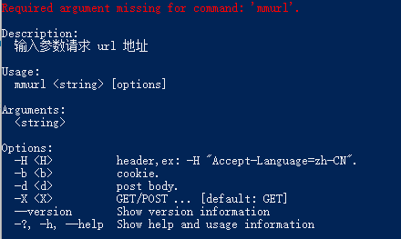

# 制作 .NET 工具包

.NET 工具包是一种特殊的 NuGet 包，比如 dotnet-dump、Refitter 等，都属于工具包。在企业内部开发时，为了提高工作效率，往往需要制作一些脚本之类的工具，而 .NET 工具包非常时候用于制作这些脚本，然后下方给其他人使用。

本节示例代码请参考 Maomi.Curl 项目，Maomi.Curl 是一个类似 curl 的工具，可以发起 http 请求，在正式开发之前，先安装 Maomi.Curl ，了解其使用方式。

通过命令安装 Maomi.Curl：

```bash
dotnet tool install --global Maomi.Curl --version 2.0.0
```

Maomi.Curl 别名为 mmurl，在终端中输入 mmurl 查看参数列表和使用示例。




jsonplaceholder.typicode.com 是一个用于测试测试 API 请求的网站，我们可以通过相关接口测试 mmurl 的功能，使用 mmurl 发起 get 请求：

```bash
mmurl https://jsonplaceholder.typicode.com/todos/1
```

```json
request: https://jsonplaceholder.typicode.com/todos/1
{
  "userId": 1,
  "id": 1,
  "title": "delectus aut autem",
  "completed": false
}
```


使用 mmurl 发起 post 请求：

```bash
mmurl -X POST -d '{\"userId\":2}' https://jsonplaceholder.typicode.com/posts
```

```json
request: https://jsonplaceholder.typicode.com/posts
{
  "userId": 2,
  "id": 101
}
```


在了解 Maomi.Curl 之后，下面正式开始编写工具包。编写工具包需要掌握两方面的知识点，一个是工具包项目配置，一个是命令行工具包的使用方式。

工具包项目其实就是控制台项目，只是在 .csproj 中需要添加一些属性配置：

```xml
<Project Sdk="Microsoft.NET.Sdk">

	<PropertyGroup>
		<OutputType>Exe</OutputType>
		<TargetFramework>net8.0</TargetFramework>
		<ImplicitUsings>enable</ImplicitUsings>
		<Nullable>enable</Nullable>
		<RootNamespace>Maomi.Curl</RootNamespace>
	</PropertyGroup>

	<PropertyGroup>
        <!--设置为工具包项目-->
		<PackAsTool>true</PackAsTool>
        <!--命令行工具名称-->
		<ToolCommandName>mmurl</ToolCommandName>
		<Version>2.0.0</Version>
		<Description>一个类似 curl 的工具</Description>
		<PackageId>Maomi.Curl</PackageId>
	</PropertyGroup>

	<ItemGroup>
	  <PackageReference Include="System.CommandLine" Version="2.0.0-beta4.22272.1" />
	</ItemGroup>
	
</Project>

```


首先编写 get、post 两个请求方法，这两个方法其实就是使用 HttpClient 进行请求，代码比较简单。

```csharp
private static async Task GetAsync(string url, IReadOnlyDictionary<string, string> headers, string? cookie = null)
{
	var client = new HttpClient();
	BuildHeader(headers, cookie, client);

	var response = await client.GetAsync(new Uri(url));
	Console.WriteLine(await response.Content.ReadAsStringAsync());
}

private static async Task PostAsync(string url, IReadOnlyDictionary<string, string> headers, string body, string? cookie = null)
{
	var client = new HttpClient();
	BuildHeader(headers, cookie, client);

	var jsonContent = new StringContent(body);
	jsonContent.Headers.ContentType = new System.Net.Http.Headers.MediaTypeHeaderValue("application/json");

	var response = await client.PostAsync(new Uri(url), jsonContent);
	Console.WriteLine(await response.Content.ReadAsStringAsync());
}

private static void BuildHeader(IReadOnlyDictionary<string, string> headers, string? cookie, HttpClient client)
{
	if (headers != null && headers.Count > 0)
	{
		foreach (var item in headers)
			client.DefaultRequestHeaders.Add(item.Key, item.Value);
	}
	if (!string.IsNullOrEmpty(cookie))
	{
		client.DefaultRequestHeaders.Add("Cookie", cookie);
	}
}
```


那么，怎么从命令行参数中解析出对应的参数呢？System.CommandLine 是一个命令行工具包，能够帮助开发者简化解析命令行参数的步骤。

```csharp
static async Task<int> Main(string[] args)
{
	// 定义命令参数
	// http header
	var headers = new Option<Dictionary<string, string>?>(
		name: "-H",
		description: "header,ex: -H \"Accept-Language=zh-CN\".",
		parseArgument: result =>
		{
			var dic = new Dictionary<string, string>();
			if (result.Tokens.Count == 0) return dic;

			foreach (var item in result.Tokens)
			{
				var header = item.Value.Split("=");
				dic.Add(header[0], header[1]);
			}
			return dic;
		})
	{
		// 可以出现 0 或多次
		Arity = ArgumentArity.ZeroOrMore,
	};

	var cookie = new Option<string?>(
		name: "-b",
		description: "cookie.")
	{
		Arity = ArgumentArity.ZeroOrOne
	};

	var body = new Option<string?>(
		name: "-d",
		description: "post body.")
	{
		Arity = ArgumentArity.ZeroOrOne
	};

	var httpMethod = new Option<string?>(
		name: "-X",
		description: "GET/POST ...",
		getDefaultValue: () => "GET")
	{
		Arity = ArgumentArity.ZeroOrOne
	};

	// 其它无名的参数
	var otherArgument = new Argument<string>();

	// 构建命令行参数
	var rootCommand = new RootCommand("输入参数请求 url 地址");
	rootCommand.AddOption(headers);
	rootCommand.AddOption(cookie);
	rootCommand.AddOption(body);
	rootCommand.AddOption(httpMethod);
	rootCommand.Add(otherArgument);

	// 解析参数调用
	rootCommand.SetHandler(async (headers, cookie, body, httpMethod, otherArgument) =>
	{
		Console.WriteLine($"request: {otherArgument}");

		if (headers == null) headers = new Dictionary<string, string>();

		try
		{
			if (!string.IsNullOrEmpty(body) ||
			"POST".Equals(httpMethod, StringComparison.InvariantCultureIgnoreCase))
			{
				ArgumentNullException.ThrowIfNull(body);
				await PostAsync(otherArgument, headers, body, cookie);
			}
			else
			{
				await GetAsync(otherArgument, headers, cookie);
			}
		}
		catch (Exception ex)
		{
			Console.ForegroundColor = ConsoleColor.Red;
			Console.WriteLine(ex.Message);
			Console.ResetColor();
		}

	}, headers, cookie, body, httpMethod, otherArgument);
	return await rootCommand.InvokeAsync(args);
}
```


当工具包项目编写完成后，可以制作为 nuget 包，上传到 nuget.org 中，其他人也可以使用到你开发的工具。