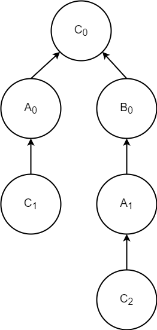
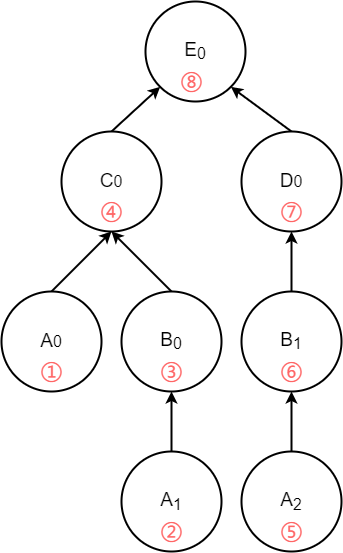
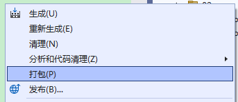
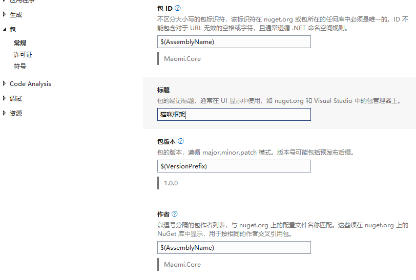
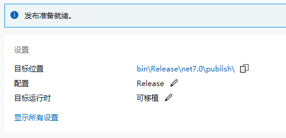
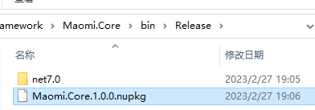
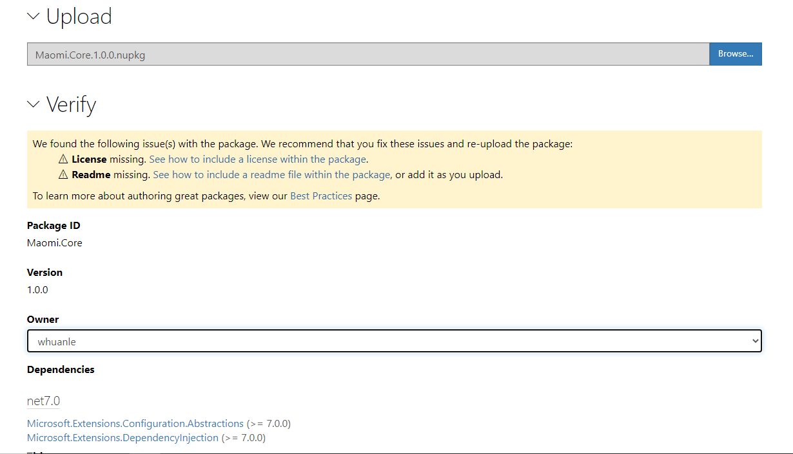
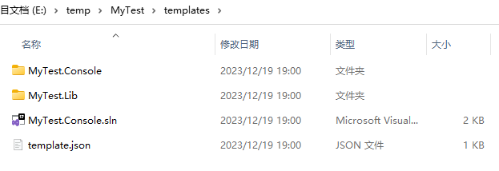

# 模块化和自动服务注册的设计和实现

在本小节中，我们将会开始设计一个支持模块化和自动服务注册的小框架，从设计和实现 Maomi.Core 开始，我们在后面的章节中会掌握更多框架技术的设计思路和实现方法，从而掌握从零开始编写一个框架的能力。


#### 项目说明

创建一个名为 Maomi.Core 的类库项目，这个类库中将会包含框架核心抽象和实现代码。


为了减少命名空间长度，便于开发的时候引入需要的命名空间，打开 Maomi.Core.csproj 文件，在 PropertyGroup 属性中，添加一行配置：

```xml
<RootNamespace>Maomi</RootNamespace>
```


配置 `<RootNamespace>` 属性之后，我们在 Maomi.Core 项目中创建的类型，其命名空间都会以 `Maomi.` 开头，而不是 `Maomi.Core`。


接着为项目添加两个依赖包，以便实现自动依赖注入和初始化模块时提供配置。

```bash
Microsoft.Extensions.DependencyInjection
Microsoft.Extensions.Configuration.Abstractions
```


#### 模块化设计

当本章的代码编写完毕之后，我们可以这样实现一个模块、初始化模块、引入依赖模块。代码示例如下：

```csharp
    [InjectModule<ApplicationModule>]
    public class ApiModule : IModule
    {
        private readonly IConfiguration _configuration;
        public ApiModule(IConfiguration configuration)
        {
            _configuration = configuration;
        }

        public void ConfigureServices(ServiceContext context)
        {
            var configuration = context.Configuration;
            context.Services.AddCors();
        }
    }
```


从这段代码，笔者以从上到下的顺序来解读我们需要实现哪些技术点。

**1，模块依赖。**

`[InjectModule<ApplicationModule>]`  表示当前模块需要依赖哪些模块。如果需要依赖多个模块，可以使用多个特性，示例如下：

```csharp
[InjectModule<DomainModule>]
[InjectModule<ApplicationModule>]
```


**2，模块接口和初始化。**

每一个模块都需要实现 IModule 接口，框架识别到类型继承了这个接口后才会把类型当作一个模块类进行处理。IModule 接口很简单，只有 `ConfigureServices(ServiceContext context)` 一个方法，可以在这个方法中编写初始化模块的代码。ConfigureServices  方法中有一个 ServiceContext 类型的参数， ServiceContext 中包含了 IServiceCollection、IConfiguration ，模块可以从 ServiceContext 中获得当前容器的服务、启动时的配置等。


**3，依赖注入**

每个模块的构造函数都可以使用依赖注入，可以在模块类中注入需要的服务，开发者可以在模块初始化时，通过这些服务初始化模块。


基于以上三点，我们可以先抽象出特性类、接口等，由于这些类型不包含具体的逻辑，因此从这一部分先下手，实现起来会更简单，可以避免大脑混乱，编写框架时不知道要从哪里先下手。


创建一个 `ServiceContext` 类，用于在模块间传递服务上下文信息，其代码如下：

```csharp
    public class ServiceContext
    {
        private readonly IServiceCollection _serviceCollection;
        private readonly IConfiguration _configuration;

        internal ServiceContext(IServiceCollection serviceCollection, IConfiguration configuration)
        {
            _serviceCollection = serviceCollection;
            _configuration = configuration;
        }

        public IServiceCollection Services => _serviceCollection;
        public IConfiguration Configuration => _configuration;
    }
```

> 根据实际需求，还可以在 ServiceContext 中添加日志等属性字段。


创建 IModule 接口。

```csharp
    public interface IModule
    {
        void ConfigureServices(ServiceContext services);
    }
```


创建 `InjectModuleAttribute` 特性，用于引入依赖模块。

```csharp
    [AttributeUsage(AttributeTargets.Class, AllowMultiple = true, Inherited = false)]
    public class InjectModuleAttribute : Attribute
    {
        // 依赖的模块
        public Type ModuleType { get; private init; }
        public InjectModuleAttribute(Type type)
        {
            ModuleType = type;
        }
    }

    [AttributeUsage(AttributeTargets.Class, AllowMultiple = true, Inherited = false)]
    public sealed class InjectModuleAttribute<TModule> : InjectModuleAttribute
        where TModule : IModule
    {
        public InjectModuleAttribute() : base(typeof(TModule)){}
    }
```

> 泛型特性属于 C# 11 的新语法。


定义两个特性类后，我们可以使用 `[InjectModule(typeof(AppModule))]` 或 `InjectModule<AppModule>` 的方式定义依赖模块。


#### 自动服务注册的设计

当完成本章的代码编写后，如果需要注入服务，只需要标记 `[InjectOn]` 特性即可。

```csharp
// 简单注册
[InjectOn]
public class MyService : IMyService
// 注注册并设置生命周期为 scope
[InjectOn(ServiceLifetime.Scoped)]
public class MyService : IMyService

// 只注册接口，不注册父类
[InjectOn(InjectScheme.OnlyInterfaces)]
public class MyService : ParentService, IMyService
```


有时我们会有各种各样的需求，例如 `MyService` 继承了父类 `ParentService` 和接口 `IMyService`，但是只需要注册 `ParentService`，而不需要注册接口；又或者只需要注册 MyService，而不需要注册  `ParentService` 、 `IMyService`。

创建 InjectScheme 枚举，定义注册模式：

```csharp
    public enum InjectScheme
    {
        // 注入父类、接口
        Any,
        
        // 手动选择要注入的服务
        Some,
        
        // 只注入父类
        OnlyBaseClass,
        
        // 只注入实现的接口
        OnlyInterfaces,
        
        // 此服务不会被注入到容器中
        None
    }
```


定义服务注册特性：

```csharp
    // 依赖注入标记
    [AttributeUsage(AttributeTargets.Class, AllowMultiple = false, Inherited = false)]
    public class InjectOnAttribute : Attribute
    {
        // 要注入的服务
        public Type[]? ServicesType { get; set; }
        
        // 生命周期
        public ServiceLifetime Lifetime { get; set; }
        
        // 注入模式
        public InjectScheme Scheme { get; set; }

        // 是否注入自己
        public bool Own { get; set; } = false;
        
        public InjectOnAttribute(ServiceLifetime lifetime = ServiceLifetime.Transient, 
                                 InjectScheme scheme = InjectScheme.OnlyInterfaces)
        {
            Lifetime = lifetime;
            Scheme = scheme;
        }
    }
```


#### 模块依赖

因为模块之间会有依赖关系，因此为了生成模块树，需要定义一个 ModuleNode 类表示模块节点，**一个 ModuleNode 实例标识一个依赖关系**。


```csharp
    /// <summary>
    /// 模块节点
    /// </summary>
    internal class ModuleNode
    {
        // 当前模块类型
        public Type ModuleType { get; set; } = null!;

        // 链表，指向父模块节点，用于循环引用检测
        public ModuleNode? ParentModule { get; set; }
        
        // 依赖的其它模块
        public HashSet<ModuleNode>? Childs { get; set; }

        // 通过链表检测是否出现了循环依赖
        public bool ContainsTree(ModuleNode childModule)
        {
            if (childModule.ModuleType == ModuleType) return true;
            if (this.ParentModule == null) return false;
            // 如果当前模块找不到记录，则向上查找
            return this.ParentModule.ContainsTree(childModule);
        }

        public override int GetHashCode()
        {
            return ModuleType.GetHashCode();
        }

        public override bool Equals(object? obj)
        {
            if (obj == null) return false;
            if(obj is ModuleNode module)
            {
                return GetHashCode() == module.GetHashCode();
            }
            return false;
        }
    }
```


框架在扫描所有程序集之后，通过 ModuleNode 实例将所有模块以及模块依赖组成一颗模块树，通过模块树来判断是否出现了循环依赖。

比如，有以下模块和依赖：

```csharp
[InjectModule<A>()]
[InjectModule<B>()]
class C:IModule

[InjectModule<A>()]
class B:IModule

// 这里出现了循环依赖
[InjectModule<C>()]
class A:IModule

// C 是入口模块
services.AddModule<C>();
```


因为 C 模块依赖 A、B 模块，所以 A、B 是节点 C 的子节点，而 A、B 的父节点则是 C。

```
C.Childs = new (){ A , B}

A.ParentModule => C
B.ParentModule => C
```


当把 A、B、C 三个模块以及依赖关系扫描完毕之后，会得到以下的模块依赖树。一个节点即是一个 ModuleNode 实例，一个模块被多次引入，就会出现多次。




那么，如果识别到循环依赖呢？只需要调用 `ModuleNode.ContainsTree()`从一个 ModuleNode 实例中，不断往上查找 `ModuleNode.ParentModule` 即可，如果该链表中包含相同类型的模块，即为循环依赖，需要抛出异常。

比如从 C<sub>0</sub> 开始，没有父节点，则不存在循环依赖。

从 A<sub>0</sub> 开始，A<sub>0</sub> -> C<sub>0</sub> ，该链路中也没有出现重复的 A 模块。

从 C<sub>1</sub> 开始，C<sub>1</sub> -> A<sub>0</sub> -> C<sub>0</sub> ，该链路中 C 模块重复出现，则说明出现了循环依赖。


所以，是否出现了循环依赖判断起来是很简单的，我们只需要从 `ModuleNode.ContainsTree()` 往上查找即可。


在生成模块树之后，通过对模块树进行后序遍历即可。

比如，有以下模块以及依赖。

```csharp
[InjectModule<C>()]
[InjectModule<D>()]
class E:IModule

[InjectModule<A>()]
[InjectModule<B>()]
class C:IModule

[InjectModule<B>()]
class D:IModule
    
[InjectModule<A>()]
class B:IModule
    
class A:IModule

// E 是入口模块
services.AddModule<E>();
```


生成模块依赖树如图所示：


首先从 E<sub>0</sub> 开始扫描，因为 E<sub>0</sub> 下存在子节点 C<sub>0</sub>、 D<sub>0</sub>，那么就会先顺着 C<sub>0</sub> 再次扫描，扫描到 A<sub>0</sub> 时，因为 A<sub>0</sub> 下已经没有子节点了，所以会对 A<sub>0</sub> 对应的模块 A 进行初始化。根据上图模块依赖树进行后序遍历，初始化模块的顺序是（已经被初始化的模块会跳过）：



伪代码示例如下：

```csharp
		private static void InitModuleTree(ModuleNode moduleNode)
		{
			if (moduleNode.Childs != null)
			{
				foreach (var item in moduleNode.Childs)
				{
					InitModuleTree(item);
				}
			}
            
            // 如果该节点已经没有子节点
			// 如果模块没有处理过
			if (!moduleTypes.Contains(moduleNode.ModuleType))
			{
				InitInjectService(moduleNode.ModuleType);
			}
		}
```


#### 实现模块化和自动服务注册

本小节的代码都在 `ModuleExtensions.cs` 中。

当我们把接口、枚举、特性等类型定义之后，接下来我们便要思考如何实例化模块、检测模块的依赖关系，实现自动服务注册。为了简化设计，我们可以将模块化自动服务注册写在一起，当初始化一个模块时，框架同时会扫描该程序集中的服务进行注册。如果程序集中不包含模块类，那么框架不会扫描该程序集，也就不会注册服务。

接下来，我们思考模块化框架需要解决哪些问题或支持哪些功能：

* 如何识别和注册服务；

* 框架能够识别模块的依赖，生成模块依赖树，能够检测到循环依赖等问题；

* 多个模块可能引用了同一个模块 A，但是模块 A 只能被实例化一次；

* 初始化模块的顺序；

* 模块类本身要作为服务注册到容器中，实例化模块类时，需要支持依赖注入，也就是说模块类的构造函数可以注入其它服务；

  

我们先解决第一个问题，

因为自动服务注册是根据模块所在的程序集扫描标记类，识别所有使用了 `InjectOnAttribute` 特性的类型，所以我们可以先编写一个程序集扫描方法，该方法的功能是通过程序集扫描所有类型，然后根据特性配置注册服务。


```csharp
/// <summary>
/// 自动依赖注入
/// </summary>
/// <param name="services"></param>
/// <param name="assembly"></param>
/// <param name="injectTypes">已被注入的服务</param>
private static void InitInjectService(IServiceCollection services, Assembly assembly, HashSet<Type> injectTypes)
{
	// 只扫描可实例化的类，不扫描静态类、接口、抽象类、嵌套类、非公开类等
	foreach (var item in assembly.GetTypes().Where(x => x.IsClass && !x.IsAbstract && !x.IsNestedPublic))
	{
		var inject = item.GetCustomAttributes().FirstOrDefault(x => x.GetType() == typeof(InjectOnAttribute)) as InjectOnAttribute;
		if (inject == null) continue;

		if (injectTypes.Contains(item)) continue;
		injectTypes.Add(item);

		// 如果需要注入自身
		if (inject.Own)
		{
			switch (inject.Lifetime)
			{
				case ServiceLifetime.Transient: services.AddTransient(item); break;
				case ServiceLifetime.Scoped: services.AddScoped(item); break;
				case ServiceLifetime.Singleton: services.AddSingleton(item); break;
			}
		}

		if (inject.Scheme == InjectScheme.None) continue;

		// 注入所有接口
		if (inject.Scheme == InjectScheme.OnlyInterfaces || inject.Scheme == InjectScheme.Any)
		{
			var interfaces = item.GetInterfaces();
			if (interfaces.Count() == 0) continue;
			switch (inject.Lifetime)
			{
				case ServiceLifetime.Transient: interfaces.ToList().ForEach(x => services.AddTransient(x, item)); break;
				case ServiceLifetime.Scoped: interfaces.ToList().ForEach(x => services.AddScoped(x, item)); break;
				case ServiceLifetime.Singleton: interfaces.ToList().ForEach(x => services.AddSingleton(x, item)); break;
			}
		}

		// 注入父类
		if (inject.Scheme == InjectScheme.OnlyBaseClass || inject.Scheme == InjectScheme.Any)
		{
			var baseType = item.BaseType;
			if (baseType == null) throw new ArgumentException($"{item.Name} 注入模式 {nameof(inject.Scheme)} 未找到父类！");
			switch (inject.Lifetime)
			{
				case ServiceLifetime.Transient: services.AddTransient(baseType, item); break;
				case ServiceLifetime.Scoped: services.AddScoped(baseType, item); break;
				case ServiceLifetime.Singleton: services.AddSingleton(baseType, item); break;
			}
		}
		if (inject.Scheme == InjectScheme.Some)
		{
			var types = inject.ServicesType;
			if (types == null) throw new ArgumentException($"{item.Name} 注入模式 {nameof(inject.Scheme)} 未找到服务！");
			switch (inject.Lifetime)
			{
				case ServiceLifetime.Transient: types.ToList().ForEach(x => services.AddTransient(x, item)); break;
				case ServiceLifetime.Scoped: types.ToList().ForEach(x => services.AddScoped(x, item)); break;
				case ServiceLifetime.Singleton: types.ToList().ForEach(x => services.AddSingleton(x, item)); break;
			}
		}
	}
}
```


定义两个扩展函数，用于注入入口模块。

```csharp
		/// <summary>
		/// 注册模块化服务
		/// </summary>
		/// <typeparam name="TModule">入口模块</typeparam>
		/// <param name="services"></param>
		public static void AddModule<TModule>(this IServiceCollection services)
			where TModule : IModule
		{
			AddModule(services, typeof(TModule));
		}


		/// <summary>
		/// 注册模块化服务
		/// </summary>
		/// <param name="services"></param>
		/// <param name="startupModule">入口模块</param>
		public static void AddModule(this IServiceCollection services, Type startupModule)
		{
			if (startupModule?.GetInterface(nameof(IModule)) == null)
			{
				throw new TypeLoadException($"{startupModule?.Name} 不是有效的模块类");
			}

			IServiceProvider scope = BuildModule(services, startupModule);
		}
```


框架需要从入口模块程序集开始查找被依赖的模块程序集，然后通过后序遍历初始化每个模块，并扫描该模块程序集中的服务。

创建一个 `BuildModule` 函数，BuildModule 为构建模块依赖树、初始化模块提前创建环境。

```csharp
		/// <summary>
		/// 构建模块依赖树并初始化模块
		/// </summary>
		/// <param name="services"></param>
		/// <param name="startupModule"></param>
		/// <returns></returns>
		/// <exception cref="InvalidOperationException"></exception>
		private static IServiceProvider BuildModule(IServiceCollection services, Type startupModule)
		{
			// 生成根模块
			ModuleNode rootTree = new ModuleNode()
			{
				ModuleType = startupModule,
				Childs = new HashSet<ModuleNode>()
			};

			// 根模块依赖的其他模块
			// IModule => InjectModuleAttribute
			var rootDependencies = startupModule.GetCustomAttributes(false)
				.Where(x => x.GetType().IsSubclassOf(typeof(InjectModuleAttribute)))
				.OfType<InjectModuleAttribute>();

			// 构建模块依赖树
			BuildTree(services, rootTree, rootDependencies);

			// 构建一个 Ioc 实例，以便初始化模块类
			var scope = services.BuildServiceProvider();

			// 初始化所有模块类
			var serviceContext = new ServiceContext(services, scope.GetService<IConfiguration>()!);

			// 记录已经处理的程序集、模块和服务，以免重复处理
			HashSet<Assembly> moduleAssemblies = new HashSet<Assembly> { startupModule.Assembly };
			HashSet<Type> moduleTypes = new HashSet<Type>();
			HashSet<Type> injectTypes = new HashSet<Type>();

            // 后序遍历树并初始化每个模块
			InitModuleTree(scope, serviceContext, moduleAssemblies, moduleTypes, injectTypes, rootTree);

			return scope;
		}
```


第一步，构建模块依赖树。

```csharp
		/// <summary>
		/// 构建模块依赖树
		/// </summary>
		/// <param name="services"></param>
		/// <param name="currentNode"></param>
		/// <param name="injectModules">其依赖的模块</param>
		private static void BuildTree(IServiceCollection services, ModuleNode currentNode, IEnumerable<InjectModuleAttribute> injectModules)
		{
			services.AddTransient(currentNode.ModuleType);
			if (injectModules == null || injectModules.Count() == 0) return;
			foreach (var childModule in injectModules)
			{
				var childTree = new ModuleNode
				{
					ModuleType = childModule.ModuleType,
					ParentModule = currentNode
				};

				// 循环依赖检测
				// 检查当前模块(parentTree)依赖的模块(childTree)是否在之前出现过，如果是，则说明是循环依赖
				var isLoop = currentNode.ContainsTree(childTree);
				if (isLoop)
				{
					throw new OverflowException($"检测到循环依赖引用或重复引用！{currentNode.ModuleType.Name} 依赖的 {childModule.ModuleType.Name} 模块在其父模块中出现过！");
				}

				if (currentNode.Childs == null)
				{
					currentNode.Childs = new HashSet<ModuleNode>();
				}

				currentNode.Childs.Add(childTree);
				// 子模块依赖的其他模块
				var childDependencies = childModule.ModuleType.GetCustomAttributes(inherit: false)
					.Where(x => x.GetType().IsSubclassOf(typeof(InjectModuleAttribute))).OfType<InjectModuleAttribute>().ToHashSet();
				// 子模块也依赖其他模块
				BuildTree(services, childTree, childDependencies);
			}
		}
```


通过后序遍历识别依赖时，由于一个模块可能会出现多次，所以初始化时需要判断模块是否已经初始化，然后对模块进行初始化并扫描模块程序集中所有的类型，进行服务注册。

```csharp
		/// <summary>
		/// 从模块树中遍历
		/// </summary>
		/// <param name="serviceProvider"></param>
		/// <param name="context"></param>
		/// <param name="moduleTypes">已经被注册到容器中的模块类</param>
		/// <param name="moduleAssemblies">模块类所在的程序集</param>'
		/// <param name="injectTypes">已被注册到容器的服务</param>
		/// <param name="moduleNode">模块节点</param>
		private static void InitModuleTree(IServiceProvider serviceProvider,
			ServiceContext context,
			HashSet<Assembly> moduleAssemblies,
			HashSet<Type> moduleTypes,
			HashSet<Type> injectTypes,
			ModuleNode moduleNode)
		{
			if (moduleNode.Childs != null)
			{
				foreach (var item in moduleNode.Childs)
				{
					InitModuleTree(serviceProvider, context, moduleAssemblies, moduleTypes, injectTypes, item);
				}
			}

			// 如果模块没有处理过
			if (!moduleTypes.Contains(moduleNode.ModuleType))
			{
				moduleTypes.Add(moduleNode.ModuleType);

				// 实例化此模块
				// 扫描此模块（程序集）中需要依赖注入的服务
				var module = (IModule)serviceProvider.GetRequiredService(moduleNode.ModuleType);
				module.ConfigureServices(context);
				InitInjectService(context.Services, moduleNode.ModuleType.Assembly, injectTypes);
				moduleAssemblies.Add(moduleNode.ModuleType.Assembly);
			}
		}

```


至此，Maomi.Core 所有的代码都已经讲解完毕，通过本章的实践，我们拥有了一个具有模块化和自动服务注册的框架。可是，别高兴得太早，我们应当如何验证框架是可靠的呢？答案是单元测试。在完成 Maomi.Core 项目之后，笔者立即编写了 Maomi.Core.Tests 单元测试项目，只有当单元测试全部通过之后，笔者才能自信地把代码放到书中。为项目编写单元测试是一个好习惯，尤其是对框架类的项目，我们需要编写大量的单元测试验证框架的可靠性，同时单元测试中大量的示例是其他开发者了解框架、入手框架的极佳参考。


### 发布到 nuget

们开发了一个支持模块化和自动服务注册的框架，通过 Maomi.Core 实现模块化应用的开发。

完成代码后，我们需要将代码共享给其他人，那么可以使用 nuget 包的方式。


当类库开发完成后，我们可以打包成 nuget 文件，上传这个到 nuget.org ，或者是内部的私有仓库，供其他开发者使用。


在 **Maomi.Core.csproj** 项目的的 `PropertyGroup` 属性中加上以下配置，以便能够在发布类库时，生成 nuget 包。

```xml
		<IsPackable>true</IsPackable>
		<PackageVersion>1.0.0</PackageVersion>
		<Title>猫咪框架</Title>
		<GeneratePackageOnBuild>True</GeneratePackageOnBuild>
```

或者右键点击项目-属性-打包。




当然，你也可以在 Visual Studio 中点击项目右键属性，在面板中进行可视化配置。




你可以配置项目的 github 地址、发布说明、开源许可证等。

配置完成后，可以使用 Visual Studio 发布项目，或使用  `dotnet publish -c Release` 命令发布项目。




发布项目后，可以在输出目录找到 `.nupkg` 文件。




打开 https://www.nuget.org/packages/manage/upload ，登录后上传 `.nupkg` 文件。




### 制作模板项目

在 .NET 中，安装 .NET SDK 时默认携带了一些项目模板，使用 `dotnet new list` 可以看到本机中已经按照的项目模板，然后通过`dotnet new {模板名称}` 命令使用模板快速创建一个应用。

通过模板创建一个应用是很方便的，项目模板提前组织好解决方案中的项目结构、代码文件，开发者使用模板时只需要提供一个名称，然后即可生成一个完整的应用。那么在本节中，笔者将会介绍如何制作自己的项目模板，进一步打包到 nuget 中，分享给更多的开发者使用。当然，在企业开发中，架构师可以规划好基础代码、设计项目架构，然后制作模板项目，业务开发者需要创建新的项目时，从企业基础项目模板一键生成即可，从而可以快速开发项目。

本节的示例代码在 `demo/1/templates` 中。


让我们来体验笔者已经制作好的项目模板，执行以下命令从 nuget 中安装模板。

```bash
dotnet new install Maomi.Console.Templates::2.0.0
```

命令执行完毕后，控制台会打印：

```bash
模板名        短名称  语言  标记
------------  ------  ----  --------------
Maomi 控制台  maomi   [C#]  Common/Console
```


使用模板名称 `maomi` 创建自定义名称的项目：

```
 dotnet new maomi --name MyTest
```



打开 Visual Studio，可以看到最近通过 nuget 安装的模板。


接下来，我们来上手制作一个属于自己的模板。

打开 `demo/1/templates` 目录，可以看到文件组织如下所示：

```bash
.
│  MaomiPack.csproj
│
└─templates
    │  Maomi.Console.sln
    │  template.json
    │
    ├─Maomi.Console
    │      ConsoleModule.cs
    │      Maomi.Console.csproj
    │      Program.cs
    │
    └─Maomi.Lib
            IMyService.cs
            LibModule.cs
            Maomi.Lib.csproj
            MyService.cs
```


创建 MaomiPack.csproj 文件（名称可以自定义），该文件用于将代码打包到 nuget 包中，否则 dotnet cli 会先编译项目再打包到 nuget 包中。

```xml
<Project Sdk="Microsoft.NET.Sdk">
  <PropertyGroup>
    <PackageType>Template</PackageType>
    <PackageVersion>2.0.0</PackageVersion>
    <PackageId>Maomi.Console.Templates</PackageId>
    <PackageTags>dotnet-new;templates;contoso</PackageTags>

    <Title>Maomi 框架控制台模板</Title>
    <Authors>痴者工良</Authors>
    <Description>用于示范 Maomi 框架的模板项目包.</Description>

    <TargetFramework>net8.0</TargetFramework>
   
    <IncludeContentInPack>true</IncludeContentInPack>
    <IncludeBuildOutput>false</IncludeBuildOutput>
    <ContentTargetFolders>content</ContentTargetFolders>
    <NoWarn>$(NoWarn);NU5128</NoWarn>
  </PropertyGroup>

  <ItemGroup>
    <Content Include="templates\**\*" Exclude="templates\**\bin\**;templates\**\obj\**" />
    <Compile Remove="**\*" />
  </ItemGroup>

</Project>
```


* `PackageVersion` ：模板版本号。
* `PackageId`：模板 id，在 nuget.org 中唯一。
* `PackageTags`：nuget 包的标记。
* `Title`：nuget 包标题。
* `Authors`：作者名称。
* `Description`：nuget 包描述。


创建一个空目录存储项目代码，一般使用 templates 命名，你可以参考 `demo/1/templates/templates` 中的解决方案。接着在该目录下创建 `template.json` 文件，文件内容如下：

```json
{
  "$schema": "http://json.schemastore.org/template",
  "author": "痴者工良",
  "classifications": [
    "Common",
    "Console"
  ],
  "identity": "Maomi.Console",
  "name": "Maomi 控制台",
  "description": "这是一个使用 Maomi.Core 搭建的模块化应用模板。",
  "shortName": "maomi",
  "tags": {
    "language": "C#",
    "type": "project"
  },
  "sourceName": "Maomi",
  "preferNameDirectory": true
}
```

`template.json`  文件用于配置项目模板属性，在安装模板后相关信息会显示到 Visual Studio 项目模板列表，以及创建项目时自动替换 `Maomi` 前缀为自定义的名称。

* `author`：作者名称。
* `classifications`：项目类型，如控制台、Web、Wpf 等。
* `identity`：模板唯一标识。
* `name`：模板名称。
* `description`：`模板描述信息`。
* `shortName`：缩写，使用 `dotnet new {shortName}` 命令时可以简化模板名称。
* `tags`：指定了模板使用的语言和项目类型。
* `sourceName`：可以被替换的名称，例如 `Maomi.Console` 将会被替换为 `MyTest.Console`，模板中所有文件名称、字符串内容都会被替换。


组织好模板之后，在 MaomiPack.csproj 所在目录下执行 `dotnet pack` 命令打包项目为 nuget 包，最后根据提示生成的 nuget 文件，上传到 nuget.org 即可。


