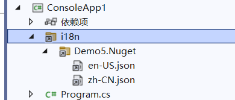

# 多语言

随着业务的国际化，为了满足不同客户群体的需要，软件产品需要支持多种语言，根据用户选择的语言呈现不同语言的界面。ASP.NET Core 或 ABP 等框架都提供了多语言解决方案，尽管配置方法各不相同，但都是通过键值对的方式使用的，开发者需要为每个 key 提供对应语言的值，框架会根据请求上下文自动区配 key 在对应语言下的值。


### 快速入手

通过 nuget 引入 Maomi.I18n 类库，Maomi.I18n 可以在控制台、Web、Wpf 等项目中使用。

Maomi.I18n 多语言配置非常简单，如 Demo5.Console 项目所示。


首先在一个目录，比如 i18n 目录下，创建与项目名称一致目录，在目录下存放多语言文件，文件使用 json 格式存储 key/value 值，然后设置文件为嵌入的资源或始终复制。

json 示例：

```json
{
  "test": "console"
}
```


json 可以有多层结构：

```json
{
	"购物车": {
		"商品名称": "商品名称"
	}
}
```


初始化 i18n 服务，有两个步骤：

```csharp
		ioc.AddI18n("zh-CN");
		ioc.AddI18nResource(options =>
		{
			options.AddJson<Program>("i18n");
		});
```


`.AddI18n("zh-CN");` 用于初始化 i18n 服务，配置默认的语言。

`.AddI18nResource()` 配置如何加载多语言资源，框架默认自带了从 json 文件加载。通过实现相关接口，也可以从 xml 、yaml 等文件、从程序集资源、从 Redis、 从数据库等地方加载。


最后从容器中取出服务 `IStringLocalizer` 并使用：

```csharp
var services = ioc.BuildServiceProvider();
var l1 = services.GetRequiredService<IStringLocalizer<Program>>();
var s1 = l1["test"];
```


默认框架根据当前线程上下文的文化指定的语言，也可以手动设置当前作用域语言。

```csharp
// 手动设置当前请求语言
using (var c = new CultureInfoScope("en-US"))
{
	var l1 = services.GetRequiredService<IStringLocalizer<Program>>();
	var s1 = l1["test"];
}
```


### 多个项目

在多个项目的场景下，每个项目都只需要创建自己的多语言文件即可。


文件结构如下：

```csharp
├─Demo5.Console
│  │  Demo5.Console.csproj
│  │  Program.cs
│  │
│  ├─i18n
│  │  └─Demo5.Console
│  │          en-US.json
│  │          zh-CN.json
│
├─Demo5.Lib
│  │  Demo5.Lib.csproj
│  │  Extensions.cs
│  │
│  ├─i18n
│  │  └─Demo5.Lib
│  │          en-US.json
│  │          zh-CN.json
```


因为 Demo5.Console、Demo5.Lib 都需要加载对应目录的多语言文件，因此需要在 `.AddI18nResource()` 时，都一起配置：

```csharp
var ioc = new ServiceCollection();
ioc.AddI18n("zh-CN");
ioc.AddI18nResource(options =>
{
	// Demo5.Console
	options.AddJson<Program>("i18n");
	// Demo5.Lib
	options.AddJson<Test>("i18n");
});
```


编译 Demo5.Console 后，所有的 json 文件会存放在一起：

```csharp
├──i8n
├──── Demo5.Console
│     ├── en-US.json
│     └── zh-CN.json
└──── Demo5.Lib
      ├── en-US.json
      └── zh-CN.json
```


在使用多语言时，`IStringLocalizer<T>` 中的泛型 T 要指定对应程序集，框架会加载类型所在的程序集的多语言文件。

```csharp
		var services = ioc.BuildServiceProvider();

		// 手动设置当前请求语言
		using (var c = new CultureInfoScope("en-US"))
		{
			var l1 = services.GetRequiredService<IStringLocalizer<Program>>();
			var l2 = services.GetRequiredService<IStringLocalizer<Test>>();
			var s1 = l1["test"];
			var s2 = l2["test"];
			Console.WriteLine(s1);
			Console.WriteLine(s2);
		}
```


如果一个 key 只在一个项目中出现，其它项目不存在相同的 key，那么可以直接使用 `IStringLocalizer` 而不需要使用泛型 `IStringLocalizer<T>`。


### 层次结构

json 文件可以出现层次结构，示例如下。

如 zh-CN.json ：

```json
{
  "购物车": {
    "商品名称": "商品名称",
    "加入时间": "加入时间",
    "清理失效商品": "清理失效商品"
  },
  "会员等级": {
    "用户名": "用户名",
    "积分": "积分",
    "等级": "等级"
  }
}
```


如 en-US.json ：

```json
{
  "购物车": {
    "商品名称": "Product name",
    "加入时间": "Join date",
    "清理失效商品": "Cleaning up failures"
  },
  "会员等级": {
    "用户名": "Username",
    "积分": "Member points",
    "等级": "Level"
  }
}
```


使用时通过 `:` 拼接 key 即可：

```csharp
    var localizer = context.RequestServices.GetRequiredService<IStringLocalizer>();
    await context.Response.WriteAsync(localizer["购物车:商品名称"]);
```


### 在 Web 中使用

在 ASP.NET Core 中使用 i18n 框架，非常简单，只需要多添加一个中间件即可：

```csharp
// 添加 i18n 多语言支持
builder.Services.AddI18n(defaultLanguage: "zh-CN");
// 设置多语言来源-json
builder.Services.AddI18nResource(option =>
{
    var basePath = "i18n";
    option.AddJson<Program>(basePath);
});

var app = builder.Build();

// 中间件
app.UseI18n();

if (app.Environment.IsDevelopment())
{
    app.UseSwagger();
    app.UseSwaggerUI();
}
```


在 Web 使用时，框架从三个地方识别多语言表示：


ASP.NET Core 定义了一个 IRequestCultureProvider 接口，用于解析客户端请求时携带的的区域性信息，从当前请求中解析出所用的语言，ASP.NET Core 本身有三个类型实现了该接口，所以相当于自带了三种获取当前请求语言的方式，下面我们来了解这三种方式是如何通过请求上下文解析语言标识。


第一种是 URL 路由参数，可以通过 QueryStringRequestCultureProvider 类型解析出来，需要 url 中携带两个参数 `culture` 和 `ui-culture`，其格式示例如下：

```
?culture=en-US&ui-culture=en-US
```


第二种是 Cookie，提供器是 CookieRequestCultureProvider，cookie 中需要添加名为 `.AspNetCore.Culture` 的 cookie，其格式示例如下：

```
c=en-US|uic=en-US
```

示例：

```
.AspNetCore.Culture=c=en-US|uic=en-US
```


第三种是通过 Header 设置，也是最常用的设置方法，提供器是 AcceptLanguageHeaderRequestCultureProvider，其格式示例如下：

```csharp
Accept-Language: zh-CN,zh;q=0.9
```


当然，开发者可以根据需求，修改这三者的配置，以便使用其他请求位置或不同的参数名称解析出当前请求的文化名称。

```csharp
new QueryStringRequestCultureProvider()
{
	QueryStringKey = "lan",
	UIQueryStringKey = "ui"
}
```


### 打包时携带多语言文件

一个类库如果目录下存在 json 文件，需要打包到 nuget 中，默认 nuget 包是不会携带这些文件的，因此需要手动修改 .csproj 文件。配置参考如下：

```xml
	<ItemGroup>
		<Content Include="i18n\Demo5.Nuget\en-US.json" Pack="true">
			<PackageCopyToOutput>true</PackageCopyToOutput>
			<CopyToOutputDirectory>Always</CopyToOutputDirectory>
			<PackagePath>contentFiles\any\any\i18n\Demo5.Nuget\en-US.json</PackagePath>
		</Content>

		<Content Include="i18n\Demo5.Nuget\zh-CN.json" Pack="true">
			<PackageCopyToOutput>true</PackageCopyToOutput>
			<CopyToOutputDirectory>Always</CopyToOutputDirectory>
			<PackagePath>contentFiles\any\any\i18n\Demo5.Nuget\zh-CN.json</PackagePath>
		</Content>
	</ItemGroup>
```

而在 Web 项目中，由于编译器已经自动设置了 EnableDefaultContentItems 属性，自动设置给 web.config、 `.json` 、 `.cshtml` 文件设置 `<Content></Content>` 属性，所以自定义配置 Content 属性时会冲突，我们需要在 `<PropertyGroup> </PropertyGroup>` 属性中关闭此配置。

```xml
<EnableDefaultContentItems>false</EnableDefaultContentItems>
```


使用者引入 nuget 包后，可以看到项目中出现了对应的文件。




### 使用 Redis 实现高性能动态多语言

Maomi.I18n.Redis 使用了 FreeRedis 框架中的 Client-Side 功能，能够将 Redis 数据缓存到本地，当 Redis 数据出现变化时，自动下发到客户端中。客户端获取 Key/Value 时，只需要在本地获取即可。

使用 Maomi.I18n.Redis 读取多语言 100w 次的性能：


### 实现自己的多语言资源提供器

简单到不能再简单了，只需要实现 I18nResource 接口就行。

可以参考 JsonResource.cs、RedisI18nResource.cs 两个文件。

实现 I18nResource 接口时，其中两个方法示例如下：

```csharp
		/// <inheritdoc/>
		public LocalizedString Get(string culture, string name)
		{
			if (culture != _defaultLanguage) return new LocalizedString(name, name, resourceNotFound: true);

			var value = _kvs.GetValueOrDefault(name);
			if (value == null) return new LocalizedString(name, name, resourceNotFound: true);
			return value;
		}

		/// <inheritdoc/>
		public LocalizedString Get(string culture, string name, params object[] arguments)
		{
			if (culture != _defaultLanguage) return new LocalizedString(name, name, resourceNotFound: true);

			var value = _kvs.GetValueOrDefault(name);
			if (value == null) return new LocalizedString(name, name, resourceNotFound: true);

			return new LocalizedString(name, string.Format(value, arguments));
		}
```


如果在自定义提供的多语言资源中没有找到 key，则返回 `new LocalizedString(name, name, resourceNotFound: true);` ，切记不能返回 null。