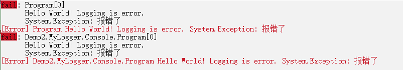

# 3.1,自定义日志框架

本节示例项目在 Demo2.MyLogger.Console 中。

创建控制台项目后，添加 Microsoft.Extensions.Logging.Console 引用。

创建 MyLoggerOptions ，存储日志配置：

```csharp
	public class MyLoggerOptions
	{
		/// <summary>
		/// 最小日志等级
		/// </summary>
		public LogLevel DefaultLevel { get; set; } = LogLevel.Debug;
	}
```


创建自定义日志记录器：

```csharp
	/// <summary>
	/// 自定义的日志记录器
	/// </summary>
	public class MyConsoleLogger : ILogger
	{
		// 日志名称
		private readonly string _name;
		private readonly MyLoggerOptions _options;

		public MyConsoleLogger(string name, MyLoggerOptions options)
		{
			_name = name;
			_options = options;
		}

		public IDisposable? BeginScope<TState>(TState state) where TState : notnull => default!;

		// 判断是否启用日志等级
		public bool IsEnabled(LogLevel logLevel)
		{
			return logLevel >= _options.DefaultLevel;
		}

		// 记录日志，formatter 由框架提供的字符串格式化器
		public void Log<TState>(
			LogLevel logLevel,
			EventId eventId,
			TState state,
			Exception? exception,
			Func<TState, Exception?, string> formatter)
		{
			if (!IsEnabled(logLevel))
			{
				return;
			}
			if (logLevel == LogLevel.Critical)
			{
				System.Console.ForegroundColor = System.ConsoleColor.Red;
				System.Console.WriteLine($"[{logLevel}] {_name} {formatter(state, exception)} {exception}");
				System.Console.ResetColor();
			}
			else if (logLevel == LogLevel.Error)
			{
				System.Console.ForegroundColor = System.ConsoleColor.DarkRed;
				System.Console.WriteLine($"[{logLevel}] {_name} {formatter(state, exception)} {exception}");
				System.Console.ResetColor();
			}
			else
			{
				System.Console.WriteLine($"[{logLevel}] {_name} {formatter(state, exception)} {exception}");
			}
		}
	}
```


创建自定义日志提供器：

```csharp
	[ProviderAlias("MyConsole")]
	public sealed class MyLoggerProvider : ILoggerProvider
	{
		private MyLoggerOptions _options;
		private readonly ConcurrentDictionary<string, MyConsoleLogger> _loggers =
			new(StringComparer.OrdinalIgnoreCase);

		public MyLoggerProvider(MyLoggerOptions options)
		{
			_options = options;
		}

		public ILogger CreateLogger(string categoryName) =>
			_loggers.GetOrAdd(categoryName, name => new MyConsoleLogger(name, _options));

		public void Dispose()
		{
			_loggers.Clear();
		}
	}
```


编写扩展函数，注入自定义日志提供器：

```csharp
	public static class MyLoggerExtensions
	{
		public static ILoggingBuilder AddMyConsoleLogger(
			this ILoggingBuilder builder, Action<MyLoggerOptions> action)
		{
			MyLoggerOptions options = new();
			if (action != null)
			{
				action.Invoke(options);
			}

			builder.AddConfiguration();
			builder.Services.TryAddEnumerable(
				ServiceDescriptor.Singleton<ILoggerProvider>(new MyLoggerProvider(options)));
			return builder;
		}
	}
```


最后使用 Microsoft.Extensions.Logging 中的 LoggerFactory，构建日志工厂，从中生成 ILogger 对象，最后打印日志：

```csharp
		static void Main(string[] args)
		{
			using ILoggerFactory factory = LoggerFactory.Create(builder =>
			{
				builder.AddConsole();
				builder.AddMyConsoleLogger(options =>
				{
					options.DefaultLevel = LogLevel.Debug;
				});
			});
			ILogger logger1 = factory.CreateLogger("Program");
			ILogger logger2 = factory.CreateLogger<Program>();

			logger1.LogError(new Exception("报错了"), message: "Hello World! Logging is {Description}.", args: "error");
			logger2.LogError(new Exception("报错了"), message: "Hello World! Logging is {Description}.", args: "error");
		}
```



