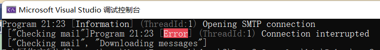
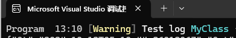
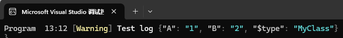
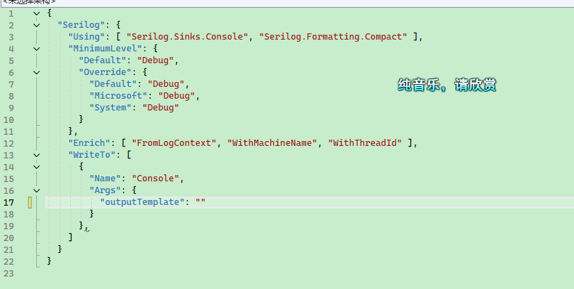
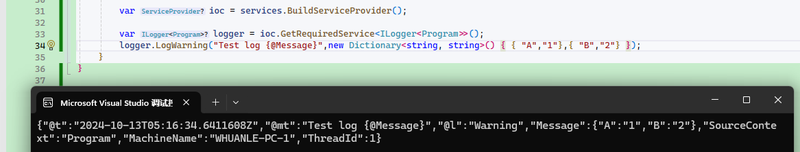
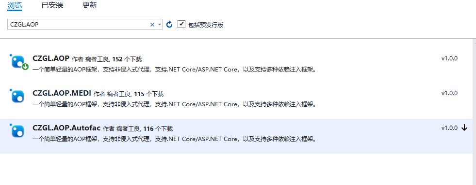
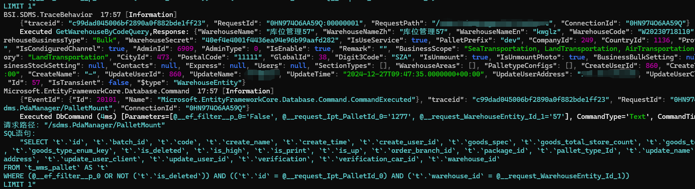

# .NET 中的日志使用技巧

Serilog 是 .NET 社区中使用最广泛的日志框架，所以在日志部分，笔者将会围绕 Serilog 讲解其使用方法以及如何解决项目的日志需求。

<br />

示例项目在 Demo2.Console 中。

创建一个控制台程序，引入两个包：

```
Serilog.Sinks.Console
Serilog.Sinks.File
```

> 除此之外，还有 `Serilog.Sinks.Elasticsearch`、`Serilog.Sinks.RabbitMQ` 等。Serilog 提供了用于将日志事件以各种格式写入存储的*接收器。*下面列出的许多接收器都是由更广泛的 Serilog 社区开发和支持的；https://github.com/serilog/serilog/wiki/Provided-Sinks

<br />

可以直接使用代码配置 Serilog：

```csharp
private static Serilog.ILogger GetLogger()
{
	const string LogTemplate = "{SourceContext} {Scope} {Timestamp:HH:mm} [{Level}] {Message:lj} {Properties:j} {NewLine}{Exception}";
	var logger = new LoggerConfiguration()
		.Enrich.WithMachineName()
		.Enrich.WithThreadId()
		.Enrich.FromLogContext()
#if DEBUG
		.MinimumLevel.Debug()
#else
		                .MinimumLevel.Information()
#endif
		.WriteTo.Console(outputTemplate: LogTemplate)
		.WriteTo.File("log.txt", rollingInterval: RollingInterval.Day, outputTemplate: LogTemplate)
		.CreateLogger();
	return logger;
}
```

<br />

如果想从配置文件中加载，添加 Serilog.Settings.Configuration：

```csharp
private static Serilog.ILogger GetJsonLogger()
{
	IConfiguration configuration = new ConfigurationBuilder()
							 .SetBasePath(AppContext.BaseDirectory)
							 .AddJsonFile(path: "serilog.json", optional: true, reloadOnChange: true)
							 .Build();
	if (configuration == null)
	{
		throw new ArgumentNullException($"未能找到 serilog.json 日志配置文件");
	}
	var logger = new LoggerConfiguration()
		.ReadFrom.Configuration(configuration)
		.CreateLogger();
	return logger;
}
```

<br />

serilog.json 配置文件示例：

```json
{
  "Serilog": {
    "Using": [ "Serilog.Sinks.Console", "Serilog.Sinks.File" ],
    "MinimumLevel": {
      "Default": "Debug"
    },
    "Enrich": [ "FromLogContext", "WithMachineName", "WithThreadId" ],
    "WriteTo": [
      {
        "Name": "Console",
        "Args": {
          "outputTemplate": "{SourceContext} {Scope} {Timestamp:HH:mm} [{Level}] {Message:lj} {Properties:j} {NewLine}{Exception}"
        }
      },
      {
        "Name": "File",
        "Args": {
          "path": "logs/log-.txt",
          "rollingInterval": "Day",
          "outputTemplate": "{SourceContext} {Scope} {Timestamp:HH:mm} [{Level}] {Message:lj} {Properties:j} {NewLine}{Exception}"
        }
      }
    ]
  }
}
```

<br />

依赖注入 Serilog。

引入 `Serilog.Extensions.Logging` 包。

```csharp
	private static Microsoft.Extensions.Logging.ILogger InjectLogger()
	{
		var logger = GetJsonLogger();
		var ioc = new ServiceCollection();
		ioc.AddLogging(builder => builder.AddSerilog(logger: logger, dispose: true));
		var loggerProvider = ioc.BuildServiceProvider().GetRequiredService<ILoggerProvider>();
		return loggerProvider.CreateLogger("Program");
	}
```

<br />

最后，使用不同方式配置 Serilog 日志，然后启动程序打印日志。

```csharp
	static void Main()
	{
		var log1 = GetLogger();
		log1.Debug("溪源More、痴者工良");
		var log2 = GetJsonLogger();
		log2.Debug("溪源More、痴者工良");
		var log3 = InjectLogger();
		log3.LogDebug("溪源More、痴者工良");
	}
```

```
20:50 [Debug] 溪源More、痴者工良 {"MachineName": "WIN-KQDULADM5LA", "ThreadId": 1}
20:50 [Debug] 溪源More、痴者工良 {"MachineName": "WIN-KQDULADM5LA", "ThreadId": 1}
20:50 [Debug] 溪源More、痴者工良 {"MachineName": "WIN-KQDULADM5LA", "ThreadId": 1}
```

<br />

### 在 ASP.NET Core 中使用日志

示例项目在 Demo2.Api 中。

新建一个 ASP.NET Core API 新项目，引入 `Serilog.AspNetCore` 包。

<br />

在 Program 中添加代码注入 Serilog 。

```csharp
var builder = WebApplication.CreateBuilder(args);

Log.Logger = new LoggerConfiguration()
	.ReadFrom.Configuration(builder.Configuration)
	.CreateLogger();
builder.Host.UseSerilog(Log.Logger);
//builder.Host.UseSerilog();
```

<br />

将前面示例中的 `serilog.json` 文件内容复制到 appsettings.json 中。

<br />

启动程序后，尝试访问 API 接口，会打印示例如下的日志：

```bash
Microsoft.AspNetCore.Hosting.Diagnostics  20:32 [Information] Request finished HTTP/1.1 GET http://localhost:5148/WeatherForecast - - - 200 - application/json;+charset=utf-8 1029.4319ms {"ElapsedMilliseconds": 1029.4319, "StatusCode": 200, "ContentType": "application/json; charset=utf-8", "ContentLength": null, "Protocol": "HTTP/1.1", "Method": "GET", "Scheme": "http", "Host": "localhost:5148", "PathBase": "", "Path": "/WeatherForecast", "QueryString": "", "EventId": {"Id": 2}, "RequestId": "0HMOONQO5ONKU:00000003", "RequestPath": "/WeatherForecast", "ConnectionId": "0HMOONQO5ONKU"}
```


<br />

如果需要为请求上下文添加一些属性信息，可以添加一个中间件，示例如下：

```csharp
app.UseSerilogRequestLogging(options =>
{
	options.EnrichDiagnosticContext = (diagnosticContext, httpContext) =>
	{
		diagnosticContext.Set("TraceId", httpContext.TraceIdentifier);
	};
});
```

```bash
 HTTP GET /WeatherForecast responded 200 in 181.9992 ms {"TraceId": "0HMSD1OUG2DHG:00000003" ... ...
```

对请求上下文添加属性信息，比如当前请求的用户信息，在本次请求作用域中使用日志打印信息时，日志会包含这些上下文信息，这对于分析日志还有帮助，可以很容易分析日志中那些条目是同一个上下文。在微服务场景下，会使用 ElasticSearch 等日志存储引擎查询分析日志，如果在日志中添加了相关的上下文属性，那么在分析日志时可以通过对应的属性查询出来，分析日志时可以帮助排除故障。

<br />

如果需要打印 http 的请求和响应日志，我们可以使用 ASP.NET Core 自带的 HttpLoggingMiddleware 中间件。

<br />

首先注入请求日志拦截服务。

```csharp
builder.Services.AddHttpLogging(logging =>
{
    logging.LoggingFields = HttpLoggingFields.All;
	// 避免打印大量的请求和响应内容，只打印 4kb
    logging.RequestBodyLogLimit = 4096;
    logging.ResponseBodyLogLimit = 4096;
});
```

<br />

通过组合 HttpLoggingFields 枚举，可以配置中间件打印 Request、Query、HttpMethod、Header、Response 等信息。

<br />

可以将HttpLogging 中间件放在 Swagger、Static 之后，这样的话可以避免打印哪些用处不大的请求，只保留 API 请求相关的日志。

```
app.UseHttpLogging();
```

<br />

HttpLoggingMiddleware  中的日志模式是以 Information 级别打印的，在项目上线之后，如果每个请求都被打印信息的话，会降低系统性能，因此我们可以在配置文件中覆盖配置，避免打印普通的日志。

```
"Microsoft.AspNetCore.HttpLogging.HttpLoggingMiddleware": "Information"
```

<br />


### 上下文属性和作用域

示例项目在 Demo2.ScopeLog 中。

日志范围注意事项
Microsoft.Extensions.Logging.Abstractions 提供 BeginScopeAPI，可用于添加任意属性以记录特定代码区域内的事件。

解释其作用

API 有两种形式：

```csharp
IDisposable BeginScope<TState>(TState state)
IDisposable BeginScope(this ILogger logger, string messageFormat, params object[] args)
```

<br />

使用如下的模板：

```csharp
{SourceContext} {Timestamp:HH:mm} [{Level}] (ThreadId:{ThreadId}) {Message}{NewLine}{Exception} {Scope}
```

<br />

使用示例：

```csharp
static void Main()
{
	var logger = GetLogger();
	using (logger.BeginScope("Checking mail"))
	{
		// Scope is "Checking mail"
		logger.LogInformation("Opening SMTP connection");

		using (logger.BeginScope("Downloading messages"))
		{
			// Scope is "Checking mail" -> "Downloading messages"
			logger.LogError("Connection interrupted");
		}
	}
}
```




而在 Serilog 中，除了支持上述接口外，还通过 LogContext 提供了在日志中注入上下文属性的方法。其作用是添加属性之后，使得在其作用域之内打印日志时，日志会携带这些上下文属性信息。

```csharp
using (LogContext.PushProperty("Test", 1))
{
	// Process request; all logged events will carry `RequestId`
	Log.Information("{Test} Adding {Item} to cart {CartId}", 1, 1);
}
```

<br />

嵌套复杂一些：

```csharp
using (LogContext.PushProperty("A", 1))
{
    log.Information("Carries property A = 1");

    using (LogContext.PushProperty("A", 2))
    using (LogContext.PushProperty("B", 1))
    {
        log.Information("Carries A = 2 and B = 1");
    }

    log.Information("Carries property A = 1, again");
}
```

<br />

当需要设置大量属性时，下面的方式会比较麻烦；

```csharp
using (LogContext.PushProperty("Test1", 1))
using (LogContext.PushProperty("Test2", 2))
{
}
```

<br />

例如在 ASP.NET Core 中间件中，我们可以批量添加：

```csharp
public async Task InvokeAsync(HttpContext context, RequestDelegate next)
{
	var enrichers = new List<ILogEventEnricher>();
	if (!string.IsNullOrEmpty(correlationId))
	{
		enrichers.Add(new PropertyEnricher(_options.EnricherPropertyNames.CorrelationId, correlationId));
	}

	using (LogContext.Push(enrichers.ToArray()))
	{
		await next(context);
	}
}
```

<br />

在业务系统中，可以通过在中间件获取 Token 中的用户信息，然后注入到日志上下文中，这样打印出来的日志，会携带用户信息。


### 格式化日志

引入 `Serilog.Formatting.Compact` 库。

本小节主要讲解三个知识点：

* 序列化类型
* 输入 JSON 格式日志

<br />

在打印日志是，我们往往想将一个对象打印到日志中，直接使用参数标识打印是不可行的：

```csharp
logger.LogWarning("Test log {0}",new MyClass { A = "1",B = "2"});
```


打印结果：



<br />

在 Serilog.Formatting.Compact 包中提供了一种格式化对象打印到日志的功能，我们只需要在标识符位置加上 `@` 即可。

```csharp
 logger.LogWarning("Test log {@Message}",new MyClass { A = "1",B = "2"});
```



<br />对于字典类型也可以起效：

```csharp
logger.LogWarning("Test log {@Message}",new Dictionary<string, string>() { { "A","1"},{ "B","2"} });
```

<br />

完整示例代码：

```csharp
static void Main()
{
	IConfiguration configuration = new ConfigurationBuilder()
							 .SetBasePath(AppContext.BaseDirectory)
							 .AddJsonFile(path: "serilog.json", optional: true, reloadOnChange: true)
							 .Build();
	if (configuration == null)
	{
		throw new ArgumentNullException($"未能找到 serilog.json 日志配置文件");
	}

	var loggerBuilder = new LoggerConfiguration()
		.ReadFrom.Configuration(configuration)
		.WriteTo.Console(new CompactJsonFormatter())
		.CreateLogger();

	var services = new ServiceCollection();
	services.AddLogging(s =>
	{
		s.AddSerilog(loggerBuilder);
	});

	var ioc = services.BuildServiceProvider();

	var logger = ioc.GetRequiredService<ILogger<Program>>();
	logger.LogWarning("Test log {@Message}", new Dictionary<string, string>() { { "A", "1" }, { "B", "2" } });
}
```

<br />

不够，这样一行或多行的数据对应微服务基础设施的日志收集来说，非常不方便，我们需要将日志自动生成 json 格式打印到控制台中，有 ELK 等日志系统自动收集。

这样搞其实也很简单，只需要去掉默认的日志模板即可：





<br />

在 ES 系统中，每个字段都将会被自动索引，我们可以在日志系统中方便处理各个字段的值。

<br />

要想自定义格式化日志也很简单，例如我们要在现在的 json 日志中，前后加上 `[]`：

```csharp
public class MyTextFormatter : ITextFormatter
{
    private readonly JsonValueFormatter _valueFormatter;

    public MyTextFormatter(JsonValueFormatter? valueFormatter = null)
    {
        _valueFormatter = valueFormatter ?? new JsonValueFormatter("$type");
    }

    /// <inheritdoc/>
    public void Format(LogEvent logEvent, TextWriter output)
    {
        output.Write('[');
        CompactJsonFormatter.FormatEvent(logEvent, output, _valueFormatter);
        output.Write(']');
        output.WriteLine();
    }
}
```


### 非侵入式日志

非侵入式的日志有多种方法，比如 ASP.NET Core 中间件管道，或者使用 AOP 框架。

这里可以使用笔者开源的 CZGL.AOP 框架，Nuget 中可以搜索到。



<br />

示例项目在 Demo2.AopLog 中。

有一个类型，我们需要在执行 SayHello 之前和之后打印日志，将参数和返回值记录下来。

```csharp
public class Hello
{
	public virtual string SayHello(string content)
	{
		var str = $"Hello,{content}";
		return str;
	}
}
```

<br />


编写统一的切入代码，这些代码将在函数被调用时执行。

`Before` 会在被代理的方法执行前或被代理的属性调用时生效，你可以通过 `AspectContext` 上下文，获取、修改传递的参数。

After 在方法执行后或属性调用时生效，你可以通过上下文获取、修改返回值。

```csharp
public class LogAttribute : ActionAttribute
{
	public override void Before(AspectContext context)
	{
		Console.WriteLine($"{context.MethodInfo.Name} 函数被执行前");
		foreach (var item in context.MethodValues)
			Console.WriteLine(item.ToString());
	}

	public override object After(AspectContext context)
	{
		Console.WriteLine($"{context.MethodInfo.Name} 函数被执行后");
		Console.WriteLine(context.MethodResult.ToString());
		return context.MethodResult;
	}
}
```

<br />改造 Hello 类，代码如下：

```csharp
	[Interceptor]
	public class Hello
	{
		[Log]
		public virtual string SayHello(string content)
		{
			var str = $"Hello,{content}";
			return str;
		}
	}
```

<br />然后创建代理类型：

```csharp
static void Main(string[] args)
{
	Hello hello = AopInterceptor.CreateProxyOfClass<Hello>();
	hello.SayHello("any one");
	Console.Read();
}
```

<br />启动程序，会输出：

```
SayHello 函数被执行前
any one
SayHello 函数被执行后
Hello,any one
```

<br />

你完全不需要担心 AOP 框架会给你的程序带来性能问题，因为 CZGL.AOP 框架采用 EMIT 编写，并且自带缓存，当一个类型被代理过，之后无需重复生成。

CZGL.AOP 可以通过 .NET Core 自带的依赖注入框架和 Autofac 结合使用，自动代理 CI 容器中的服务。这样不需要 `AopInterceptor.CreateProxyOfClass` 手动调用代理接口。

CZGL.AOP 代码是开源的，可以参考笔者另一篇博文：

[https://www.cnblogs.com/whuanle/p/13160139.html](https://www.cnblogs.com/whuanle/p/13160139.html)


### Serilog 日志格式模板

下面给出笔者最常使用的 Serilog 日志格式模板，笔者在个人项目以及生产项目中大量使用。

json格式的配置模板如下：
```json
{
  "Serilog": {
    "Using": [
      "Serilog.Sinks.Console"
    ],
    "MinimumLevel": {
      "Default": "Information",
      "Override": {
        "Microsoft.AspNetCore.HttpLogging": "Information",
        "ProtoBuf.Grpc.Server.ServicesExtensions.CodeFirstServiceMethodProvider": "Warning",
        "Microsoft.EntityFrameworkCore": "Information",
        "Microsoft.AspNetCore": "Warning",
        "System.Net.Http.HttpClient.TenantManagerClient.LogicalHandler": "Warning",
        "Microsoft.EntityFrameworkCore.Database.Command.CommandExecuted": "Warning",
        "System": "Information",
        "Microsoft": "Information",
        "Grpc": "Information",
        "MySqlConnector": "Information"
      }
    },
    "WriteTo": [
      {
        "Name": "Console",
        "Args": {
          "outputTemplate": "{SourceContext} {Scope} {Timestamp:HH:mm} [{Level}]{NewLine}{Properties:j}{NewLine}{Message:lj} {Exception} {NewLine}"
        }
      }
    ],
    "Enrich": [
      "FromLogContext",
      "WithMachineName",
      "WithThreadId"
    ]
  }
}
```

<br />

YAML 格式日志模板如下：

```yaml
Serilog:
  Using:
    - "Serilog.Sinks.Console"
  MinimumLevel:
    Default: Information
    Override:
      Microsoft.AspNetCore.HttpLogging: Information
      ProtoBuf.Grpc.Server.ServicesExtensions.CodeFirstServiceMethodProvider: Warning
      Microsoft.EntityFrameworkCore: Information
      Microsoft.AspNetCore: Warning
      System.Net.Http.HttpClient.TenantManagerClient.LogicalHandler: Warning
      Microsoft.EntityFrameworkCore.Database.Command.CommandExecuted: Warning
      System: Information
      Microsoft: Information
      Grpc: Information
      MySqlConnector: Information
  WriteTo:
    - Name: Console
      Args:
        outputTemplate: "{SourceContext} {Scope} {Timestamp:HH:mm} [{Level}]{NewLine}{Properties:j}{NewLine}{Message:lj} {Exception} {NewLine}"
  Enrich:
    - FromLogContext
    - WithMachineName
    - WithThreadId
```

<br />

在代码中使用，如在 ASP.NET Core 使用时，建议分开两种情况，分开 Debug 和部署后的日志输出。

```csharp
// 配置日志.
builder.Logging.ClearProviders();

builder.Host.UseSerilog((ctx, services, configuration) =>
{
	configuration.ReadFrom.Services(services);
#if DEBUG
	// 在本地不需要特定格式化
	configuration.ReadFrom.Configuration(ctx.Configuration)

	// 自定义部分日志的格式
	.Enrich.With(new MyLogEnricher());
#else
            // 使用 json 收集时，忽略日志模板
            ctx.Configuration["Serilog:WriteTo:0:Args:outputTemplate"] = "";

            // 以 json 格式化输出
            configuration.WriteTo.Console(new RenderedCompactJsonFormatter())
            .ReadFrom.Configuration(ctx.Configuration)

            // 自定义部分日志的格式
            .Enrich.With(new MyLogEnricher());
#endif
});
```

<br />

默认情况下使用 `configuration.ReadFrom.Configuration(ctx.Configuration)` 时，日志就是正常人类方便阅读的格式。



<br />

但是在系统部署后，特别在微服务场景下，会使用各类工具收集日志，例如最常见的 ELK 日志套件，那么项目输出的日志是 json 时，收集最方便，解析也是最方便的。

所以，我们需要重定向输出日志为 json 格式，可以使用：

```csharp
.WriteTo.Console(new RenderedCompactJsonFormatter())
```

<br />

对比直接输出和 json 输出，区别如下：

```csharp
configuration
.ReadFrom.Configuration(ctx.Configuration)
↓ ↓ ↓
configuration
.WriteTo.Console(new RenderedCompactJsonFormatter())   // 多了这一句
.ReadFrom.Configuration(ctx.Configuration)
```

<br />

Serilog 提供了四种 json 格式化器。

下面是四种格式化器的性能测试：

| Formatter                            | Median     | StdDev    | Scaled |
| ------------------------------------ | ---------- | --------- | ------ |
| `JsonFormatter`                      | 11.2775 µs | 0.0682 µs | 1.00   |
| `CompactJsonFormatter`               | 6.0315 µs  | 0.0429 µs | 0.53   |
| `JsonFormatter(renderMessage: true)` | 13.7585 µs | 0.1194 µs | 1.22   |
| `RenderedCompactJsonFormatter`       | 7.0680 µs  | 0.0605 µs | 0.63   |

<br />

建议大家使用 RenderedCompactJsonFormatter。

对于 JsonFormatter 和 CompactJsonFormatter ，只在长度上差一点，CompactJsonFormatter 的压缩性比较好，但是阅读起来不方便，这两者都是将参数模板和参数值分开存储的。

<br />

以该日志为例：

```csharp
_logger.Information("Hello, {@User}, {N:x8} at {Now}", new { Name = "nblumhardt", Tags = new[] { 1, 2, 3 } }, 123, DateTime.Now);
```

<br />

JsonFormatter 的格式：

```json
{
	"Timestamp": "2016-06-07T13:44:57.8532799+10:00",
	"Level": "Information",
	"MessageTemplate": "Hello, {@User}, {N:x8} at {Now}",
	"Properties": {
		"User": {
			"Name": "nblumhardt",
			"Tags": [1, 2, 3]
		},
		"N": 123,
		"Now": "2016-06-07T13:44:57.8532799+10:00"
	},
	"Renderings": {
		"N": [{
			"Format": "x8",
			"Rendering": "0000007b"
		}]
	}
}
```

<br />

CompactJsonFormatter 的格式：

```json
{
	"@t": "2016-06-07T03:44:57.8532799Z",
	"@mt": "Hello, {@User}, {N:x8} at {Now}",
	"@r": ["0000007b"],
	"User": {
		"Name": "nblumhardt",
		"Tags": [1, 2, 3]
	},
	"N": 123,
	"Now": "2016-06-07T13:44:57.8532799+10:00"
}
```

<br />

两者都是记录日志原本的字符串 `"Hello, {@User}, {N:x8} at {Now}"`，但是不在字符串里面重定向输出结果(格式化)，而是单独使用别的属性分开存储 `User`、`N`、`Now` 的值。

那么对于 `JsonFormatter(renderMessage: true)` 和 `RenderedCompactJsonFormatter` 则是上面两者的重定向(格式化)版本，会直接在原字符串里面格式化。

`JsonFormatter(renderMessage: true)` 格式：

```json
{
	"Timestamp": "2024-12-30T08:54:32.2909994+08:00",
	"Level": "Information",
	"MessageTemplate": "Hello, {@User}, {N:x8} at {Now}",
	"RenderedMessage": "Hello, { Name: \"nblumhardt\", Tags: [1, 2, 3] }, 0000007b at 12/30/2024 08:54:32",
	"Properties": {
		"User": {
			"Name": "nblumhardt",
			"Tags": [1, 2, 3]
		},
		"N": 123,
		"Now": "2024-12-30T08:54:32.2886810+08:00",
		"SourceContext": "BSI.SDMS.Api.Program"
	},
	"Renderings": {
		"N": [{
			"Format": "x8",
			"Rendering": "0000007b"
		}]
	}
}
```

<br />

RenderedCompactJsonFormatter 格式：

```json
{
	"@t": "2024-12-30T00:53:09.8507927Z",
	"@m": "Hello, { Name: \"nblumhardt\", Tags: [1, 2, 3] }, 0000007b at 12/30/2024 08:53:09",
	"@i": "4e2159b8",
	"User": {
		"Name": "nblumhardt",
		"Tags": [1, 2, 3]
	},
	"N": 123,
	"Now": "2024-12-30T08:53:09.8484345+08:00",
	"SourceContext": "BSI.SDMS.Api.Program"
}
```

