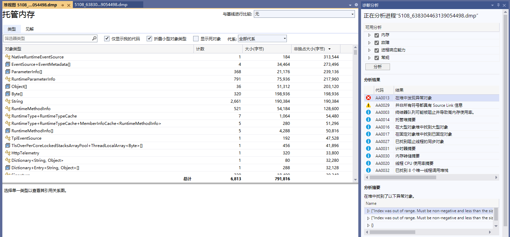

# 3.3, 开发 .NET 诊断工具

### System.Diagnostics、Microsoft.Diagnostics

在 System.Diagnostics Microsoft.Diagnostics 命名空间中的接口用于诊断 .NET 程序，里面涉及到很多诊断技术，由于个人技术水平限制以及篇幅原因，笔者只介绍比较常用的几种诊断方法，不深入探讨原理。

<br />

#### Debug、Trace

在 System.Diagnostics 命名空间中有 Debug、Trace 两个类型，用来追踪代码的执行Debug、Trace 可以打印调试信息并使用断点检查逻辑，使代码更可靠，而**不会影响发运程序的性能**。System.Diagnostics.Debug 只在 Debug 环境下起作用，在 Release 环境下会失效，除此之外两者的接口几乎一样。

<br />

下面示例代码，当 sum 的值在 100 以内时程序正常执行，当 sum 的值大于等于 100时会触发断点，IDE 会跳转到该位置，此时会引起我们的注意。

```csharp
static void Main()
{
	List<int> ls = new List<int> { 30, 40, 50 };
	Sum(ls);
}

static int Sum(List<int> ls)
{
	var sum = 0;
	foreach (var item in ls)
	{
		sum += item;
		// 当条件为否时触发
		// Debug.Assert(condition: sum < 100);
		Debug.Assert(condition: sum < 100, message: "数据量有点大");
	}
	return sum;
}
```


<br />

`.Assert()`  会触发断点同时打印信息。.NET Runtime 源代码中就大量地使用了 `Debug.Assert()` ，笔者个人也常常在项目中使用 `Debug.Assert`，比如某个条件分支很少情况下会执行，如果该分支被执行，需要引起开发者关注。一方面 Debug 只在调试模式下有效，不会干扰正式发布的项目运行。IDE 断点正在当前设备环境中起效，不能跟其它设备共享断点位置，而 Debug 在代码中，所有人都可以使用。

<br />

此外通过 Debug、Trace 打印信息，方法有  Write 、WriteLine 、 WriteIf 、 WriteLineIf 、Print 等，默认打印到 IDE 的调试输出。

```csharp
int value = -1;
Debug.Assert(value != -1, "值不应该为 -1.");
Debug.WriteLineIf(value == -1, "当前值居然为 -1.");
```

```
---- DEBUG ASSERTION FAILED ----
---- Assert Short Message ----                  
值不应该为 -1.
---- Assert Long Message ----

   at Demo2.Diagnostics.Program.Main(String[] args) in E:\demo\Program.cs:line 14
当前值居然为 -1.
```

<br />

也可以通过监听器将信息打印到控制台或文件中，如需将调试信息打印到控制台，可以注册相关的侦听器：

```csharp
Trace.Listeners.Add(new ConsoleTraceListener();
// 或者 Trace.Listeners.Add(new TextWriterTraceListener(Console.Out));
```

> 注意，  Debug 没有 Listeners 属性，因为 Debug 使用的是 Trace 的侦听器，即给 Trace 配置之后，Debug 也会生效。


<br />

.NET 中主要有以下监听器 DefaultTraceListener、TextWriterTraceListener、ConsoleTraceListener、DelimitedListTraceListener、EventLogTraceListener 等。

如果需要输出到文件中，可以自行继承 `TextWriterTraceListener` ，编写文件流输出，也可以使用 DelimitedListTraceListener。

示例：

```csharp
// TraceListener listener = new TextWriterTraceListener(new FileStream(@"C:\debugfile.txt", FileMode.OpenOrCreate));
TraceListener listener = new DelimitedListTraceListener(@"D:\debugfile.txt");

Debug.Listeners.Add(listener);
Debug.WriteLine("打印调试信息");
```

<br />

为了格式化输出流，可以使用相关属性控制排版：

| 属性        | 说明                                                         |
| ----------- | ------------------------------------------------------------ |
| AutoFlush   | 获取或设置一个值，通过该值指示每次写入后是否应在 Flush() 上调用 Listeners。 |
| IndentLevel | 获取或设置缩进级别。                                         |
| IndentSize  | 获取或设置缩进的空格数。                                     |

```csharp
Debug.WriteLine("One");
// 缩进
Debug.Indent();
Debug.WriteLine("Two");
Debug.WriteLine("Three");
// 结束缩进
Debug.Unindent();

Debug.WriteLine("Four");
```

```
One
    Two
    Three
Four
```

<br />

#### EventSource、EventListener

System.Diagnostics.Tracing 命名空间下的 EventSource 、DiagnosticCounter 都是抽象类，EventSource 称为事件源，用于定义事件和记录日志，运行时本身会有很多事件，比如 GC 回收事件、线程退出事件等，可以使用工具进行监听和分析。DiagnosticCounter 称为计数器，用于收集各种类型的性能指标，比如内存使用量、GC 触发次数。

<br />

从技术角度出发，我们需要关注两个部分，自定义 EventSource 、DiagnosticCounter ，以及如何监听  EventSource 、DiagnosticCounter 。

<br />

##### 自定义 EventSource 、DiagnosticCounter

我们可以在程序中自定义事件源，然后通过代码监听或 .NET 中的诊断工具收集这些事件。

示例项目在 Demo2.ES 中，下面的代码定义了一个事件源 MyEventSource 类，其内部使用了一个计数器。其功能非常简单，每次循环时，触发 MyEventSource 内的计数器自动递增 1。

```csharp
internal class Program
{
	private static readonly MyEventSource EventSource = new MyEventSource();
	public static void Main(string[] args)
	{
		int number = 0;
		while (true)
		{
			number++;
			EventSource.LogEvent("测试", number);
			Thread.Sleep(1000);
		}
	}
}

// MyEvent 是事件的名称
[EventSource(Name = "MyEvent")]
public class MyEventSource : EventSource
{
	// 计数器
	private readonly IncrementingEventCounter _incrementingEventCounter;
	public MyEventSource()
	{
		_incrementingEventCounter = new IncrementingEventCounter("MyEvent", this);
	}

	[Event(eventId: 1)]
	public void LogEvent(string message, int favoriteNumber)
	{
		_incrementingEventCounter.Increment();
		WriteEvent(1, message, favoriteNumber);
	}
}
```

<br />

然后我们通过 `dotnet-trace` 工具收集事件信息。

我们在一个空目录中启动命令行工具，然后执行下面的命令。

安装 `dotnet-trace` 工具：

```bash
dotnet tool install -g dotnet-trace
```

<br />

列出系统中的 .NET 程序及其进程 id：

```
$> dotnet-trace ps
18064  Demo2.ES ...
```

<br />

收集进程 18064 中的事件以及指定事件名称包括 MyEvent：

```
dotnet-trace collect --process-id 18064 --providers MyEvent
```

<br />

一段时间之后按下回车键或 Ctrl+C，在目录中可以找到一个 .nettrace 文件，使用 Visual Studio 打开 .nettrace 文件。

然后点击表格头部 “提供程序名称/事件名称” 右侧的图标，选中 `MyEvent` 对事件进行筛选。


<br />然后点击具体的事件可以观察到该事件的信息，**文本**列显示的是使用 `WriteEvent(1, message, favoriteNumber);` 记录的事件的信息，**时间戳**列记录了事件发生的时间，右侧属性面板显示了事件的详细信息。


<br />

自定义事件源需要继承 EventSource ，EventSource 中包含很多记录事件发生的函数，如 `WriteEvent` 方法，然后使用 dotnet-trace 工具可以捕获程序中发生的事件，获取事件记录的信息。

<br />

由于在自定义事件源中我们添加了计数器，所以我们还可以使用 dotnet-counters 工具收集计数信息。

```bash
dotnet-counters monitor  --process-id 18064  --counters MyEvent
```


<br />如上图所示，dotnet-counters 统计了 MyEvent 计数器在一秒钟之内触发的次数。

<br />

当然，在不指定计数器名称时， dotnet-counters 可以显示 CLR 中很多的信息，在 ASP.NET Core 中可以显示流量速率、并发量等。

```bash
dotnet-counters monitor  --process-id 18064
```

<br />


<br />

我们也可以给计数器设置一些属性：

```csharp
_incrementingEventCounter = new IncrementingEventCounter("MyEvent", this)
{
	// 以下两项只能从构造函数传入
	// EventSource = this,
	// Name = "MyEvent"

	// 显示的名称
	DisplayName = "MyEvent",
	// 时间间隔
	DisplayRateTimeScale = TimeSpan.FromSeconds(1),
	// 单位名称
	DisplayUnits = "count"
};
```

<br />

除了 IncrementingEventCounter ，还存在其它类型的计数器：

- EventCounter：事件计数器
- IncrementingEventCounter ：递增事件计数器
- PollingCounter ：轮询计数器
- IncrementingPollingCounter ：递增轮询计数器

<br />

通过以上的例子，我们可以看到 dotnet-trace、dotnet-counters 两个工具收集的信息是基于 EventSource、EventCounter 的，.NET CLI 诊断工具通过 .NET 内置或自定义的事件或计数器收集信息。

在 .NET 中本身提供一些事件源，线程池、类型系统、异常、运行时方法等事件，比如在 .NET Runtime 中主要提供以下两种事件：

* `Microsoft-Windows-DotNETRuntime` 提供运行时发出的各种事件，如 GC、JIT、异常等事件；
* `Microsoft-DotNETCore-SampleProfiler` 提供托管线程堆栈的快照；

<br />

.NET 还有其他内置的事件，读者感兴趣的话可以通过官方文档了解更多，这里就不再赘述。

<br />

##### 编写收集器

上一节中，我们使用了 dotnet-trace、dotnet-counters 两个工具捕获程序中的事件和计数器，在本节中，笔者将介绍如何使用 EventListener 捕获程序内发生的事件。

<br />

在 `System.Net.Http` 包中，有着跟 http 请求相关的接口，例如 HttpClient ，`System.Net.Http` 也内置了一些事件，记录 HTTP 请求信息，列举部分 Http 事件如下：

| 事件名称              | 说明              |
| :-------------------- | :---------------- |
| RequestStart          | HTTP 请求已启动。 |
| RequestStop           | HTTP 请求已完成。 |
| RequestFailed         | HTTP 请求失败。   |
| ConnectionEstablished | HTTP 连接已建立。 |
| ConnectionClosed      | HTTP 连接已关闭。 |

<br />

那么，我们编写一个 HttpClient 程序，然后编写一个监听器监听程序发出的所有 Http 请求并记录状态码。

示例代码在 Demo2.ESTrace 中。

```csharp
public static class Program
{
	public static async Task Main(string[] args)
	{
		// 由 CLR 自动调用
		HttpClientEventListener listener = new();

		Console.WriteLine("活动ID ---- 事件名称 ---- 请求地址 ---- 协议");
		while (true)
		{
			await GetAsync();
			await Task.Delay(1000);
		}
	}

	static async Task GetAsync()
	{
		await new HttpClient().GetAsync("https://www.baidu.com");
	}
}

// 只监听 System.Net.Http 事件源的监听器
sealed class HttpClientEventListener : EventListener
{
	protected override void OnEventSourceCreated(EventSource eventSource)
	{
		switch (eventSource.Name)
		{
			case "System.Net.Http":
				EnableEvents(eventSource, EventLevel.Informational, EventKeywords.All);
				break;
		}

		base.OnEventSourceCreated(eventSource);
	}

	protected override void OnEventWritten(EventWrittenEventArgs eventData)
	{
		// RequestStart 事件
		if (eventData.EventId == 1)
		{
			var scheme = (string)eventData.Payload[0];
			var host = (string)eventData.Payload[1];
			var port = (int)eventData.Payload[2];
			var pathAndQuery = (string)eventData.Payload[3];
			var versionMajor = (byte)eventData.Payload[4];
			var versionMinor = (byte)eventData.Payload[5];
			var policy = (HttpVersionPolicy)eventData.Payload[6];

			Console.WriteLine($"{eventData.ActivityId} {eventData.EventName} {scheme}://{host}:{port}{pathAndQuery} HTTP/{versionMajor}.{versionMinor}");
		}
		// RequestStop 事件
		else if (eventData.EventId == 2)
		{
			Console.WriteLine($"{eventData.ActivityId} {eventData.EventName} 状态码：{eventData.Payload[0]}");
		}
	}
}
```

<br />运行之后在控制台中可以看到事件信息。


<br />此外，通过 Visual Studio 的诊断工具也可以看到相关的事件，或者使用 dotnet-trace 工具进行收集。


<br />当然，当前使用的监听器还只能收集自身进程内的事件，在前面我们使用的 dotnet-trace、dotnet-counters 是如何通过跨进程收集的呢？接下来我们学习如何编写一个跨进程收集信息的诊断工具。


##### 编写诊断工具

dotnet CLI 工具很多，除了前面提到的 dotnet-trace、dotnet-counters ，还有 dotnet-dump、dotnet-gcdump 等 CLI 工具，都可以通过跨进程的方式收集程序的信息。在本小节中，我们通过诊断工具包实现跨进程收集信息，实现 类似的工具。

<br />

写一个简单的控制台程序并启动：

```csharp
private static readonly HttpClient Http = new();
public static async Task Main(string[] args)
{
	while (true)
	{
		await Http.GetAsync("https://www.baidu.com");
		await Task.Delay(1000);
		GC.Collect();
	}
}
```

<br />

然后编写一个诊断工具，示例项目在 Demo2.Diagnostics 中。

创建一个控制台，引入两个包：

```csharp
  <ItemGroup>
    <PackageReference Include="Microsoft.Diagnostics.NETCore.Client" Version="0.2.442301" />
    <PackageReference Include="Microsoft.Diagnostics.Tracing.TraceEvent" Version="3.1.5" />
  </ItemGroup>
```


编写一个订阅事件信息的程序：

```csharp
internal class Program
{
	static void Main(string[] args)
	{
		// 获取所有 .NET 进程
		var processes = DiagnosticsClient.GetPublishedProcesses()
			.Select(Process.GetProcessById)
			.Where(process => process != null);
		Console.WriteLine("请输入进程 id");
		foreach (var item in processes)
		{
			Console.WriteLine($"{item.Id} ------ {item.ProcessName}");
		}

		var read = Console.ReadLine();
		ArgumentNullException.ThrowIfNullOrEmpty(read);
		var pid = int.Parse(read);

		var providers = new List<EventPipeProvider>()
			{
				new ("Microsoft-Windows-DotNETRuntime", EventLevel.Informational, (long)ClrTraceEventParser.Keywords.GC),
			};

		var client = new DiagnosticsClient(pid);

		using var session = client.StartEventPipeSession(providers: providers, requestRundown: false, circularBufferMB: 256);
		var source = new EventPipeEventSource(session.EventStream);

		// CLR 事件
		source.Clr.All += (TraceEvent obj) =>
		{
			Console.WriteLine(obj.ToString());
		};

		// 订阅 providers 中监听的所有事件
		// 如果想订阅全部事件，则应该则使用 Dynamic.All
		//source.AllEvents += (TraceEvent obj) =>
		//{
		//    Console.WriteLine(obj.ToString());
		//};

		// 内核事件
		//source.Kernel.All += (TraceEvent obj) =>
		//{
		//    Console.WriteLine(obj.ToString());
		//};

		// 动态处理所有事件
		//source.Dynamic.All += (TraceEvent obj) =>
		//{
		//    Console.WriteLine(obj.ToString());
		//};

		// 通常在 Debug 下使用，
		// 当一个事件没有被订阅处理时，将会使用此事件处理
		//source.UnhandledEvents += (TraceEvent obj) =>
		//{
		//    Console.WriteLine(obj.ToString());
		//};


		try
		{
			// 监听进程
			source.Process();
		}
		catch (Exception e)
		{
			Console.WriteLine(e.ToString());
		}
	}
}
```


<br />

接着启动 Demo2.Diagnostics，输入控制台的进程号，即可考察到监听的进程 GC 事件。


<br />

我们也可以做一个像 dotnet-dump 的工具，截取进程快照。


```csharp
static async Task Main()
{
	var processes = DiagnosticsClient.GetPublishedProcesses()
	.Select(Process.GetProcessById)
	.Where(process => process != null);
	Console.WriteLine("请输入进程 id");
	foreach (var item in processes)
	{
		Console.WriteLine($"{item.Id} ------ {item.ProcessName}");
	}

	var read = Console.ReadLine();
	ArgumentNullException.ThrowIfNullOrEmpty(read);
	var pid = int.Parse(read);

	var client = new DiagnosticsClient(pid);
	await client.WriteDumpAsync(
		dumpType: DumpType.Full,
		dumpPath: $"D:/{pid}_{DateTime.Now.Ticks}.dmp",
		logDumpGeneration: true,
		token: CancellationToken.None
	);
}
```

<br />

然后使用 Visual Studio 打开 .dmp 文件，可以看到很多快照信息。





> 已经介绍了 System.Diagnostics 中的接口，以及介绍了部分 .NET CLI 工具的使用方法，因此不单独介绍 dotnet-gcdump、dotnet-dump 等诊断工具，读者可根据需要阅读官方文档。
> https://learn.microsoft.com/en-us/dotnet/core/diagnostics/microsoft-diagnostics-netcore-client


<br />

目前，很多 C# 语言编写的可观测性框架是基于 System.Diagnostics、Microsoft.Diagnostics 的，由于本书不涉及微服务，因此对于这类框架在 C# 程序中的原理不再赘述，请参考官方文档。

也可以参考笔者的另一个 MQ 项目：https://mmq.whuanle.cn/7.opentelemetry.html