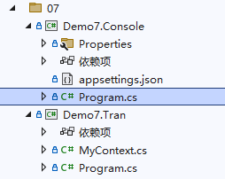

# 事件总线

事件总线常常作为软件开发中解耦各个组件通讯的工具。在领域驱动设计的开发过程中，由于系统存在多个模块，为了避免各个模块的函数直接进行调用，使用事件总线作为媒介进行模块间的通讯，解耦模块之间的依赖。

Maomi.EventBus 的设计参考了 MASA 的事件总线设计。


### 快速上手

可以参考以下两个项目：



首先引入 Maomi.EventBus ，在控制台、Web、Wpf 等项目下均可使用。

这里我们来模拟用户注册的流程，模拟用户注册流程。假设用户提交信息后，系统的处理过程是检查验证码、将用户信息写到 Users 表中、初始化用户数据、发送电子邮箱。


首先是定义一个事件模型类，模型类必须继承 Event 抽象类或 IEvent 接口。

```csharp
public record class MyEvent : Event
{
	public string Name { get; set; }
	public string EMail { get; set; }
	public override string ToString()
	{
		return $"用户名:	{Name} ，邮箱:	{EMail}";
	}
}
```


接着要编写事件执行器，在 Maomi.EventBus 中，事件执行器是一个方法，而不是一个类型，事件执行器方法命名没有约束，只要求方法参数包含 `MyEvent` 事件即可，执行器方法所在的类型不需要继承任何接口，只需要使用 `EventAttribute` 特性标记即可。


```csharp
[Event] // 标记此类型里有事件处理器
public class CheckImageCodeEventHandler
{
	// 标记该方法是事件处理器，并设置执行顺序
	[EventHandler(Order = 0)]
	public void Check(MyEvent @event)
	{
		Console.WriteLine(@event.ToString());
	}
}
```


与常规的事件总线框架不一样，Maomi.EventBus 并不是每个 Event 一个或多个订阅者类型，而是使用执行器方法处理。只需要在方法的参数加上 Event 类型，然后使用 `[EventHandler(Order = 0)]` 设置执行序号，可以将多个方法使用 `[EventHandler(Order = 0)]` 根据序号编排其执行顺序。


在编写验证码执行器方法后，我们继续完善用户注册过程，其完整代码示例如下：

```csharp
[Event]
public class UserRegisterEventHandler
{
	[EventHandler(Order = 1)]
	public void InsertDb(MyEvent @event)
	{
		var state = new Random().Next(0, 2);
		if (state == 0)
			Console.WriteLine("√ 用户信息已添加到数据库");
		else throw new Exception("× 写入用户信息到数据库失败");
	}

	[EventHandler(Order = 1, IsCancel = true)]
	public void CancelInsertDb(MyEvent @event)
	{
		Console.WriteLine("注册失败，刷新验证码");
	}

	[EventHandler(Order = 2)]
	public void InitUser(MyEvent @event)
	{
		var state = new Random().Next(0, 2);
		if (state == 0)
			Console.WriteLine("√ 初始化用户数据，系统生成默认用户权限、数据");
		else throw new Exception("× 初始化用户数据失败");
	}

	[EventHandler(Order = 2, IsCancel = true)]
	public void CancelInitUser(MyEvent @event)
	{
		Console.WriteLine("撤销用户注册信息");
	}

	[EventHandler(Order = 3)]
	public void SendEmail(MyEvent @event)
	{
		var state = new Random().Next(0, 2);
		if (state == 0)
			Console.WriteLine("√ 发送验证邮件成功");
		else throw new Exception("× 发送验证邮件失败");
	}

	[EventHandler(Order = 3, IsCancel = true)]
	public void CancelSendEmail(MyEvent @event)
	{
		Console.WriteLine("× 撤销初始化用户数据");
	}
}
```


可以看到，每个执行器方法都有其执行顺序，而且都配有一个撤销器，只需要标记 `IsCancel = true` 即可，执行器和撤销器也可以可以分开放到不同的类型中。如果执行到 `SendEmail` 时出现错误，框架会逐个执行撤销器，执行顺序为 `CancelSendEmail`、`CancelInitUser`、`CancelInsertDb` 。


使用事件总线是非常简单的，只需要注册 `.AddEventBus()` 服务即可，然后使用 IEventBus 服务发布事件。

```csharp
static async Task Main()
{
	var ioc = new ServiceCollection();
	ioc.AddEventBus(middleware: typeof(LoggingMiddleware<>));
	ioc.AddLogging(build => build.AddConsole());
	
    var services = ioc.BuildServiceProvider();
	var eventBus = services.GetRequiredService<IEventBus>();
	await eventBus.PublishAsync(new MyEvent()
	{
		Name = "工良",
		EMail = "工良@maomi.com"
	});
}
```


### 中间件

本节示例代码参考 Demo7.Tran 项目，该项目使用 EFCore 将数据存储到 Sqlite 数据库中。

```csharp
public class MyContext : DbContext
{
	public DbSet<AccountEntity> Account { get; set; }

	public MyContext(DbContextOptions<MyContext> dbContext) : base(dbContext)
	{
		Database.EnsureCreated();
	}

	protected override void OnConfiguring(DbContextOptionsBuilder optionsBuilder)
	{
		optionsBuilder.UseSqlite(
			@"filename=my.db");
	}
	protected override void OnModelCreating(ModelBuilder modelBuilder)
	{
		modelBuilder.Entity<AccountEntity>()
			.Property(b => b.Id)
			.ValueGeneratedOnAdd();
	}
}

[PrimaryKey(nameof(Id))]
[Index(nameof(EMail), IsUnique = true)]
public class AccountEntity
{
	public int Id { get; set; }
	public string Name { get; set; }
	public string EMail { get; set; }
	public bool VerifyEMail { get; set; }
}
```


由于一个事件会有多个执行器方法，虽然事件执行失败后可以执行对应的方法回滚，可是当准备回滚时，程序崩溃了，那么就会导致数据不一致，为了解决这一问题，可以在事件中间件中加入数据库事务处理。

定义一个事件中间件，在中间件中打开和回滚事务。

```csharp
public class TranMiddleware<TEvent> : IEventMiddleware<TEvent> where TEvent : IEvent
{
	private readonly MyContext _context;

	public TranMiddleware(MyContext context)
	{
		_context = context;
	}

	public async Task HandleAsync(TEvent @event, EventHandlerDelegate next)
	{
		Console.WriteLine("----- Handling command {0} ({1})", @event.GetType().Name, @event.ToString());
		using var tran = await _context.Database.BeginTransactionAsync();
		try
		{
			await next();
			await tran.CommitAsync();
		}
		catch (Exception)
		{
			await tran.RollbackAsync();
			throw;
		}
	}
}
```


编写相关事件，将数据插入到数据库中：

```csharp
[Event]
public class UserRegisterEventHandler
{
	private readonly MyContext _context;

	public UserRegisterEventHandler(MyContext context)
	{
		_context = context;
	}

	[EventHandler(Order = 0)]
	public async Task InsertDb(MyEvent @event)
	{
		var state = new Random().Next(0, 2);
		if (state == 1)
		{
			await _context.Account.AddAsync(new AccountEntity
			{
				Name = @event.Name,
				EMail = @event.EMail,
			});
			await _context.SaveChangesAsync();
			Console.WriteLine("√ 用户信息已添加到数据库");
		}
		else throw new Exception("× 写入用户信息到数据库失败");
	}
}
```


在进行依赖注入时，注入该中间件：

```csharp
static async Task Main(string[] args)
{
	var ioc = new ServiceCollection();
	ioc.AddDbContext<MyContext>();
	ioc.AddLogging(build => build.AddConsole());
	ioc.AddEventBus(typeof(TranMiddleware<>));

	var services = ioc.BuildServiceProvider();
	var eventBus = services.GetRequiredService<IEventBus>();
	await eventBus.PublishAsync(new MyEvent()
	{
		Name = "工良",
		EMail = "工良@maomi.com"
	});
}
```

