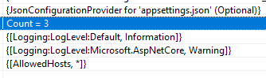
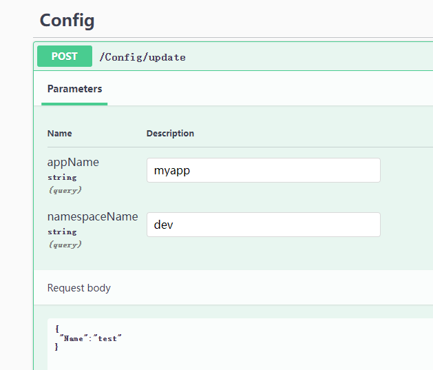

# 4，配置和选项

ASP.NET Core 模板项目下会有 appsettings.json、appsettings.Development.json 两个配置文件，我们可以通过这两个文件配置 Web 应用的启动端口、是否使用 https 等，大多数第三方框架也都支持在这两个 json 文件中配置。ASP.NET Core 程序默认支持从 json 文件、xml 文件、环境变量等多种配置源注入到内存中，微服务应用一般会使用远程配置中心存储配置以便动态更新到程序中，不管是什么类型的配置源，只需要提供 IConfigurationBuilder 的扩展方法给开发者即可，开发者不必关注配置源本身的实现细节。而 Microsoft.Extensions.Configuration.Abstractions 定义了统一的接口，使用者只需要 注入 IConfiguration 服务即可动态获取配置。


在实际生产环境中，尤其在微服务场景下，我们会有实时更新配置的需求，要求服务实例使用集中式的配置中心，以便修改配置后所有实例同时更新。通过配置中心管理多个服务的配置，以及将实例的开发、测试等环境的配置隔离开来。在本章中，笔者将会介绍这些 .NET 中的配置和选项，在学会使用方法和原理之后，还会介绍如何使用 SignalR 开发一个配置中心，不管使用的是控制台还是例如 WPF 这类桌面程序，都可以达到 ASP.NET Core 中使用配置的效果。

在本小节中，我们将会做两个实践项目，第一个是实现从文件中读取配置，并且在文件修改后能够实时更新配置到内存中；第二个是实现一个配置中心，能够将远程配置更新到本地。

### 配置(Configuration)

创建一个控制台程序，然后引入 Microsoft.Extensions.Configuration 类库，我们可以使用 ConfigurationBuilder 类构建配置提供器，然后通过扩展包从各种数据源中导入配置。

目前，Microsoft 官方提供的导入配置源扩展方法有以下类型：

* 内存键值集合
* 配置文件，json、xml、yaml 文件等
* 环境变量、命令行参数


无论是哪种数据源，导入到内存中时，均以字符串键值对的形式出现。


从 json 文件获取配置，需要引入 `Microsoft.Extensions.Configuration.Json` 包。

在项目根目录下创建一个 json 文件，内容如下：

```json
{
"test":"配置"
}
```

然后从 json 中导入配置。

```csharp
            var config = new ConfigurationBuilder()
                .AddJsonFile("test.json")
                .Build();
            string test = config["test"];
            Console.WriteLine(test);
```


如果配置文件不在根目录下，则可以使用 `SetBasePath()` 来定义路径，示例如下：

```csharp
            var config = new ConfigurationBuilder()
                .SetBasePath("E:\\test\\aaa")
                .AddJsonFile("test.json")
                .Build();
```

另外，json 扩展默认会监听文件的变化，如果文件做出了修改，那么就会重新读取配置到内存中。

```csharp
                config.AddJsonFile("appsettings.json", 
                    optional: true, 
                    reloadOnChange: true);
```


而从键值对计划中导入配置，示例如下：

```csharp
        var dic = new Dictionary<string, string>()
        {
            ["test"] = "配置"
        };
        var config = new ConfigurationBuilder()
            .AddInMemoryCollection(dic)
            .Build();
        string test = config["test"];
```

常用的导入配置的扩展方法有：

```csharp
builder.Configuration
    .AddCommandLine(...)
    .AddEnvironmentVariables(...)
    .AddIniFile(...)
    .AddIniStream(...)
    .AddInMemoryCollection(...)
    .AddJsonFile(...)
    .AddJsonStream(...)
    .AddKeyPerFile(...)
    .AddUserSecrets(...)
    .AddXmlFile(...)
    .AddXmlStream(...);
```


观察 `AddInMemoryCollection()` 的扩展方法，可以看到本质是创建了一个 MemoryConfigurationSource 实例，添加到 IConfigurationBuilder 中。

```csharp
        public static IConfigurationBuilder AddInMemoryCollection(this IConfigurationBuilder configurationBuilder)
        {
            ThrowHelper.ThrowIfNull(configurationBuilder);

            configurationBuilder.Add(new MemoryConfigurationSource());
            return configurationBuilder;
        }
```


如果我们要自定义一个数据源，需要实现 IConfigurationSource、IConfigurationProvider 两个接口，IConfigurationSource 用于生成配置提供器，IConfigurationProvider 用于通过 key 获取配置字符串。

```csharp
    public interface IConfigurationSource
    {
        IConfigurationProvider Build(IConfigurationBuilder builder);
    }
```

```csharp
    public interface IConfigurationProvider
    {
        bool TryGet(string key, out string? value);
        void Set(string key, string? value);
        IChangeToken GetReloadToken();
        void Load();
        IEnumerable<string> GetChildKeys(IEnumerable<string> earlierKeys, string? parentPath);
    }
```


#### 读取配置

在 ASP.NET Core 项目中，都会有个 appsettings.json 文件，其默认内容如下：

```json
{
  "Logging": {
    "LogLevel": {
      "Default": "Information",
      "Microsoft": "Warning",
      "Microsoft.Hosting.Lifetime": "Information"
    }
  }
}
```


因为配置在内存中是以键值对出现的，我们可以使用 `:` 符号获取下一层子项的配置。

```csharp
            var config = new ConfigurationBuilder()
                .AddJsonFile("appsettings.json")
                .Build();

            string test = config["Logging:LogLevel:Default"];
```



查找 `Logging:LogLevel:Default` 时，并不需要先定位 `Logging` 再往下查找 `LogLevel` ，而是直接使用字符串 `Logging:LogLevel:Default` 作为 Key 从配置字典中查询对应的 Value。

```
"Logging:LogLevel:Default" = "Information"
"Logging:LogLevel:Microsoft" = "Warning"
```


通过 json 配置文件，我们可以很方便地构建层级结构的配置，如果想在字典中存储，可以使用 `"{k1}:{k2}"` 这种形式存。例如：

```csharp
            var dic = new Dictionary<string, string>()
            {
                ["testParent:Child1"] = "6",
                ["testParent:Child2"] = "666"
            };
            var config = new ConfigurationBuilder()
                .AddInMemoryCollection(dic)
                .Build().GetSection("testParent");

            string test = config["Child1"];
```


如果你只想 获取 json 文件中 `LogLevel` 部分的配置，可以使用 `GetSection()` 方法获取 IConfigurationSection 对象，这样可以筛选出以当前字符串开头的所有配置，那么我们下次使用时，就不必提供完整的 Key 了。

```csharp
// json:
{
  "Logging": {
    "LogLevel": {
      "Default": "Information",
      "Microsoft.AspNetCore": "Warning"
    }
  },
  "AllowedHosts": "*"
}

// C#
varconfig = new ConfigurationBuilder()
    .AddJsonFile("appsettings.json")
    .Build();

IConfigurationSection section = config.GetSection("Logging:LogLevel");
string test = section["Default"];
```


但是这样读取起来很不方便，我们可以使用 Microsoft.Extensions.Configuration.Binder 类库，里面有大量的扩展方法，可以帮助我们将配置字符串转换为强类型。

```csharp
// json:
{
  "test": {
    "Index": 1
  }
}


// C#:
public class Test
{
	public int Index { get; set; }
}

var config = new ConfigurationBuilder()
	.AddJsonFile("test.json")
    .Build();
var section = config.GetSection("test");
var o = section.Get<Test>();
```


即使源数据没有层次结构，我们可以也可以使用 `Get<>()` 方法将配置映射为对象。

```csharp
    public class TestOptions
    {
        public string A { get; set; }
        public string B { get; set; }
        public string C { get; set; }
    }
```

```csharp
            var dic = new Dictionary<string, string>()
            {
                ["A"] = "6",
                ["B"] = "66",
                ["C"] = "666"
            };
            TestOptions config = new ConfigurationBuilder()
                .AddInMemoryCollection(dic)
                .Build().Get<TestOptions>();
```


#### 配置拦截

有时，从数据源中导入的配置是第三方扩展提供的，有些配置无法直接修改，因为所有的配置都会以键值对的形式存储在内存中，那么我们可以尝试通过增加配置键值对来解决这个问题。


比如 Serilog 的配置，Serilog 可以在配置文件中设置打印文件日志，我们需要在程序运行时确定日志存放到哪里。

```csharp
    public static void DynamicLog(this IServiceCollection services, string customPath)
    {
        var configuration = services!.BuildServiceProvider().GetRequiredService<IConfiguration>();

		// 查找节点
        var fileName = configuration.AsEnumerable()
            .Where(x => x.Key.StartsWith("Serilog:WriteTo") && x.Key.EndsWith("Name") && x.Value!.Equals("File")).FirstOrDefault();

        // Serilog:WriteTo:0:Name
        if (!string.IsNullOrEmpty(fileName.Value))
        {
            var key = fileName.Key.Replace("Name", "Args:path");
            var path = Path.Combine(customPath, "log.txt");
            configuration[key] = path;
        }
    }
```


#### 配置优先级

在 ASP.NET Core 中，开发时会使用到 `appsettings.json`、`appsettings.Development.json` 配置文件，这两个配置文件都有自己的 IConfigurationSource、IConfigurationProvider。

运行时，appsettings.Development.json 中的配置会替换 appsettings.json 的配置。


其实在于配置的注入顺序，例如我们可以手动注入多个 json 配置文件：

```csharp
var configuration = new ConfigurationBuilder()
.AddJsonFile(path: "appsettings.json")
.AddJsonFile(path: "appsettings.Development.json")
```


这个 Configuration 会存在两个配置源：

```
// appsettings.json
JsonConfigurationSource
// appsettings.Development.json
JsonConfigurationSource
```


当查找配置时，会从 Providers 中倒序查找，会首先从 appsettings.Development.json 中查找配置，当查找完成后，立即返回。


因此，当我们需要使用自定义配置提供器时，可以在最后才加上我们的提供器，这样我们自定义的提供器优先级最高。


### 选项(Options)

在 ASP.NET Core 中，很多中间件的配置是通过选项传递的。比如设置表单上传文件最大为 30MB。

```csharp
// 表单配置
builder.Services.Configure<FormOptions>(options =>
{
    // 上传的文件最大为 30mb
    options.MultipartBodyLengthLimit = 31_457_280;
});
```

这样做的好处是，我们使用配置时，可以直接使用强类型，而不需要关注如何从 IConfiguration 中取出配置。

如果我们要获取 TestOptions，是通过 `IOptions<TestOptions>` 来获取的，不能直接获取 TestOptions 服务。

```
        private readonly TestModel _options;
        public TestController(IOptions<FormOptions> options)
        {
            _options = options.Value;
        }
```


配置和选项的最重要差别是，配置是用于整个程序，以键值对的形式存储信息，而选项是给特定模块提供参数，使用强类型。


示例项目在 Demo3.Options

我们创建一个控制台项目，引入以下包：

```csharp
	<ItemGroup>
		<PackageReference Include="Microsoft.Extensions.Configuration" Version="7.0.0" />
		<PackageReference Include="Microsoft.Extensions.Configuration.Json" Version="7.0.0" />
		<PackageReference Include="Microsoft.Extensions.DependencyInjection" Version="7.0.0" />
		<PackageReference Include="Microsoft.Extensions.Options.ConfigurationExtensions" Version="7.0.0" />
	</ItemGroup>
```


添加一个 test.json 文件，内容如下：

```json
{
  "Title": "测试",
  "Name": "测试测试"
}
```

再创建一个与之对应的模型类：

```csharp
    public class TestOptions
    {
        public string Title { get; set; }
        public string Name { get; set; }
    }
```


选项接口主要有三个接口，分别是：

* `IOptions<TOptions>`
* `IOptionsSnapshot<TOptions>`
* `IOptionsMonitor<TOptions>` 

.NET 8 有了新的变化。

使用示例如下：

```csharp
        static void Main(string[] args)
        {
            var services = new ServiceCollection();
            var configuration = new ConfigurationBuilder()
                .AddJsonFile("test.json", optional: true, reloadOnChange: true)
                .Build();
            services.AddSingleton<IConfiguration>(configuration);

            services.AddOptions<TestOptions>().Bind(configuration);
            // services.Configure<TestOptions>(name: "", configuration);
            // 或者使用 Microsoft.Extensions.Options.ConfigurationExtensions 包
            // services.Configure<TestOptions>(configuration);

            var ioc = services.BuildServiceProvider();
            var to1 = ioc.GetRequiredService<IOptions<TestOptions>>();
            var to2 = ioc.GetRequiredService<IOptionsSnapshot<TestOptions>>();
            var to3 = ioc.GetRequiredService<IOptionsMonitor<TestOptions>>();
            to3.OnChange(s =>
            {
                Console.WriteLine($"变更之前的值: {s.Name}");
            });
            while (true)
            {
                Console.WriteLine($"IOptions: {to1.Value.Name}");
                Console.WriteLine($"IOptionsSnapshot: {to2.Value.Name}");
                Console.WriteLine($"IOptionsMonitor: {to3.CurrentValue.Name}");
                Thread.Sleep(1000);
            }
        }
```

我们可以手动修改 test.json 文件，观察控制台打印。


这三种方式都可以获取到选项，它们之间的区别在于生命周期和文件监控等。

ASP.NET Core 源代码：

```csharp
            services.TryAdd(ServiceDescriptor.Singleton(typeof(IOptions<>), typeof(UnnamedOptionsManager<>)));
            services.TryAdd(ServiceDescriptor.Scoped(typeof(IOptionsSnapshot<>), typeof(OptionsManager<>)));
            services.TryAdd(ServiceDescriptor.Singleton(typeof(IOptionsMonitor<>), typeof(OptionsMonitor<>)));
            services.TryAdd(ServiceDescriptor.Transient(typeof(IOptionsFactory<>), typeof(OptionsFactory<>)));
            services.TryAdd(ServiceDescriptor.Singleton(typeof(IOptionsMonitorCache<>), typeof(OptionsCache<>)));
```

 

`IOptions<TOptions>` 有以下特征：

注册为单一实例且可以注入到任何服务生存期。

不支持在应用启动后读取配置数据。也就是说即使配置源可以动态更新，但是 `IOptions<TOptions>` 不会动态从 IConfiguration 中 最新的配置。

也就是说，在应用启动前就已经读取配置文件生成对象(单一实例)。当然，后续如果修改了配置文件(.json)，也不会影响这个对象的。


文档解释：通过使用 `IOptionsSnapshot<TOptions>`，针对请求生存期访问和缓存选项时，每个请求都会计算一次选项。

IOptionsSnapshot 的生命作用域是 scoped ，在一个请求周期内有效，而 IOptionsMonitor 是单例模式，但是却可以监听配置的变更。

由于 IOptionsSnapshot 每次请求都会进行更新，因此配置文件变更后，可以及时获得更新。

IOptionsMonitor 则略有不同。IOptionsSnapshot 和 IOptionsMonitor 都可以检测到配置文件的更改，但是 IOptionsSnapshot 每次请求都是一个新的对象，在同一个请求上下文中同一个对象。而 IOptionsMonitor 是单例模式，主要用于结合 IConfiguration 使用。


但是要注意，要使用 `IOptionsMonitor<T> ` 很多写法是无效的。比如：

```csharp
            services.Configure<TestOptions>(o =>
            {
                o.Name = new Random().Next(0, 100).ToString();
            });
            services.Configure<TestOptions>(o =>
            {
                configuration.Bind(o);
            });
```


### 实现自定义配置提供器

在本节中，笔者将会介绍如何编写一个从文件导入的配置提供器，并且实现随文件变化动态更新到内存中。

代码示例在 `Demo4.Console` 中。

引入 `Microsoft.Extensions.FileProviders.Physical` ，用于监听目录、文件变化。


我们将来实现读取自定义配置格式的文件，创建一个 env.conf 文件，内容如下：

```
A:111
B:222
```

配置文件通过 `:` 号来分隔 key 和 value，


我们要实现自定义配置提供器，需要先编写一个配置源，需要继承 IConfigurationSource 接口，其接口定义非常简单：

```csharp
	public interface IConfigurationSource
	{
		IConfigurationProvider Build(IConfigurationBuilder builder);
	}
```


创建一个 MyConfigurationSource 类型，代码如下：

```csharp
    public class MyConfigurationSource : IConfigurationSource
    {
        // 配置文件的路径
        public string Path { get; set; }
        // 是否实时监听此文件变化
        public bool ReloadOnChange { get; set; }
        public IConfigurationProvider Build(IConfigurationBuilder builder)
        {
            return new MyConfigurationProvider(this);
        }
    }
```


接着定义配置提供器，配置提供器需要存储配置信息，提供配置查询等接口。


代码示例如下：

```csharp
public class MyConfigurationProvider : IConfigurationProvider
{
	private readonly MyConfigurationSource _source;
	private readonly IFileProvider _fileProvider;

	private readonly string _path;
	private readonly string _fileName;

    // 缓存
	private readonly Dictionary<string, string> _cache;
    
	public MyConfigurationProvider(MyConfigurationSource source)
	{
		_source = source;
		_cache = new Dictionary<string, string>();
	
		_path = Directory.GetParent(_source.Path)!.FullName;
		_fileName = Path.GetFileName(_source.Path);

		_fileProvider = new PhysicalFileProvider(_path);
		if (_source.ReloadOnChange)
		{
            // 监听配置文件变化
			ChangeToken.OnChange(() => _fileProvider.Watch(_fileName), async () => await ReloadFileAsync());
		}
		else
		{
			ReloadFileAsync().Wait();
		}
	}
    
	// 重新加载配置文件到内存中
	private async Task ReloadFileAsync()
	{
		using var stream = _fileProvider.GetFileInfo(_fileName).CreateReadStream();
		using var streamReader = new StreamReader(stream);
		_cache.Clear();
		while (true)
		{
			var line = await streamReader.ReadLineAsync();
			if (line == null) break;
			var kv = line.Split(':')[0..2].Select(x => x.Trim(' ')).ToArray();
			_cache.Add(kv[0], kv[1]);
		}
	}

	public IEnumerable<string> GetChildKeys(IEnumerable<string> earlierKeys, string? parentPath) => _cache.Keys;

	public IChangeToken GetReloadToken() => null;

	public void Load()
	{
		ReloadFileAsync().Wait();
	}

	public void Set(string key, string? value)
	{
		_cache[key] = value!;
	}

	public bool TryGet(string key, out string? value)
	{
		return _cache.TryGetValue(key, out value);
	}
}
```


接着定义扩展，以便支持外部依赖注入：

```csharp
public static class Extensions
{
    public static IConfigurationBuilder AddEnvFile(this IConfigurationBuilder builder, string path, bool reloadOnChange = false)
    {
        var source = new MyConfigurationSource()
        {
            Path = path,
            ReloadOnChange = reloadOnChange
        };
        builder.Add(source);
        return builder;
    }
}
```


然后使用我们自定义的配置提供器：

```csharp
	static void Main()
	{
		var configuration = new ConfigurationBuilder()
			.AddEnvFile("env.conf", true)
			.Build();
		while (true)
		{
			var value = configuration["A"];
			Console.WriteLine($"A = {value}");
			Thread.Sleep(1000);
		}
	}
```


启动程序后，修改程序运行目录下的 env.conf 文件，查看控制台中的输出，检查控制台的输出是否与修改后的文件一致。


### 实现配置中心

在了解配置、选项的使用方法，以及如何自定义配置提供器之后，在本小节，我们将会创建一个配置中心服务，然后客户端通过 SignalR 与配置中心通讯，当配置中心的配置内容被修改后，自动推送到客户端中。


新建一个名为 Demo3.ConfigCenter 的 API 项目和一个名为 Demo3.ConfigClient 的控制台项目。


首先是实现配置中心的 Demo3.ConfigCenter 的代码，创建一个保存客户端信息的模型类。

```csharp
    /// <summary>
    /// 客户端的信息
    /// </summary>
    public class ClientInfo
    {
        /// <summary>
        /// SignalR 连接的 id
        /// </summary>
        public string ConnectionId { get; set; }

        /// <summary>
        /// 应用名称
        /// </summary>
        public string AppName { get; set; }

        /// <summary>
        /// 命名空间
        /// </summary>
        public string Namespace { get; set; }

        /// <summary>
        /// 分组名称
        /// </summary>
        public string GroupName => $"{AppName}-{Namespace}";

        /// <summary>
        /// 客户端的 IP 地址
        /// </summary>
        public string IpAddress { get; set; }
    }
```


创建一个用于 SignalR 通讯的 Hub 服务，与客户端进行实时通信。

```csharp
    public partial class ConfigCenterHub : Hub
    {
        // 客户端连接信息
        private static readonly ConcurrentDictionary<string, ClientInfo> _clients = new();
        // 在内存中保存每个服务的配置
        private static readonly ConcurrentDictionary<string, JsonObject> _settings = new();

        private readonly IHubContext<ConfigCenterHub> _hubContext;
        public ConfigCenterHub(IHubContext<ConfigCenterHub> hubContext)
        {
            _hubContext = hubContext;
        }

        // 当客户端连接到服务时
        public override async Task OnConnectedAsync()
        {
            ClientInfo clientnInfo = GetInfo();

            await _hubContext.Groups.AddToGroupAsync(clientnInfo.ConnectionId, clientnInfo.GroupName);
            _clients[clientnInfo.GroupName] = clientnInfo;
        }

        // 当客户端断开服务时
        public override async Task OnDisconnectedAsync(Exception? exception)
        {
            ClientInfo clientnInfo = GetInfo();

            await _hubContext.Groups.RemoveFromGroupAsync(clientnInfo.ConnectionId, clientnInfo.GroupName);
            _clients.TryRemove(clientnInfo.ConnectionId, out _);
        }

        // 获取客户端的信息
        private ClientInfo GetInfo()
        {
            var feature = Context.Features.Get<IHttpConnectionFeature>();
            var httpContext = Context.GetHttpContext();

            ArgumentNullException.ThrowIfNull(feature);
            ArgumentNullException.ThrowIfNull(httpContext);

            // 从 header 中查询信息
            var appName = httpContext.Request.Headers["AppName"].FirstOrDefault();
            var namespaceName = httpContext.Request.Headers["Namespace"].FirstOrDefault();

            ArgumentNullException.ThrowIfNull(appName);
            ArgumentNullException.ThrowIfNull(namespaceName);

            var groupName = $"{appName}-{namespaceName}";

            // 获取客户端通讯地址
            var remoteAddress = feature.RemoteIpAddress;
            ArgumentNullException.ThrowIfNull(remoteAddress);
            var remotePort = feature.RemotePort;

            return new ClientInfo
            {
                ConnectionId = feature.ConnectionId,
                AppName = appName,
                Namespace = namespaceName,
                IpAddress = $"{remoteAddress.MapToIPv4().ToString()}:{remotePort}"
            };
        }
        
        // 客户端自行获取配置
        public async Task<JsonObject> GetAsync()
        {
            ClientInfo clientnInfo = GetInfo();
            if(_settings.TryGetValue(clientnInfo.GroupName, out var v))
            {
                return v;
            }
            var dic = new Dictionary<string, JsonNode>().ToList();
            return new JsonObject(dic);
        }
        
        // 更新缓存
        public void UpdateCache(string appName, string namespaceName, JsonObject json)
        {
            var groupName = $"{appName}-{namespaceName}";
            _settings[groupName] = json;
        }
    }
```


然后注册 Hub 服务：

```csharp
... ...
builder.Services.AddSwaggerGen();

// 注入 SignalR
builder.Services.AddSignalR();
builder.Services.AddScoped<ConfigCenterHub>();

var app = builder.Build();

... ...
app.MapControllers();

// 加入 Hub 中间件
app.MapHub<ConfigCenterHub>("/config");
app.Run("http://*:5000");
```


创建一个 ConfigController 控制器，允许通过 API 修改配置中心的内容，以及在修改配置后推送到对应的客户端中。

```csharp
    [ApiController]
    [Route("[controller]")]
    public class ConfigController : ControllerBase
    {
        private readonly ConfigCenterHub _configCenter;
        private readonly IHubContext<ConfigCenterHub> _hubContext;

        public ConfigController(IHubContext<ConfigCenterHub> hubContext, ConfigCenterHub configCenter)
        {
            _hubContext = hubContext;
            _configCenter = configCenter;
        }

        [HttpPost("update")]
        public async Task<string> Update(string appName, string namespaceName, [FromBody] JsonObject json)
        {
            var groupName = $"{appName}-{namespaceName}";
            _configCenter.UpdateCache(appName, namespaceName, json);
            await _hubContext.Clients.Group(groupName).SendAsync("Publish", json);
            return "已更新配置";
        }
    }
```


接下来就是客户端部分。

在程序启动时，会读取目录的 tmp_config.json 文件注入到配置中，如果文件不存在则创建。然后使用框架自带的 JsonConfigurationProvider 为我们动态监听 json 文件的变化，减少我们的代码量。在实时监听 Json 文件变化，以及解析 json ，这部分可以利用官方的 JsonConfigurationSource 来实现，我们就不需要重新写一个了。

然后使用 SignalR 与配置中心通讯，将配置中心的内容写入到临时文件 tmp_config.json 中，JsonConfigurationProvider 会自动将修改后的 json 文件加载到内存中。因为我们使用了本地配置文件，获取到的配置先缓存在本地中，所以当下次程序启动时或网络出现故障时，程序依然可以通过本地缓存配置启动起来。这个也是很多配置中心都有实现的。


在  Demo3.ConfigClient 中创建 OnlineConfigurationSource、OnlineConfigurationProvider 文件，写入以下代码：

```csharp
    public class OnlineConfigurationSource : IConfigurationSource
    {
        /// <summary>
        /// 获取最新配置的 API 路径
        /// </summary>
        public string URL { get; init; }
        public string AppName { get; init; }
        public string Namespace { get; init; }

        public IConfigurationProvider Build(IConfigurationBuilder builder)
        {
            return new OnlineConfigurationProvider(this, builder);
        }
    }
```


然后实现一个配置提供器，与 Hub 服务器实时通信，并更新到 tmp_config.json 文件中。

```csharp
    public class OnlineConfigurationProvider : IConfigurationProvider, IDisposable
    {
        private const string TmpFile = "tmp_config.json";
        private readonly string _jsonPath;

        private readonly OnlineConfigurationSource _configurationSource;
        private readonly JsonConfigurationSource _jsonSource;
        private readonly IConfigurationProvider _provider;
        private readonly HubConnection _connection;

        public OnlineConfigurationProvider(OnlineConfigurationSource configurationSource, IConfigurationBuilder builder)
        {
            // 使用框架自带的 JsonConfigurationSource 动态获取 json 文件的内容
            var curPath = Directory.GetParent(typeof(OnlineConfigurationProvider).Assembly.Location).FullName;
            _jsonPath = Path.Combine(curPath, TmpFile);
            if (!File.Exists(TmpFile)) File.WriteAllText(_jsonPath, "{}");

            _configurationSource = configurationSource;
            _jsonSource = new JsonConfigurationSource()
            {
                Path = TmpFile,
                ReloadOnChange = true,
            };
            _provider = _jsonSource.Build(builder);

            // 配置 SignalR 通讯，将新的内容写入到 json 文件
            _connection = new HubConnectionBuilder()
                .WithUrl(_configurationSource.URL, options =>
                {
                    options.Headers.Add("AppName", _configurationSource.AppName);
                    options.Headers.Add("Namespace", _configurationSource.Namespace);
                })
                .WithAutomaticReconnect()
                .Build();

            _connection.On<JsonObject>("Publish", async (json) =>
            {
                await SaveJsonAsync(json);
            });

            _connection.StartAsync().Wait();
            var json = _connection.InvokeAsync<JsonObject>("GetAsync").Result;
            SaveJsonAsync(json).Wait();
        }

        private async Task SaveJsonAsync(JsonObject json)
        {
            // 每次清空文件重新写入内容
            using FileStream fs = new FileStream(_jsonPath, FileMode.Truncate, FileAccess.ReadWrite);
            await System.Text.Json.JsonSerializer.SerializeAsync(fs, json);
            Console.WriteLine($"已更新配置：{System.Text.Json.JsonSerializer.Serialize(json)}");
        }

        private bool _disposedValue;
        ~OnlineConfigurationProvider() => Dispose(false);
        public void Dispose()
        {
            Dispose(true);
            GC.SuppressFinalize(this);
        }

        protected virtual void Dispose(bool disposing)
        {
            if (!_disposedValue)
            {
                if (disposing)
                {
                    _connection.DisposeAsync();
                }
                _disposedValue = true;
            }
        }

        public IEnumerable<string> GetChildKeys(IEnumerable<string> earlierKeys, string? parentPath) => _provider.GetChildKeys(earlierKeys, parentPath);
        public IChangeToken GetReloadToken() => _provider.GetReloadToken();
        public void Load() => _provider.Load();
        public void Set(string key, string? value) => _provider.Set(key, value);
        public bool TryGet(string key, out string? value) => _provider.TryGet(key, out value);
    }
```


编写扩展方法，配置 Hub 服务。

```csharp
    public static class Extensions
    {
        // 添加远程配置
        public static IConfigurationBuilder AddReomteConfig(this IConfigurationBuilder builder, string url, string appName, string @namespace)
        {
            var source = new OnlineConfigurationSource()
            {
                URL = url,
                AppName = appName,
                Namespace = @namespace
            };
            builder.Add(source);
            return builder;
        }
    }
```


使用配置中心服务：

```csharp
    internal class Program
    {
        static void Main(string[] args)
        {
            Thread.Sleep(5000);
            var builder = new ConfigurationBuilder()
                .AddReomteConfig("http://127.0.0.1:5000/config", "myapp", "dev");

            var config = builder.Build();
            while (true)
            {
                Console.WriteLine(config["Name"]);
                Thread.Sleep(1000);
            }
        }
    }
```


同时启动配置中心和客户端，打开配置中心的 Swagger 地址，修改并推送新的配置到客户端。



