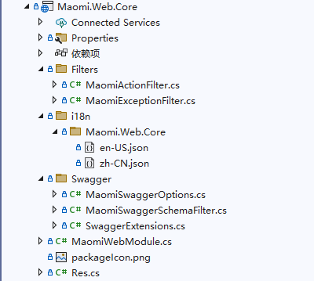
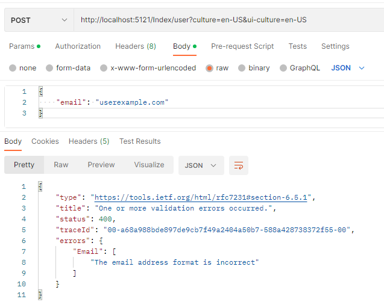
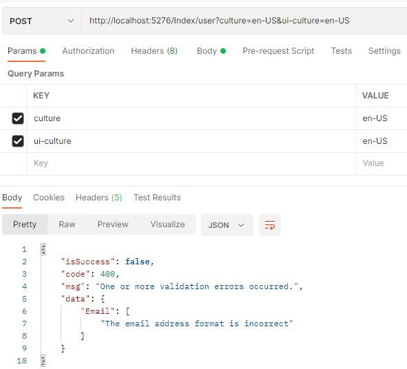
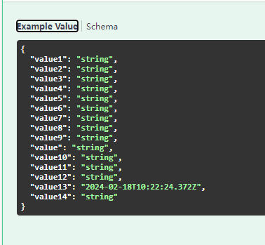
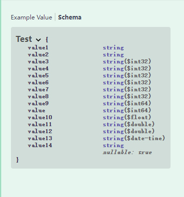
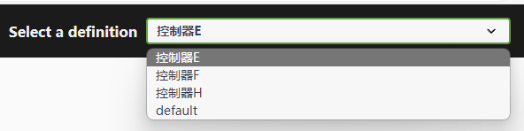
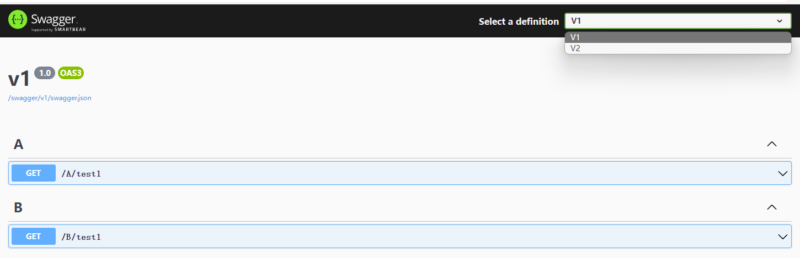

# Web 定制

Web 开发是 .NET 最广泛使用的场景之一，现在越来越多的企业 Web 开发业务系统采用 ASP.NET Core 或第三方框架如 ABP 等进行开发，这些第三方框架绝大多数是基于 ASP.NET Core 进行开发的，当然每个企业或每个开发者对框架的需求都不一样，有的人觉得 ABP 满足了大多数需求，有的人觉得 ABP 太重了，也有很多人选择自己基于 ASP.NET Core 开发新的 Web 开发框架。由于 ASP.NET Core 是 .NET 日常开发中最常是使用的框架，因此本章主要讲解如何定制 Web，以便满足不同的需求。

Maomi.Web.Core 是一个简洁地定制了 ASP.NET Core 的模块框架，主要是集成 i18n 和 swagger，此外没有集成太多功能。

使用时需要在模块上添加 `[InjectModule<MaomiWebModule>()]` 注入 Web 模块服务。



### 统一响应模型

无论是报错还是模型验证失败、请求成功等，都要设置一定的响应体格式，方便前端或客户端使用。

Maomi.Web.Core 定制了以下模型类：

````csharp
// 响应模型类
public class Res<T>
{
	// 当前请求是否有错误
	public virtual bool IsSuccess => Code == 200;

	// 业务代码
	public virtual int Code { get; set; }

	// 响应消息
	public virtual string Msg { get; set; }

	// 返回数据
	public virtual T? Data { get; set; }
}

// 响应模型类
public partial class Res : Res<object?>
{
	// 创建 Res
	public static Res<T> Create<T>(int code, string message, T data)
	{
		return new Res<T>
		{
			Code = code,
			Msg = message,
			Data = data
		};
	}

	/// 创建 Res
	/// </summary>
	public static Res<T> Create<T>(HttpStatusCode code, string message, T data) => Create((int)code, message, data);
}

// 分页结果模型类
public class PageRes<T>
{
	/// 当前页
	public virtual int PageNo { get; set; }

	/// 页大小
	public virtual int PageSize { get; set; }

	public virtual T? List { get; set; }
}

// 分页结果模型类
public partial class PageListRes<T> : Res<PageRes<IEnumerable<T>>>
{
}

/// 分页结果模型类
/// <typeparam name="T"></typeparam>
public partial class PageArrayRes<T> : Res<PageRes<T[]>>
{
}
````


### 模型验证使用多语言

ASP.NET Core 中模型验证器打印的字符串默认都是英文，我们在业务中往往需要多语言以及自定义模型验证特性，因此有必要让模型验证也支持 i18n。

在使用 ``[InjectModule<MaomiWebModule>()]` ` 时，已经自动使用模型验证动态多语言，因此不需要额外配置。

当然，你也可以手动注入：

```csharp
// 添加控制器
context.Services.AddControllers(options =>
{
})
// 注入
.AddI18nDataAnnotation();
```


然后我们在该项目中创建一个模型类：

```csharp
public class UserInfo
{
	[EmailAddress(ErrorMessage = "邮箱地址格式不正确")]
	public string Email { get; set; }
}
```


因为 UserInfo 模型类在 Demo10.ApiDataAnnotations 项目中，因此我们需要在 Demo10.ApiDataAnnotations 中创建 json 多语言资源文件，目录在 `i18n/Demo10.ApiDataAnnotations ` 下。

json 文件示例如下：

zh-CN.json

```json
{
  "邮箱地址格式不正确": "邮箱地址格式不正确"
}
```

en-US.json

```json
{
  "邮箱地址格式不正确": "The email address format is incorrect"
}
```


然后创建一个简单的 API 接口进行测试：

```csharp
    [ApiController]
    [Route("[controller]")]
    public class IndexController : ControllerBase
    {
        [HttpPost("user")]
        public string GetUserName([FromBody] UserInfo info)
        {
            return info.Email.Split("@").FirstOrDefault();
        }
    }
```


然后对 API 发出请求，分别在 email 字段输入不同的内容。




使用 i18n 服务之后，模型验证错误会随着语言标识而变化。


### 筛选器

Maomi.Web.Core 默认注入了以下筛选器：

```csharp
// 添加控制器
context.Services.AddControllers(options =>
{
	options.Filters.Add<MaomiActionFilter>();
	options.Filters.AddService<MaomiActionFilter>();
	options.Filters.AddService<MaomiExceptionFilter>();
})
.AddI18nDataAnnotation();
```

在 ASP.NET Core 中，当模型验证失败时，会返回如下格式的内容。

```json
{
    "type": "https://tools.ietf.org/html/rfc7231#section-6.5.1",
    "title": "One or more validation errors occurred.",
    "status": 400,
    "traceId": "00-4fcae233f0ff7c4de765680f5ee8b8b8-67b2c0d9a41224c6-00",
    "errors": {
        "Email": [
            "The email address format is incorrect"
        ]
    }
}
```


但是在项目开发中，我们往往需要固定一种格式，比如本章开头就设置了统一的响应模型类 `Res`、`Res<T>`。


然后在 Demo10.ApiDataAnnotations 项目中的 IndexController 中加上 MaomiActionFilter 特性。

```csharp
[ApiController]
[Route("[controller]")]
public class IndexController : ControllerBase
{
	[ServiceFilter(typeof(MaomiActionFilter))]
	[HttpPost("user")]
	public string GetUserName([FromBody] UserInfo info)
	{
		return info.Email.Split("@").FirstOrDefault();
	}
}
```

启动 Web 程序，请求该接口，模型验证错误的结果使用固定格式响应。




ActionFilterAttribute 可以用在 Action 上，也可以用在 Controller 上，在 Controller 配置时，对所有 Action 起效。

```csharp
[ServiceFilter(typeof(MaomiActionFilter))]
[ApiController]
[Route("[controller]")]
public class IndexController : ControllerBase
{
}
```


因为 MaomiActionFilter 需要进行依赖注入，需要使用 ServiceFilter 配置筛选器，如果自定义的 ActionFilterAttribute 并不需要使用依赖注入，那么可以直接使用。

```csharp
[MyActionFilter]
[HttpPost("user")]
public string GetUserName([FromBody] UserInfo info)
{
	return info.Email.Split("@").FirstOrDefault();
}
```


异常筛选器主要用于捕获发生在 Action 中的异常。

当 API 出现异常时，我们需要屏蔽异常信息以免泄露敏感信息，以及统一响应模型。


然后创建一个简单的示例项目 Demo10.ExceptionFilter，引用 MaomiWebModule ，只需要创建一个简单的 API 即可。

```csharp
[ApiController]
[Route("[controller]")]
public class TestController : ControllerBase
{
	[HttpGet(Name = "get")]
	public IEnumerable<TestModel> Get()
	{
		throw new Exception("test");
	}
}

public class TestModel
{
	public string Name { get; set; }
}
```


直接请求 http://localhost:5242/Test，响应：

```json
{
    "isSuccess": false,
    "code": 500,
    "msg": "服务出现故障，请求 Id:0HMT8H2RIMEQ7:00000001",
    "data": null
}
```

使用多语言请求 http://localhost:5242/Test?culture=en-US&ui-culture=en-US ，响应：

```json
{
    "isSuccess": false,
    "code": 500,
    "msg": "Service error，Request Id:0HMT8H2RIMEQ7:00000002",
    "data": null
}
```


### swagger 定制

Maomi.Web.Core 给 Swagger 封装了一些代码，使得用户配置 swagger 变得简单起来，可以很容易解决日常开发定制 swagger 或微服务场景下 swagger 处理的问题。

使用 Maomi.Web.Core 中的 swagger 配置，只需要这样使用即可：

```csharp
			var builder = WebApplication.CreateBuilder(args);

			builder.Services.AddControllers();
			builder.Services.AddEndpointsApiExplorer();
			// 1，这里注入
			builder.Services.AddMaomiSwaggerGen();

			var app = builder.Build();

			// Configure the HTTP request pipeline.
			if (app.Environment.IsDevelopment())
			{
				// 2，这里配置中间件
				app.UseMaomiSwagger();
			}

			app.UseAuthorization();
```


下面来介绍 Maomi.Web.Core 中封装好的 Swagger 的几种功能。


#### 模型类属性类型处理

在示例项目 Demo9.Swagger 中，有一个模型类：

```csharp
public class Test
{
	[JsonConverter(typeof(string))]
	public Boolean Value1 { get; set; }  
    ...  
	[JsonConverter(typeof(string))]
	public Int32 Value7 { get; set; }

	[JsonConverter(typeof(string))]
	public UInt32 Value8 { get; set; }

	[JsonConverter(typeof(string))]
	public Int64 Value9 { get; set; }
    ...
}
```

Test 模型类中包含了多种类型，打开 swagger 后，如下所示：

```json
{
  "value1": true,
  "value2": "string",
  "value3": 0,
  "value4": 0,
  "value5": 0,
  "value6": 0,
  "value7": 0,
  "value8": 0,
  "value9": 0,
  "value": 0,
  "value10": 0,
  "value11": 0,
  "value12": 0,
  "value13": "2024-02-15T03:50:35.891Z",
  "value14": "string"
}

```


我们希望 swagger 中显示时，能够显示 JsonConverter 中指定的格式。因为我们定制了类型转换器，因此我们希望 swagger 中显示该字段是字符串，而不是值。但是默认 swagger 是不会处理 `[JsonConverter]` 的。

使用 `.AddMaomiSwaggerGen()` 后，变成：






#### 接口分组

由于项目逐渐庞大，API 接口越来越多，所有接口都在一个 swagger 中，导致 swagger.json 文件庞大。第六章中提到过可以使用工具将 swagger.json 生成代码文件，可是如果只需要使用其中一部分接口，却需要生成全部接口代码文件，以及不同模块中可能会有相同名称的接口，这样会导致混乱。因此，需要将 swagger 中的接口进行分组。

```csharp
[ApiController]
[Route("[controller]")]
[ApiExplorerSettings(GroupName = "控制器E")]
public class EController : ControllerBase
{
}
```


本节示例代码请参考 Demo9.Swagger 项目。


效果如下：



控制器代码：

```csharp
    /// <summary>
    /// 控制器A
    /// </summary>
    [ApiController]
    [Route("[controller]")]
    public class AController : ControllerBase
    {
        /// <summary>
        /// 测试
        /// </summary>
        /// <returns></returns>
        [HttpGet("test1")]
        public string Get1() => "true";

        /// <summary>
        /// 测试
        /// </summary>
        /// <returns></returns>
        [HttpGet("test2")]
        public string Get2() => "true";
    }

    /// <summary>
    /// 控制器B
    /// </summary>
    [ApiController]
    [Route("[controller]")]
    public class BController : ControllerBase
    {
        /// <summary>
        /// 测试
        /// </summary>
        /// <returns></returns>
        [HttpGet("test1")]
        public string Get1() => "true";

        /// <summary>
        /// 测试
        /// </summary>
        /// <returns></returns>
        [HttpGet("test2")]
        public string Get2() => "true";
    }

    /// <summary>
    /// 控制器C
    /// </summary>
    [ApiController]
    [Route("[controller]")]
    public class CController : ControllerBase
    {
        /// <summary>
        /// 测试
        /// </summary>
        /// <returns></returns>
        [HttpGet("test1")]
        public string Get1() => "true";

        /// <summary>
        /// 测试
        /// </summary>
        /// <returns></returns>
        [HttpGet("test2")]
        public string Get2() => "true";
    }

    /// <summary>
    /// 控制器D
    /// </summary>
    [ApiController]
    [Route("[controller]")]
    public class DController : ControllerBase
    {
        /// <summary>
        /// 测试
        /// </summary>
        /// <returns></returns>
        [HttpGet("test")]
        public string Get() => "true";
    }

    /// <summary>
    /// 控制器E
    /// </summary>
    [ApiController]
    [Route("[controller]")]
    [ApiExplorerSettings(GroupName = "控制器E")]
    public class EController : ControllerBase
    {
        /// <summary>
        /// 测试
        /// </summary>
        /// <returns></returns>
        [HttpGet("test")]
        public string Get() => "true";
    }

    /// <summary>
    /// 控制器F
    /// </summary>
    [ApiController]
    [Route("[controller]")]
    [ApiExplorerSettings(GroupName = "控制器F")]
    public class FController : ControllerBase
    {
        /// <summary>
        /// 测试
        /// </summary>
        /// <returns></returns>
        [HttpGet("test")]
        public string Get() => "true";
    }

    /// <summary>
    /// 控制器G
    /// </summary>
    [ApiController]
    [Route("[controller]")]
    public class GController : ControllerBase
    {
        /// <summary>
        /// 测试
        /// </summary>
        /// <returns></returns>
        [HttpGet("test")]
        public string Get() => "true";
    }

    /// <summary>
    /// 控制器H
    /// </summary>
    [ApiController]
    [Route("[controller]")]
    [ApiExplorerSettings(GroupName = "控制器H")]
    public class HController : ControllerBase
    {
        /// <summary>
        /// 测试
        /// </summary>
        /// <returns></returns>
        [HttpGet("test")]
        public string Get() => "true";
    }
```


#### 接口版本号

随着项目迭代，接口越来越多，为了不影响已经对接的项目，同一个接口就会出现多个版本号。

只需要在 Controller 或 Action 上添加 `[ApiVersion("1.0")]` 特性注解即可。




如果你对版本号的格式和分组，需要额外处理或修改默认配置，可以自行定制：

```csharp
			// 1，这里注入
			builder.Services.AddMaomiSwaggerGen(
				setupApiVersionAction: setup =>
				{
					// 全局默认 api 版本号
					setup.DefaultApiVersion = new ApiVersion(1, 0);
					// 用户请求未指定版本号时，使用默认版本号
					setup.AssumeDefaultVersionWhenUnspecified = true;
					// 响应时，在 header 中返回版本号
					setup.ReportApiVersions = true;
					// 从哪里读取版本号信息
					setup.ApiVersionReader =
					ApiVersionReader.Combine(
					   new HeaderApiVersionReader("X-Api-Version"),
					   new QueryStringApiVersionReader("version"));
				},
				setupApiExplorerAction: setup =>
				{
					// 获取或设置版本参数到 url 地址中
					setup.SubstituteApiVersionInUrl = true;
					// swagger 页面默认填入的版本号
					setup.DefaultApiVersion = new ApiVersion(1, 0);
					// 显示的版本分组格式
					setup.GroupNameFormat = "'v'VVV";
				});
```


#### 路由后缀

在微服务场景下，许多服务会共用一个域名，然后使用不同的路由后缀指向对应的服务，比如 https://localhost/a、 https://localhost/b ，不过默认 swagger ui 中请求时，使用了绝对路径，因此不会自动使用这些路由后缀参数。为了能够让 swagger ui 在微服务下能够支持不同路由后缀请求，需要对此进行配置。

```csharp
// 2，这里配置中间件
app.UseMaomiSwagger(setupAction: setup =>
{
	setup.PreSerializeFilters.Add((swagger, httpReq) =>
	{
		swagger.Servers = new List<OpenApiServer>
		{
		    new  (){ Url = $"{httpReq.Scheme}://{httpReq.Host.Value}/mya" },
			new  (){ Url = $"{httpReq.Scheme}://{httpReq.Host.Value}/myb" }
		};
	});
});
```


效果如下：


在 swagger 页面调试时，如果需要配置请求不同的服务地址，可以配置中间件 `.UseMaomiSwagger()` ，在其中加上自定义地址。