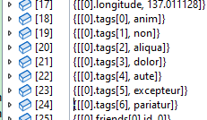
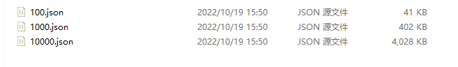

# .NET 中的序列化和反序列化

在 ASP.NET Core 应用中，框架会屏蔽了很多实现序列化和反序列化的细节，我们只需要定义参数模型，ASP.NET Core 会自动将 http 请求的 Body 反序列化为模型对象。但是日常开发中我们会对序列化和反序列化做许多定制配置，比如忽略值为 null 的字段、时间格式处理、忽略大小写、字段类型转换等各种情况。因此笔者单独使用一章讲解序列化框架的使用以及如何进行定制，深入了解 .NET 中序列化和反序列化机制。

System.Text.Json 是 .NET 框架自带的序列化框架，简单易用并且性能也很出色，使用  System.Text.Json 反序列化字符串为对象是很简单的，示例如下：

```csharp
// 自定义序列化配置
static JsonSerializerOptions jsonSerializerOptions = new JsonSerializerOptions()
{
	PropertyNameCaseInsensitive = true,
	WriteIndented = true
};

public static void Main()
{
	const string json =
		"""
            {
                "Name": "工良"
            }
            """;
	var obj = JsonSerializer.Deserialize<Model>(json, jsonSerializerOptions);
}

public class Model
{
	public string Name { get; set; }
}
```


JsonSerializerOptions 的属性定义了如何序列化和反序列化，其常用属性如下：

| 属性                        | 类型                   | 说明                                    |
| --------------------------- | ---------------------- | --------------------------------------- |
| AllowTrailingCommas         | `bool`                 | 忽略 JSON 中多余的逗号                  |
| Converters                  | `IList<JsonConverter>` | 转换器列表                              |
| DefaultBufferSize           | `int`                  | 默认缓冲区大小                          |
| DefaultIgnoreCondition      | `JsonIgnoreCondition`  | 当字段/属性的值为默认值时，是否忽略     |
| DictionaryKeyPolicy         | `JsonNamingPolicy`     | 字典 Key 重命名规则，如首字母生成小写   |
| IgnoreNullValues            | `bool`                 | 忽略 JSON 中值为 null 的字段/属性       |
| IgnoreReadOnlyFields        | `bool`                 | 忽略只读字段                            |
| IgnoreReadOnlyProperties    | `bool`                 | 忽略只读属性                            |
| IncludeFields               | `bool`                 | 是否处理字段，默认只处理属性            |
| MaxDepth                    | `int`                  | 最大嵌套深度，默认最大深度为 64         |
| NumberHandling              | `JsonNumberHandling`   | 如何处理数字类型                        |
| PropertyNameCaseInsensitive | `bool`                 | 忽略大小写                              |
| PropertyNamingPolicy        | `JsonNamingPolicy`     | 重命名规则，如首字母生成小写            |
| ReadCommentHandling         | `JsonCommentHandling`  | 处理注释                                |
| WriteIndented               | `bool`                 | 序列化时格式化 JSON，如换行、空格、缩进 |

接下来笔者将会列举一些常用的定制场景和编码方法，为了避免混肴，在本章中所指的 “字段” 或 “属性”，等同于类型的“字段和属性”。


## 编写类型转换器

类型转换器的作用是当 json 对象字段和模型类字段类型不一致时，可以自动转换对应的类型，下面笔者介绍常用的几种类型转换器。


### 枚举转换器

#### .NET 是如何序列化枚举

编写 WebAPI 的模型类时常常会用到枚举，枚举类型默认会以数值的形式输出到 json 中。


C# 代码示例如下：

```csharp
// 枚举
public enum NetworkType
    {
        Unknown = 0,
        IPV4 = 1,
        IPV6 = 2
    }

// 类型
public class Model
    {
        public string Name { get; set; }
        public NetworkType Netwotk1 { get; set; }
        public NetworkType? Netwotk2 { get; set; }
    }

var model = new Model
		{
			Name = "工良",
			Netwotk1 = NetworkType.IPV4,
			Netwotk2 = NetworkType.IPV6
		}
```


当我们序列化对象时，会得到这样的结果：

```csharp
{
	"Name": "工良",
	"Netwotk1": 1,
	"Netwotk2": 2
}
```


但是这样会在阅读上带来难题，数字记忆比较困难，并且后期需要扩展枚举字段时，可能会导致对应数值的变化，那么已经对接的代码都需要修改，如果枚举涉及的范围比较广，那么要做出修改就会变得十分困难。

比如说突然出现了一个 IPV5，那么我们除了改代码，可能还要修改以及对接的其它应用。

```csharp
public enum NetworkType
{
        Unknown = 0,
        IPV4 = 1,
        IPV5 = 2,
        IPV6 = 3
}
```


因此，我们需要一种方法，能够让枚举序列化后使用对应的名称表示，以及能够使用这个字符串转化为对应的枚举类型，后期需要扩展或中间插入时，对以前的代码和数据库完全没有影响。

比如反序列化时，得到的是这样的 json：

```json
"Netwotk1": "IPV4"
"Netwotk2": "IPV6"
```

即使后来中间插入一个 IPV5，生成新的字符串即可，完全不需要重新排序枚举值。

```json
"Netwotk1": "IPV4"
"Netwotk2": "IPV6"
"Netwotk3": "IPV5"
```


在 C# 模型类中使用枚举而 json 中使用字符串，要实现这种形式的枚举转换，有两种方法。

* 在模型类的枚举字段或属性上放置一个特性注解，序列化反序列化时从这个特性注解中获取转换器。
* 使用 JsonSerializerOptions 添加转换器，在反序列化或序列化时传递自定义配置。


无论哪种方法，我们都需要实现一个转换器，能够将模型类中的枚举使用对应的名称序列化到 json 中。在实现自定义转换器示例之前，我们来了解相关的一些知识。

自定义转换器需要继承 `JsonConverter` 或 `JsonConverter<T>`，当反序列化 json 的字段或序列化对象的字段属性时，框架会自动调用转换器。

以 `JsonConverter<T>` 为例，里面有好几个抽象接口，我们一般只需要实现转换器的两个抽象接口即可：

```csharp
// json 值 => 对象字段
public abstract T? Read(ref Utf8JsonReader reader, Type typeToConvert, JsonSerializerOptions options);
// 对象字段 => json 值
public abstract void Write(Utf8JsonWriter writer, T value, JsonSerializerOptions options);
```


不过我们一定要注意 C# 中的可空类型，比如 `NetworkType` 和 `NetworkType?` 实际上是两种类型，可空类型本质是使用 `Nullable<T>` 包装的类型。

`Nullable<T>` 的定义如下：

```
public struct Nullable<T> where T : struct
```


另外 `Nullable<T>` 实现了和 T 类型的隐式和显式转换重载，所以我们在使用可空类型时，可能不太容易感受出 `Nullable<T>` 和 T 区别，比如可以在使用可空类型 `T?` 时，直接将 `Nullable<T>` 与 `T` 类型隐式和显式转换，如：

```csharp
Nullable<int> value = 100
```


但是在使用反射时，由于 `T` 和 `T?` 是两种不同的类型，因此我们编写转换器时必须留意到这种区别，否则会出现错误。


#### 实现枚举转换器

> 本节示例代码在 Demo4.Console 中。


编写一个枚举字符串转换器代码示例如下：

```csharp
public class EnumStringConverter<TEnum> : JsonConverter<TEnum>
{
	private readonly bool _isNullable;

	public EnumStringConverter(bool isNullType)
	{
		_isNullable = isNullType;
	}
    
    // 判断当前类型是否可以使用该转换器转换
	public override bool CanConvert(Type objectType) => EnumStringConverterFactory.IsEnum(objectType);

    // 从 json 中读取数据
	// JSON => 值
	// typeToConvert: 模型类属性/字段的类型
	public override TEnum Read(ref Utf8JsonReader reader, Type typeToConvert, JsonSerializerOptions options)
	{
        // 读取 json
		var value = reader.GetString();
		if (value == null)
		{
			if (_isNullable) return default;
			throw new ArgumentNullException(nameof(value));
		}

		// 是否为可空类型
		var sourceType = EnumStringConverterFactory.GetSourceType(typeof(TEnum));
		if (Enum.TryParse(sourceType, value.ToString(), out var result))
		{
			return (TEnum)result!;
		}
		throw new InvalidOperationException($"{value} 值不在枚举 {typeof(TEnum).Name} 范围中");
	}

	// 值 => JSON
	public override void Write(Utf8JsonWriter writer, TEnum? value, JsonSerializerOptions options)
	{
		if (value == null) writer.WriteNullValue();
		else writer.WriteStringValue(Enum.GetName(value.GetType(), value));
	}
}
```

> 由于 Utf8JsonReader 日常出行的机会不多，因此读者可能不太了解，在本章的末尾，笔者会简单介绍。


一般情况下，我们不会直接使用 EnumStringConverter ，为了能够适应所有枚举类型，还需要编写一个枚举转换工厂，通过工厂模式判断输入类型之后，再创建对应的转换器。


```csharp
public class EnumStringConverterFactory : JsonConverterFactory
{
	// 获取需要转换的类型
	public static bool IsEnum(Type objectType)
	{
		if (objectType.IsEnum) return true;

		var sourceType = Nullable.GetUnderlyingType(objectType);
		return sourceType is not null && sourceType.IsEnum;
	}
    
    // 如果类型是可空类型，则获取原类型
	public static Type GetSourceType(Type typeToConvert)
	{
		if (typeToConvert.IsEnum) return typeToConvert;
		return Nullable.GetUnderlyingType(typeToConvert);
	}

    // 判断该类型是否属于枚举
	public override bool CanConvert(Type typeToConvert) => IsEnum(typeToConvert);
    
    // 为该字段创建一个对应的类型转换器
	public override JsonConverter? CreateConverter(Type typeToConvert, JsonSerializerOptions options)
	{
		var sourceType = GetSourceType(typeToConvert);
		var converter = typeof(EnumStringConverter<>).MakeGenericType(typeToConvert);
		return (JsonConverter)Activator.CreateInstance(converter, new object[] { sourceType != typeToConvert });
	}
}
```


当 System.Text.Json 处理一个字段时，会调用 EnumStringConverterFactory 的  `CanConvert` 方法，如果返回 true，则会调用 EnumStringConverterFactory 的 `CreateConverter` 方法创转换器，最后调用转换器处理字段，这样一来，我们可以通过泛型类 `EnumStringConverter<TEnum>` 处理各种枚举。


然后定义特性注解，能够将模型类的属性字段绑定到一个转换器上。

```csharp
    [AttributeUsage(AttributeTargets.Enum | AttributeTargets.Property | AttributeTargets.Field, AllowMultiple = false)]
    public class EnumConverterAttribute : JsonConverterAttribute
    {
        public override JsonConverter CreateConverter(Type typeToConvert)
        {
            return new EnumStringConverterFactory();
        }
    }
```


#### 如何使用类型转换器

使用自定义类型转换器有三种方法。


方法一，在枚举字段中使用自定义特性：

```csharp
    public class Model
    {
        public string Name { get; set; }

        [EnumConverter]
        public NetworkType Netwotk1 { get; set; }
        
        [EnumConverter]
        public NetworkType? Netwotk2 { get; set; }
    }
```


方法二，使用 `JsonConverter` 特性。

```csharp
public class Model
{
	public string Name { get; set; }
    
	[JsonConverter(typeof(EnumConverter))]   
	public NetworkType Netwotk1 { get; set; }
    
	[JsonConverter(typeof(EnumConverter))]
	public NetworkType? Netwotk2 { get; set; }
}
```


方法三，在配置中添加转换器。

```csharp
		jsonSerializerOptions.Converters.Add(new EnumStringConverterFactory());
		var obj = JsonSerializer.Deserialize<Model>(json, jsonSerializerOptions);
```


在模型类中使用转换器特性之后，我们可以通过字符串反序列化为枚举类型：

```csharp
        const string json =
            """
            {
                "Name": "工良",
                "Netwotk1": "IPV4",
                "Netwotk2": "IPV6"
            }
            """;
        var obj = JsonSerializer.Deserialize<Model>(json, jsonSerializerOptions);
```


#### 使用官方的转换器

System.Text.Json 中已经实现了很多转换器，可以在官方源码的 `System/Text/Json/Serialization/Converters/Value` 下找到所有自带的转换器，其中官方实现的枚举字符串转换器叫 JsonStringEnumConverter ，使用方法跟我们的自定义转换器一致。


这里我们可以使用官方的 JsonStringEnumConverter 转换器替代 ` EnumStringConverter<TEnum>`：

```csharp
    public class Model
    {
        public string Name { get; set; }
        public NetworkType Netwotk1 { get; set; }
        public NetworkType? Netwotk2 { get; set; }
    }
```

```csharp
        JsonSerializerOptions jsonSerializerOptions = new();
        jsonSerializerOptions.Converters.Add(new JsonStringEnumConverter());
        const string json =
            """
            {
                "Name": "工良",
                "Netwotk1": "IPV4",
                "Netwotk2": "IPV6"
            }
            """;
        var obj = JsonSerializer.Deserialize<Model>(json, jsonSerializerOptions);
```


### 字符串和值类型转换

很多情况下，会在模型类下使用数值类型，序列化到 json 时使用字符串。比如对应浮点型的数值，为了保证其准确性，我们会使用字符串形式保存到 json 中，这样可以避免传输时对浮点型处理而丢失其准确性。又比如前端处理超过 16 位数值时，数字会丢失精确度，16位数字存储毫秒格式的时间戳足够了，很多时候我们会使用分布式 id，雪花算法有很多种，其生成的 id 往往会超过 16 位。


JS 中处理超过 16 位数字时，会出现很精确度丢失的问题：

```js
console.log(11111111111111111);
输出: 11111111111111112

console.log(111111111111111111);
输出: 111111111111111100
```


有个最简单的方法是在 JsonSerializerOptions 中将所有数值字段转换为字符串：

```csharp
        new JsonSerializerOptions
		{
			NumberHandling = JsonNumberHandling.AllowReadingFromString
		};
```


但是这样会导致所有值类型字段序列化为 json 时变成字符串，如果只需要处理几个字段而不是处理所有字段，那就需要我们自己编写类型转换器了。

要实现字符串转数值，需要考虑很多种数值类型，如 byte、int、double、long 等，从值类型转换为字符串是很简单的，但是要实现一个字符串转任意类型值类型，那就很麻烦，这也是我们编写转换器的重点。


编写 json 字符串和模型类值类型转换器的代码示例如下：

```csharp
public class StringNumberConverter<T> : JsonConverter<T>
{
	private static readonly TypeCode typeCode = Type.GetTypeCode(typeof(T));

    // 从 json 中读取字符串，转换为对应的值类型
	public override T Read(ref Utf8JsonReader reader, Type typeToConvert, JsonSerializerOptions options)
	{
		switch (reader.TokenType)
		{
			case JsonTokenType.Number:
				if (typeCode == TypeCode.Int32)
				{
					if (reader.TryGetInt32(out var value))
					{
						return Unsafe.As<int, T>(ref value);
					}
				}
				if (typeCode == TypeCode.Int64)
				{
					if (reader.TryGetInt64(out var value))
					{
						return Unsafe.As<long, T>(ref value);
					}
				}
				if (typeCode == TypeCode.Decimal)
				{
					if (reader.TryGetDecimal(out var value))
					{
						return Unsafe.As<decimal, T>(ref value);
					}
				}
				if (typeCode == TypeCode.Double)
				{
					if (reader.TryGetDouble(out var value))
					{
						return Unsafe.As<double, T>(ref value);
					}
				}
				if (typeCode == TypeCode.Single)
				{
					if (reader.TryGetSingle(out var value))
					{
						return Unsafe.As<float, T>(ref value);
					}
				}
				if (typeCode == TypeCode.Byte)
				{
					if (reader.TryGetByte(out var value))
					{
						return Unsafe.As<byte, T>(ref value);
					}
				}
				if (typeCode == TypeCode.SByte)
				{
					if (reader.TryGetSByte(out var value))
					{
						return Unsafe.As<sbyte, T>(ref value);
					}
				}
				if (typeCode == TypeCode.Int16)
				{
					if (reader.TryGetInt16(out var value))
					{
						return Unsafe.As<short, T>(ref value);
					}
				}
				if (typeCode == TypeCode.UInt16)
				{
					if (reader.TryGetUInt16(out var value))
					{
						return Unsafe.As<ushort, T>(ref value);
					}
				}
				if (typeCode == TypeCode.UInt32)
				{
					if (reader.TryGetUInt32(out var value))
					{
						return Unsafe.As<uint, T>(ref value);
					}
				}
				if (typeCode == TypeCode.UInt64)
				{
					if (reader.TryGetUInt64(out var value))
					{
						return Unsafe.As<ulong, T>(ref value);
					}
				}
				break;

			case JsonTokenType.String:
				IConvertible str = reader.GetString() ?? "";
				return (T)str.ToType(typeof(T), null);

		}

		throw new NotSupportedException($"无法将{reader.TokenType}转换为{typeToConvert}");
	}

    // 将值类型转换为 json 字符串
	public override void Write(Utf8JsonWriter writer, T value, JsonSerializerOptions options)
	{
		switch (typeCode)
		{
			case TypeCode.Int32:
				writer.WriteNumberValue(Unsafe.As<T, int>(ref value));
				break;
			case TypeCode.UInt32:
				writer.WriteNumberValue(Unsafe.As<T, uint>(ref value));
				break;
			case TypeCode.Decimal:
				writer.WriteNumberValue(Unsafe.As<T, decimal>(ref value));
				break;
			case TypeCode.Double:
				writer.WriteNumberValue(Unsafe.As<T, double>(ref value));
				break;
			case TypeCode.Single:
				writer.WriteNumberValue(Unsafe.As<T, uint>(ref value));
				break;
			case TypeCode.UInt64:
				writer.WriteNumberValue(Unsafe.As<T, ulong>(ref value));
				break;
			case TypeCode.Int64:
				writer.WriteNumberValue(Unsafe.As<T, long>(ref value));
				break;
			case TypeCode.Int16:
				writer.WriteNumberValue(Unsafe.As<T, short>(ref value));
				break;
			case TypeCode.UInt16:
				writer.WriteNumberValue(Unsafe.As<T, ushort>(ref value));
				break;
			case TypeCode.Byte:
				writer.WriteNumberValue(Unsafe.As<T, byte>(ref value));
				break;
			case TypeCode.SByte:
				writer.WriteNumberValue(Unsafe.As<T, sbyte>(ref value));
				break;
			default:
				throw new NotSupportedException($"不支持非数字类型{typeof(T)}");
		}
	}
}
```


编写字符串转换为各种类型的值类型，主要有一个难点泛型转换，我们使用 `reader.TryGetInt32()` 读取 int 值之后，明明知道泛型 T 是 int，但是我们却不能直接返回 int ，我们必须要有一个手段可以将值转换为泛型 T。如果使用反射，会带来很大的性能消耗，还可能伴随着装箱拆箱，所以这里使用了 `Unsafe.As` ，其作用是将转换类型的指针，使得相关的值类型可以转换为泛型 T。


实现字符串和值类型转换器之后，接着实现转换工厂：

```csharp
public class JsonStringToNumberConverter : JsonConverterFactory
{
	public static JsonStringToNumberConverter Default { get; } = new JsonStringToNumberConverter();

	public override bool CanConvert(Type typeToConvert)
	{
		var typeCode = Type.GetTypeCode(typeToConvert);
		return typeCode == TypeCode.Int32 ||
			typeCode == TypeCode.Decimal ||
			typeCode == TypeCode.Double ||
			typeCode == TypeCode.Single ||
			typeCode == TypeCode.Int64 ||
			typeCode == TypeCode.Int16 ||
			typeCode == TypeCode.Byte ||
			typeCode == TypeCode.UInt32 ||
			typeCode == TypeCode.UInt64 ||
			typeCode == TypeCode.UInt16 ||
			typeCode == TypeCode.SByte;
	}

	public override JsonConverter CreateConverter(Type typeToConvert, JsonSerializerOptions options)
	{
		var type = typeof(StringNumberConverter<>).MakeGenericType(typeToConvert);
		var converter = Activator.CreateInstance(type);
		if (converter == null)
		{
			throw new InvalidOperationException($"无法创建 {type.Name} 类型的转换器");
		}
		return (JsonConverter)converter;
	}
}
```


### 时间类型转换器

json 中规定了标准的时间格式，部分常用时间格式如下：

```
YYYY-MM-DDTHH:mm:ss.sssZ
YYYY-MM-DDTHH:mm:ss.sss+HH:mm
YYYY-MM-DDTHH:mm:ss.sss-HH:mm
```

示例：

```
2023-08-15T20:20:00+08:00
```


但是在项目开发中，我们很多使用需要使用定制的格式，如 `2023-02-15 20:20:20` ，那么就需要自行编写转换器，以便能够正确序列化或反序列化时间字段。

在 C# 中有一个指定 DateTtime 如何解析字符串时间的接口，即 `DateTime.ParseExact(String, String, IFormatProvider)`，为了能够适应各种字符串时间格式，我们可以利用该接口将字符串转换为时间。


编写 json 字符串时间与 DateTime 互转的代码示例如下：

```csharp
public class CustomDateTimeConverter : JsonConverter<DateTime>
{
	private readonly string _format;
    // format 参数是时间的字符串格式
	public CustomDateTimeConverter(string format)
	{
		_format = format;
	}
	public override void Write(Utf8JsonWriter writer, DateTime date, JsonSerializerOptions options)
	{
		writer.WriteStringValue(date.ToString(_format));
	}
	public override DateTime Read(ref Utf8JsonReader reader, Type typeToConvert, JsonSerializerOptions options)
	{
		var value = reader.GetString() ?? throw new FormatException("当前字段格式错误");
		return DateTime.ParseExact(value, _format, null);
	}
}
```

转换器中不需要判断 json 字符串时间的各种，而是在使用时指定格式在构造函数中注入。使用示例：

```csharp
jsonSerializerOptions.Converters.Add(new CustomDateTimeConverter("yyyy/MM/dd HH:mm:ss"));
```


其实，使用默认的 json 时间格式是一个很好的习惯。据笔者经验，在项目中修改默认的 json 时间格式，在后期项目开发和对接中，很有可能出现序列化问题。如果某些地方需要更高精细度，如需要毫秒、使用转换为时间戳、第三方系统对接需要特殊格式等，可以在需要的模型类上使用特性标记对应的时间转换器格式，最好不要全局修改 json 时间格式。


## 从底层处理 JSON

在本节中，笔者将会介绍如何使用 Utf8JsonReader 高性能地解析 json 文件，然后编写对 Utf8JsonReader 的性能测试，通过相关的示例让读者掌握 Utf8JsonReader 的使用，以及如何对代码进行性能测试。


### Utf8JsonReader

Utf8JsonReader 和 Utf8JsonWriter 是 C# 中读取写入 json 的高性能 API，通过 Utf8JsonReader 和 Utf8JsonWriter 我们可以逐步读取 json 或写入 json。

Utf8JsonReader 使用比较广泛，例如官方的 JsonConfigurationProvider 便是使用 Utf8JsonReader 逐步读取 json 文件，生成 key/value 结构，而在后面的章节中，笔者也会介绍如何利用 Utf8JsonReader 实现 i18n 多语言的配置。由于 Utf8JsonReader 的使用最广泛，而 Utf8JsonWriter 并不常见，所以笔者只介绍 Utf8JsonReader  的使用方法。


Utf8JsonReader 和 Utf8JsonWriter 都是结构体，其定义如下：

```csharp
public ref struct Utf8JsonReader
public ref struct Utf8JsonWriter
```


由于其是 ref 结构体，因此使用上有较多限制，例如不能在异步中使用，不能作为类型参数在数组、 `List<>`、字典等中使用，只能被放到 `ref struct` 类型中当作字段或属性，或在函数参数中使用。使用 Utf8JsonReader  读取 json 时，开发者需要自行处理闭合括号 `{}`、`[]` 等，也需要自行判断处理 json 类型，因此读取过程也稍为复杂 。


下面，笔者来设定一个场景，就是使用 Utf8JsonReader 来实现读取 json 文件，将读取到的字段全都存到字典中，如果有多层结构，则使用 `:` 拼接层级，生成 IConfiguration 中的能够直接读取的 key/value 格式。
比如：

```json
// json
{
	"A": {
		"B": "test"
	}
}

// C#
new Dictionary<string, string>()
{
	{"A:B","test" }
};
```


新建一个静态类 ReadJsonHelper，在这个类型中编写解析 json 的代码。

```csharp
public static class ReadJsonHelper
{
}
```


首先是读取字段值的代码，当从 json 读取字段时，如果字段不是对象或数组类型，则直接读取其值即可。

```csharp
// 读取字段值
private static object? ReadObject(ref Utf8JsonReader reader)
{
	switch (reader.TokenType)
	{
		case JsonTokenType.Null or JsonTokenType.None:
			return null;
		case JsonTokenType.False:
			return reader.GetBoolean();
		case JsonTokenType.True:
			return reader.GetBoolean();
		case JsonTokenType.Number:
			return reader.GetDouble();
		case JsonTokenType.String:
			return reader.GetString() ?? "";
		default: return null;
	}
}
```


读取 json 字段时，我们会碰到复杂的嵌套结构，因此需要判断当前读取的是对象还是数组，而且两者可以相互嵌套，这就增加了我们的解析难度。

比如：

```json
{
	... ...
}
[... ...]
[{...}, {...} ...]
```


第一步是判断一个 json 的根结构是 `{}` 还是 `[]`，然后逐步解析。

```csharp
// 解析 json 对象
private static void BuildJsonField(ref Utf8JsonReader reader, 
                                   Dictionary<string, object> map, 
                                   string? baseKey)
{
	while (reader.Read())
	{
		// 顶级数组 "[123,123]"
		if (reader.TokenType is JsonTokenType.StartArray)
		{
			ParseArray(ref reader, map, baseKey);
		}
		// 碰到 } 符号
		else if (reader.TokenType is JsonTokenType.EndObject) break;
		// 碰到字段
		else if (reader.TokenType is JsonTokenType.PropertyName)
		{
			var key = reader.GetString()!;
			var newkey = baseKey is null ? key : $"{baseKey}:{key}";

			// 判断字段是否为对象
			reader.Read();
			if (reader.TokenType is JsonTokenType.StartArray)
			{
				ParseArray(ref reader, map, newkey);
			}
			else if (reader.TokenType is JsonTokenType.StartObject)
			{
				BuildJsonField(ref reader, map, newkey);
			}
			else
			{
				map[newkey] = ReadObject(ref reader);
			}
		}
	}
}
```


json 数组有很多种情况，json 数组的元素可以是任意类型，因此处理起来稍微麻烦，所以针对数组类型，我们还应该支持解析元素，使用序号来访问对应位置的元素。

解析数组：

```csharp
// 解析数组
private static void ParseArray(ref Utf8JsonReader reader, Dictionary<string, object> map, string? baseKey)
{
	int i = 0;
	while (reader.Read())
	{
		if (reader.TokenType is JsonTokenType.EndArray) break;
		var newkey = baseKey is null ? $"[{i}]" : $"{baseKey}[{i}]";
		i++;

		switch (reader.TokenType)
		{
			// [...,null,...]
			case JsonTokenType.Null:
				map[newkey] = null;
				break;
			// [...,123.666,...]
			case JsonTokenType.Number:
				map[newkey] = reader.GetDouble();
				break;
			// [...,"123",...]
			case JsonTokenType.String:
				map[newkey] = reader.GetString();
				break;
			// [...,true,...]
			case JsonTokenType.True:
				map[newkey] = reader.GetBoolean();
				break;
			case JsonTokenType.False:
				map[newkey] = reader.GetBoolean();
				break;
			// [...,{...},...]
			case JsonTokenType.StartObject:
				BuildJsonField(ref reader, map, newkey);
				break;
			// [...,[],...]
			case JsonTokenType.StartArray:
				ParseArray(ref reader, map, newkey);
				break;
			default:
				map[newkey] = JsonValueKind.Null;
				break;
		}
	}
}
```


最后，我们编写一个解析 json 的入口，通过用户传递的 json 文件，解析出字典。

```csharp
public static Dictionary<string, object> Read(ReadOnlySequence<byte> sequence, 
                                              JsonReaderOptions jsonReaderOptions)
{
	var reader = new Utf8JsonReader(sequence, jsonReaderOptions);
	var map = new Dictionary<string, object>();
	BuildJsonField(ref reader, map, null);
	return map;
}
```


JsonReaderOptions 用于配置 Utf8JsonReader 读取策略，其主要属性如下：

| 属性                |                       | 说明                                           |
| ------------------- | --------------------- | ---------------------------------------------- |
| AllowTrailingCommas | `bool`                | 是否允许（和忽略）对象或数组成员末尾多余的逗号 |
| CommentHandling     | `JsonCommentHandling` | 如何处理 JSON 注释                             |
| MaxDepth            | `int`                 | 最大嵌套深度，默认最大 64 层                   |


读取文件生成字典示例：

```csharp
// 注意，不能直接 File.ReadAllBytes() 读取文件，因为文件有 bom 头
var text = Encoding.UTF8.GetBytes(File.ReadAllText("read.json"));
var dic = ReadJsonHelper.Read(new ReadOnlySequence<byte>(text), new JsonReaderOptions { AllowTrailingCommas = true });
```


在 Demo4.Console 示例项目中，有一个 read.json 文件，其内容较为复杂，可以使用这个 json 验证代码。




另外我们可以利用 Utf8JsonReader ，结合第三章中的自定义配置教程，将 json 文件解析到 IConfiguration 中。

```csharp
var config = new ConfigurationBuilder()
	.AddInMemoryCollection(dic.ToDictionary(x => x.Key, x => x.Value.ToString()))
	.Build();
```


### Utf8JsonReader 和 JsonNode 解析 JSON 性能测试

JsonNode 也是我们读取 json 常用的方法之一，在本节中，笔者会介绍如何使用 BenchmarkDotNet 编写性能测试，对比 Utf8JsonReader 和 JsonNode 读取 json 的性能。


在 Demo4.Benchmark 示例项目中，有三个存储了大量对象数组的 json 文件，这些文件使用工具批量生成，我们将会使用这三个 json 进行性能测试。




对象格式：

```json
  {
    "a_tttttttttttt": 1001,
    "b_tttttttttttt": "邱平",
    "c_tttttttttttt": "Nancy Lee",
    "d_tttttttttttt": "buqdu",
    "e_tttttttttttt": 81.26,
    "f_tttttttttttt": 60,
    "g_tttttttttttt": "1990-04-18 10:52:59",
    "h_tttttttttttt": "35812178",
    "i_tttttttttttt": "18935330000",
    "j_tttttttttttt": "w.nsliozye@mbwrxiyf.ug",
    "k_tttttttttttt": "浙江省 金华市 兰溪市"
  }
```


首先安装 BenchmarkDotNet 框架，然后创建一个性能测试入口加载 json 文件。

```csharp
[SimpleJob(RuntimeMoniker.Net80)]
[SimpleJob(RuntimeMoniker.NativeAot80)]
[MemoryDiagnoser]
[ThreadingDiagnoser]
[MarkdownExporter, AsciiDocExporter, HtmlExporter, CsvExporter, RPlotExporter]
public class ParseJson
{
    private ReadOnlySequence<byte> sequence;

    [Params("100.json", "1000.json", "10000.json")]
    public string FileName;

    [GlobalSetup]
    public async Task Setup()
    {
        var text = File.ReadAllText(Path.Combine(Environment.CurrentDirectory, $"json/{FileName}"));
        var bytes = Encoding.UTF8.GetBytes(text);
        sequence = new ReadOnlySequence<byte>(bytes);
    }
}
```


在 ParseJson 中添加相关的方法，使用 Utf8JsonReader 解析 json :

```csharp
[Benchmark]
public void Utf8JsonReader()
{
	var reader = new Utf8JsonReader(sequence, new JsonReaderOptions());
	U8Read(ref reader);
}

private static void U8Read(ref Utf8JsonReader reader)
{
	while (reader.Read())
	{
		if (reader.TokenType is JsonTokenType.StartArray)
		{
			U8ReadArray(ref reader);
		}
		else if (reader.TokenType is JsonTokenType.EndObject) break;
		else if (reader.TokenType is JsonTokenType.PropertyName)
		{
			reader.Read();
			if (reader.TokenType is JsonTokenType.StartArray)
			{
				// 进入数组处理
				U8ReadArray(ref reader);
			}
			else if (reader.TokenType is JsonTokenType.StartObject)
			{
				U8Read(ref reader);
			}
			else
			{
			}
		}
	}
}

private static void U8ReadArray(ref Utf8JsonReader reader)
{
	while (reader.Read())
	{
		if (reader.TokenType is JsonTokenType.EndArray) break;
		switch (reader.TokenType)
		{
			case JsonTokenType.StartObject:
				U8Read(ref reader);
				break;
			// [...,[],...]
			case JsonTokenType.StartArray:
				U8ReadArray(ref reader);
				break;
		}
	}
}
```


在 ParseJson 中增加  JsonNode 解析 json 的代码：

```csharp
	[Benchmark]
	public void JsonNode()
	{
		var reader = new Utf8JsonReader(sequence, new JsonReaderOptions());
		var nodes = System.Text.Json.Nodes.JsonNode.Parse(ref reader, null);
		if (nodes is JsonObject o)
		{
			JNRead(o);
		}
		else if (nodes is JsonArray a)
		{
			JNArray(a);
		}
	}

	private static void JNRead(JsonObject obj)
	{
		foreach (var item in obj)
		{
			var v = item.Value;
			if (v is JsonObject o)
			{
				JNRead(o);
			}
			else if (v is JsonArray a)
			{
				JNArray(a);
			}
			else if (v is JsonValue value)
			{
				var el = value.GetValue<JsonElement>();
				JNValue(el);
			}
		}
	}

	private static void JNArray(JsonArray obj)
	{
		foreach (var v in obj)
		{
			if (v is JsonObject o)
			{
				JNRead(o);
			}
			else if (v is JsonArray a)
			{
				JNArray(a);
			}
			else if (v is JsonValue value)
			{
				var el = value.GetValue<JsonElement>();
				JNValue(el);
			}
		}
	}

	private static void JNValue(JsonElement obj){}
```


然后在 Main 方法中启动性能 Benchmark 框架进行测试。

```csharp
		static void Main()
		{
			var summary = BenchmarkRunner.Run(typeof(Program).Assembly);
			Console.Read();
		}
```


以 Release 模式编译项目后，启动程序进行性能测试。

> 笔者所用机器配置：
>
> ```
> AMD Ryzen 5 5600G with Radeon Graphics, 1 CPU, 12 logical and 6 physical cores
> ```


可以看到两者的性能差异比较大，所以在需要高性能的场景下，我们使用 Utf8JsonReader 的性能会高一点，还可以降低内存的使用量。

| Method         | Job           | FileName   |         Mean |      Gen0 |      Gen1 |      Gen2 |  Allocated |
| -------------- | ------------- | ---------- | -----------: | --------: | --------: | --------: | ---------: |
| Utf8JsonReader | .NET 8.0      | 100.json   |     42.87 us |         - |         - |         - |          - |
| JsonNode       | .NET 8.0      | 100.json   |    237.57 us |   37.1094 |   24.4141 |         - |   312624 B |
| Utf8JsonReader | NativeAOT 8.0 | 100.json   |     49.81 us |         - |         - |         - |          - |
| JsonNode       | NativeAOT 8.0 | 100.json   |    301.11 us |   37.1094 |   24.4141 |         - |   312624 B |
| Utf8JsonReader | .NET 8.0      | 1000.json  |    427.07 us |         - |         - |         - |          - |
| JsonNode       | .NET 8.0      | 1000.json  |  2,699.76 us |  484.3750 |  460.9375 |  199.2188 |  3120511 B |
| Utf8JsonReader | NativeAOT 8.0 | 1000.json  |    494.87 us |         - |         - |         - |          - |
| JsonNode       | NativeAOT 8.0 | 1000.json  |  3,652.08 us |  484.3750 |  464.8438 |  199.2188 |  3120513 B |
| Utf8JsonReader | .NET 8.0      | 10000.json |  4,306.30 us |         - |         - |         - |        3 B |
| JsonNode       | .NET 8.0      | 10000.json | 60,883.56 us | 4000.0000 | 3888.8889 | 1222.2222 | 31215842 B |
| Utf8JsonReader | NativeAOT 8.0 | 10000.json |  4,946.71 us |         - |         - |         - |        3 B |
| JsonNode       | NativeAOT 8.0 | 10000.json | 62,864.68 us | 4125.0000 | 4000.0000 | 1250.0000 | 31216863 B |