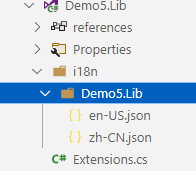

# 多语言框架的设计

随着业务的国际化，为了满足不同客户群体的需要，软件产品需要支持多种语言，根据用户选择的语言呈现不同语言的界面。ASP.NET Core 或 ABP 等框架都提供了多语言解决方案，尽管配置方法各不相同，但都是通过键值对的方式使用的，开发者需要为每个 key 提供对应语言的值，框架会根据请求上下文自动区配 key 在对应语言下的值。

在本章中，笔者将基于 ASP.NET Core，简述如何实现一个 i18n 多语言框架。


### 体验 Maomi.I18n

Maomi.I18n 是本章完成学习后的代码成果， 在编写多语言框架之前，先来学习 `Maomi.I18n` 的用法。 

#### 控制台示例

如果要使用 json 文件存储语言资源包，那么需要根据项目名称创建目录，接下来，我们创建示例项目演示这个过程。
创建一个 Demo5.Lib 项目，引入 Maomi.I18n 框架。

在 Demo5.lib 中创建一个 Extensions.cs 文件。

```csharp
    public class Test { }
    public static class Extensions
    {
        public static void AddLib(this IServiceCollection services)
        {
            services.AddI18nResource(options =>
            {
                options.AddJson<Test>("i18n");
            });
        }
    }
```

在 i18n/Demo5.Lib 目录中创建 en-US.json、zh-CN.json 文件。



两个文件的内容都设置为：

```json
{
  "test": "lib"
}
```


右键修改 en-US.json、zh-CN.json 属性，设置生成操作为内容、始终复制到输出目录。


然后创建一个 Demo5.Console 项目，引用 Demo5.Lib。

在 i18n/Demo5.Console 目录中创建 en-US.json、zh-CN.json 文件。


两个文件都设置内容为：

```
{
  "test": "console"
}
```


最后得到的目录结构如下：

```bash
├─Demo5.Console
│  │  Demo5.Console.csproj
│  │  Program.cs
│  │
│  ├─i18n
│  │  └─Demo5.Console
│  │          en-US.json
│  │          zh-CN.json
│
├─Demo5.Lib
│  │  Demo5.Lib.csproj
│  │  Extensions.cs
│  │
│  ├─i18n
│  │  └─Demo5.Lib
│  │          en-US.json
│  │          zh-CN.json
```


在 Demo5.Console 的 Program 中使用 `IStringLocalizer<T>` 来获取 key 在不同语言下的值。

```csharp
static void Main()
{
	var ioc = new ServiceCollection();
	ioc.AddI18n("zh-CN");
	ioc.AddI18nResource(options =>
	{
		options.AddJson<Program>("i18n");
	});

	ioc.AddLib();

	var services = ioc.BuildServiceProvider();

	// 手动设置当前请求语言
	using (var c = new CultureInfoScope("en-US"))
	{
		var l1 = services.GetRequiredService<IStringLocalizer<Program>>();
		var l2 = services.GetRequiredService<IStringLocalizer<Test>>();
		var s1 = l1["test"];
		var s2 = l2["test"];
		Console.WriteLine(s1);
		Console.WriteLine(s2);
	}
}
```


编译 Demo5.Console ，打开 bin/Debug/net8.0 目录，在 i18n 目录下可以看到如下文件结构：

```bash
.
├── Demo5.Console
│   ├── en-US.json
│   └── zh-CN.json
└── Demo5.Lib
    ├── en-US.json
    └── zh-CN.json
```


Maomi.I18n 的原理很简单，每个项目都设置多语言文件，编译后所有文件都会合并到 i18n 目录中统一管理和加载，每个目录都与项目名称一致，便于区分。使用 `IStringLocalizer<T>` 读取 key 时，会自动从 T 类型所在的项目名称目录下加载 json 文件。


#### Web 示例

创建一个 Api 项目，名为 Demo5.Api ，引入 `Maomi.I18n`  。

在项目中新建一个 i18n/Demo5.Api 目录，然后创建两个 json 文件。


zh-CN.json 文件内容：

```json
{
  "购物车": {
    "商品名称": "商品名称",
    "加入时间": "加入时间",
    "清理失效商品": "清理失效商品"
  },
  "会员等级": {
    "用户名": "用户名",
    "积分": "积分:{0}",
    "等级": "等级"
  }
}
```

en-US.json 文件内容：

```csharp
{
  "购物车": {
    "商品名称": "Product name",
    "加入时间": "Join date",
    "清理失效商品": "Cleaning up failures"
  },
  "会员等级": {
    "用户名": "Username",
    "积分": "Member points:{0}",
    "等级": "Level"
  }
}
```


`Maomi.I18n` 框架会扫描程序集目录的 json 文件，然后解析 json 文件以键值对的形式存储到内存中，Key 的形式与第三章中提到的 IConfiguration 的 Key 一致，在第四章中也提到了如何解析 json 文件，比如要取得商品名称的值，可以使用 `["购物车:商品名称"]`  这样的形式获取嵌套层次下的值，而且还可以使用字符串插值，如 `"积分": "Member points:{0}"`。


使用 Maomi.I18n ，只需要两步，注入 i18n 服务和导入 i18n 语言资源。

```csharp
// 添加 i18n 多语言支持
builder.Services.AddI18n(defaultLanguage: "zh-CN");
// 设置多语言来源-json
builder.Services.AddI18nResource(option =>
{
    var basePath = "i18n";
    option.AddJson<Program>(basePath);
});
```


接着，添加 i18n 中间件，中间件会将用户请求时的上下文中解析出对应的语言。

```csharp
var app = builder.Build();
app.UseI18n();	// <- 放到中间件靠前的位置
```


然后添加控制器或直接编写中间件进行测试，只需要注入 `IStringLocalizer` 服务即可。

```csharp
app.UseRouting();
app.Use(async (HttpContext context, RequestDelegate next) =>
{
	var localizer = context.RequestServices.GetRequiredService<IStringLocalizer>();
	await context.Response.WriteAsync(localizer["购物车:商品名称"]);
	return;
});
```


启动程序，打开地址 http://localhost:5177/test?culture=en-US&ui-culture=en-US 可以观察到输出为 Product name。


### 携带请求语言信息

 `Maomi.I18n` 本质是基于 ASP.NET Core 的多语言接口进行扩展的，所以 `Maomi.I18n` 并不需要做太多解析语言的工作，而是依靠 ASP.NET Core 自带的多语言功能将客户端请求时解析出要使用的语言，以及相关的上下文信息。

ASP.NET Core 中可以使用 `app.UseRequestLocalization();` 引入 RequestLocalizationMiddleware 中间件提供一些多语言的处理。RequestLocalizationMiddleware  中间件会自动调用 IRequestCultureProvider 检索请求所用语言，然后我们可以通过 `context.Features.Get<IRequestCultureFeature>();` 来获取到对应的语言，简化我们设计多语言框架的代码。


ASP.NET Core 定义了一个 IRequestCultureProvider 接口，用于解析客户端请求时携带的的区域性信息，从当前请求中解析出所用的语言，ASP.NET Core 本身有三个类型实现了该接口，所以相当于自带了三种获取当前请求语言的方式，下面我们来了解这三种方式是如何通过请求上下文解析语言标识。


第一种是 URL 路由参数，可以通过 QueryStringRequestCultureProvider 类型解析出来，需要 url 中携带两个参数 `culture` 和 `ui-culture`，其格式示例如下：

```
?culture=en-US&ui-culture=en-US
```


第二种是 Cookie，提供器是 CookieRequestCultureProvider，cookie 中需要添加名为 `.AspNetCore.Culture` 的 cookie，其格式示例如下：

```
c=en-US|uic=en-US
```

示例：

```
.AspNetCore.Culture=c=en-US|uic=en-US
```


第三种是通过 Header 设置，也是最常用的设置方法，提供器是 AcceptLanguageHeaderRequestCultureProvider，其格式示例如下：

```csharp
Accept-Language: zh-CN,zh;q=0.9
```


当然，开发者可以根据需求，修改这三者的配置，以便使用其他请求位置或不同的参数名称解析出当前请求的文化名称。

```csharp
new QueryStringRequestCultureProvider()
{
	QueryStringKey = "lan",
	UIQueryStringKey = "ui"
}
```


由于 ASP.NET Core 会自动解析出请求语言，因此我们只需要从 IRequestCultureFeature 服务中取得语言信息即可，不需要自行解析。

```csharp
var requestCultureFeature = context.Features.Get<IRequestCultureFeature>();
var requestCulture = requestCultureFeature?.RequestCulture;
```


当客户端请求时，ASP.NET Core 会自动从 RequestLocalizationOptions 中取出 IRequestCultureProvider 服务列表，然后逐个调用，直到能够确定用户请求的语言信息。 ASP.NET Core 默认会按顺序执行 QueryStringRequestCultureProvider、CookieRequestCultureProvider、AcceptLanguageHeaderRequestCultureProvider 三个提供器，如果前者解析找不到对应的参数，则会使用下一个 IRequestCultureProvider 解析，如果默认三个提供器都解析不出来，则会调用用户自定义的服务，如果能够获得结果，则不会再调用其它的提供器。当然也可以自行修改以上组件的顺序，但是这里不再赘述。


要实现一个IRequestCultureProvider 很简单，比如我们要求在 url 中使用 c、uic 两个参数携带多语言信息，其示例代码如下：

```csharp
	// 自定义请求语言提供器
	// 或直接继承 RequestCultureProvider
	public class I18nRequestCultureProvider : IRequestCultureProvider
	{
		private readonly string _defaultLanguage;
		public I18nRequestCultureProvider(string defaultLanguage)
		{
			_defaultLanguage = defaultLanguage;
		}

		private const string RouteValueKey = "c";
		private const string UIRouteValueKey = "uic";
		public override Task<ProviderCultureResult> DetermineProviderCultureResult(HttpContext  httpContext)
		{
			var request = httpContext.Request;
			if (!request.RouteValues.Any())
			{
				return NullProviderCultureResult;
			}

			string? queryCulture = null;
			string? queryUICulture = null;

			// 从路由中解析
			if (!string.IsNullOrWhiteSpace(RouteValueKey))
			{
				queryCulture = request.RouteValues[RouteValueKey]?.ToString();
			}
            
            // 其他过程省略

			var providerResultCulture = new ProviderCultureResult(queryCulture, queryUICulture);

			return Task.FromResult<ProviderCultureResult?>(providerResultCulture);
		}
	}
```


开发者需要根据 HttpContext 中的请求参数解析出当前请求使用的语言，如果解析不出来，则应该返回 NullProviderCultureResult，框架会继续使用下一个IRequestCultureProvider 解析请求语言。如果找到了请求语言，则需要返回 ProviderCultureResult。


要注意的是，IRequestCultureProvider 接口的服务是不能通过容器注入的，而是在 RequestLocalizationOptions 中配置。

```csharp
			services.Configure<RequestLocalizationOptions>(options =>
			{
				// 默认自带了三个请求语言提供器，会先从这些提供器识别要使用的语言。
				// QueryStringRequestCultureProvider
				// CookieRequestCultureProvider
				// AcceptLanguageHeaderRequestCultureProvider
				// 自定义请求请求语言提供器
				options.RequestCultureProviders.Add(new I18nRequestCultureProvider(defaultLanguage));
			});
```


如果你想调整提供器的顺序，只需要修改 options.RequestCultureProviders 中的 IRequestCultureProvider 集合即可。


### 实现 i18n 框架

在本节中，将会介绍如何设计和编写一个 i18n 框架，框架的全部代码如下所示。

```csharp
// 手动设置当前语言作用域
CultureInfoScope
// 记录当前请求语言
I18nContext.cs
// 服务注入扩展
I18nExtensions.cs
// 生成 I18nContext
I18nMiddleware.cs
// 自定义请求语言解析
I18nRequestCultureProvider.cs
// i18n 语言资源提供接口
I18nResource.cs
// i18n 语言资源工厂
I18nResourceFactory.cs
// 实现 IStringLocalizer 接口
I18nStringLocalizer.cs
// 实现 IStringLocalizer<T> 接口
I18nStringLocalizer`.cs
// 实现 I18nResourceFactory
InternalI18nResourceFactory.cs
// 实现 I18nResource，通过 json 文件导入语言资源
JsonResource.cs
// 扩展
JsonResourceExtensions.cs
// 解析 json 的帮助类
ReadJsonHelper.cs
```


#### 抽象接口

设计多语言框架，首先将框架划分为三个角色，即使用者、框架自身、多语言提供者，使用者通过抽象接口获取 key 对应语言的值，多语言提供者通过抽象接口提供多语言键值对数据。所以，抽象接口主要是面向使用者和多语言提供者设计，框架自身则是为使用者和提供者架设一个桥梁，此外还需要定义一些上下文类、模型类，以便传递信息。


首先思考以何种方式保存多语言资源数据，比如说嵌入程序集、在项目中携带 json 文件、存储在 redis 中等，i18n 框架不需要关心多语言存储在哪里，只需要通过接口加载出来即可。


定义一个 I18nResource 接口，i18n 框架通过该接口加载多语言数据。

```csharp
// i18n 资源管理
public interface I18nResource
{
	// 该资源提供的语言
	IReadOnlyList<CultureInfo> SupportedCultures { get; }

	// 该资源提供的 UI 语言
	IReadOnlyList<CultureInfo> SupportedUICultures { get; }

	// 获取值
	LocalizedString Get(string culture, string name);

	// 获取值，支持字符串插值
	LocalizedString Get(string culture, string name, params object[] arguments);

	// 获取值
	LocalizedString Get<T>(string culture, string name);

	// 支持字符串插值
	LocalizedString Get<T>(string culture, string name, params object[] arguments);

	// 获取全部字符串
	IEnumerable<LocalizedString> GetAllStrings(bool includeParentCultures);
}
```


然后创建多语言管理工厂，管理 I18nResource 列表。

```csharp
// I18n 资源工厂
public interface I18nResourceFactory
{
	// 支持的语言
	IList<CultureInfo> SupportedCultures { get; }

	// UI 支持的语言
	IList<CultureInfo> SupportedUICultures { get; }

	// 所有资源提供器
	IReadOnlyList<I18nResource> Resources { get; }

	// 添加资源提供器
	I18nResourceFactory Add(I18nResource resource);
}
```


接下来是设计使用者接口的抽象。

ASP.NET Core 通过 IRequestCultureProvider 检索出来的当前请求语言，为了简化解析语言标识的代码，定义一个I18nContext 类型，用来存储从请求上下文中解析处理的多语言标识，i18n 框架中下游服务可以通过 I18nContext 获取当前请求语言。

```csharp
// 记录当前请求的 i18n 信息
public class I18nContext
{
	// 当前用户请求的语言
	public CultureInfo Culture { get; internal set; } = CultureInfo.CurrentCulture;
}
```


 `IStringLocalizer`、`IStringLocalizer<T>` 是 ASP.NET Core 中多语言服务的接口，使用者可以从这两个接口中查询多语言字符串，我们实现两个对应的服务，从 I18nResource 集合中查找出对应字符串的值。

```csharp
// i18n 字符串本地化，从 I18nResource 获取字符串
public class I18nStringLocalizer : IStringLocalizer
{
	private readonly I18nContext _context;
	private readonly IReadOnlyList<I18nResource> _resources;
	public I18nStringLocalizer(I18nContext context, I18nResourceFactory resourceFactory)
	{
		_context = context;
		_resources = resourceFactory.Resources;
	}

	public LocalizedString this[string name] => Find(name);

	public LocalizedString this[string name, params object[] arguments] => Find(name, arguments);

	public IEnumerable<LocalizedString> GetAllStrings(bool includeParentCultures)
	{
		foreach (var resource in _resources)
		{
			foreach (var item in resource.GetAllStrings(includeParentCultures))
			{
				yield return item;
			}
		}
	}

	private LocalizedString Find(string name)
	{
		foreach (var resource in _resources)
		{
			var result = resource.Get(_context.Culture.Name, name);
			if (result == null || result.ResourceNotFound) continue;
			return result;
		}
		// 所有的资源都查找不到时，使用默认值
		return new LocalizedString(name, name);
	}

	private LocalizedString Find(string name, params object[] arguments)
	{
		foreach (var resource in _resources)
		{
			var result = resource.Get(_context.Culture.Name, name, arguments);
			if (result == null || result.ResourceNotFound) continue;
			return result;
		}
		// 所有的资源都查找不到时，使用默认值
		return new LocalizedString(name, name);
	}
}
```

```csharp
public class I18nStringLocalizer<T> : IStringLocalizer<T>
{
	private readonly I18nContext _context;
	private readonly IReadOnlyList<I18nResource> _resources;

	public I18nStringLocalizer(I18nContext context, I18nResourceFactory resourceFactory)
	{
		_context = context;
		_resources = resourceFactory.Resources;
	}

	public LocalizedString this[string name] => Find(name);

	public LocalizedString this[string name, params object[] arguments] => Find(name, arguments);

	public IEnumerable<LocalizedString> GetAllStrings(bool includeParentCultures)
	{
		foreach (var resource in _resources)
		{
			foreach (var item in resource.GetAllStrings(includeParentCultures))
			{
				yield return item;
			}
		}
	}

	private LocalizedString Find(string name)
	{
		foreach (var resource in _resources)
		{
			var result = resource.Get<T>(_context.Culture.Name, name);
			if (result == null || result.ResourceNotFound) continue;
			return result;
		}
		// 所有的资源都查找不到时，使用默认值
		return new LocalizedString(name, name);
	}

	private LocalizedString Find(string name, params object[] arguments)
	{
		foreach (var resource in _resources)
		{
			var result = resource.Get<T>(_context.Culture.Name, name, arguments);
			if (result == null || result.ResourceNotFound) continue;
			return result;
		}
		// 所有的资源都查找不到时，使用默认值
		return new LocalizedString(name, name);
	}
}
```


CultureInfoScope 的作用很简单，在其作用域之内修改 CultureInfo.CurrentCulture 的值。

```csharp
public class CultureInfoScope : IDisposable
{
	private readonly CultureInfo _defaultCultureInfo;

	public CultureInfoScope(string language)
	{
		_defaultCultureInfo = CultureInfo.CurrentCulture;
		CultureInfo.CurrentCulture = CultureInfo.CreateSpecificCulture(language);
	}

	public void Dispose()
	{
		CultureInfo.CurrentCulture = _defaultCultureInfo;
	}
}
```


至此，我们已经设计好 i18n 框架的抽象了，接下来我们会进一步实现 i18n 框架。


#### 实现从 json 读取语言资源

Maomi.I18n 本身实现了一个从 json 文件读取多语言资源包的 I18nResource 服务，代码在 JsonResource.cs 中，下面笔者以 JsonResource 为例，讲解开发者如何实现一个 I18nResource 服务。

为了保证每个项目都可以携带自己的语言信息，我们可以要求项目下面创建 i18n 目录，然后创建与当前项目同名的子目录，在子目录下存储自己的语言文件。


这样做的好处时，当编译项目时，主项目下的 i18n 会收集到所有项目的语言文件，而且不会发生冲突。而且当我们使用 nuget 打包项目时，nuget 包还会携带这些文件，使用这个拉取 nuget 包后也可以使用到这些多语言文件。

```csharp
public class JsonResource<TResource> : I18nResource
{
	protected readonly string _defaultLanguage;

	public IReadOnlyList<CultureInfo> SupportedCultures => new List<CultureInfo>() { new CultureInfo(_defaultLanguage) };
	public IReadOnlyList<CultureInfo> SupportedUICultures => new List<CultureInfo>() { new CultureInfo(_defaultLanguage) };


	private readonly IReadOnlyDictionary<string, LocalizedString> _kvs;

	public JsonResource(string language, IReadOnlyDictionary<string, object> kvs)
	{
		_defaultLanguage = language;
		_kvs = kvs.ToDictionary(x => x.Key, x => new LocalizedString(x.Key, x.Value.ToString()));
	}

	public IEnumerable<LocalizedString> GetAllStrings(bool includeParentCultures) => _kvs.Values;

	public LocalizedString Get(string culture, string name)
	{
		if (culture != _defaultLanguage) return new LocalizedString(name, name, resourceNotFound: true);

		var value = _kvs.GetValueOrDefault(name);
		if (value == null) return new LocalizedString(name, name, resourceNotFound: true);
		return value;
	}

	public LocalizedString Get(string culture, string name, params object[] arguments)
	{
		if (culture != _defaultLanguage) return new LocalizedString(name, name, resourceNotFound: true);

		var value = _kvs.GetValueOrDefault(name);
		if (value == null) return new LocalizedString(name, name, resourceNotFound: true);

		return new LocalizedString(name, string.Format(value, arguments));
	}

	public LocalizedString Get<T>(string culture, string name)
	{
		// 不是同一个程序集的资源，不处理
		if (typeof(TResource).Assembly != typeof(T).Assembly) return new LocalizedString(name, name, resourceNotFound: true);
		return Get(culture, name);
	}

	public LocalizedString Get<T>(string culture, string name, params object[] arguments)
	{
		if (typeof(TResource).Assembly != typeof(T).Assembly) return new LocalizedString(name, name, resourceNotFound: true);
		return Get(culture, name, arguments);
	}
}
```


编写扩展方法注入 json 语言资源，该扩展方法只会加载与 `T` 类型所在程序集的相同命名目录下的 json 文件。

```csharp
public static class JsonResourceExtensions
{
	// 添加 json 文件资源
	public static I18nResourceFactory AddJson<T>(this I18nResourceFactory resourceFactory,
		string basePath)
		where T : class
	{
		var dirName = typeof(T).Assembly.GetName().Name;

		// 非递归法遍历所有目录，读取 json 文件，生成语言支持
		var rootDir = new DirectoryInfo(Path.Combine(Directory.GetParent(typeof(T).Assembly.Location).FullName, basePath));
		var lanDir = rootDir.GetDirectories().FirstOrDefault(x => x.Name == dirName);

		ArgumentNullException.ThrowIfNull(lanDir);

		var files = lanDir.GetFiles().Where(x => x.Name.EndsWith(".json"));
		foreach (var file in files)
		{
			var language = Path.GetFileNameWithoutExtension(file.Name);
			var text = File.ReadAllText(file.FullName);
			// 参考第四章实现的 ReadJsonHelper.cs
			var dic = ReadJsonHelper.Read(new ReadOnlySequence<byte>(Encoding.UTF8.GetBytes(text)), new JsonReaderOptions { AllowTrailingCommas = true });

			JsonResource<T> jsonResource = new JsonResource<T>(language, dic);
			resourceFactory.Add(jsonResource);
		}

		return resourceFactory;
	}
}
```


#### 实现 Web i18n 框架

在 Web 中，框架需要支持从请求上下文中获取语言标识，所以需要编写一个中间件，用于获取当前请求的语言信息，然后存储到 I18nContext 中。

```csharp
// i18n 中间件，从请求中提取用户指定的语言
public class I18nMiddleware : IMiddleware
{
	// 默认多语言配置
	private readonly CultureInfo _defaultCulture;

	public I18nMiddleware(CultureInfo defaultCulture)
	{
		_defaultCulture = defaultCulture;
	}

    // 从请求上下文中解析语言标识
	public async Task InvokeAsync(HttpContext context, RequestDelegate next)
	{
		CultureInfo culture;
		var requestCultureFeature = context.Features.Get<IRequestCultureFeature>();
		var requestCulture = requestCultureFeature?.RequestCulture;
		if (requestCulture != null)
			culture = requestCulture.Culture;
		else culture = _defaultCulture;

		var option = context.RequestServices.GetRequiredService<I18nContext>();
		option.Culture = culture;
		await next(context);
	}
}
```


最后在 I18nExtensions 中实现一个中间件扩展，使用该扩展解析语言标识。

```csharp
// i18n 中间件
public static void UseI18n(this IApplicationBuilder app)
{
	app.UseRequestLocalization();
	app.UseMiddleware<I18nMiddleware>();
}
```


中间件准备完毕之后，我们开始写管理 I18nResourceFactory 接口的实现，以便管理好各种语言资源服务。

```csharp
internal class InternalI18nResourceFactory : I18nResourceFactory
{
	private readonly List<I18nResource> _resources;
	public IReadOnlyList<I18nResource> Resources => _resources;

	private readonly List<CultureInfo> _supportedCultures = new();
	public IList<CultureInfo> SupportedCultures => _supportedCultures;

	private readonly List<CultureInfo> _supportedUICultures = new();
	public IList<CultureInfo> SupportedUICultures => _supportedUICultures;

	internal InternalI18nResourceFactory()
	{
		_resources = new List<I18nResource>();
	}

	public I18nResourceFactory Add(I18nResource resource)
	{
		_resources.Add(resource);
		foreach (var item in resource.SupportedCultures)
		{
			if (_supportedCultures.Contains(item)) continue;
			_supportedCultures.Add(item);
		}
		foreach (var item in resource.SupportedUICultures)
		{
			if (_supportedUICultures.Contains(item)) continue;
			_supportedUICultures.Add(item);
		}
		return this;
	}
}
```


实现 IStringLocalizerFactory 接口，根据泛型类型创建 `IStringLocalizer` 对象。

```csharp
public class I18nStringLocalizerFactory : IStringLocalizerFactory
{
	private readonly I18nResourceFactory _i18NResourceFactory;
	public I18nStringLocalizerFactory(I18nResourceFactory i18NResourceFactory)
	{
		_i18NResourceFactory = i18NResourceFactory;
	}

    // 根据泛型类型创建 IStringLocalizer
	public IStringLocalizer Create(Type resourceSource)
	{
		return Activator.CreateInstance(typeof(I18nStringLocalizer<>).MakeGenericType(resourceSource),
			new object[]
			{
						new I18nContext{ Culture = CultureInfo.CurrentCulture },
						_i18NResourceFactory
			}) as IStringLocalizer;
	}

	public IStringLocalizer Create(string baseName, string location)
	{
		throw new NotImplementedException();
	}
}
```


最后在 I18nExtensions 中添加 AddI18n 扩展方法注入相关的服务。

```csharp
public static class I18nExtensions
{
    // 添加 i18n 资源
	public static void AddI18nResource(this IServiceCollection services, Action<I18nResourceFactory> resourceFactory)
	{
		var service = services.BuildServiceProvider().GetRequiredService<I18nResourceFactory>();
		resourceFactory.Invoke(service);
	}

    // 添加 i18n 支持服务
	public static void AddI18n(this IServiceCollection services,
		string defaultLanguage = "zh-CN")
	{
		InternalI18nResourceFactory resourceFactory = new InternalI18nResourceFactory();

		// ASP.NET Core 自带的
		services.AddLocalization();

		// 配置 ASP.NET Core 的本地化服务
		services.Configure<RequestLocalizationOptions>(options =>
		{
			options.ApplyCurrentCultureToResponseHeaders = true;
			options.DefaultRequestCulture = new RequestCulture(culture: defaultLanguage, uiCulture: defaultLanguage);
			options.SupportedCultures = resourceFactory.SupportedCultures;
			options.SupportedUICultures = resourceFactory.SupportedUICultures;

			// 默认自带了三个请求语言提供器，会先从这些提供器识别要使用的语言。
			// QueryStringRequestCultureProvider
			// CookieRequestCultureProvider
			// AcceptLanguageHeaderRequestCultureProvider
			// 自定义请求请求语言提供器
			options.RequestCultureProviders.Add(new I18nRequestCultureProvider(defaultLanguage));
		});

		// i18n 中间件
		services.AddScoped<I18nContext>();
		services.AddScoped<I18nMiddleware>(s => new I18nMiddleware(new CultureInfo(defaultLanguage)));

		// 注入 i18n 服务
		services.AddSingleton<I18nResourceFactory>(s => resourceFactory);
		services.AddSingleton<IStringLocalizerFactory, I18nStringLocalizerFactory>();
		services.AddScoped<IStringLocalizer, I18nStringLocalizer>();
		services.TryAddEnumerable(new ServiceDescriptor(typeof(IStringLocalizer<>), typeof(I18nStringLocalizer<>), ServiceLifetime.Scoped));
	}

	/// <summary>
	/// i18n 中间件
	/// </summary>
	/// <param name="app"></param>
	public static void UseI18n(this IApplicationBuilder app)
	{
		app.UseRequestLocalization();
		app.UseMiddleware<I18nMiddleware>();
	}
}
```


在本章中，讲解了如何编写一个全球化语言的类库，其实现比较简单，也许并不满足业务系统的需求，那么你可以根据本章的内容，结合业务系统的需求，实现一个更好用的 i18n 类库。


### 单元测试

编写单元测试和性能测试是开发者需要掌握的技能之一，在本书中的第四章介绍了性能测试的编写示例，在本章中继续介绍单元测试的编写方法，读者还可以从从 Maomi 仓库源码中了解看到更多的单元测试示例。

创建一个 xUnit 单元测试项目，项目文件结构如下：


添加对 Maomi.I18n 、Microsoft.AspNetCore.Mvc.Testing 两个类库的引用。

在 I18nTest 中创建一个测试方法：

```csharp
[Fact]
public async Task I18n_Request()
{    
}
```


首先构建一个用于测试的 Web Host，并且注入相关的服务，用来模拟启动 Web 服务。

```csharp
using var host = await new HostBuilder()
	.ConfigureWebHost(webBuilder =>
	{
		webBuilder
			.UseTestServer()
			.ConfigureServices(services =>
			{
				services.AddControllers();
				services.AddI18n(defaultLanguage: "zh-CN");
				services.AddI18nResource(option =>
				{
					var basePath = "i18n";
					option.AddJson<I18nTest>(basePath);
				});
			})
			.Configure(app =>
			{
				app.UseI18n();
				app.UseRouting();
				app.Use(async (HttpContext context, RequestDelegate next) =>
				{
					var localizer = context.RequestServices.GetRequiredService<IStringLocalizer>();
					await context.Response.WriteAsync(localizer["购物车:商品名称"]);
					return;
				});
			});
	})
	.StartAsync();
```


由于该 Host 不会真的启动一个 Web 服务，因此无法直接发起 HttpClient 请求进行测试，需要从 Host 中创建一个 HttpClient 对象：

```csharp
var httpClient = host.GetTestClient();
```


下面给出分别测试路由、Cookie、Accept-Language 标头的三种解析语言标识测试 i18n 框架的示例代码：

```csharp
httpClient.DefaultRequestHeaders.AcceptLanguage.Clear();
var response = await httpClient.GetStringAsync("/test?culture=en-US&ui-culture=en-US");
Assert.Equal("Product name", response);

response = await httpClient.GetStringAsync("/test?culture=zh-CN&ui-culture=zh-CN");
Assert.Equal("商品名称", response);

httpClient.DefaultRequestHeaders.Add("Cookie", ".AspNetCore.Culture=c=en-US|uic=en-US");
response = await httpClient.GetStringAsync("/test");
Assert.Equal("Product name", response);

httpClient.DefaultRequestHeaders.Add("Cookie", ".AspNetCore.Culture=c=zh-CN|uic=zh-CN");
response = await httpClient.GetStringAsync("/test");
Assert.Equal("商品名称", response);
httpClient.DefaultRequestHeaders.Remove("Cookie");

httpClient.DefaultRequestHeaders.AcceptLanguage.Clear();
httpClient.DefaultRequestHeaders.AcceptLanguage.Add(new StringWithQualityHeaderValue("zh-CN"));
httpClient.DefaultRequestHeaders.AcceptLanguage.Add(new StringWithQualityHeaderValue("zh", 0.9));
response = await httpClient.GetStringAsync("/test");
Assert.Equal("商品名称", response);

httpClient.DefaultRequestHeaders.AcceptLanguage.Clear();
httpClient.DefaultRequestHeaders.AcceptLanguage.Add(new StringWithQualityHeaderValue("en-US"));
httpClient.DefaultRequestHeaders.AcceptLanguage.Add(new StringWithQualityHeaderValue("en", 0.9));
response = await httpClient.GetStringAsync("/test");
Assert.Equal("Product name", response);

httpClient.DefaultRequestHeaders.AcceptLanguage.Clear();
httpClient.DefaultRequestHeaders.AcceptLanguage.Add(new StringWithQualityHeaderValue("sv"));
httpClient.DefaultRequestHeaders.AcceptLanguage.Add(new StringWithQualityHeaderValue("en-US", 0.9));
response = await httpClient.GetStringAsync("/test");
Assert.Equal("Product name", response);
```


### 基于 Redis 的动态多语言

本节示例代码在 Maomi.I18n.Redis 中，该扩展库通过实现 I18nResource 接口，从 Redis 中加载多语言数据缓存到本地客户端中，当 Redis 中的数据变化时，客户端自动拉取最新的值。由于数据会被缓存到本地，所以该扩展库可以实时更新多语言数据，同时保持高性能。


新建一个 `Maomi.I18n.Redis` 项目，引用 Maomi.I18n 库 和 FreeRedis 库，创建 RedisI18nResource 类实现 I18nResource 接口，从 Redis 中读取值。

```csharp
// i18n redis 资源
public class RedisI18nResource : I18nResource
{
	private readonly RedisClient _redisClient;
	private readonly string _pathPrefix;

	internal RedisI18nResource(RedisClient redisClient, string pathPrefix, TimeSpan expired, int capacity = 10)
	{
		_redisClient = redisClient;
		_pathPrefix = pathPrefix;

		// Redis client-side 模式
		redisClient.UseClientSideCaching(new ClientSideCachingOptions
		{
			Capacity = capacity,
			KeyFilter = key => key.StartsWith(pathPrefix),
			CheckExpired = (key, dt) => DateTime.Now.Subtract(dt) > expired
		});

		// FreeRedis 的 client-side 模式，使用 Hash 类型时，
		// 第一次需要先 HGetAll() ，框架将缓存拉取到本地
		GetAllStrings(default);
	}

	public IReadOnlyList<CultureInfo> SupportedCultures => _redisClient
		.Keys(_pathPrefix)
		.Select(x => new CultureInfo(x.Remove(0, _pathPrefix.Length + 1))).ToList();

	public IReadOnlyList<CultureInfo> SupportedUICultures => _redisClient
		.Keys(_pathPrefix)
		.Select(x => new CultureInfo(x.Remove(0, _pathPrefix.Length + 1))).ToList();

	public LocalizedString Get(string culture, string name)
	{
		var key = $"{_pathPrefix}:{culture}";
		var value = _redisClient.HGet<string>(key, name);
		if (string.IsNullOrEmpty(value)) return new LocalizedString(name, name, resourceNotFound: true);
		return new LocalizedString(name, value);
	}

	public LocalizedString Get(string culture, string name, params object[] arguments)
	{
		var key = $"{_pathPrefix}:{culture}";
		var value = _redisClient.HGet<string>(key, name);
		if (string.IsNullOrEmpty(value)) return new LocalizedString(name, name, resourceNotFound: true);
		var v = string.Format(value, arguments);
		return new LocalizedString(name, v);
	}

	public LocalizedString Get<T>(string culture, string name)
	{
		var key = $"{_pathPrefix}:{culture}";
		var value = _redisClient.HGet<string>(key, name);
		if (string.IsNullOrEmpty(value)) return new LocalizedString(name, name, resourceNotFound: true);
		return new LocalizedString(name, value);
	}

	public LocalizedString Get<T>(string culture, string name, params object[] arguments)
	{
		var key = $"{_pathPrefix}:{culture}";
		var value = _redisClient.HGet<string>(key, name);
		if (string.IsNullOrEmpty(value)) return new LocalizedString(name, name, resourceNotFound: true);
		var v = string.Format(value, arguments);
		return new LocalizedString(name, v);
	}

	public IEnumerable<LocalizedString> GetAllStrings(bool includeParentCultures)
	{
		var keys = _redisClient.Keys(_pathPrefix);
		foreach (var key in keys)
		{
			var vs = _redisClient.HGetAll<string>(key);
			foreach (var item in vs)
			{
				yield return new LocalizedString(item.Key, item.Value);
			}
		}
	}
}
```


然后编写一个扩展类，利用 FreeRedis 中的 API，将 Redis 中的缓存拉取到本地内存中，并且 Redis 中的缓存变化时，FreeRedis 会自动拉取到本地。基于这个特性，我们虽然使用了 Redis 存储多语言，但是每次读取时实际上都是在本地内存读取的，因此具有极高的性能和速度，也避免了网络开销。

```csharp
public static class Extensions
{
	// 添加 i18n redis 资源
	public static I18nResourceFactory AddRedis(this I18nResourceFactory resourceFactory,
		RedisClient.DatabaseHook redis,
		string pathPrefix,
		TimeSpan expired,
		int capacity = 10
		)
	{
		redis.UseClientSideCaching(new ClientSideCachingOptions
		{
			Capacity = capacity,
			KeyFilter = key => key.StartsWith(pathPrefix),
			CheckExpired = (key, dt) => DateTime.Now.Subtract(dt) > expired
		});

		var keys = redis.Keys(pathPrefix);
		resourceFactory.Add(new RedisI18nResource(redis, pathPrefix));
		return resourceFactory;
	}
}
```


Demo6.Redis 项目示范了该扩展的使用方法，关键部分代码示例如下：

```csharp
WRedisClient cli = new RedisClient("127.0.0.1:6379,defaultDatabase=0");
builder.Services.AddI18n(defaultLanguage: "zh-CN");
builder.Services.AddI18nResource(option =>
{
	option.AddRedis(cli, "language", TimeSpan.FromMinutes(100), 10);
	option.AddJson<Program>("i18n");
});
```


在 Redis 中创建 Hash 类型的 key，并设置一些键值对，然后在客户端中读取出来。


### nuget 打包嵌入 json

在企业内部开发时，可能要将项目打包为 nuget 提供给其他开发者使用，所以多语言资源文件也需要打包到 nuget 包中。

创建 Demo5.Nuget 类库项目，其目录结构如下：


修改 .csproj 文件，将相关属性修改为如下所示配置：

```xml
	<ItemGroup>
		<Content Include="i18n\Demo5.Nuget\en-US.json" Pack="true">
			<PackageCopyToOutput>true</PackageCopyToOutput>
			<CopyToOutputDirectory>Always</CopyToOutputDirectory>
			<PackagePath>contentFiles\any\any\i18n\Demo5.Nuget\en-US.json</PackagePath>
		</Content>

		<Content Include="i18n\Demo5.Nuget\zh-CN.json" Pack="true">
			<PackageCopyToOutput>true</PackageCopyToOutput>
			<CopyToOutputDirectory>Always</CopyToOutputDirectory>
			<PackagePath>contentFiles\any\any\i18n\Demo5.Nuget\zh-CN.json</PackagePath>
		</Content>
	</ItemGroup>
```


而在 Web 项目中，由于编译器已经自动设置了 EnableDefaultContentItems 属性，自动设置给 web.config、 `.json` 、 `.cshtml` 文件设置 `<Content></Content>` 属性，所以自定义配置 Content 属性时会冲突，我们需要在 `<PropertyGroup> </PropertyGroup>` 属性中关闭此配置。

```xml
<EnableDefaultContentItems>false</EnableDefaultContentItems>
```


使用者引入 nuget 包后，可以看到项目中出现了对应的文件。

