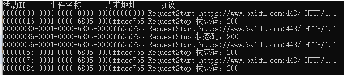

# 编写诊断工具收集器

.NET 中有  dotnet-trace、dotnet-counters 等工具，那么这些工具是怎么实现的呢？

首先将此类工具分为收集器和诊断器两种类型。如果只是在程序内收集自己的信息，那么就是简单的收集。


在 `System.Net.Http` 包中，有着跟 http 请求相关的接口，例如 HttpClient ，`System.Net.Http` 也内置了一些事件，记录 HTTP 请求信息，列举部分 Http 事件如下：

| 事件名称              | 说明              |
| :-------------------- | :---------------- |
| RequestStart          | HTTP 请求已启动。 |
| RequestStop           | HTTP 请求已完成。 |
| RequestFailed         | HTTP 请求失败。   |
| ConnectionEstablished | HTTP 连接已建立。 |
| ConnectionClosed      | HTTP 连接已关闭。 |


那么，我们编写一个 HttpClient 程序，然后编写一个监听器监听程序发出的所有 Http 请求并记录状态码。

示例代码在 Demo2.ESTrace 中。

```csharp
    public static class Program
    {
        public static async Task Main(string[] args)
        {
            // 由 CLR 自动调用
            HttpClientEventListener listener = new ();

            Console.WriteLine("活动ID ---- 事件名称 ---- 请求地址 ---- 协议");
            while (true)
            {
                await GetAsync();
                await Task.Delay(1000);
            }
        }

        static async Task GetAsync()
        {
            await new HttpClient().GetAsync("https://www.baidu.com");
        }
    }
    
    // 只监听 System.Net.Http 事件源的监听器
    sealed class HttpClientEventListener : EventListener
    {
        protected override void OnEventSourceCreated(EventSource eventSource)
        {
            switch (eventSource.Name)
            {
                case "System.Net.Http":
                    EnableEvents(eventSource, EventLevel.Informational, EventKeywords.All);
                    break;
            }

            base.OnEventSourceCreated(eventSource);
        }

        protected override void OnEventWritten(EventWrittenEventArgs eventData)
        {
            // RequestStart 事件
            if (eventData.EventId == 1)
            {
                var scheme = (string)eventData.Payload[0];
                var host = (string)eventData.Payload[1];
                var port = (int)eventData.Payload[2];
                var pathAndQuery = (string)eventData.Payload[3];
                var versionMajor = (byte)eventData.Payload[4];
                var versionMinor = (byte)eventData.Payload[5];
                var policy = (HttpVersionPolicy)eventData.Payload[6];

                Console.WriteLine($"{eventData.ActivityId} {eventData.EventName} {scheme}://{host}:{port}{pathAndQuery} HTTP/{versionMajor}.{versionMinor}");
            }
            // RequestStop 事件
            else if (eventData.EventId == 2)
            {
                Console.WriteLine($"{eventData.ActivityId} {eventData.EventName} 状态码：{eventData.Payload[0]}");
            }
        }
    }
```

运行之后在控制台中可以看到事件信息。



此外，通过 Visual Studio 的诊断工具也可以看到相关的事件，或者使用 dotnet-trace 工具进行收集。


当然，当前使用的监听器还只能收集自身进程内的事件，在前面我们使用的 dotnet-trace、dotnet-counters 是如何通过跨进程收集的呢？接下来我们学习如何编写一个跨进程收集信息的诊断工具。

