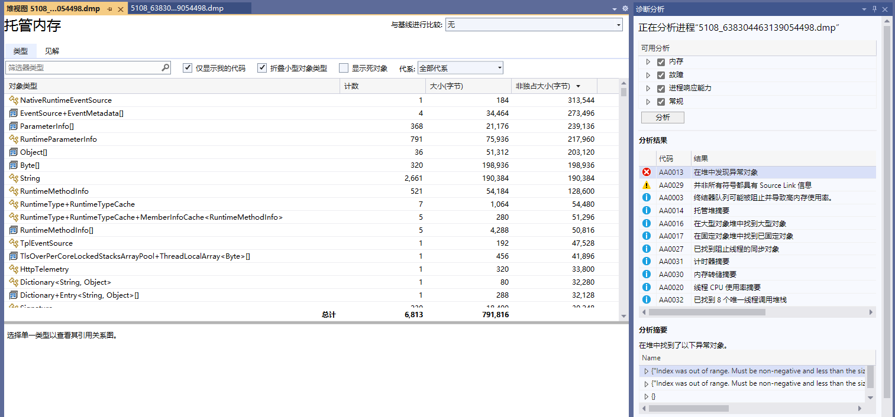

# 编写诊断工具

##### 编写诊断工具

dotnet CLI 工具很多，除了前面提到的 dotnet-trace、dotnet-counters ，还有 dotnet-dump、dotnet-gcdump 等 CLI 工具，都可以通过跨进程的方式收集程序的信息。在本小节中，我们通过诊断工具包实现跨进程收集信息，实现 类似的工具。


写一个简单的控制台程序并启动：

```csharp
        private static readonly HttpClient Http = new();
        public static async Task Main(string[] args)
        {
            while (true)
            {
                await Http.GetAsync("https://www.baidu.com");
                await Task.Delay(1000);
                GC.Collect();
            }
        }
```


然后编写一个诊断工具，示例项目在 Demo2.Diagnostics 中。

创建一个控制台，引入两个包：

```csharp
  <ItemGroup>
    <PackageReference Include="Microsoft.Diagnostics.NETCore.Client" Version="0.2.442301" />
    <PackageReference Include="Microsoft.Diagnostics.Tracing.TraceEvent" Version="3.1.5" />
  </ItemGroup>
```


编写一个订阅事件信息的程序：

```csharp
    internal class Program
    {
        static void Main(string[] args)
        {
            // 获取所有 .NET 进程
            var processes = DiagnosticsClient.GetPublishedProcesses()
                .Select(Process.GetProcessById)
                .Where(process => process != null);
            Console.WriteLine("请输入进程 id");
            foreach (var item in processes)
            {
                Console.WriteLine($"{item.Id} ------ {item.ProcessName}");
            }

            var read = Console.ReadLine();
            ArgumentNullException.ThrowIfNullOrEmpty(read);
            var pid = int.Parse(read);

            var providers = new List<EventPipeProvider>()
            {
                new ("Microsoft-Windows-DotNETRuntime", EventLevel.Informational, (long)ClrTraceEventParser.Keywords.GC),
            };

            var client = new DiagnosticsClient(pid);

            using var session = client.StartEventPipeSession(providers: providers, requestRundown: false, circularBufferMB: 256);
            var source = new EventPipeEventSource(session.EventStream);

            // CLR 事件
            source.Clr.All += (TraceEvent obj) =>
            {
                Console.WriteLine(obj.ToString());
            };

            // 订阅 providers 中监听的所有事件
            // 如果想订阅全部事件，则应该则使用 Dynamic.All
            //source.AllEvents += (TraceEvent obj) =>
            //{
            //    Console.WriteLine(obj.ToString());
            //};

            // 内核事件
            //source.Kernel.All += (TraceEvent obj) =>
            //{
            //    Console.WriteLine(obj.ToString());
            //};

            // 动态处理所有事件
            //source.Dynamic.All += (TraceEvent obj) =>
            //{
            //    Console.WriteLine(obj.ToString());
            //};

            // 通常在 Debug 下使用，
            // 当一个事件没有被订阅处理时，将会使用此事件处理
            //source.UnhandledEvents += (TraceEvent obj) =>
            //{
            //    Console.WriteLine(obj.ToString());
            //};


            try
            {
                // 监听进程
                source.Process();
            }
            catch (Exception e)
            {
                Console.WriteLine(e.ToString());
            }
        }
    }
```


接着启动 Demo2.Diagnostics，输入控制台的进程号，即可考察到监听的进程 GC 事件。


我们也可以做一个像 dotnet-dump 的工具，截取进程快照。


```csharp
    static async Task Main()
    {
        var processes = DiagnosticsClient.GetPublishedProcesses()
        .Select(Process.GetProcessById)
        .Where(process => process != null);
        Console.WriteLine("请输入进程 id");
        foreach (var item in processes)
        {
            Console.WriteLine($"{item.Id} ------ {item.ProcessName}");
        }

        var read = Console.ReadLine();
        ArgumentNullException.ThrowIfNullOrEmpty(read);
        var pid = int.Parse(read);

        var client = new DiagnosticsClient(pid);
        await client.WriteDumpAsync(
            dumpType: DumpType.Full,
            dumpPath: $"D:/{pid}_{DateTime.Now.Ticks}.dmp",
            logDumpGeneration: true,
            token: CancellationToken.None
        );
    }
```


然后使用 Visual Studio 打开 .dmp 文件，可以看到很多快照信息。





> 已经介绍了 System.Diagnostics 中的接口，以及介绍了部分 .NET CLI 工具的使用方法，因此不单独介绍 dotnet-gcdump、dotnet-dump 等诊断工具，读者可根据需要阅读官方文档。
> https://learn.microsoft.com/en-us/dotnet/core/diagnostics/microsoft-diagnostics-netcore-client


目前，很多 C# 语言编写的可观测性框架是基于 System.Diagnostics、Microsoft.Diagnostics 的，由于本书不涉及微服务，因此对于这类框架在 C# 程序中的原理不再赘述，请参考官方文档。