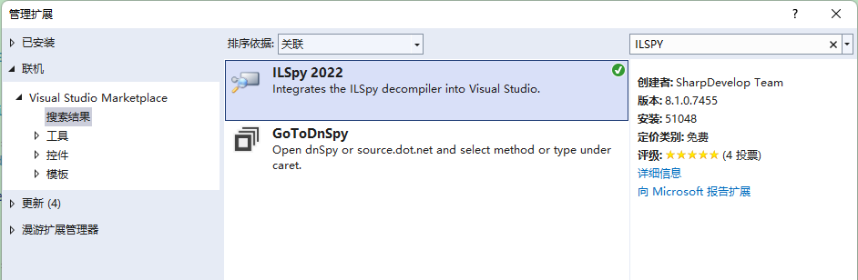
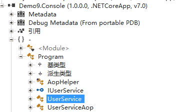
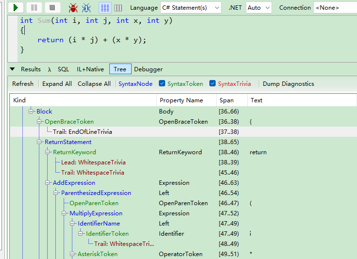
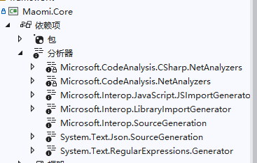

# 动态代码

C# 中实现动态代码的方式有很多，比如 反射、表达式树、EMIT、Roslyn、Source Generators 等，C# 各类框架中几乎都有动态代码技术的使用，比如依赖注入、对象关系映射、AOP 技术等。由于动态代码技术在 C# 中的使用场景非常广泛，因此在本章中，笔者将会介绍多种动态代码技术，以及完成部分实践，完成常见几种框架技术的编写方法。

阅读本章内容之前，需要读者熟练掌握反射技术，需要学习反射技术，可以参考笔者的在线电子书课程： https://reflect.whuanle.cn/


## EMIT

EMIT 是一种使用 C# 编排生成 IL 代码的技术，IL 是 .NET 平台的中间语言，由于 IL 的高性能的特点，很多框架都使用 EMIT 技术动态生成代码，最广泛的使用是编写 AOP 框架。在本节中，笔者将会介绍 AOP 的实现原理，以及使用 EMIT 编写一个简单的 AOP 程序。

创建控制台项目，引入 `CZGL.AOP` 包，示例代码请参考 Demo.CZGLAOP 项目。


有以下接口和类型：

```csharp
public interface ITest
{
    void MyMethod();
}
public class Test : ITest
{
    public virtual string A { get; set; }
    public Test()
    {
        Console.WriteLine("构造函数没问题");
    }
    public virtual void MyMethod()
    {
        Console.WriteLine("运行中");
    }
}
```


我们希望，在执行 MyMethod 方法时，能够在执行前后打印出日志，这时可以先编写一个特性类，继承 ActionAttribute ，实现 Before 和 After 接口。

```csharp
public class LogAttribute : ActionAttribute
{
    public override void Before(AspectContext context)
    {
        Console.WriteLine("--执行前--");
    }

    public override object After(AspectContext context)
    {
        Console.WriteLine("--执行后--");
        if (context.IsMethod)
            return context.MethodResult;
        else if (context.IsProperty)
            return context.PropertyValue;
        return null;
    }
}
```


然后改造 Test 类型。

```csharp
[Interceptor]
public class Test : ITest
{
    [Log]
    public virtual string A { get; set; }
    public Test()
    {
        Console.WriteLine("构造函数");
    }
    [Log]
    public virtual void MyMethod()
    {
        Console.WriteLine("运行中");
    }
}
```


然后创建 AOP 类型：

```csharp
ITest test1 = AopInterceptor.CreateProxyOfInterface<ITest, Test>();
test1.MyMethod();
Test test2 = AopInterceptor.CreateProxyOfClass<Test>();
test2.MyMethod();
```


运行项目，会输出：

```csharp
构造函数
--执行前--
运行中
--执行后--
构造函数
--执行前--
运行中
```


### AOP 实现原理

AOP(Aspect-oriented Programming) 即面向切片编程，在 C# 中有动态 AOP 和静态 AOP 两种，如果是在程序启动后生成的，为动态 AOP，这类框架有 Castle 、AspectCore 等，它们都使用了 EMIT 技术，在代码编译时即生成的，为静态 AOP，这类框架有 Fody 等。


### 实现 AOP 的前提

请看如下所示的代码，当调用 `Voice()` 方法时，请思考控制台会打印什么内容。

```csharp
public class Program
{
    static void Main()
    {
        Animal c = new Cat();
        Console.WriteLine(c.Voice());
    }

	public abstract class Animal
	{
		public string Voice() => "null";
	}

    public class Cat: Animal
    {
        public new string Voice() => "喵";
    }
}
```


如果你有运行代码，会发现打印结果是 `null`，虽然 c 是 Cat 类型，但是这里我们使用的是 Animal 类型，CLR 首先判断 Voice 方法是否为抽象方法或虚方法，如果不是则直接调用，不会往子类中查找。

我们使用工具查看Animal 中 Voice 方法的 IL 代码：

```csharp
// Methods
.method public hidebysig 
        instance string Voice () cil managed 
```


那么，同样的代码，在 java 中，又会发生什么呢？

```java
public class Main {
    public static void main(String[] args) {
       Animal animal = new Cat();
       System.out.println(animal.Voice());
    }
}


class Animal{
    public String Voice(){
    return "null";
    }
}

class Cat extends Animal{
    public String Voice(){
    return "喵";
    }
}
```


运行这段代码后会发现，打印出来的是 `喵`。因为 java 中的方法默认是虚方法，而 C# 中的 方法需要加上关键字 virtual 才是虚方法。


为了能够在使用父类方法时，执行的是子类的代码，我们需要将代码改成：

```csharp
public abstract class Animal
{
	public virtual string Voice() => "null";
}

public class Cat : Animal
{
	public override string Voice() => "喵";
}
// Methods
   .method public hidebysig newslot virtual 
           instance string Voice () cil managed 
```


那么，虚方法跟实现 AOP 有啥关系呢？其实，使用 EMIT 技术编写 AOP 框架的思路很简单，那就是继承，比如我们要给 A 类型的 A 方法实现 AOP，那么 A 方法就必须得是抽象方法或虚方法，然后我们通过 EMIT 技术生成一个类型 B 继承 A，然后创建 A 类型时实际上创建的是 B 类型。此时，调用 A 中的 A 方法，CLR 会执行 B 中的 A 方法。

```
A a = new B();
```


在使用 EMIT 技术实现 AOP 之前，我们可以通过容器依赖注入来领会 AOP 是如何通过继承实现的。


有个 UserService 服务，实现了登录过程。

```csharp
public class UserService
{
	public virtual bool Login(string name, string passeword)
	{
		return true;
	}
}
```


然后我们使用一个新的类型重写 Login 方法，在执行方法之前和之后打印日志。

```csharp
public class UserServiceAop : UserService
{
	public override bool Login(string name, string passeword)
	{
		Console.WriteLine($"用户开始登录：{name}");
		var result = base.Login(name, passeword);
		Console.WriteLine($"用户 {name} 登录结果 {result}");
		return result;
	}
}
```


然后通过注入服务实现 AOP：

```csharp
IServiceCollection ioc = new ServiceCollection();
ioc.AddScoped<UserService, UserServiceAop>();
var services = ioc.BuildServiceProvider();

var userService = services.GetRequiredService<UserService>();
userService.Login("工良", "123456");
```


如果需要 AOP 的是接口，那就更加简单，我们只需要生成一个继承接口的类型即可，完全不需要继承父类，而父类也不需要标记为虚方法或抽象方法。

```csharp
public interface IUserService
{
	bool Login(string name, string passeword);
}

public class UserService : IUserService
{
	public bool Login(string name, string passeword)
	{
		return true;
	}
}

public class UserServiceAop : IUserService
{
	private readonly UserService _service;
	public UserServiceAop()
	{
		_service = new UserService();
	}
	public bool Login(string name, string passeword)
	{
		Console.WriteLine($"用户开始登录：{name}");
		var result = _service.Login(name, passeword);
		Console.WriteLine($"用户 {name} 登录结果 {result}");
		return result;
	}
}

IServiceCollection ioc = new ServiceCollection();
ioc.AddScoped<IUserService, UserServiceAop>();
var services = ioc.BuildServiceProvider();

var userService = services.GetRequiredService<IUserService>();
userService.Login("工良", "123456");
```


实际上，接口方法本身就是抽象方法，所以因此无需处理接口即可直接使用 AOP 生成代理类型。

```csharp
// Methods
   .method public hidebysig newslot abstract virtual 
           instance bool Login (
                string name,
                string passeword
            ) cil managed 
        {
        } // end of method IUserService::Login
```


通过这个例子你应该可以领会到使用 EMIT 技术实现 AOP ，最基础最本质的是实现一个新的类型基础父类或接口。由于 AOP 的类型是动态生成的，我们在开发是无法创建，所以 AOP 一般需要结合 IOC 使用，我们可以拦截容器中的 `<IUserService, UserService>`，替换成 `<IUserService, UserServiceAop>`。或者提供一个工厂服务，用于获取 AOP 后的对象。


### EMIT 实现 AOP

本节代码可以在 Demo8.Console、Demo8.FxConsole 中查看。

ILSpy 是一个反编译工具，能够帮助我们查看代码生成的 IL，这样一来，即使我们对 IL 不熟悉，也可以通过编译好的 IL 代码中抄过来。

在 Visual Studio 中 安装扩展 ILSpy ，安装或手动下载(https://github.com/icsharpcode/ILSpy)。




创建一个项目，然后创建接口和类型。

```csharp
public interface IUserService
{
	bool Login(string name, string passeword);
}

public class UserService : IUserService
{
	public bool Login(string name, string passeword)
	{
		return true;
	}
}
public class UserServiceAop : IUserService
{
	private readonly UserService _service;
	public UserServiceAop()
	{
		_service = new UserService();
	}
	public bool Login(string name, string passeword)
	{
		Console.WriteLine($"用户开始登录：{name}");
		var result = _service.Login(name, passeword);
		Console.WriteLine($"用户 {name} 登录结果 {result}");
		return result;
	}
}
```

然后编译项目生成 dll 文件，将 Demo8.Console.dll 拖动放到 ILSpy 中，你可以查看到 UserServiceAop 的全部 IL 代码，我们只需要抄即可！




接下来，我们开始使用 EMIT 技术，动态生成一个 UserServiceAop 类型。


首先是动态构建程序集并创建一个新的类型。

```csharp
public static Assembly Build()
{
	// 构建运行时程序集
	AssemblyName assemblyName = new AssemblyName("AopTmp");
	assemblyName.SetPublicKeyToken(new Guid().ToByteArray());
	AssemblyBuilder assBuilder = AssemblyBuilder.DefineDynamicAssembly(assemblyName, AssemblyBuilderAccess.RunAndCollect);

	// 构建模块
	ModuleBuilder moduleBuilder = assBuilder.DefineDynamicModule(assemblyName.Name);
	/// 构建类型，命名空间+类名
	TypeBuilder typeBuilder = moduleBuilder.DefineType("Aop.UserServiceAop",
		TypeAttributes.Public, parent: null, interfaces: typeof(UserService).GetInterfaces());
	// 构建字段
	// field private initonly class Program/UserService _service
	var fieldBuilder = typeBuilder.DefineField("_service", typeof(UserService), FieldAttributes.Private | FieldAttributes.InitOnly);

	BuildCtor(typeBuilder, fieldBuilder);
	BuildMethod(typeBuilder, fieldBuilder);
	var type = typeBuilder.CreateType();
	return assBuilder;
}
```


创建类型后，首先给类型添加构造函数。

```csharp
private static void BuildCtor(TypeBuilder typeBuilder, FieldBuilder fieldBuilder)
{
	// 构造函数
	// .method public hidebysig specialname rtspecialname 
	var ctorBuilder = typeBuilder.DefineConstructor(MethodAttributes.Public,
		CallingConventions.Standard,
		Type.EmptyTypes);
	var il = ctorBuilder.GetILGenerator();
	//  _service = new UserService();
	il.Emit(OpCodes.Ldarg_0);
	il.Emit(OpCodes.Newobj, typeof(UserService).GetConstructors()[0]);
	il.Emit(OpCodes.Stfld, fieldBuilder);
	il.Emit(OpCodes.Ret);
}
```


然后生成 `Login` 方法。

```csharp
private static void BuildMethod(TypeBuilder typeBuilder, FieldBuilder fieldBuilder)
{
	var baseMethod = typeof(UserService).GetMethod("Login");
	// .method public final hidebysig newslot virtual 
	var methodBuilder = typeBuilder.DefineMethod(baseMethod.Name,
		baseMethod.Attributes,
		baseMethod.CallingConvention,
		// 返回值和参数
		baseMethod.ReturnType, baseMethod.GetParameters().Select(x => x.ParameterType).ToArray());
	var sType = typeof(DefaultInterpolatedStringHandler);

	ILGenerator il = methodBuilder.GetILGenerator();

	// 定义本地变量
	il.DeclareLocal(typeof(bool));
	il.DeclareLocal(sType);

	// Console.WriteLine("用户开始登录：" + name);
	il.Emit(OpCodes.Ldstr, "用户开始登录: ");
	il.Emit(OpCodes.Ldarg_1);
	il.Emit(OpCodes.Call, typeof(String).GetMethod("Concat", new Type[] { typeof(string), typeof(string) }));
	il.Emit(OpCodes.Call, typeof(Console).GetMethod("WriteLine", new Type[] { typeof(string) }));

	// bool result = _service.Login(name, passeword);
	il.Emit(OpCodes.Ldarg_0);
	il.Emit(OpCodes.Ldfld, fieldBuilder);
	il.Emit(OpCodes.Ldarg_1);
	il.Emit(OpCodes.Ldarg_2);
	il.Emit(OpCodes.Callvirt, baseMethod);
	il.Emit(OpCodes.Stloc_0);

	// Console.WriteLine($"用户 {name} 登录结果 {result}");
	// DefaultInterpolatedStringHandler defaultInterpolatedStringHandler = new DefaultInterpolatedStringHandler(9, 2);
	il.Emit(OpCodes.Ldloca_S, 1);
	il.Emit(OpCodes.Ldc_I4_S, 9);
	il.Emit(OpCodes.Ldc_I4_2);
	il.Emit(OpCodes.Call, sType.GetConstructor(new Type[] { typeof(int), typeof(int) }));
	// defaultInterpolatedStringHandler.AppendLiteral("用户 ");
	il.Emit(OpCodes.Ldloca_S, 1);
	il.Emit(OpCodes.Ldstr, "用户: ");
	il.Emit(OpCodes.Call, sType.GetMethod("AppendLiteral", new Type[] { typeof(string) }));
	// defaultInterpolatedStringHandler.AppendFormatted(name);
	il.Emit(OpCodes.Ldloca_S, 1);
	il.Emit(OpCodes.Ldarg_1);
	il.Emit(OpCodes.Call, sType.GetMethod("AppendFormatted", new Type[] { typeof(string) }));
	// defaultInterpolatedStringHandler.AppendLiteral(" 登录结果 ");
	il.Emit(OpCodes.Ldloca_S, 1);
	il.Emit(OpCodes.Ldstr, " ,登录结果: ");
	il.Emit(OpCodes.Call, sType.GetMethod("AppendLiteral", new Type[] { typeof(string) }));
	// defaultInterpolatedStringHandler.AppendFormatted(result); AppendFormatted<bool>(result)
	il.Emit(OpCodes.Ldloca_S, 1);
	il.Emit(OpCodes.Ldloc_0);
	il.Emit(OpCodes.Call, sType.GetMethods()
		.FirstOrDefault(x => x.Name == "AppendFormatted" && x.IsGenericMethod && x.GetParameters().Length == 1).MakeGenericMethod(typeof(bool)));
	// Console.WriteLine(defaultInterpolatedStringHandler.ToStringAndClear());
	il.Emit(OpCodes.Ldloca_S, 1);
	il.Emit(OpCodes.Call, sType.GetMethod("ToStringAndClear", Type.EmptyTypes));
	il.Emit(OpCodes.Call, typeof(Console).GetMethod("WriteLine", new Type[] { typeof(string) }));
	// return result;
	il.Emit(OpCodes.Ldloc_0);
	il.Emit(OpCodes.Ret);
}
```


最后通过依赖注入添加服务：

```csharp
static void Main()
{
	var assembly = AopHelper.Build();
	var newType = assembly.GetType("Aop.UserServiceAop");

	IServiceCollection ioc = new ServiceCollection();
	ioc.Add(new ServiceDescriptor(typeof(IUserService), newType, ServiceLifetime.Scoped));
	var services = ioc.BuildServiceProvider();

	var userService = services.GetRequiredService<IUserService>();
	userService.Login("工良", "123456");
}
```


到目前为止，我们已经介绍了如何使用 EMIT 动态生成一个新的类型，我们的例子仅仅是针对 IUserService 生成一个 UserServiceAop 类型，。


## 表达式树

表达式树的应用很广泛，表达式树的使用方法主要分为两种情况，生成动态代码执行，比如延迟查询、yeild return，第二种是解析表达式，比如编写 ORM 框架。


### 表达式树生成

笔者写过表达式树系列的教程，欢迎阅读 https://ex.whuanle.cn/

表达式树是程序运行时动态生成代码的一种方法，通过定义各种表达式来组合代码逻辑，最后编译执行。

在第八章中，编写事件总线方法时，我们就使用了表达式树组装方法，以便将不同形式的方法统一起来。


比如，有以下代码。

```csharp
int Sum(int i, int j, int x, int y)
{
	return (i * j) + (x * y);
}
```


如果我们需要使用表达式树的形式编写该逻辑，示例代码如下：

```csharp
ParameterExpression a = Expression.Parameter(typeof(int), "i");
ParameterExpression b = Expression.Parameter(typeof(int), "j");

Expression r1 = Expression.Multiply(a, b);      //乘法运行
ParameterExpression c = Expression.Parameter(typeof(int), "x");
ParameterExpression d = Expression.Parameter(typeof(int), "y");
Expression r2 = Expression.Multiply(c, d);      //乘法运行

Expression result = Expression.Add(r1, r2);     //相加
```


为了使用表达式树表示代码，需要将表达式树做得很复杂，需要表达常量变量，逻辑运算、条件控制、循环控制等等，还要访问变量的字段、属性、方法等。

笔者将表达式树的学习分为以下部分：

* 变量、常量、赋值
* 运算符
* 条件控制
* 循环控制
* 对象、泛型、集合和实例化
* 访问对象成员，字段、属性、函数


表达式树主要分为三个逻辑，其中最重要的是组合表达式树，然后是编译、执行。


由于表达式树的本身很复杂，因此，本书只是简单介绍表达式树如何使用，以及使用场景，只需要掌握简单的表达式树编写即可，以便理解后面的表达式树如何进行解析。


如果我们碰到需要编写表达式树的场景，我们可以像编写 AOP 一样，首先简化 C# 代码，然后借助工具先查出这段 C# 代码生成的表达式树的大概写法，然后再借鉴这些表达式树到项目当中。

比如，我们可以使用 LinqPad ，首先将需要生成表达式树的代码放到编辑器中，然后查看该代码对应的表达式树。




#### 变量常量和赋值

在 C# 中，变量分为以下几种类型：

- 值类型（Value types）
- 引用类型（Reference types）
- 指针类型（Pointer types）

一般上，只用到值类型和引用类型，这里不会说到指针类型。


创建一个变量：

```csharp
ParameterExpression varA = Expression.Variable(typeof(int), "x");
```

创建一个函数参数：

```csharp
ParameterExpression varB = Expression.Parameter(typeof(int), "y");
```

创建一个常量：

```csharp
ConstantExpression constant = Expression.Constant(100);
ConstantExpression constant1 = Expression.Constant(100, typeof(int));
```


#### 逻辑运算

在 C# 中，算术运算符，有以下类型

- 算术运算符
- 关系运算符
- 逻辑运算符
- 位运算符
- 赋值运算符
- 其他运算符

由于 C# 中的运算符非常多，笔者就不一一介绍了，推荐读者阅读  https://ex.whuanle.cn/4.operator.html

比如，要将两个 int 类型的变量相加或相减，可以使用 `Expression.Add` 和 `Expression.Subtract`。

```c#
ParameterExpression a = Expression.Parameter(typeof(int), "a");
ParameterExpression b = Expression.Parameter(typeof(int), "b");

// = a + b
BinaryExpression ab = Expression.Add(a, b);
// = a - b
BinaryExpression ab = Expression.Subtract(a, b);
```


#### 调用方法

`Expression.Call` 是表达式树种调用类型方法的接口，其定义如下：

```csharp
static MethodCallExpression Call(Expression? instance, MethodInfo method, params Expression[]? arguments)
```

有如下 C# 代码：

```csharp
int a = 100;
int b = 200;

var ab = a + b;
Console.WriteLine(ab);
```


使用表达式树调用 `Console.WriteLine()` 静态方法打印信息：

```csharp
ParameterExpression a = Expression.Parameter(typeof(int), "a");
ParameterExpression b = Expression.Parameter(typeof(int), "b");

// ab = a + b
BinaryExpression ab = Expression.Add(a, b);

// 打印 a + b 的值
MethodCallExpression method = Expression.Call(null, typeof(Console).GetMethod("WriteLine", new Type[] { typeof(int) }), ab);
```


`Expression.Call` 也可以调用实例的方法：

```csharp
public class Test
{
	public void Print(string info)
	{
		Console.WriteLine(info);
	}
}

Test test = new Test();
test.Print("打印出来");
```

```csharp
// Test test
ParameterExpression test = Expression.Variable(typeof(Test), "test");

// test.Print("打印出来");
MethodCallExpression method = Expression.Call(
	test,
	typeof(Test).GetMethod("Print", new Type[] { typeof(string) }),
	Expression.Constant("打印出来")
	);

// 编译生成并执行
Expression<Action<Test>> lambda = Expression.Lambda<Action<Test>>(method, test);
lambda.Compile()(new Test());
```


### 编写对象映射框架

示例代码请参考 Demo8.Mapper 项目。


```csharp
// 利用泛型缓存，提升访问速度，以及简化缓存结构
public static class TypeMembers<TTarget>
        where TTarget : class
{
    private static readonly MemberInfo[] MemberInfos;

    public static MemberInfo[] Members => MemberInfos;
    static TypeMembers()
    {
        MemberInfos = typeof(TTarget)
        .GetMembers(BindingFlags.Instance | BindingFlags.Public | BindingFlags.NonPublic)
        .Where(x => (x is FieldInfo) || (x is PropertyInfo)).ToArray();
    }
}
```


```csharp
public class MapperBuilder<TSource, TTarget>
        where TSource : class
        where TTarget : class, new()
{
    // 生成的值映射委托
    private Delegate? MapDelegate;

    // 缓存用户自定义映射委托
    private readonly Dictionary<MemberInfo, Delegate> MapExpressions = new();
}
```

```
var builder = new MapperBuilder<A, B>();
```


```csharp
public class A
{
	public string C { get; set; }
	public int D { get; set; }
}
public class B
{
	public string C { get; set; }
	public string D { get; set; }
}

// b.D = a.D.ToString()
builder.Set(a => a.D.ToString(), b => b.D);
// 构建关系映射
builder.Build();
```


```csharp
// 单独设置表达式赋值
public MapperBuilder<TSource, TTarget> Set<TValue, TField>(Func<TSource, TValue> buildValue,
Expression<Func<TTarget, TField>> targetField)
{
	MemberInfo p = GetMember(targetField);
	MapExpressions[p] = buildValue;
	return this;
}

// 从表达式中识别出对象的成员名称。
// 如 (a => a.Value) ，解析出 Value
private MemberInfo GetMember<TField>(Expression<Func<TTarget, TField>> field)
{
	var body = field.Body;

	string name = "";

	// 提取 (a=> a.Value)
	if (body is MemberExpression memberExpression)
	{
		MemberInfo member = memberExpression.Member;
		name = member.Name;
	}
	// 提取 (a=> a.Value)
	else if (body is ParameterExpression parameterExpression)
	{
		name = parameterExpression.Name ?? "-";
	}
	// 提取 (a=> "Value") 字符串表达式
	else if (body is ConstantExpression constantExpression)
	{
		name = constantExpression.Value?.ToString() ?? "-";
	}
	else
	{
		throw new KeyNotFoundException($"{typeof(TTarget).Name} 中不存在名为 {body.ToString()} 的字段或属性，请检查表达式！");
	}

	var p = TypeMembers<TTarget>.Members.FirstOrDefault(x => x.Name == name);
	if (p == null)
	{
		throw new KeyNotFoundException($"{typeof(TTarget).Name} 中不存在名为 {body.ToString()} 的字段或属性，请检查表达式！");
	}

	return p;
}
```

```csharp
// 构建对象映射
public void Build()
{
	List<Expression> exList = new List<Expression>();

	// TSource a;
	// TTarget b;
	ParameterExpression sourceParameter = Expression.Parameter(typeof(TSource), "_a");
	ParameterExpression targetParameter = Expression.Parameter(typeof(TTarget), "_b");

	foreach (var item in TypeMembers<TTarget>.Members)
	{
		// 如果用户设置了自定义赋值表达式
		if (MapExpressions.TryGetValue(item, out var @delegate))
		{
			exList.Add(BuildAssign(sourceParameter, targetParameter, item, @delegate));
			continue;
		}
		if (item is FieldInfo field)
		{
			// 忽略属性的私有字段
			if (item.Name.EndsWith(">k__BackingField")) continue;

			Expression assignDel = MapFieldOrProperty(sourceParameter, targetParameter, field);
			exList.Add(assignDel);
		}
		else if (item is PropertyInfo property)
		{
			if (!property.CanWrite) continue;
			Expression assignDel = MapFieldOrProperty(sourceParameter, targetParameter, property);
			exList.Add(assignDel);
		}
	}

	var block = Expression.Block(exList);
	var del = Expression.Lambda(block, sourceParameter, targetParameter).Compile();
	MapDelegate = del;
}

// 构建映射表达式
private Expression BuildAssign(ParameterExpression sourceParameter, ParameterExpression targetParameter, MemberInfo memberInfo, Delegate @delegate)
{
	// b.Value
	MemberExpression targetMember;
	if (memberInfo is FieldInfo field)
	{
		targetMember = Expression.Field(targetParameter, field);
	}
	else if (memberInfo is PropertyInfo property)
	{
		targetMember = Expression.Property(targetParameter, property);
	}
	else
	{
		throw new InvalidCastException($"{memberInfo.DeclaringType?.Name}.{memberInfo.Name} 不是字段或属性");
	}

	// 调用用户自定义委托
	var instance = Expression.Constant(@delegate.Target);
	MethodCallExpression delegateCall = Expression.Call(instance, @delegate.Method, sourceParameter);
	// b.Value = @delegate.DynamicInvoke(a);
	BinaryExpression assign = Expression.Assign(targetMember, delegateCall);
	return assign;
}

// 默认字段映射规则，根据同名字段或属性赋值
private Expression MapFieldOrProperty(ParameterExpression sourceParameter, ParameterExpression targetParameter, MemberInfo targetField)
{
	// b.Value
	MemberExpression targetMember;
	Type targetFieldType;
	{
		if (targetField is FieldInfo fieldInfo)
		{
			targetFieldType = fieldInfo.FieldType;
			targetMember = Expression.Field(targetParameter, fieldInfo);
		}
		else if (targetField is PropertyInfo propertyInfo)
		{
			targetFieldType = propertyInfo.PropertyType;
			targetMember = Expression.Property(targetParameter, propertyInfo);
		}
		else
		{
			throw new InvalidCastException(
				$"框架处理出错，请提交 Issue！ {typeof(TTarget).Name}.{targetField.Name} 既不是字段也不是属性");
		}
	}

	var sourceField = typeof(TSource).GetMember(targetField.Name, BindingFlags.Instance | BindingFlags.Public | BindingFlags.NonPublic).FirstOrDefault();

	// 在 TSource 中搜索不到对应字段时，b.Value 使用默认值
	if (sourceField == null)
	{
		// 生成表达式 b.Value = default;
		return Expression.Assign(targetMember, Expression.Default(targetFieldType));
	}

	MemberExpression sourceMember;
	Type sourceFieldType;
	{
		if (sourceField is FieldInfo fieldInfo)
		{
			sourceFieldType = fieldInfo.FieldType;
			sourceMember = Expression.Field(sourceParameter, fieldInfo);
		}
		else if (sourceField is PropertyInfo propertyInfo)
		{
			sourceFieldType = propertyInfo.PropertyType;
			sourceMember = Expression.Property(sourceParameter, propertyInfo);
		}
		else
		{
			throw new InvalidCastException(
				$"框架处理出错，请提交 Issue！ {typeof(TSource).Name}.{sourceField.Name} 既不是字段也不是属性");
		}
	}

	if (targetFieldType != sourceFieldType)
		throw new InvalidCastException(
					$"类型不一致！ {typeof(TSource).Name}.{sourceField.Name} 与 {typeof(TTarget).Name}.{targetField.Name}");

	// 生成表达式 b.Value = a.Value
	return Expression.Assign(targetMember, sourceMember);
}
```


完整使用示例：

```csharp
var builder = new MapperBuilder<A, B>();
// c.D = a.D.ToString()
builder.Set(a => a.D.ToString(), b => b.D);
builder.Build();

A a = new A()
{
	C = "C",
	D = 123
};
var b = builder.Map(a);
```


### 表达式树解析

日常业务开发少不了 ORM 框架，ORM 框架为我们的操作数据库代理了极大的便利，ORM 中也大量使用了表达式树技术，不过跟动态生成代码截然相反，ORM 使用的是解析表达式树。

本节讲解如何使用表达式树完成一个简单的 ORM 框架，示例代码请参考 Demo8.ORM 项目。


请在 mysql 数据库中执行以下 SQL，以便创建和插入表数据：

```sql
CREATE TABLE `Test`  (
  `Id` int NOT NULL,
  `Name` varchar(255) CHARACTER SET utf8mb4 COLLATE utf8mb4_0900_ai_ci NULL DEFAULT NULL,
  PRIMARY KEY (`Id`) USING BTREE
) ENGINE = InnoDB CHARACTER SET = utf8mb4 COLLATE = utf8mb4_0900_ai_ci ROW_FORMAT = Dynamic;


INSERT INTO `Test` VALUES (1, '工良');
INSERT INTO `Test` VALUES (2, '工良');
INSERT INTO `Test` VALUES (3, '工良');
INSERT INTO `Test` VALUES (4, '工良');
```


为了让示例项目更简单，该 ORM 只包含简单的查询功能。

使用示例：

````csharp
var context = new MyDBContext(connction);
var list = await context.Select<Test>()
.Where(x => x.Id >= 2 && x.Name.Contains("工良") && x.Id < 4)
.ToListAsync();
````


创建上下文类型 MyDBContext ：

```csharp
public class MyDBContext
{
    protected readonly IDbConnection _connction;
    public MyDBContext(IDbConnection connction)
    {
        _connction = connction;
    }

    public MyDBContext<T> Select<T>() where T : class, new()
    {
        return new MyDBContext<T>(_connction);
    }
}
```


泛型 `MyDBContext<T>` 用于构造和生成 SQL 语句：

```csharp
public class MyDBContext<T> : MyDBContext
    where T : class, new()
{
    public MyDBContext(IDbConnection connction) : base(connction)
    {
    }

    private readonly StringBuilder _strBuilder = new StringBuilder();

    public MyDBContext<T> Where(Expression<Func<T, bool>> predicate)
    {
        var bin = predicate.Body as BinaryExpression;
        ArgumentNullException.ThrowIfNull(bin);
        var content = $"{Parse(bin.Left)} {GetChar(bin.NodeType)} {Parse(bin.Right)}";
        _strBuilder.Append(content);
        return this;
    }

    // 解析条件
    private static string Parse(Expression ex)
    {
        if (ex is BinaryExpression bin)
        {
            ArgumentNullException.ThrowIfNull(bin);
            var left = bin.Left;
            var right = bin.Right;
            var content = $"{Parse(bin.Left)} {GetChar(bin.NodeType)} {Parse(bin.Right)}";
            return content;
        }
        else if (ex is MemberExpression p)
        {
            var name = $"`{p.Member.Name}`";
            return name;
        }
        else if (ex is ConstantExpression c)
        {
            var obj = c.Value;
            if (obj == null) return "null";
            var typeCode = TypeInfo.GetTypeCode(obj.GetType());
            if (typeCode == TypeCode.String) return $"'{obj.ToString()}'";
            return obj.ToString();
        }
        else if (ex is MethodCallExpression m)
        {
            if (m.Method.Name == "Contains")
            {
                return $"{Parse(m.Object)} like '%{Parse(m.Arguments.FirstOrDefault()).Trim('\'')}%'";
            }
        }
        throw new InvalidOperationException("不支持的表达式");
    }

    // 解析连接符
    private static string GetChar(ExpressionType type)
    {
        switch (type)
        {
            case ExpressionType.And: return "&";
            case ExpressionType.AndAlso: return "&&";
            case ExpressionType.Or: return "|";
            case ExpressionType.OrElse: return "||";
            case ExpressionType.Equal: return "=";
            case ExpressionType.NotEqual: return "!=";
            case ExpressionType.GreaterThan: return ">";
            case ExpressionType.GreaterThanOrEqual: return ">=";
            case ExpressionType.LessThan: return "<";
            case ExpressionType.LessThanOrEqual: return "<=";
        }
        throw new InvalidOperationException("不支持的表达式");
    }

    public async Task<List<T>> ToListAsync()
    {
        var sql = $"SELECT * FROM {typeof(T).Name} Where {_strBuilder.ToString()}";

        _connction.Open();
        var command = new MySqlCommand();
        command.Connection = _connction as MySqlConnection;
        command.CommandText = sql;

        var reader = await command.ExecuteReaderAsync();

        List<T> list = new List<T>();
        var ps = typeof(T).GetProperties();

        while (await reader.ReadAsync())
        {
            T t = new T();
            list.Add(t);
            for (int i = 0; i < ps.Length; i++)
            {
                var p = ps[i];
                object v = null;
                // 只处理一些简单的数据库类型
                switch (TypeInfo.GetTypeCode(p.PropertyType))
                {
                    case TypeCode.Int32: v = reader.GetInt32(i); break;
                    case TypeCode.Int64: v = reader.GetInt64(i); break;
                    case TypeCode.Double: v = reader.GetDouble(i); break;
                    case TypeCode.String: v = reader.GetString(i); break;
                    default: v = null; break;
                }
                p.SetValue(t, v);
            }
        }

        return list;
    }

    public async Task<T> FirstAsync()
    {
        return (await ToListAsync()).FirstOrDefault();
    }
}
```


通过 nuget 包引入 MySqlConnector，通过 `MyDBContext` 查询从数据库查询数据。


```csharp
public class Test
{
    public int Id { get; set; }

    public string Name { get; set; }
}

public class Program
{
    static async Task Main()
    {
        var builder = new MySqlConnectionStringBuilder
        {
            Server = "localhost:3306",
            Database = "test",
            UserID = "root",
            Password = "123456",
            SslMode = MySqlSslMode.Required,
        };
        IDbConnection connction = new MySqlConnection(builder.ConnectionString);

        var context = new MyDBContext(connction);
        var list = await context.Select<Test>()
        .Where(x => x.Id >= 2 && x.Name.Contains("工良") && x.Id < 4)
        .ToListAsync();
    }
}
```


## Roslyn

Roslyn 是一种用来编译代码和分析代码的技术，主要有两种使用方式，一种是动态编译代码，与 EMIT 技术不同的是， Roslyn 可以直接编译字符串代码，也可以编译完整的项目代码，而不需要 .NET SDK 或 MSBuild，国内有开发者利用 Natasha 技术编写了 Natasha 框架。另一种使用方式是作为代码分析器，使用非常广泛，.NET 5 以后的版本都自带了代码分析器，我们在 IDE 中可以看到。



在后面的章节中笔者会使用介绍如何编写一个代码分析器，所以在本章中，笔者只介绍如何使用 Roslyn 编译代码。

#### 使用 Roslyn

示例代码请参考 Demo8.Roslyn 项目。

首先通过 nuget 引入 Microsoft.CodeAnalysis.CSharp 包。

创建一个 DomainOptions 类型，用来存储编译程序集时的配置。

```csharp
public class DomainOptions
{

    // 当前要编译的程序集是何种类型的项目
    public OutputKind OutputKind { get; set; } = OutputKind.DynamicallyLinkedLibrary;

    // Debug 还是 Release
    public OptimizationLevel OptimizationLevel { get; set; } = OptimizationLevel.Release;

    // 是否允许使用不安全代码
    public bool AllowUnsafe { get; set; } = false;

    // 生成目标平台，如 X64、x86
    public Platform Platform { get; set; } = Platform.AnyCpu;

    // 是否检查边界
    public bool CheckOverflow { get; set; } = false;

    // 语言版本
    public LanguageVersion LanguageVersion { get; set; } = LanguageVersion.CSharp7_3;

    // 环境变量
    public HashSet<string> Environments { get; } = new HashSet<string>();
}
```


然后创建一个构造器，用来构造 DomainOptions 类型。

```csharp
// 程序集编译配置构建器
public class DomainOptionBuilder
{
    private readonly DomainOptions _option = new DomainOptions();
    internal LanguageVersion LanguageVersion => _option.LanguageVersion;
    internal string[] Environments => _option.Environments.ToArray();
    internal CSharpCompilationOptions Build()
    {
        if (_option.Environments.Count == 0)
        {
            _option.Environments.Add(_option.OptimizationLevel == OptimizationLevel.Debug ? "DEBUG" : "RESEALE");
        }

        return new CSharpCompilationOptions(
          concurrentBuild: true,
          metadataImportOptions: MetadataImportOptions.All,
          outputKind: _option.OutputKind,
          optimizationLevel: _option.OptimizationLevel,
          allowUnsafe: _option.AllowUnsafe,
          platform: _option.Platform,
          checkOverflow: _option.CheckOverflow,
          assemblyIdentityComparer: DesktopAssemblyIdentityComparer.Default);
    }

    // 程序集要编译成何种项目，比如控制台、桌面程序等，默认编译成动态库。
    public DomainOptionBuilder WithKind(OutputKind kind = OutputKind.DynamicallyLinkedLibrary)
    {
        _option.OutputKind = kind;
        return this;
    }

    // 配置程序集是否使用 DEBUG 条件编译，默认使用 RELEASE 编译程序
    public DomainOptionBuilder WithDebug(bool isDebug = false)
    {
        _option.OptimizationLevel = isDebug ? OptimizationLevel.Debug : OptimizationLevel.Release;
        return this;
    }

    // 是否允许项目使用不安全代码
    public DomainOptionBuilder WIthAllowUnsafe(bool isAllow = false)
    {
        _option.AllowUnsafe = isAllow;
        return this;
    }

    // 指定公共语言运行库（CLR）的哪个版本可以运行程序集，默认为可移植的
    public DomainOptionBuilder WithPlatform(Platform platform = Platform.AnyCpu)
    {
        _option.Platform = platform;
        return this;
    }

    // 是否在默认情况下强制执行整数算术的边界检查
    public DomainOptionBuilder WithCheckOverflow(bool checkOverflow = false)
    {
        _option.CheckOverflow = checkOverflow;
        return this;
    }

    // 要使用的语言版本，<para>如果直接通过代码生成，代码版本任意；如果通过 API 生成，目前项目的语法只考虑到 7.3
    public DomainOptionBuilder WithLanguageVersion(LanguageVersion version = LanguageVersion.CSharp7_3)
    {
        _option.LanguageVersion = version;
        return this;
    }


    // 编译条件字符串，#if 中使用到的条件编译，如 Debug 这些符号
    public DomainOptionBuilder WithEnvironment(params string[] environment)
    {
        foreach (var item in environment)
        {
            _option.Environments.Add(item);
        }

        return this;
    }
}
```


最后，编写一个编译器，用来编译代码成程序集。

```csharp
// 程序集编译构建器
public class CompilationBuilder
{
	/// 通过代码生成程序集
	// code:         字符串代码
	// assemblyPath: 程序集路径
	// assemblyName: 程序集名称
	// option:       程序集配置
	// messages:     编译时的消息
	public static bool CreateDomain(string code,
		string assemblyPath,
		string assemblyName,
		DomainOptionBuilder option,
		out ImmutableArray<Diagnostic> messages)
	{
		HashSet<PortableExecutableReference> references = new HashSet<PortableExecutableReference>();

		// 设置依赖的程序集列表，这里使用跟 Demo8.Roslyn 一样的依赖
		// 读者可以根据自己的需求添加
		var refAssemblys = AppDomain.CurrentDomain.GetAssemblies()
		   .Where(i => !i.IsDynamic && !string.IsNullOrWhiteSpace(i.Location))
		   .Distinct()
		   .Select(i => MetadataReference.CreateFromFile(i.Location)).ToList();
		foreach (var item in refAssemblys)
		{
			references.Add(item);
		}

		CSharpCompilationOptions options = (option ?? new DomainOptionBuilder()).Build();

		var syntaxTree = ParseToSyntaxTree(code, option);
		var result = BuildCompilation(assemblyPath, assemblyName, new SyntaxTree[] { syntaxTree }, references.ToArray(), options);
		messages = result.Diagnostics;
		return result.Success;
	}

	// 将代码转为语法树  
	[MethodImpl(MethodImplOptions.AggressiveInlining)]
	private static SyntaxTree ParseToSyntaxTree(string code, DomainOptionBuilder option)
	{
		var parseOptions = new CSharpParseOptions(option.LanguageVersion, preprocessorSymbols: option.Environments);

		return CSharpSyntaxTree.ParseText(code, parseOptions);
	}

	// 编译代码 
	// path：        程序集位置
	// assemblyName: 程序集名称
	// syntaxTrees:  代码语法树
	// references:   依赖
	// options:      编译配置
	[MethodImpl(MethodImplOptions.AggressiveInlining)]
	private static EmitResult BuildCompilation(
		string path,
		string assemblyName,
		SyntaxTree[] syntaxTrees,
		PortableExecutableReference[] references,
		CSharpCompilationOptions options)
	{
		var compilation = CSharpCompilation.Create(assemblyName, syntaxTrees, references, options);
		var result = compilation.Emit(Path.Combine(path, assemblyName));
		return result;
	}
}
```


然后在 Main 方法中，我们开始进行编译。

定义字符串代码：

```csharp
const string code =
"""
using System;
namespace MySpace
{
	public class Test
	{
		public int Sum(int a, int b)
		{
			return a + b;
		}
	}
}
""";
```


配置编译选项：

```csharp
// 编译选项
// 编译选项可以不配置
DomainOptionBuilder option = new DomainOptionBuilder()
	.WithPlatform(Platform.AnyCpu)                     // 生成可移植程序集
	.WithDebug(false)                                  // 使用 Release 编译
	.WithKind(OutputKind.DynamicallyLinkedLibrary)     // 生成动态库
	.WithLanguageVersion(LanguageVersion.CSharp7_3);   // 使用 C# 7.3
```


最后编译代码并获取编译结果：

```csharp
// 编译代码
var isSuccess = CompilationBuilder.CreateDomain(code,
   assemblyPath: "./",
   assemblyName: "test.dll",
   option: option,
   out var messages);
```


检查编译结果以及动态调用程序集：

```csharp
// 编译失败，输出错误信息
if (!isSuccess)
{
	foreach (var item in messages)
	{
		Console.WriteLine(
$"""
        ID:{item.Id}
        严重程度:{item.Severity}     
        位置：{item.Location.SourceSpan.Start}~{item.Location.SourceSpan.End}
        消息:{item.Descriptor.Title}   {item}
        """);
	}
	return;
}

// 编译成功，反射调用程序集代码
var curPath = Directory.GetParent(typeof(Program).Assembly.Location).FullName;
var assembly = Assembly.LoadFile($"{curPath}/test.dll");
var type = assembly.GetType("MySpace.Test");
var method = type.GetMethod("Sum");
object obj = Activator.CreateInstance(type);
int result = (int)method.Invoke(obj, new object[] { 1, 2 });
Console.WriteLine(result);
```


#### 使用 Natasha

Natasha 开源项目地址：https://github.com/dotnetcore/Natasha

基于 Roslyn 的 C# 动态程序集构建库，该库允许开发者在运行时使用 C# 代码构建域 / 程序集 / 类 / 结构体 / 枚举 / 接口 / 方法等，使得程序在运行的时候可以增加新的模块及功能。Natasha 集成了域管理/插件管理，可以实现域隔离，域卸载，热拔插等功能。 

示例项目在 Demo8.Natasha 中。

```csharp
<Project Sdk="Microsoft.NET.Sdk">

  <PropertyGroup>
    <OutputType>Exe</OutputType>
    <TargetFramework>net7.0</TargetFramework>
  </PropertyGroup>

  <ItemGroup>
    <PackageReference Include="DotNetCore.Compile.Environment" Version="3.2.0" />
    <PackageReference Include="DotNetCore.Natasha.CSharp" Version="5.2.2.1" />
  </ItemGroup>

</Project>
```


```csharp
static void Main()
{
	const string code =
"""
using System;
namespace MySpace
{
	public class Test
	{
		public int Sum(int a, int b)
		{
			return a + b;
		}
	}
}
""";

	//初始化 Natasha 编译组件及环境
	NatashaInitializer.Preheating();
	//创建编译单元,并指定程序集名
	AssemblyCSharpBuilder oop = new AssemblyCSharpBuilder("myAssembly");
	//编译单元使用从域管理分配出来的随机域
	oop.Domain = DomainManagement.Random();
	//增加代码到编译单元中
	oop.Add(code);
	// 生成程序集
	Assembly assembly = oop.GetAssembly();

	var type = assembly.GetTypes().FirstOrDefault(x => x.Name == "Test");
	var result = type.GetMethod("Sum", BindingFlags.Instance | BindingFlags.Public).Invoke(Activator.CreateInstance(type), new object[] { 1, 2 });
	Console.Write(result);
}
```


## Source Generators

Source Generators 是一种很复杂的技术，用于生成源代码，Source Generators 技术的基础是 Roslyn。

https://wengier.com/SourceGeneratorPlayground/


首先创建一个用于生成代码的项目，名为 Demo8.SGBuild，`Demo8.SGBuild.csproj` 文件内容如下所示：

```xml
<Project Sdk="Microsoft.NET.Sdk">

	<PropertyGroup>
		<TargetFramework>netstandard2.0</TargetFramework>
		<LangVersion>11.0</LangVersion>
	</PropertyGroup>

	<ItemGroup>
		<PackageReference Include="Microsoft.CodeAnalysis.CSharp" Version="4.5.0" PrivateAssets="all" />
		<PackageReference Include="Microsoft.CodeAnalysis.Analyzers" Version="3.3.4" PrivateAssets="all" />
	</ItemGroup>

</Project>
```


然后我们实现一个源代码生成器，在项目编译时，代码生成器会查找项目中 Main 方法所在的命名空间，然后生成一个 Test 类型存储在 MyAOP.cs 中，新生成的代码会随着项目一起编译。

```csharp
[Generator]
public class MySourceGenerator : ISourceGenerator
{
	public void Execute(GeneratorExecutionContext context)
	{
		// 查找 Main 方法
		var mainMethod = context.Compilation.GetEntryPoint(context.CancellationToken);
		// 生成新的代码
		string source = $@"
using System;

namespace {mainMethod.ContainingNamespace.ToDisplayString()}
{{
    public class Test : ITest
    {{
        public int Sum(int a, int b)
        {{
            return a + b;
        }}
    }}
}}
";

		// 生成新的代码到文件
		context.AddSource($"MyAOP.cs", source);
	}

	public void Initialize(GeneratorInitializationContext context)
	{
	}
}
```


然后我们再创建一个 Demo8.UseSG 项目，引用 Demo8.SGBuild 。

```xml
	<ItemGroup>
		<ProjectReference Include="..\Demo8.SGBuild\Demo8.SGBuild.csproj"
						  OutputItemType="Analyzer"
						  ReferenceOutputAssembly="false" />
	</ItemGroup>
```


Demo8.UseSG 中的代码示例如下：

````cs
class Program
{
	static void Main(string[] args)
	{
		var assembly = typeof(Program).Assembly;
		var testType = assembly.GetTypes().FirstOrDefault(x => x.GetInterfaces().Any(i => i == typeof(ITest)));
		var test = Activator.CreateInstance(testType) as ITest;
		var sum = test.Sum(1, 2);
		Console.WriteLine(sum);
	}
}

public interface ITest
{
	int Sum(int a, int b);
}
````