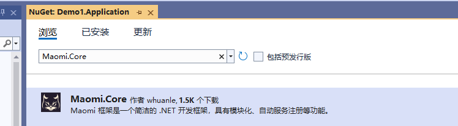
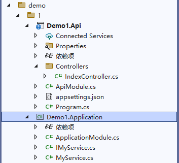
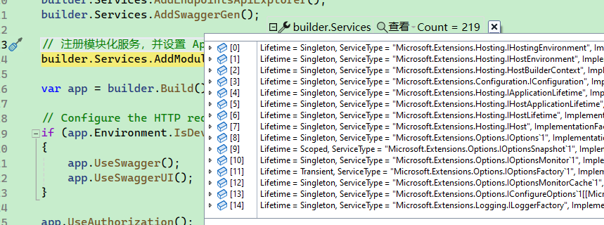
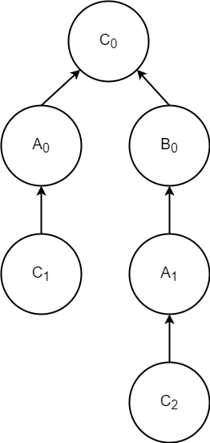
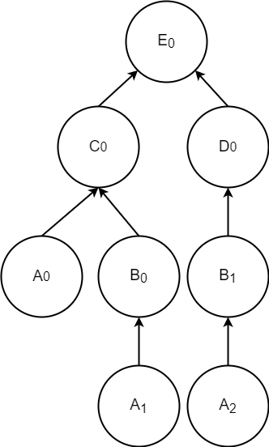

# Maomi.Core

Maomi.Core 是一个模块化和自动服务注册包，以简单和便捷的方式实现项目模块化和注册服务配置。Maomi.Core 是一个很简洁的包，可以在控制台、Web 项目、WPF 项目等项目中使用，在 WPF 项目中结合 MVVM 可以大量减少代码复杂度，让代码更加清晰明朗。

基于 ASP.NET Core 开发的 Web 框架中，最著名的是 ABP，ABP 主要特点之一开发不同项目(程序集)时，在每个项目中创建一个模块类，程序加载每个程序集中，扫描出所有的模块类，然后通过模块类作为入口，初始化程序集。

使用模块化开发程序，好处是不需要关注程序集如何加载配置。开发人员开发程序集时，在模块类中配置如何初始化、如何读取配置，使用者只需要将模块类引入进来即可，由框架自动启动模块类。


开始顺序实例初始化所有模块类。


首先扫码模块所在的类型，把所有模块的类型扫描后，扫描每个类型时，都会出发模块所在的类型过滤器。


### 快速入手

创建  Demo1.Api、Demo1.Application 两个项目，在 Demo1.Application 在中引入最新的 Maomi.Core 包。



<br />

每个项目都应该有一个模块类，分别创建 ApplicationModule.cs、ApiModule.cs，模块类需要实现 IModule 接口。



<br />

Demo1.Application 项目的 ApplicationModule.cs 文件内容如下，其构造函数注入了 IConfiguration，模块类中可以使用依赖注入，可以注入一些 WebApplicationBuilder 默认注册的服务。

```csharp
public class ApplicationModule : IModule
{
    // 模块类中可以使用依赖注入
    private readonly IConfiguration _configuration;
    public ApplicationModule(IConfiguration configuration)
    {
        _configuration = configuration;
    }

    public void ConfigureServices(ServiceContext services)
    {
        // 这里可以编写模块初始化代码
    }
}
```

<br />

或者什么都不注入：

```csharp
public class ApplicationModule : IModule
{
    public void ConfigureServices(ServiceContext services)
    {
        // 这里可以编写模块初始化代码
    }
}
```

<br />

在 Demo1.Application 项目里，如果需要将 MyService 注册到容器中，在类型上加上 `[InjectOnScoped]` 特性即可。

```csharp
public interface IMyService
{
    int Sum(int a, int b);
}

[InjectOnScoped] // 自动注册的标记
public class MyService : IMyService
{
    public int Sum(int a, int b)
    {
        return a + b;
    }
}
```

> 等同于：
>
> ```csharp
> service.AddScoped<IMyService, MyService>();
> ```

<br />

上层模块 Demo1.Api 中的 ApiModule.cs 可以通过特性注解引用底层模块。

```csharp
using System.Reflection;

[InjectModule<ApplicationModule>]	// 指明依赖了 ApplicationModule 模块
public class ApiModule : IModule
{
    public void ConfigureServices(ServiceContext services)
    {
        // 这里可以编写模块初始化代码
    }
}
```

<br />

最后，在程序启动时配置模块入口，并进行初始化。

```csharp
var builder = WebApplication.CreateBuilder(args);
builder.Services.AddControllers();
builder.Services.AddEndpointsApiExplorer();
builder.Services.AddSwaggerGen();

// 注册模块化服务，并设置 ApiModule 为入口
builder.Services.AddModule<ApiModule>();

var app = builder.Build();
```


## 模块

Maomi.Core 也支持从程序集中弱引用模块类，即不直接调用模块类，而是动态扫描识别出模块类。


### 模块使用依赖注入

每个模块都需要实现 IModule 接口，其定义如下：

> 如果是单纯模型类模块或者纯接口抽象模块，则是没必要为此程序集添加模块。

```csharp
/// <summary>
/// 模块接口.
/// </summary>
public interface IModule
{
    /// <summary>
    /// 模块中的依赖注入.
    /// </summary>
    /// <param name="context">模块服务上下文.</param>
    void ConfigureServices(ServiceContext context);
}
```

<br />

在 ASP.NET Core 配置 Host 时，会自动注入一些框架依赖的服务，如 IConfiguration 等，因此在 开始初始化模块服务时，模块类的构造函数可以获取到已经注入的服务。



<br />

可以在模块类的构造函数注入想要的服务。

```cs
[InjectModule<ApplicationModule>]
public class ApiModule : IModule
{
    private readonly IConfiguration _configuration;
    private readonly IHostEnvironment _hostEnvironment;
    public ApiModule(IConfiguration configuration, IHostEnvironment hostEnvironment)
    {
        _configuration = configuration;
        _hostEnvironment = hostEnvironment;
    }

    public void ConfigureServices(ServiceContext context)
    {
        var configuration = context.Configuration;
        context.Services.AddCors();
    }
}
```

<br />

除了可以直接在模块构造函数注入服务之外，还可以通过 `ServiceContext context` 获取服务和配置。

```csharp
/// <summary>
/// 模块上下文.
/// </summary>
public abstract class ServiceContext
{
    protected readonly IServiceCollection _serviceCollection;
    protected readonly IConfiguration _configuration;
    protected readonly List<ModuleRecord> _modules;

    /// <summary>
    /// Initializes a new instance of the <see cref="ServiceContext"/> class.
    /// </summary>
    /// <param name="serviceCollection"></param>
    /// <param name="configuration"></param>
    internal ServiceContext(IServiceCollection serviceCollection, IConfiguration configuration)
    {
        _serviceCollection = serviceCollection;
        _configuration = configuration;
        _modules = new List<ModuleRecord>();
    }

    /// <summary>
    /// 容器服务集合.
    /// </summary>
    public IServiceCollection Services => _serviceCollection;

    /// <summary>
    /// 配置.
    /// </summary>
    public IConfiguration Configuration => _configuration;

    /// <summary>
    /// 已识别到的模块列表.
    /// </summary>
    public IReadOnlyList<ModuleRecord> Modules => _modules;
}
```

<br />

例如，使用 `context.Services` 可以手动注册服务到容器中，使用 `context.Modules` 可以获取模块和程序集的相关信息。

`context.Modules` 里面只记录了跟当前项目关联的模块类所在的程序集，可以避免在使用不同的框架时重复扫描项目所有的程序集。

```csharp
public void ConfigureServices(ServiceContext context)
{
	var configuration = context.Configuration;
	context.Services.AddCors();

	context.Services.AddScoped<IMyService, MyService>();

	// 注册 CQRS 服务.
	context.Services.AddMediatR(cfg =>
	{
		cfg.MaxTypesClosing = 500;
		cfg.AddOpenBehavior(typeof(TraceBehavior<,>));
		cfg.RegisterServicesFromAssemblies(context.Modules.Select(x => x.Assembly).ToArray());
	});
}
```

<br />

例如，使用 MediatR 框架需要添加程序集，使用 AutoMapper 也需要添加程序集，使用 `AppDomain.CurrentDomain.GetAssemblies()` 会将非常多的程序集一起添加进去，由于 MediatR、AutoMapper 等框架会反射扫描所有程序集，导致项目启动时会有点慢。

使用 `context.Modules` 则只会注册有用的模块类所在的程序集，例如 上面的 Demo1 解决方案中，`context.Modules` 里面只有 `Demo1.Application`、`Demo1.Api`，可以避免引入其它程序集，只关注当前项目的程序集。


### ModuleCore 抽象类

ModuleCore 是一个实现了 IModule 接口的抽象类，主要是多了一个 TypeFilter 方法，在扫描程序集的类型时会调用该方法，开发者可以通过此方法灵活处理一些类型。

```csharp
/// <summary>
/// 模块过滤器接口.
/// </summary>
public abstract class ModuleCore : IModule
{
    /// <inheritdoc/>
    public abstract void ConfigureServices(ServiceContext context);

    /// <summary>
    /// 扫描每个类型时会调用该接口.
    /// </summary>
    /// <param name="type"></param>
    public abstract void TypeFilter(Type type);
}
```

<br />

如下所示，框架扫描到一个类型时，触发了 TypeFilter 函数，开发者可以识别该类型，然后进行相应的处理。

```csharp
public void TypeFilter(IServiceCollection services, Type type)
{
	if (type.IsClass && !type.IsAbstract)
	{
		if (type.IsGenericType && type.GetGenericTypeDefinition() == typeof(ITypeConverter<,>))
		{
            services.AddScoped(type);
		}
	}
}
```

<br />

项目里面可能会有很多第三方的框架以及自己编写的组件，如果每个框架都把所有程序集的类型都扫描一遍，会导致启动耗时变大，而且这个过程也是重复的，通过 TypeFilter 可以减少重复扫描过程。

<br />

模块类都可以自由继承 ModuleCore 或者 IModule。

例如，在项目中，开发者自己实现了一个事件总线的框架组件，以及一个自动对象映射的框架组件，将这两个组件封装成两个模块，由于它们关注的类型对象不一样，所以每个模块对当前扫描到的类型处理方法不一样，比如说识别特性注解、识别接口，然后做对应的处理逻辑。

<br />

如下代码所示，不同的逻辑分别在不同的模块类：

```csharp
public class EventBusModule : ModuleCore
{
    public override void ConfigureServices(ServiceContext context)
    {
    }

    public override void TypeFilter(IServiceCollection services, Type type)
    {
        //
    }
}

```

```csharp
public class AutoMapperModule : ModuleCore
{
    public override void ConfigureServices(IServiceCollection services, ServiceContext context)
    {
    }

    public override void TypeFilter(Type type)
    {
    }
}
```


### 自定义模块配置

在使用 `AddModule()` 时可以注入 ModuleOptions 配置，影响模块化行为，ModuleOptions 定义如下：

```csharp
/// <summary>
/// 初始化配置.
/// </summary>
public class ModuleOptions
{
    /// <summary>
    /// 注册服务时要过滤的类型或接口，这些类型不会被注册到容器中.
    /// </summary>
    public ICollection<Type> FilterServiceTypes { get;  }
    {
        typeof(IDisposable),
        typeof(ICloneable),
        typeof(IComparable),
        typeof(object)
    };

    /// <summary>
    /// 自定义要注册的程序集.
    /// </summary>
    public ICollection<Assembly> CustomAssembies { get;  }
}
```

<br />

在自动服务注册时，框架会自动忽略把 IDisposable、ICloneable 这里没意义的接口注册到容器中，读者也可以添加一些过滤接口。

例如对于 MyService 服务，实现了 IMyService、IDisposable 两个接口。

```csharp
public interface IMyService
{
    int Sum(int a, int b);
}

[InjectOnScoped]
public class MyService : IMyService, IDisposable
{
    public int Sum(int a, int b)
    {
        return a + b;
    }
    
    public void Dispose()
    {
        throw new NotImplementedException();
    }
}
```

<br />

由于默认过滤规则，最终只会注册：

```csharp
context.Services.AddScoped<IMyService, MyService>();
```

<br />

而不会注册成：

```csharp
context.Services.AddScoped<IMyService, MyService>();
context.Services.AddScoped<IDisposable, MyService>();
```

<br />

如果开发者需要动态引入程序集，不使用模块类强引用时，可以使用 `CustomAssembies`。

```csharp
builder.Services.AddModule<ApiModule>(options =>
{
    options.CustomAssembies.Add(Assembly.Load("./aaa.dll"));
});
```

> aaa.dll 里面需要有模块类。


### 模块加载


在项目启动时，模块加载的流程如下：

1. 识别模块依赖树。
2. 按照模块依赖树初始化各个模块类。
3. 初始化自定义程序集模块类。
4. 按照模块依赖树扫描程序集中的类型，调用各个模块类的 `TypeFilter` 函数。
5. 顺序扫描自定义程序集模块的类型，调用各个模块类的 `TypeFilter` 函数。

<br />

如果一个 B 模块需要依赖另一个 A 模块，或者 A 模块必须先在 B 模块之前初始化，那么可以在 B 模块上使用 `[InjectModule]` 引入 A 模块，这种规则称为模块依赖树。

如下代码所示，由于 B 依赖了 A 模块，因此会先初始化 A 模块之后才会初始化 B 模块。

```csharp
class A:IModule

[InjectModule<A>()]
class B:IModule
```

<br />

关于模块依赖的规则，后面的小节会更加详细讲解。

<br />

对于程序集引用的模块，即使用了 `[InjectModule]` ，框架也会忽略依赖关系，只会直接加载当前模块类，不会构建模块依赖树。

如下所示，即使 `aaa.dll` 中的模块类使用 `[InjectModule]` 引入了其它模块类，框架会忽略这种关系。

```csharp
builder.Services.AddModule<ApiModule>(options =>
{
    options.CustomAssembies.Add(Assembly.Load("./aaa.dll"));
});
```

<br />

### 循环依赖检测

因为模块之间会有依赖关系，为了识别这些依赖关系，Maomi.Core 使用树来表达依赖关系。Maomi.Core 在启动模块服务时，扫描所有模块类，然后将模块依赖关系存放到模块树中，然后按照左序遍历的算法对模块逐个初始化，也就是先从底层模块开始进行初始化。

<br />

Maomi.Core 可以识别模块循环依赖，比如，有以下模块和依赖出现循环，那么将会抛出错误。

```csharp
[InjectModule<A>()]
[InjectModule<B>()]
class C:IModule

[InjectModule<A>()]
class B:IModule

// 这里出现了循环依赖
[InjectModule<C>()]
class A:IModule

// C 是入口模块
services.AddModule<C>();
```


因为 C 模块依赖 A、B 模块，所以 A、B 是节点 C 的子节点，而 A、B 的父节点则是 C。当把 A、B、C 三个模块以及依赖关系扫描完毕之后，会得到以下的模块依赖树。

如下图所示，每个模块都做了下标，表示不同的依赖关系，一个模块可以出现多次，`C1 -> A0` 表示 C 依赖 A。



<br />

C<sub>0</sub> 开始，没有父节点，则不存在循环依赖。

从 A<sub>0</sub> 开始，A<sub>0</sub> -> C<sub>0</sub> ，该链路中也没有出现重复的 A 模块。

从 C<sub>1</sub> 开始，C<sub>1</sub> -> A<sub>0</sub> -> C<sub>0</sub> ，该链路中 C 模块重复出现，则说明出现了循环依赖。

从 C<sub>2</sub> 开始，C<sub>2</sub> -> A<sub>1</sub> -> B<sub>0</sub> -> C<sub>0</sub> ，该链路中 C 模块重复出现，则说明出现了循环依赖。


### 模块初始化顺序

在生成模块树之后，通过对模块树进行后序遍历，可以保证正确的模块初始化顺序。

比如，有以下模块以及依赖。

```csharp
[InjectModule<C>()]
[InjectModule<D>()]
class E:IModule

[InjectModule<A>()]
[InjectModule<B>()]
class C:IModule

[InjectModule<B>()]
class D:IModule
    
[InjectModule<A>()]
class B:IModule
    
class A:IModule

// E 是入口模块
services.AddModule<E>();
```

<br />

生成模块依赖树如图所示：



<br />

首先从 E<sub>0</sub> 开始扫描，因为 E<sub>0</sub> 下存在子节点 C<sub>0</sub>、 D<sub>0</sub>，那么就会先顺着 C<sub>0</sub> 再次扫描，扫描到 A<sub>0</sub> 时，因为 A<sub>0</sub> 下已经没有子节点了，所以会对 A<sub>0</sub> 对应的模块 A 进行初始化。根据上图模块依赖树进行后序遍历，初始化模块的顺序是（已经被初始化的模块会跳过）：


## 服务自动注册

Maomi.Core 是通过 `[InjectOn]` 特性注解识别如何注的服务到容器中，其定义如下：

```csharp
/// <summary>
/// 将当前类型自动注册到容器中.
/// </summary>
[AttributeUsage(AttributeTargets.Class, AllowMultiple = false, Inherited = false)]
public class InjectOnAttribute : Attribute
{
    /// <summary>
    /// 要注册的服务类型.
    /// </summary>
    public Type[]? ServiceTypes { get; set; } = Array.Empty<Type>();

    /// <summary>
    /// 服务的生命周期.
    /// </summary>
    public ServiceLifetime Lifetime { get; set; } = ServiceLifetime.Scoped;

    /// <summary>
    /// 服务注册模式.
    /// </summary>
    public InjectScheme Scheme { get; set; }

    /// <summary>
    /// 将自己也注册到容器中.
    /// </summary>
    public bool Own { get; set; } = false;

    /// <summary>
    /// ServiceKey.
    /// </summary>
    public object? ServiceKey { get; set; }

    /// <summary>
    /// Initializes a new instance of the <see cref="InjectOnAttribute"/> class.
    /// </summary>
    /// <param name="lifetime">服务生命周期.</param>
    /// <param name="scheme">服务注册模式.</param>
    public InjectOnAttribute(ServiceLifetime lifetime = ServiceLifetime.Scoped, InjectScheme scheme = InjectScheme.OnlyInterfaces)
    {
        Lifetime = lifetime;
        Scheme = scheme;
    }
}
```

<br />

一共提供了四种注册方式，`[InjectOn]` 最基础的注册方式，其它三个特性类区别在于生命周期不同，四个特性类在其它方面的使用方式一致。

```
InjectOn
InjectOnScoped
InjectOnSingleton
InjectOnTransient
```

<br />

使用 `[InjectOn]` 时，默认是注册服务为 `Scoped` 生命周期，且注册所有接口。

> 会自动过滤 IDisposable、ICloneable 等接口，详细参考 [自定义模块配置](#自定义模块配置) 。

```csharp
[InjectOn]
public class MyService : IAService, IBService
```

<br />

或者使用：

```csharp
[InjectOnScoped]
public class MyService : IAService, IBService
```

<br />

等同于：

```csharp
services.AddScoped<IAService, MyService>();
services.AddScoped<IBService, MyService>();
```

<br />

如果只想注册 `IAService`，可以将注册模式设置为`InjectScheme.Some` ，然后自定义注册的类型：

```csharp
[InjectOn(
	Scheme = InjectScheme.Some,
	ServicesType = new Type[] { typeof(IAService) }
	)]
public class MyService : IAService, IBService
```

<br />

再例如只想注册 SomeB，则：
```csharp
public class Some { }
public interface SomeA { }
public interface SomeB { }
public interface SomeC { }

[InjectOn(scheme: InjectScheme.Some, ServiceTypes = new Type[] { typeof(SomeB) })]
public class Service_Some : Some, SomeA, SomeB, SomeC { }
```

<br />

也可以把自身注册到容器中：

```csharp
[InjectOn(Own = true)]
public class MyService : IMyService
```

<br />

等同于：

```csharp
services.AddScoped<IAService, MyService>();
services.AddScoped<MyService>();
```

<br />

再如下代码所示：

```csharp
public class Some { }
public interface SomeA { }
public interface SomeB { }
public interface SomeC { }

[InjectOn(scheme: InjectScheme.Some, Own = true, ServiceTypes = new Type[] { typeof(SomeB) })]
public class Service_Some : Some, SomeA, SomeB, SomeC { }
```

<br />

等同于：

```csharp
services.AddScoped<SomeB, Service_Some>();
services.AddScoped<Service_Some>();
```

<br />

对于 Service_Some 的例子，如果服务继承了类、接口，只想注册接口，那么可以这样写：

```csharp
public class Some { }
public interface SomeA { }
public interface SomeB { }
public interface SomeC { }

[InjectOn(scheme: InjectScheme.OnlyInterfaces)]
public class Service_Some : Some, SomeA, SomeB, SomeC { }
```

<br />

等同于：

```csharp
services.AddScoped<SomeA, Service_Some>();
services.AddScoped<SomeB, Service_Some>();
services.AddScoped<SomeC, Service_Some>();
```

<br />

如果只注册自身，忽略接口等，可以使用 `InjectScheme.None`：

```csharp
[InjectOn(ServiceLifetime.Scoped, Scheme = InjectScheme.None, Own = true)]
```

<br />

在 .NET 8 中，服务注册出现了 Keyed Service 方式，可以更加方便地实现工厂模式

可以为同一个服务添加不同的 Key，最简单的使用场景是为同一个接口提供不同的实现，通过 Key 引入对应的实现。

```csharp
[InjectOnScoped(ServiceKey = "A")]
public class AService : IMyService
{
    public int Sum(int a, int b)
    {
        return a + b;
    }
}

[InjectOnScoped(ServiceKey = "B")]
public class BService : IMyService
{
    public int Sum(int a, int b)
    {
        return a + b;
    }
}

[InjectOnScoped(ServiceKey = "C")]
public class CService : IMyService
{
    public int Sum(int a, int b)
    {
        return a + b;
    }
}
```

<br />

在注入服务时，可以这样写：

```csharp
private readonly IMyService _service;

public IndexController([FromKeyedServices("A")] IMyService service)
{
	_service = service;
}
```

```csharp
private readonly IMyService _service;

public IndexController(IServiceProvider serviceProvider)
{
	_service = serviceProvider.GetKeyedService<IMyService>("A");
}
```

<br />

另外，基于模块类的 `TypeFilter`，读者也可以实现自己的自动服务注册和发现组件，有兴趣的读者可以自行编写。
