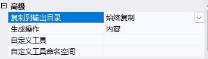

# Maomi.I18n

随着业务的国际化，为了满足不同客户群体的需要，软件产品需要支持多种语言，根据用户选择的语言呈现不同语言的界面。ASP.NET Core 或 ABP 等框架都提供了多语言解决方案，尽管配置方法各不相同，但都是通过键值对的方式使用的，开发者需要为每个 key 提供对应语言的值，框架会根据请求上下文自动区配 key 在对应语言下的值。

Maomi.I18n 是一个简单易用的 i18n 多语言框架，注册控制台、ASP.NET Core、WPF 等项目，开发者还可以很简单地扩展和定制自己的多语言解决方案。

<br />

Maomi.I18n 使用标准化的接口实现相关功能，开发者可以在极小代价下迁移不同的多语言方案、切换其它多语言框架等。

<br />

## 在控制台中使用

使用 i18n 需要加载多语言资源，这些多语言资源可以存储在 json 文件、远程加载等，对于项目来说，大概有两种情况，Maomi.I18n 内置对 json 的支持，因此这里主要说使用 json 存储多语言的方式。


一个解决方案往往会有多个项目，在使用多语言上主要有两种情况：

一个解决方案中只需要一个多语言。

一个解决方案的不同项目需要隔离多语言。

<br />

下面会逐个讲解。


### 全局共享多语言资源

如果一个解决方案只需要一套多语言，不需要根据项目隔离，那么多语言 json 文件可以存放到任意项目的目录，在本节中，创建一个控制台项目，在 i18n 目录下创建 en-US.json、zh-CN.json 文件，两个文件的内容分别设置为：

```json
{
  "test": "Test"
}
```

```json
{
  "test": "测试"
}
```

<br />右键修改 en-US.json、zh-CN.json 属性，设置生成操作为内容、始终复制到输出目录。



<br />


然后通过代码注册 i18n 服务，以及引入 i18n 资源。 

```csharp
var ioc = new ServiceCollection();
ioc.AddI18n("zh-CN");	// 注册 i18n 服务以及设置默认语言
ioc.AddI18nResource(options =>
{
	options.AddJsonDirectory("i18n");	// 识别多语言文件
});
```

<br />

`AddJsonDirectory()` 函数会扫描目录中的 json 文件，然后将文件名称作为语言名称，例如 `zh-CN.json` 代表语言为 `zh-CN`。

<br />

当然，也可以手动添加多语言文件。

```csharp
ioc.AddI18nResource(options =>
{
	options.AddJsonFile("zh-CN", "i18n/zh-CN.json");
	options.AddJsonFile("en-US", "i18n/en-US.json");
});
```

<br />

因为控制台程序不像 ASP.NET Core 应用，没有当前请求上下文，因此我们需要手动设置当前作于域语言为 `en-US`。

```csharp
var services = ioc.BuildServiceProvider();

// 手动设置当前请求语言
using (var c = new I18nScope("en-US"))
{
	var i18n = services.GetRequiredService<IStringLocalizer>();
	var s1 = i18n["test"];
	Console.WriteLine(s1);
	Console.WriteLine(s1);
}
using (var c = new I18nScope("zh-CN"))
{
	var i18n = services.GetRequiredService<IStringLocalizer>();
	var s1 = i18n["test"];
	Console.WriteLine(s1);
	Console.WriteLine(s1);
}
```

<br />

不过，对于控制台程序来说，这样有点多余，一般控制台程序不像 ASP.NET Core 需要动态转换多语言上下文，我们可以直接在启动的时候就固定死对应的语言，并且不需要使用依赖注入。

<br />

创建一个自己的 i18n 上下文类型，可以自由设置当前语言类型：

```csharp
public class MyI18nContext : I18nContext
{
	public void SetCulture(string language)
    {
        Culture = CultureInfo.CreateSpecificCulture(language);
    }
}
```

<br />

在项目启动时默认设置语言为 `zh-CN`，然后从目录中导入 json 多语言文件。

```csharp
public class Program
{
	private static readonly IStringLocalizer _i18n;

    static Program()
	{
        MyI18nContext i18nContext = new MyI18nContext();
        i18nContext.SetCulture("zh-CN");

        var i18nResource = I18nHelper.CreateResourceFactory();
        i18nResource.AddJsonDirectory("i18n");

        _i18n = I18nHelper.CreateStringLocalizer(i18nContext, i18nResource);
        // 		_i18n = new I18nStringLocalizer(i18nContext, i18nResource, new ServiceCollection().BuildServiceProvider());
    }

    static void Main()
	{
        var s1 = _i18n["test"];
        Console.WriteLine(s1);
    }
}
```

<br />

由于控制台程序一般只会面向单个用户，因此直接全局一个 IStringLocalizer 对象即可，当然，如果运行中需要切换语言，只需要使用 `i18nContext.SetCulture("en-US")` 即可。

<br />

另一种方法是跟当前容器上下文有个，开发者可以自由定义如何解析当前程序多语言上下文。

```csharp
public class MyI18nContext : I18nContext
{
    public MyI18nContext()
    {
        base.Culture = ...
    }

    public void Set(CultureInfo cultureInfo)
    {
        base.Culture = cultureInfo;
    }
}

builder.Services.AddScoped<I18nContext, MyI18nContext>();
```

<br />

在本节中，演示了在控制台程序中通过容器注册和和手动配置 i18n 服务方式使用多语言，开发者可以根据合适的场景使用何种方式。

<br />

### 多项目隔离

解决方案中可能会有多个项目，每个项目独享自己的多语言，需要按照项目隔离。

比如，Test 类型是 A 项目的类型，那么要使用 A 项目的多语言，则：

```csharp
var l1 = services.GetRequiredService<IStringLocalizer<Program>>();
var s1 = l1["test"];
```

<br />

创建如下两个 Demo5.Console、Demo5.Lib 项目，前者是控制台项目，后者是类库项目。


<br />在 `i18n/Demo5.Lib` 目录中创建 en-US.json、zh-CN.json 两个文件。


<br />两个文件分别设置内容为：

```json
{
  "test": "lib en-US"
}
```

```json
{
  "test": "lib zh-CN"
}
```

<br />

右键修改 en-US.json、zh-CN.json 属性，设置生成操作为内容、始终复制到输出目录。


<br />创建扩展函数，将 Demo5.Lib 项目的多语言加载到容器中。

```csharp
public class Test { }
public static class Extensions
{
    public static void AddLib(this IServiceCollection services)
    {
        services.AddI18nResource(options =>
        {
            options.ParseDirectory("i18n");
        });
    }
}
```

<br />

然后创建一个 Demo5.Console 项目，引用 Demo5.Lib。

在 i18n/Demo5.Console 目录中创建 en-US.json、zh-CN.json 文件。


<br />两个文件分别设置内容为：

```json
{
  "test": "console en-US"
}
```

```json
{
  "test": "console zh-CN"
}
```

<br />

最后得到的目录结构如下：

```bash
├─Demo5.Console
│  │  Demo5.Console.csproj
│  │  Program.cs
│  │
│  ├─i18n
│  │  └─Demo5.Console
│  │          en-US.json
│  │          zh-CN.json
│
├─Demo5.Lib
│  │  Demo5.Lib.csproj
│  │  Extensions.cs
│  │
│  ├─i18n
│  │  └─Demo5.Lib
│  │          en-US.json
│  │          zh-CN.json
```

<br />

在 Demo5.Console 的 Program 中使用 `IStringLocalizer<T>` 来获取 key 在不同语言下的值。

```csharp
static void Main()
{
	var ioc = new ServiceCollection();
	ioc.AddI18n("zh-CN");
	ioc.AddI18nResource(options =>
	{
		options.ParseDirectory("i18n");
		options.AddJsonDirectory("i18n");
	});

	ioc.AddLib();

	var services = ioc.BuildServiceProvider();

	// 手动设置当前请求语言
	using (var c = new I18nScope("en-US"))
	{
		var l1 = services.GetRequiredService<IStringLocalizer<Program>>();
		var l2 = services.GetRequiredService<IStringLocalizer<Test>>();
		var s1 = l1["test"];
		var s2 = l2["test"];
		Console.WriteLine(s1);
		Console.WriteLine(s2);
	}

	// 手动设置当前请求语言
	using (var c = new I18nScope("zh-CN"))
	{
		var l1 = services.GetRequiredService<IStringLocalizer<Program>>();
		var l2 = services.GetRequiredService<IStringLocalizer<Test>>();
		var s1 = l1["test"];
		var s2 = l2["test"];
		Console.WriteLine(s1);
		Console.WriteLine(s2);
	}
}
```

<br />

生成结果：

```
console en-US
lib en-US
console zh-CN
lib zh-CN
```

<br />

编译 Demo5.Console ，打开 bin/Debug/net8.0 目录，在 i18n 目录下可以看到如下文件结构：

```bash
.
├── Demo5.Console
│   ├── en-US.json
│   └── zh-CN.json
└── Demo5.Lib
    ├── en-US.json
    └── zh-CN.json
```

<br />

Maomi.I18n 的原理很简单，每个项目都设置多语言文件，编译后所有文件都会合并到 i18n 目录中统一管理和加载，每个目录都与项目名称一致，便于区分。使用 `IStringLocalizer<T>` 读取 key 时，会自动从 T 类型所在的项目名称目录下加载 json 文件。

<br />

## 打包到 nuget

有些类库项目会被制作为 nuget 包，然后提供给其他开发者使用，类库项目可以内置多语言文件，以便在 nuget 包中嵌入多语言文件，在本节中将会演示这一过程。

<br />

创建 Demo5.Nuget 类库项目，创建对应的多语言文件。


<br />

然后修改项目文件，将多语言文件嵌入到 nuget 包中。

```xml
<Project Sdk="Microsoft.NET.Sdk">

	<PropertyGroup>
		<OutputType>Library</OutputType>
		<TargetFramework>net8.0</TargetFramework>
		<ImplicitUsings>enable</ImplicitUsings>
		<Nullable>enable</Nullable>
	</PropertyGroup>

	<ItemGroup>
		<Content Include="i18n\Demo5.Nuget\en-US.json" Pack="true">
			<PackageCopyToOutput>true</PackageCopyToOutput>
			<CopyToOutputDirectory>Always</CopyToOutputDirectory>
			<PackagePath>contentFiles\any\any\i18n\Demo5.Nuget\en-US.json</PackagePath>
		</Content>

		<Content Include="i18n\Demo5.Nuget\zh-CN.json" Pack="true">
			<PackageCopyToOutput>true</PackageCopyToOutput>
			<CopyToOutputDirectory>Always</CopyToOutputDirectory>
			<PackagePath>contentFiles\any\any\i18n\Demo5.Nuget\zh-CN.json</PackagePath>
		</Content>
	</ItemGroup>
</Project>

```

<br />

而在 Web 项目中，由于编译器已经自动设置了 EnableDefaultContentItems 属性，自动设置给 web.config、 `.json` 、 `.cshtml` 文件设置 `<Content></Content>` 属性，所以自定义配置 Content 属性时会冲突，我们需要在 `<PropertyGroup> </PropertyGroup>` 属性中关闭此配置。

```xml
<EnableDefaultContentItems>false</EnableDefaultContentItems>
```

<br />

使用者引入 nuget 包后，可以看到项目中出现了对应的文件。


<br />

Demo5.Nuget 并不需要引用 Maomi.I18n 包，可以让使用者自行自动解析目录，按照项目对多语言资源文件进行隔离。

```csharp
services.AddI18nResource(options =>
{
	options.ParseDirectory("i18n");
});
```

<br />

## 自定义多语言资源

Maomi.I18n 提供了字典、Json、WPF 资源字典三种方式导入多语言，如果开发者有自己的其它需求，可以很容易扩展多语言资源导入方式。


例如 Maomi.I18n.WPF 中，是将资源字典转换为 `Dictionary<string, object>`，然后使用 DictionaryResource 导入多语言资源。

```csharp
services.AddI18nResource(f =>
{
	// 读取每个多语言资源文件
	foreach (var item in xamlFiles)
	{
		string resourceDictionaryPath = $"pack://application:,,,/{localization}/{item.Key}.xaml";
		var resourceDictionary = new ResourceDictionary
		{
			Source = new Uri(resourceDictionaryPath, UriKind.RelativeOrAbsolute)
		};

		Dictionary<string, object> dictionary = ResourceDictionaryToDictionary(resourceDictionary);
		f.Add(new DictionaryResource(new CultureInfo(item.Key), dictionary));
	}
});
```


所以，如果开发者可以直接将要导入的多语言资源转换为字典的方式，那么直接使用上例的 `DictionaryResource` 添加进去即可。


或者可以直接实现 I18nResource 接口，完全自定义多语言资源的查找：

```csharp
/// <summary>
/// 字典存储多语言文件资源.
/// </summary>
public class DictionaryResource : I18nResource
{
    /// <inheritdoc/>
    public CultureInfo SupportedCulture => _cultureInfo;

    private readonly CultureInfo _cultureInfo;
    private readonly IReadOnlyDictionary<string, LocalizedString> _kvs;

    /// <summary>
    /// Initializes a new instance of the <see cref="DictionaryResource"/> class.
    /// </summary>
    /// <param name="cultureInfo"></param>
    /// <param name="kvs"></param>
    public DictionaryResource(CultureInfo cultureInfo, IReadOnlyDictionary<string, object> kvs)
    {
        _cultureInfo = cultureInfo;
        _kvs = kvs.ToDictionary(x => x.Key, x => new LocalizedString(x.Key, x.Value.ToString()!));
    }

    /// <inheritdoc/>
    public virtual LocalizedString Get(string culture, string name)
    {
        if (culture != _cultureInfo.Name)
        {
            return new LocalizedString(name, name, resourceNotFound: true);
        }

        var value = _kvs.GetValueOrDefault(name);
        if (value == null)
        {
            return new LocalizedString(name, name, resourceNotFound: true);
        }

        return value;
    }

    /// <inheritdoc/>
    public virtual LocalizedString Get(string culture, string name, params object[] arguments)
    {
        if (culture != _cultureInfo.Name)
        {
            return new LocalizedString(name, name, resourceNotFound: true);
        }

        var value = _kvs.GetValueOrDefault(name);
        if (value == null)
        {
            return new LocalizedString(name, name, resourceNotFound: true);
        }

        return new LocalizedString(name, string.Format(value, arguments));
    }

    /// <inheritdoc/>
    public virtual IEnumerable<LocalizedString> GetAllStrings(bool includeParentCultures)
    {
        return _kvs.Values;
    }
}
```


然后手动添加到到多语言资源文件即可。

```csharp
services.AddI18nResource(f =>
{
	f.Add(myI18nResource);
});
```


如果多语言资源提供器不能直接提前实例化，需要使用依赖注入，这也是可以的。

如下代码所示，Maomi.I18n 在当前请求中，会自动从容器中读取 MyResource 实例，然后解析多语言信息。

```csharp
services.AddScoped<MyResource>();
services.AddI18nResource(f =>
{
	f.Add(typeof(MyResource));
});
```


## 在 ASP.NET Core 中使用

创建 Demo5.Api 项目，引入 `Maomi.I18n.AspNetCore`  包。

在项目中新建一个 i18n 目录，然后创建两个 json 文件。


<br />

zh-CN.json 文件内容：

```json
{
  "购物车": {
    "商品名称": "商品名称",
    "加入时间": "加入时间",
    "清理失效商品": "清理失效商品"
  },
  "会员等级": {
    "用户名": "用户名",
    "积分": "积分:{0}",
    "等级": "等级"
  }
}
```

<br />en-US.json 文件内容：

```csharp
{
  "购物车": {
    "商品名称": "Product name",
    "加入时间": "Join date",
    "清理失效商品": "Cleaning up failures"
  },
  "会员等级": {
    "用户名": "Username",
    "积分": "Member points:{0}",
    "等级": "Level"
  }
}
```

<br />

`Maomi.I18n` 框架会扫描程序集目录的 json 文件，然后解析 json 文件以键值对的形式存储到内存中，Key 的形式与第三章中提到的 IConfiguration 的 Key 一致，在第四章中也提到了如何解析 json 文件，比如要取得商品名称的值，可以使用 `["购物车:商品名称"]`  这样的形式获取嵌套层次下的值，而且还可以使用字符串插值，如 `"积分": "Member points:{0}"`。

<br />

使用 Maomi.I18n ，只需要两步，注入 i18n 服务和导入 i18n 语言资源。

```csharp
builder.Services.AddHttpContextAccessor();

// 添加 i18n 多语言支持
builder.Services.AddI18nAspNetCore(defaultLanguage: "zh-CN");
// 设置多语言来源-json
builder.Services.AddI18nResource(option =>
{
    var basePath = "i18n";
    option.AddJsonDirectory(basePath);
});
```

<br />

接着，添加 i18n 中间件，中间件会将用户请求时的上下文中解析出对应的语言。

```csharp
var app = builder.Build();
app.UseI18n();	// <- 放到中间件靠前的位置
```

<br />

然后添加控制器或直接编写中间件进行测试，只需要注入 `IStringLocalizer` 服务即可。

```csharp
app.UseRouting();
app.Use(async (HttpContext context, RequestDelegate next) =>
{
	var localizer = context.RequestServices.GetRequiredService<IStringLocalizer>();
	await context.Response.WriteAsync(localizer["购物车:商品名称"]);
	return;
});
```

<br />

启动程序，打开地址 http://localhost:5177/test?culture=en-US 可以观察到输出为 Product name。


<br />

### 携带请求语言信息

 `Maomi.I18n` 本质是基于 ASP.NET Core 的多语言接口进行扩展的，所以 `Maomi.I18n` 并不需要做太多解析语言的工作，而是依靠 ASP.NET Core 自带的多语言功能将客户端请求时解析出要使用的语言，以及相关的上下文信息。

ASP.NET Core 中可以使用 `app.UseRequestLocalization();` 引入 RequestLocalizationMiddleware 中间件提供一些多语言的处理。RequestLocalizationMiddleware  中间件会自动调用 IRequestCultureProvider 检索请求所用语言，然后我们可以通过 `context.Features.Get<IRequestCultureFeature>();` 来获取到对应的语言，简化我们设计多语言框架的代码。

<br />

ASP.NET Core 定义了一个 IRequestCultureProvider 接口，用于解析客户端请求时携带的的区域性信息，从当前请求中解析出所用的语言，ASP.NET Core 本身有三个类型实现了该接口，所以相当于自带了三种获取当前请求语言的方式，下面我们来了解这三种方式是如何通过请求上下文解析语言标识。

<br />

第一种是 URL 路由参数，可以通过 QueryStringRequestCultureProvider 类型解析出来，需要 url 中携带两个参数 `culture` 和 `ui-culture`，其格式示例如下：

```
?culture=en-US&ui-culture=en-US
```

<br />

第二种是 Cookie，提供器是 CookieRequestCultureProvider，cookie 中需要添加名为 `.AspNetCore.Culture` 的 cookie，其格式示例如下：

```
c=en-US|uic=en-US
```

示例：

```
.AspNetCore.Culture=c=en-US|uic=en-US
```

<br />

第三种是通过 Header 设置，也是最常用的设置方法，提供器是 AcceptLanguageHeaderRequestCultureProvider，其格式示例如下：

```csharp
Accept-Language: zh-CN,zh;q=0.9
```


<br />

当然，开发者可以根据需求，修改这三者的配置，以便使用其他请求位置或不同的参数名称解析出当前请求的文化名称。

```csharp
new QueryStringRequestCultureProvider()
{
	QueryStringKey = "lan",
	UIQueryStringKey = "ui"
}
```

<br />

由于 ASP.NET Core 会自动解析出请求语言，因此我们只需要从 IRequestCultureFeature 服务中取得语言信息即可，不需要自行解析。

```csharp
var requestCultureFeature = context.Features.Get<IRequestCultureFeature>();
var requestCulture = requestCultureFeature?.RequestCulture;
```

<br />

当客户端请求时，ASP.NET Core 会自动从 RequestLocalizationOptions 中取出 IRequestCultureProvider 服务列表，然后逐个调用，直到能够确定用户请求的语言信息。 ASP.NET Core 默认会按顺序执行 QueryStringRequestCultureProvider、CookieRequestCultureProvider、AcceptLanguageHeaderRequestCultureProvider 三个提供器，如果前者解析找不到对应的参数，则会使用下一个 IRequestCultureProvider 解析，如果默认三个提供器都解析不出来，则会调用用户自定义的服务，如果能够获得结果，则不会再调用其它的提供器。当然也可以自行修改以上组件的顺序，但是这里不再赘述。

<br />

开发者需要根据 HttpContext 中的请求参数解析出当前请求使用的语言，如果解析不出来，则应该返回 NullProviderCultureResult，框架会继续使用下一个IRequestCultureProvider 解析请求语言。如果找到了请求语言，则需要返回 ProviderCultureResult。

<br />

要注意的是，IRequestCultureProvider 接口的服务是不能通过容器注入的，而是在 RequestLocalizationOptions 中配置。

```csharp
			services.Configure<RequestLocalizationOptions>(options =>
			{
				// 默认自带了三个请求语言提供器，会先从这些提供器识别要使用的语言。
				// QueryStringRequestCultureProvider
				// CookieRequestCultureProvider
				// AcceptLanguageHeaderRequestCultureProvider
				// 自定义请求请求语言提供器
				options.RequestCultureProviders.Add(new I18nRequestCultureProvider(defaultLanguage));
			});
```

<br />

如果你想调整提供器的顺序，只需要修改 options.RequestCultureProviders 中的 IRequestCultureProvider 集合即可。

<br />

### 建议的多语言方案

本节中将会介绍笔者建议的多语言方案，有助于帮助开发者为服务设计一个健壮的多语言应用程序。

<br />

创建一个 Demo5.HttpApi 的 ASP.NET Core 项目。

```json
{
  "用户未填写手机号": "The user did not enter the mobile phone number",
  "邮箱格式错误{0}": "Mailbox format error{0}"
}
```

```json
{
  "用户未填写手机号": "用户未填写手机号",
  "邮箱格式错误{0}": "邮箱格式错误{0}"
}
```

<br />

创建一个业务异常类型 BusinessException，项目中出现异常情况时，统一使用业务异常抛出，不要自行抛出异常，不要使用模型类存储状态码逐层传递，业务上的逻辑错误、异常情况，能够预测到的，全部使用 BusinessException 异常抛出，然后通过中间件拦截处理。

<br />

```csharp
/// <summary>
/// 业务异常类型.
/// </summary>
public class BusinessException : Exception
{
    /// <summary>
    /// 异常代码.
    /// </summary>
    public int? Code { get; set; }

    /// <summary>
    /// 异常描述.
    /// </summary>
    public string? Details { get; set; }

    /// <summary>
    /// 参数.
    /// </summary>
    public object[]? Paramters { get; set; }

    /// <summary>
    /// 异常级别.
    /// </summary>
    public LogLevel LogLevel { get; set; } = LogLevel.Error;

    /// <summary>
    /// Initializes a new instance of the <see cref="BusinessException"/> class.
    /// </summary>
    /// <param name="code"></param>
    /// <param name="message"></param>
    /// <param name="paramters"></param>
    public BusinessException(
    int? code = null,
    string? message = null,
    params object[] paramters)
    : base(message)
    {
        Code = code;
        Paramters = paramters;
    }

    /// <summary>
    /// 记录额外的异常信息.
    /// </summary>
    /// <param name="name"></param>
    /// <param name="value"></param>
    /// <returns><see cref="BusinessException"/>.</returns>
    public BusinessException WithData(string name, object value)
    {
        Data[name] = value;
        return this;
    }
}
```

<br />

设计一个针对 Http 请求的异常过滤器，拦截 BusinessException 异常，将里面的 message 信息转换为多语言，其它异常则直接返回异常信息。

```csharp
/// <summary>
/// 统一异常处理.
/// </summary>
public class BusinessExceptionFilter : IAsyncExceptionFilter
{
    private readonly ILogger<BusinessExceptionFilter> _logger;
    private readonly IStringLocalizer _stringLocalizer;

    /// <summary>
    /// Initializes a new instance of the <see cref="BusinessExceptionFilter"/> class.
    /// </summary>
    /// <param name="logger"></param>
    /// <param name="stringLocalizer"></param>
    public BusinessExceptionFilter(ILogger<BusinessExceptionFilter> logger, IStringLocalizer stringLocalizer)
    {
        _logger = logger;
        _stringLocalizer = stringLocalizer;
    }

    /// <inheritdoc/>
    public async Task OnExceptionAsync(ExceptionContext context)
    {
        // 未被处理的异常
        if (!context.ExceptionHandled)
        {
            object? response = default;

            // 如果抛出的是业务异常，转换为对应异常信息返回
            if (context.Exception is BusinessException ex)
            {
                string message = string.Empty;
                if (ex.Paramters != null && ex.Paramters.Length != 0)
                {
                    message = _stringLocalizer[ex.Message, ex.Paramters];
                }
                else
                {
                    message = _stringLocalizer[ex.Message];
                }

                response = new
                {
                    Code = 500,
                    Message = message
                };

                // ... 记录异常日志 ...
            }
            else
            {

                response = new
                {
                    Code = 500,
                    Message = context.Exception.Message
                };

                // ... 记录异常日志 ...
            }

            context.Result = new ObjectResult(response)
            {
                StatusCode = 500,
            };

            context.ExceptionHandled = true;
        }

        await Task.CompletedTask;
    }
}
```

<br />

启动项目时配置使用 i18n、异常拦截器。

```csharp
var builder = WebApplication.CreateBuilder(args);

builder.Services.AddControllers(o =>
{
    o.Filters.Add<BusinessExceptionFilter>();
});

builder.Services.AddEndpointsApiExplorer();
builder.Services.AddSwaggerGen();

builder.Services.AddHttpContextAccessor();

// 添加 i18n 多语言支持
builder.Services.AddI18nAspNetCore(defaultLanguage: "zh-CN");
// 设置多语言来源-json
builder.Services.AddI18nResource(option =>
{
    var basePath = "i18n";
    option.AddJsonDirectory(basePath);
});

var app = builder.Build();

app.UseI18n();

if (app.Environment.IsDevelopment())
{
    app.UseSwagger();
    app.UseSwaggerUI();
}

app.UseAuthorization();

app.MapControllers();

app.Run();
```

<br />

创建接口，用于测试业务异常拦截结果。

```csharp
[HttpPost("create_user")]
public string CreateUser(string? userName, string email)
{
	if (string.IsNullOrEmpty(userName))
	{
		throw new BusinessException(500, "用户未填写手机号");
	}

	if (!email.Contains("@"))
	{
		throw new BusinessException(500, "邮箱格式错误{0}", email);
	}

	return "创建成功";
}
```

<br />

设置请求语言为英文，设置 userName 为空，请求后发现抛出的业务异常信息 `"用户未填写手机号"` 已经被翻译为 `"The user did not enter the mobile phone number"`。


<br />

继续修改请求信息，将 email 字段设置为 `aaaa|aaa.com` ，会相关错误：


#### grpc

对于 Grpc 项目，做法也是大同小异。

<br />

创建一个 BusinessInterceptor 异常拦截器。

```csharp
/// <summary>
/// 业务异常拦截器.
/// </summary>
public class BusinessInterceptor : Interceptor
{
    private readonly ILogger<BusinessInterceptor> _logger;
    private readonly IStringLocalizer _stringLocalizer;

    /// <summary>
    /// Initializes a new instance of the <see cref="BusinessInterceptor"/> class.
    /// </summary>
    /// <param name="logger"></param>
    /// <param name="stringLocalizer"></param>
    public BusinessInterceptor(ILogger<BusinessInterceptor> logger, IStringLocalizer stringLocalizer)
    {
        _logger = logger;
        _stringLocalizer = stringLocalizer;
    }

    /// <inheritdoc/>
    public override async Task<TResponse> UnaryServerHandler<TRequest, TResponse>(TRequest request, ServerCallContext context, UnaryServerMethod<TRequest, TResponse> continuation)
        where TRequest : class
        where TResponse : class
    {
        try
        {
            var response = await continuation(request, context);
            return response;
        }
        catch (BusinessException ex)
        {
            // ... 打印日志 ...

            string message = string.Empty;
            if (ex.Paramters != null)
            {
                message = _stringLocalizer[ex.Message, ex.Paramters];
            }
            else
            {
                message = _stringLocalizer[ex.Message];
            }

            throw new RpcException(new Status(StatusCode.Internal, message));
        }
        catch (Exception ex)
        {
            // ... 打印日志 ...

            if (ex is RpcException)
            {
                throw;
            }

            throw new RpcException(new Status(StatusCode.Internal, ex.Message));
        }
    }
}
```

<br />

启动配置：

```csharp
var builder = WebApplication.CreateBuilder(args);

builder.Services.AddHttpContextAccessor();

// 添加 i18n 多语言支持
builder.Services.AddI18nAspNetCore(defaultLanguage: "zh-CN");

// 设置多语言来源-json
builder.Services.AddI18nResource(option =>
{
    var basePath = "i18n";
    option.AddJsonDirectory(basePath);
});

builder.Services.AddGrpc(o =>
{
    o.Interceptors.Add<BusinessInterceptor>();
});

var app = builder.Build();

app.UseI18n();

app.MapGrpcService<GreeterService>();
app.MapGet("/", () => "Communication with gRPC endpoints must be made through a gRPC client. To learn how to create a client, visit: https://go.microsoft.com/fwlink/?linkid=2086909");

app.Run();
```

<br />

修改 GreeterService 服务。

```csharp
public override Task<HelloReply> SayHello(HelloRequest request, ServerCallContext context)
{
	if (request.Name == "error")
	{
		throw new BusinessException(500, "用户未填写手机号");
	}
	return Task.FromResult(new HelloReply
	{
		Message = "Hello " + request.Name
	});
}
```

<br />

#### 模型验证多语言

模型验证的组件比较多，常用的有 FluentValidation 框架，或者可以直接使用原生的方式，http、grpc 的使用方法大同小异，由于篇幅的原因，这里不展开细说，如果是 Http 方式使用默认的模型验证器，直接添加 `AddI18nDataAnnotation()` 扩展方法即可。

```csharp
// 添加控制器
context.Services.AddControllers()
.AddI18nDataAnnotation();
```

<br />

对于FluentValidation 框架，官方也有示例， [Localization — FluentValidation documentation](https://docs.fluentvalidation.net/en/latest/localization.html)

```csharp
public class PersonValidator : AbstractValidator<Person>
{
	public PersonValidator(IStringLocalizer localizer)
	{
		RuleFor(x => x.Surname).NotNull().WithMessage(x => localizer["Surname is required"]);
	}
}
```

<br />

另外还有一种方法，就是 http api 方式通过 ActionFilterAttribute 统一拦截模型验证错误信息然后再转换为多语言输出，GRPC 方式通过实现 Interceptor 拦截器处理。

<br />

#### 导出多语言文件

<br />

配置多语言文件是比较麻烦的，开发者在编写代码的时候，要设置多语言，就需要手动去修改 json 文件，然后粘贴复制到代码里面，在 key 比较多的情况下，写代码会不太爽。

所以笔者这里提供一个方法，就是代码里面先写多语言，例如 `throw new BusinessException(500, "用户未填写手机号")`、`.WithMessage("用户未填写手机号")`，然后编写 Roslyn 工具，分析代码文件，将符合条件的字符串抽出来，生成多语言文件。

这样依赖，开发者可以愉快地编写代码，写完后一次性全部导出再翻译。

参考 exporti18n 项目。

```csharp
public class Program
{
    static async Task Main(string[] args)
    {
        var filters = new string[] { "bin", "obj", "Properties" };

        var i18nDic = new Dictionary<string, string>();

        var slnPath = "";
        var jsonDir = "";

        var dllPath = typeof(Program).Assembly.Location;

        // 如果运行路径在 bin\Debug\net8.0
        if (Directory.GetParent(dllPath)!.FullName.Contains("bin\\Debug"))
        {
            slnPath = Directory.GetParent(dllPath)!.Parent!.Parent!.Parent!.Parent!.Parent!.FullName;
            jsonDir = Directory.GetParent(dllPath)!.Parent!.Parent!.Parent!.FullName;
        }
        else
        {
            slnPath = Directory.GetParent(dllPath)!.Parent!.Parent!.FullName;
            jsonDir = Directory.GetParent(dllPath)!.FullName;
        }

        // 所有项目所在目录都在 src 下面
        var projPath = slnPath;

        // 所有项目目录
        var projects = Directory.GetDirectories(projPath);

        // 使用队列逐个目录搜索，不要一次性都加载进去
        foreach (string project in projects)
        {
            // 子目录列表
            Queue<string> itemDirs = new();

            itemDirs.Enqueue(project);

            while (itemDirs.Count > 0)
            {
                var curDir = itemDirs.Dequeue();
                var csFiles = Directory.GetFiles(curDir, "*.cs", SearchOption.TopDirectoryOnly);
                foreach (var csFile in csFiles)
                {
                    Console.WriteLine(csFile);
                    string fileContent = await File.ReadAllTextAsync(csFile);

                    // 读取文件解析语法树
                    SyntaxTree tree = CSharpSyntaxTree.ParseText(fileContent);
                    var root = tree.GetRoot();

                    // 查找所有 new BusinessException 语句，new BsiRpcException 语句
                    var objectCreations = root.DescendantNodes()
                                             .OfType<ObjectCreationExpressionSyntax>()
                                             .Where(node => node.Type.ToString() == "BusinessException");

                    foreach (var objectCreation in objectCreations)
                    {
                        if (objectCreation.ArgumentList == null)
                        {
                            continue;
                        }

                        // 提取 objectCreation 的参数列表中的字符串
                        var arguments = objectCreation.ArgumentList.Arguments;

                        foreach (var argument in arguments)
                        {
                            if (argument.Expression is LiteralExpressionSyntax literal &&
                                literal.IsKind(SyntaxKind.StringLiteralExpression))
                            {
                                string str = literal.Token.ValueText;
                                if (!i18nDic.ContainsKey(str))
                                {
                                    i18nDic[str] = str;
                                }
                            }
                        }
                    }


                    // 查找所有 WithMessage 方法
                    var invocationExpressions = root.DescendantNodes()
                                                    .OfType<InvocationExpressionSyntax>()
                                                    .Where(node => node.Expression is MemberAccessExpressionSyntax memberAccess &&
                                                                   memberAccess.Name.ToString() == "WithMessage");

                    foreach (var invocation in invocationExpressions)
                    {
                        var arguments = invocation.ArgumentList.Arguments;

                        foreach (var argument in arguments)
                        {
                            if (argument.Expression is LiteralExpressionSyntax literal &&
                                literal.IsKind(SyntaxKind.StringLiteralExpression))
                            {
                                string str = literal.Token.ValueText;
                                if (!i18nDic.ContainsKey(str))
                                {
                                    i18nDic[str] = str;
                                }
                            }
                        }
                    }
                }

                var newDirs = Directory.GetDirectories(curDir).Where(x => !filters.Contains(x)).ToArray();
                foreach (var itemDir in newDirs)
                {
                    itemDirs.Enqueue(itemDir);
                }
            }
        }

        string jsonOutput = System.Text.Json.JsonSerializer.Serialize(i18nDic, new System.Text.Json.JsonSerializerOptions
        {
            WriteIndented = true,
            Encoder = System.Text.Encodings.Web.JavaScriptEncoder.UnsafeRelaxedJsonEscaping
        });
        File.WriteAllText(Path.Combine(jsonDir, "zh-CN.json"), jsonOutput);

        Console.WriteLine("已经自动生成i18n文件");
    }
}
```

<br />

## 在 WPF 中使用

效果如下，只针对主体页面做了多语言，标题栏和菜单没有弄。


<br />

由于 WPF 示例项目代码量比较多，因此这里只讲解核心细节，完整代码请参考 https://github.com/whuanle/maomi/tree/main/demo/5/Demo5Wpf

WPF 项目使用了 WPF-UI 框架，读者也可以直接使用原生的 WPF 或者其它第三方框架，WPF 使用 Host 方式启动即可。

<br />

引入 Maomi.I18n.Wpf 包，然后在项目下创建 Localization 目录。

````
├─Localization
│      en-US.xaml
│      zh-CN.xaml
````

<br />


<br />右键添加资源字典，创建 en-US.xaml、zh-CN.xaml 两个文件。


<br />

内容示例：

```csharp
<ResourceDictionary xmlns="http://schemas.microsoft.com/winfx/2006/xaml/presentation"
                    xmlns:x="http://schemas.microsoft.com/winfx/2006/xaml"
                    xmlns:sys="clr-namespace:System;assembly=mscorlib">

    <sys:String x:Key="错误">错误</sys:String>
    <sys:String x:Key="用户名">用户名</sys:String>
    <sys:String x:Key="邮箱">邮箱</sys:String>
    <sys:String x:Key="手机号">手机号</sys:String>
    <sys:String x:Key="切换语言">切换语言</sys:String>
    <sys:String x:Key="手机号必填">手机号必填</sys:String>
    <sys:String x:Key="邮箱必填">邮箱必填</sys:String>
    <sys:String x:Key="用户名必填">用户名必填</sys:String>
    <sys:String x:Key="成功">成功</sys:String>
    <sys:String x:Key="已保存信息">已保存信息</sys:String>
    <sys:String x:Key="保存">保存</sys:String>

</ResourceDictionary>
```

<br />

在 App.xaml.cs 里注入 i18n 服务。

```csharp
services.AddI18n("zh-CN");

// 主项目名称：Demo5Wpf
// 资源字典位置：Localization
services.AddI18nWpf("Demo5Wpf", "Localization");
```


<br />

在 App.xaml 文件添加引入的多语言资源文件。

```xaml
<!--导入默认语言，以便在设计界面时使用-->
<ResourceDictionary Source="pack://application:,,,/Demo5Wpf;component/Localization/zh-CN.xaml" />
```


<br />

在编写界面时，直接使用 `{DynamicResource 用户名}` 绑定对应的 Key ，即可自动翻译为对应的语言。

<br />示例：

```xaml
<TextBlock Text="{DynamicResource 用户名}" VerticalAlignment="Center" />
```


<br />

需要切换项目语言时，注入 `WpfI18nContext` 接口，直接设置对应的语言即可。

```csharp
_i18nContext.SetLanguage(SelectedLanguage);
```

<br />

在非界面代码中使用多语言，依然是注入 IStringLocalizer ，直接使用即可，示例：


