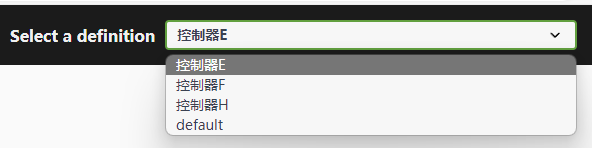

# Swagger 定制

Web 项目中 Swagger 是必不可少的，但是在项目越来越复杂、API 接口越来越多、微服务下多路由地址调试等因素影响下，Swagger 的管理会变得越来越复杂。

Maomi.Swagger 就是为了解决这些需求而设计的，本章示例可以参考：

* Demo9.MaomiSwagger
* Demo9.Swagger
* Demo9.SwaggerModel
* Demo9.SwaggerVersion


引入 Maomi.Swagger 包后，使用 Swagger 是很简单的，参考 Demo9.MaomiSwagger 项目即可。

示例如下：

```csharp
public static void Main(string[] args)
{
	var builder = WebApplication.CreateBuilder(args);

	// Add services to the container.

	builder.Services.AddControllers();
	builder.Services.AddEndpointsApiExplorer();
	// 1，这里注入
	builder.Services.AddMaomiSwaggerGen();

	var app = builder.Build();

	// Configure the HTTP request pipeline.
	if (app.Environment.IsDevelopment())
	{
		// 2，这里配置中间件
		app.UseMaomiSwagger(setupAction: setup =>
		{
			setup.PreSerializeFilters.Add((swagger, httpReq) =>
			{
				swagger.Servers = new List<OpenApiServer>
				{
							new  (){ Url = $"{httpReq.Scheme}://{httpReq.Host.Value}/mya" },
							new  (){ Url = $"{httpReq.Scheme}://{httpReq.Host.Value}/myb" }
				};
			});
		});
	}

	app.UseAuthorization();


	app.MapControllers();

	app.Run();
}
```


Swagger 的生成管理有不同的使用场景，也有不同的需求，因此这里不讲解 Swgger 基础，直接讲解某些特殊场景如何解决问题。


#### 模型类属性类型处理

在示例项目 Demo9.Swagger 中，有一个模型类，因为 API 接口需要使用 json 框架序列化反序列化参数，这里就涉及到 json 框架的类型转换和处理，我们常常会将模型类的属性类型使用类型转换器处理，将 json 转换类型到模型类的其它值类型，如下所示：

```csharp
public class Test
{
	[JsonConverter(typeof(string))]
	public Boolean Value1 { get; set; }  
    ...  
	[JsonConverter(typeof(string))]
	public Int32 Value7 { get; set; }

	[JsonConverter(typeof(string))]
	public UInt32 Value8 { get; set; }

	[JsonConverter(typeof(string))]
	public Int64 Value9 { get; set; }
    ...
}
```


使用 `[JsonConverter(typeof(string))]` 后，外部请求接口都只需要填写字符串，ASP.NET Core 会自动将字符串转换为对应的值类型。


Test 模型类中包含了多种类型，但是打开 swagger 后，如下所示，Swagger 并不会处理这种类型转换关系。

```json
{
  "value1": true,
  "value2": "string",
  "value3": 0,
  "value4": 0,
  "value5": 0,
  "value6": 0,
  "value7": 0,
  "value8": 0,
  "value9": 0,
  "value": 0,
  "value10": 0,
  "value11": 0,
  "value12": 0,
  "value13": "2024-02-15T03:50:35.891Z",
  "value14": "string"
}

```


我们希望 swagger 中显示时。能够显示出原本的真正类型，能够显示 JsonConverter 中指定的格式。

在 Maomi.Swagger 中有个 MaomiSwaggerSchemaFilter 类型，继承 ISchemaFilter，可以帮助转换类型。

你可以这样引入：

```csharp
builder.Services.AddMaomiSwaggerGen(setupSwaggerAction: options =>
{
    // 模型类过滤器
    options.SchemaFilter<MaomiSwaggerSchemaFilter>();
});
```


如果你喜欢使用原生的接口，不使用 Maomi.Swagger 扩展方法注入，则只需要：

```csharp
builder.Services.AddSwaggerGen(options =>
{
	// 模型类过滤器
	options.SchemaFilter<MaomiSwaggerSchemaFilter>();
});
```


重新打开 swagger ，会发现 swagger 跟 json 序列化的类型信息一致。

```json
{
  "value1": "string",
  "value2": "string",
  "value3": "string",
  "value4": "string",
  "value5": "string",
  "value6": "string",
  "value7": "string",
  "value8": "string",
  "value9": "string",
  "value": "string",
  "value10": "string",
  "value11": "string",
  "value12": "string",
  "value13": "2024-02-15T03:54:45.440Z",
  "value14": "string"
}
```


#### 接口分组

在 ASP.NET Core 中使用 swagger 时，默认配置如下：

```csharp
builder.Services.AddSwaggerGen(options =>
{
});
var app = builder.Build();

if (app.Environment.IsDevelopment())
{
	app.UseSwagger();
	app.UseSwaggerUI();
}
```


使用 swagger 分为两个部分，一个是服务注册，一个是中间件，本节从两个步骤出发讲解如何定制 swagger 去解决业务开发中的一些问题。


由于项目逐渐庞大，API 接口越来越多，所有接口都在一个 swagger 中，导致 swagger.json 文件庞大。第六章中提到过可以使用工具将 swagger.json 生成代码文件，可是如果只需要使用其中一部分接口，却需要生成全部接口代码文件，以及不同模块中可能会有相同名称的接口，这样会导致混乱。因此，需要将 swagger 中的接口进行分组。

```csharp
[ApiController]
[Route("[controller]")]
[ApiExplorerSettings(GroupName = "控制器E")]
public class EController : ControllerBase
{
}
```


有以下控制器：

```csharp
/// <summary>
/// 控制器A
/// </summary>
[ApiController]
[Route("[controller]")]
public class AController : ControllerBase
{
	/// <summary>
	/// 测试
	/// </summary>
	/// <returns></returns>
	[HttpGet("test1")]
	public string Get1() => "true";

	/// <summary>
	/// 测试
	/// </summary>
	/// <returns></returns>
	[HttpGet("test2")]
	public string Get2() => "true";
}

/// <summary>
/// 控制器B
/// </summary>
[ApiController]
[Route("[controller]")]
public class BController : ControllerBase
{
	/// <summary>
	/// 测试
	/// </summary>
	/// <returns></returns>
	[HttpGet("test1")]
	public string Get1() => "true";

	/// <summary>
	/// 测试
	/// </summary>
	/// <returns></returns>
	[HttpGet("test2")]
	public string Get2() => "true";
}

/// <summary>
/// 控制器C
/// </summary>
[ApiController]
[Route("[controller]")]
public class CController : ControllerBase
{
	/// <summary>
	/// 测试
	/// </summary>
	/// <returns></returns>
	[HttpGet("test1")]
	public string Get1() => "true";

	/// <summary>
	/// 测试
	/// </summary>
	/// <returns></returns>
	[HttpGet("test2")]
	public string Get2() => "true";
}

/// <summary>
/// 控制器D
/// </summary>
[ApiController]
[Route("[controller]")]
public class DController : ControllerBase
{
	/// <summary>
	/// 测试
	/// </summary>
	/// <returns></returns>
	[HttpGet("test")]
	public string Get() => "true";
}

/// <summary>
/// 控制器E
/// </summary>
[ApiController]
[Route("[controller]")]
[ApiExplorerSettings(GroupName = "控制器E")]
public class EController : ControllerBase
{
	/// <summary>
	/// 测试
	/// </summary>
	/// <returns></returns>
	[HttpGet("test")]
	public string Get() => "true";
}

/// <summary>
/// 控制器F
/// </summary>
[ApiController]
[Route("[controller]")]
[ApiExplorerSettings(GroupName = "控制器F")]
public class FController : ControllerBase
{
	/// <summary>
	/// 测试
	/// </summary>
	/// <returns></returns>
	[HttpGet("test")]
	public string Get() => "true";
}

/// <summary>
/// 控制器G
/// </summary>
[ApiController]
[Route("[controller]")]
public class GController : ControllerBase
{
	/// <summary>
	/// 测试
	/// </summary>
	/// <returns></returns>
	[HttpGet("test")]
	public string Get() => "true";
}

/// <summary>
/// 控制器H
/// </summary>
[ApiController]
[Route("[controller]")]
[ApiExplorerSettings(GroupName = "控制器H")]
public class HController : ControllerBase
{
	/// <summary>
	/// 测试
	/// </summary>
	/// <returns></returns>
	[HttpGet("test")]
	public string Get() => "true";
}
```


效果如下：




本节示例代码请参考 Demo9.Swagger 项目。主要原理是通过注入 swagger 服务，将已经扫描的接口整理出来，对每个接口进行分组划分，如果接口没有设置 `[ApiExplorerSettings]` 特性，则放到默认分组中。

MaomiSwaggerOptions 模型类保存了默认分组信息，其定义如下。

```csharp
// swagger 配置
public class MaomiSwaggerOptions
{
	/// 默认分组名称
	public string DefaultGroupName { get; set; } = "default";

	/// 默认标题
	public string DefaultGroupTitle { get; set; } = "default";
}
```


分组管理的代码较为复杂，作用是对接口进行分组，分组后 swagger 框架会给每个分组生成一个单独的 swagger.json 文件，Maomi.Swagger 默认就支持这样干，其示例代码如下：

```csharp
builder.Services.AddMaomiSwaggerGen(setupMaomiSwaggerAction:o =>
{
	o.DefaultGroupName = "默认分组";
	o.DefaultGroupTitle = "测试";
});

// ... ...

app.UseMaomiSwagger();
```


生成结果：


#### 接口版本号

随着项目迭代，接口越来越多，为了不影响已经对接的项目，同一个接口就会出现多个版本号。

只需要在 Controller 或 Action 上添加 `[ApiVersion("1.0")]` 特性注解即可。


关于 ASP.NET Core API 版本号的管理和实践，可以参考官方文档：https://github.com/dotnet/aspnet-api-versioning/wiki


示例代码如下：

```csharp
/// <summary>
/// 控制器A
/// </summary>
[ApiController]
[Route("[controller]")]
public class AController : ControllerBase
{
	/// <summary>
	/// 测试
	/// </summary>
	/// <returns></returns>
	[HttpGet("test1")]
	public string Get1() => "true";
}

/// <summary>
/// 控制器B
/// </summary>
[ApiController]
[Route("[controller]")]
[ApiVersion("1.0")]
public class BController : ControllerBase
{
	/// <summary>
	/// 测试
	/// </summary>
	/// <returns></returns>
	[HttpGet("test1")]
	public string Get1() => "true";
}

/// <summary>
/// 控制器C
/// </summary>
[ApiController]
[Route("[controller]")]
[ApiVersion("2.0")]
public class CController : ControllerBase
{
	/// <summary>
	/// 测试
	/// </summary>
	/// <returns></returns>
	[HttpGet("test1")]
	public string Get1() => "true";
}
```


然后注册 Swagger 服务时，配置使用 ApiVersion 服务。

```csharp
builder.Services.AddMaomiSwaggerGen(
	setupApiVersionAction: (ApiVersioningOptions options) =>
	{
	},
	setupApiExplorerAction: (ApiExplorerOptions options) =>
	{
	}
	);
```


因为默认版本号是 1.0，所以其它不为 1.0 版本的接口单独列组，而版本号为 1.0 或没有设置版本号的，统一归到 1.0 分组中。


基于约定大于配置的默认意识，使用到 `.AddMaomiSwaggerGen(setupApiVersionAction,setupApiExplorerAction)` 时，开发者可以不设置属性，默认会使用以下属性做启动配置。

```csharp
// 配置 Api 版本信息
builder.Services.AddApiVersioning(setup =>
{
	// 全局默认 api 版本号
	setup.DefaultApiVersion = new ApiVersion(1, 0);
	// 用户请求未指定版本号时，使用默认版本号
	setup.AssumeDefaultVersionWhenUnspecified = true;
	// 响应时，在 header 中返回版本号
	setup.ReportApiVersions = true;
	// 从哪里读取版本号信息
	setup.ApiVersionReader =
	ApiVersionReader.Combine(
	   new HeaderApiVersionReader("X-Api-Version"),
	   new QueryStringApiVersionReader("version"));
});

// 在 swagger 中显示版本信息，
// 进一步使用版本号进行隔分
builder.Services.AddVersionedApiExplorer(o =>
{
	// 获取或设置版本参数到 url 地址中
	o.SubstituteApiVersionInUrl = true;
	// swagger 页面默认填入的版本号
	o.DefaultApiVersion = new ApiVersion(1, 0);
	// 显示的版本分组格式
	o.GroupNameFormat = "'v'VVV";
});
```


如果需要修改 Swagger 配置，则在委托里面配置属性即可，示例：

```csharp
builder.Services.AddMaomiSwaggerGen(
    setupApiVersionAction: (ApiVersioningOptions options) =>
    {
        // 全局默认 api 版本号
        options.DefaultApiVersion = new ApiVersion(1, 0);
        // 用户请求未指定版本号时，使用默认版本号
        options.AssumeDefaultVersionWhenUnspecified = true;
        // 响应时，在 header 中返回版本号
        options.ReportApiVersions = true;
        // 从哪里读取版本号信息
        options.ApiVersionReader =
        ApiVersionReader.Combine(
           new HeaderApiVersionReader("X-Api-Version"),
           new QueryStringApiVersionReader("version"));
    },
    setupApiExplorerAction: (ApiExplorerOptions options) =>
    {
    }
    );
```


当然，可以将版本号和分组结合一起使用，效果如下：


#### 路由后缀

在微服务场景下，许多服务会共用一个域名，然后使用不同的路由后缀指向对应的服务，比如 https://localhost/a、 https://localhost/b 。

为什么会有这种需求呢，这是因为在微服务场景下，一个服务可能有多个反向代理访问入口，并且可能赋予不同的路由后缀，而默认的 Swagger 配置是 `/swagger` 路径访问的，这样一来可能就无法正常访问或使用 Swagger 调试了。


不过默认 swagger ui 中请求时，使用了绝对路径，因此不会自动使用这些路由后缀参数。为了能够让 swagger ui 在微服务下能够支持不同路由后缀请求，需要对此进行配置。

示例代码：

```csharp
// 2，这里配置中间件
app.UseMaomiSwagger(setupAction: setup =>
{
	setup.PreSerializeFilters.Add((swagger, httpReq) =>
	{
		swagger.Servers = new List<OpenApiServer>
		{
		    new  (){ Url = $"{httpReq.Scheme}://{httpReq.Host.Value}/mya" },
			new  (){ Url = $"{httpReq.Scheme}://{httpReq.Host.Value}/myb" }
		};
	});
});
```


打开 Swagger 可以切换调试时的请求地址。


